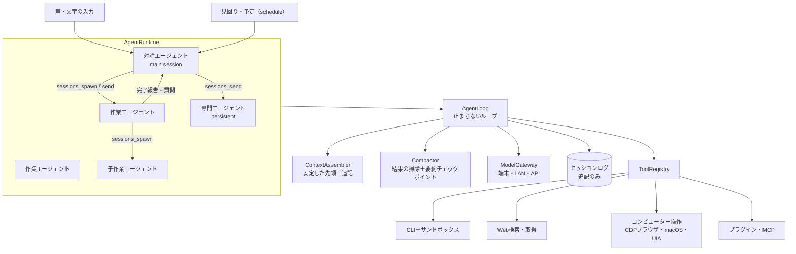

# エージェントハーネス設計（作り替え）

2026-10-06 の方針にもとづく、Teporaのエージェント実行基盤の設計です。旧 `core/harness.mjs`・`dialogue.mjs`・`requests.mjs`・`intent.mjs`・`plans.mjs`・`execution.mjs` を置き換えました。2026-10-07 に、レビューで見つかった問題の修正と、DeepSeek Harness・Pi・d1-computer-use を参考にした改良（§5・§6・§9・§10・§11）を反映しています。

## 1. 方針

- **止まらない**: ループは失敗で終わらない。モデル・ツール・通信の失敗は分類して自分で立て直す。止まるのは「仕事が終わった」「人が止めた」「人の判断が要る」ときだけ。
- **長期作業が前提**: 何百ステップ・何日も続く作業で、文脈を失わない。コンパクションの精度を最重要とする。
- **キャッシュが当たり続ける文脈**: プロンプトの先頭を変えない。変えるときはまとめて変える。
- **対話エージェントと作業エージェントの分離**: 対話エージェント（キャラクター）は指揮役（オーケストレーター）。作業エージェントは非同期にいくつでも立てられる。セッションどうしはメッセージで通信する（Grok Bot の chief of staff 型、OpenClaw の `sessions_*` に相当）。
- **ツールは拡張可能**: 組み込み（CLI・Web検索・Web取得・コンピューター操作など）、プラグイン、MCP を同じ口で扱う。ストア・配布は考えない。
- **コンピューター操作**: ヘッドレスでも動く。意思決定モデルが観測した候補から操作対象を選ぶ方式を主とし、モデルが直接操作する方式も選べる。
- **保護は既定でオフ、必要なら一発でサンドボックス**: ホストでそのまま実行する。保護が必要な環境では設定ひとつで隔離して実行できる。
- **常駐とハンズフリー**: 常に動き続けて判断し、声で話しかけられる。
- **端末内で完結できることは端末内で**: ローカルモデルを第一にしつつ、LANの推論サーバーとクラウドAPIにもつなげる。

## 2. 全体構成



| モジュール | 役割 |
| --- | --- |
| `core/agent/runtime.mjs` | セッションの起動・停止・再開、スケジューラー、ハートビート、再起動後の復旧 |
| `core/agent/sessions.mjs` | セッション記録と追記型ログ（SQLite） |
| `core/agent/loop.mjs` | 1ステップ＝文脈を組む→モデル→ツール→記録。失敗の分類と立て直し |
| `core/agent/context.mjs` | ログから送信用メッセージを組み立てる。トークン見積もり |
| `core/agent/compaction.mjs` | ツール結果の掃除、要約チェックポイント、台帳 |
| `core/agent/prompts.mjs` | 固定のシステムプロンプト、要約指示、立て直し用の文 |
| `core/tools/*.mjs` | ツール登録と組み込みツール |
| `core/sandbox.mjs` | 実行の隔離（seatbelt・bubblewrap・コンテナ） |
| `core/agent/decisions.mjs` | 判断モデル（System One: Liquid d1 / Laya）による軽い判定と、その代わりの手段 |
| `core/agent/schedule.mjs` | 予定とくり返し（対話エージェントへの入力になる） |
| `core/agent/images.mjs` | 画像の寸法・トークン見積もり・読み込み |
| `core/computer/*.mjs` | コンピューター操作（CDPブラウザ、macOSのアクセシビリティ補助、判断モデルの操作ループ） |
| `core/provider-*.mjs` | モデル接続（ストリーミング、無通信タイムアウト、使用量、キャッシュ指定） |

## 3. セッションとオーケストレーション

### セッション

| 種類 | 役割 | 生き方 |
| --- | --- | --- |
| `main` | 対話エージェント。人と話し、仕事を振り分け、報告を受けて伝える | ずっと続く。1つだけ |
| `worker` | 作業エージェント。1つの仕事をやり切って報告する | 終わったら `done`。追加の依頼で再開できる |
| `specialist` | 名前と役割を持つ常設の作業エージェント（調査係など） | ずっと続く。何度も仕事を受ける |

セッションは自分の文脈（ログ）、作業フォルダ、ツールの組、接続先の役割（`chat`/`work`）、人格を持ちます。子セッションは親を持ち、深さに上限があります（既定3）。

### 受信箱

セッションへの入力はすべて受信箱に入ります。入力の出どころは、人（声・文字）、他のセッション（依頼・報告・質問）、タイマー（ハートビート・ルーティン）、ハーネス（立て直しの指示）です。

- 待機中のセッションに入力が来たら、1ターンを始める。
- 実行中のセッションには、次のステップの区切りで届ける（`steer`）。ツールの途中には割り込まない。
- `notify` は文脈に足すだけで、ターンを起こさない。

### セッション間通信ツール

| ツール | 内容 |
| --- | --- |
| `sessions_spawn` | 仕事を新しい作業エージェントに渡し、すぐ戻る。終わると依頼元へ完了報告が届く。`context: isolated / fork`、`persistent`（専門エージェントにする）、`cwd`、`role` |
| `sessions_send` | 別のセッションへメッセージを送る。`mode: followup / steer / notify`。`wait` 秒だけ、その相手から自分宛てに届くメッセージ（`sessions_send` での返事か完了報告）を待てる。相手が人に向けた返事を取り違えることはない |
| `sessions_list` | セッションの一覧と状態 |
| `sessions_history` | 別のセッションのやり取りを読む（ツール結果は既定で省く） |
| `sessions_stop` | 子セッションを止める |

作業エージェントから見える範囲は、自分・親・自分の子だけです。対話エージェントはすべて見えます。

### 完了報告と常駐

作業エージェントが終わると、最後の報告文が依頼元の受信箱に `[作業「…」完了]` として届きます。対話エージェントはそれを受けて、伝えるかどうか、どう伝えるかを自分で決めます。伝えることがなければ `NO_REPLY` を返し、何も話しません。

見回り（間隔は設定で決める。既定はオフ）と予定（`schedule` ツール。時刻・くり返し・仕事の自動開始）も、対話エージェントへの入力として届きます。見回りは、仕事の状態が前回から変わっていなければモデルを呼びません。判断モデルがあれば、「誰も知る必要のない変化」も呼ぶ前にふるい落とします。

## 4. 止まらないループ

### 1ステップ

1. 受信箱の入力をログに追記する。
2. 必要なら掃除・コンパクションを行う（§6）。
3. 文脈を組み立てて、モデルを呼ぶ（ストリーミング）。プラグインの `beforeRequest` フックがあれば通す。
4. 返答をログに追記する。ツール呼び出しがあれば実行して、結果を追記する。読むだけのツールは並列に、それ以外は順に実行する。
5. ツール呼び出しがなければ、ターンを終える。作業エージェントはここで完了確認をする（ToDoの残り → **名前の出たファイルが実在するか** → 何もしていない → プラグインの `turnEnd` → **仕上げの確認**）。キャラクターはここで**委任の安全網**を通る。

**ファイルの実在確認**: 依頼文と報告に出てきたファイルのパスが作業フォルダに無ければ、報告を受け取らずに差し戻します（モデルを使わない機械的な確認、最大2回）。小さいモデルは、ツールを呼ばずに「notes/a.txt を保存しました」と言いがちだからです。

**仕上げの確認**: 報告する前に一度だけ、元の依頼と照らして確かめます。判断モデルがあれば、依頼・ToDo・報告に加えて**実際のツール結果の一覧（成功/失敗）**を渡し、「証拠は依頼のすべてをやり終えたことを示しているか」を判定させます。報告の主張ではなく証拠で判定するので、全部失敗したのに「作りました」と書いた報告も差し戻せます。呼び出し1回で安いので、ツールを1回でも使った仕事が対象です。判断モデルがなければ、ツールを3回以上使った仕事だけ、作業エージェント自身に依頼文を示して見直させます（1ターン、キャッシュの上）。設定で切れます。

**委任の安全網**（キャラクター）: 利用者の発言が届くと、キャラクターが考えている間に判断モデルが並行して「これは作業（ファイル作成・コード・調査・アプリ操作など）の依頼か」を判定します。確率が0.8以上なのに、キャラクターがツールを使わずに答えた場合（小さいモデルは委任せず「ファイルは作れません」と答えがち）、その返答は見せずに取り下げ、ハーネスが会話の流れを付けて作業エージェントを起動します。キャラクターにはそのことを伝え、改めて「始めました」と答えさせます。判定が出るまでキャラクターの文字は画面にも音声にも出さないので、取り下げた返答が一瞬見えることもありません。判断モデルが無いとき、または設定 `delegationGuard: false` のときは働きません。

### 失敗の分類と立て直し

| 失敗 | 立て直し |
| --- | --- |
| 通信断・5xx | 指数バックオフで再試行し、代替の接続先へ切り替える。全滅したら `waiting` で待ち、時間を置いて自動で再開する（`failed` にはしない） |
| 無通信のまま長く考える | 無通信の上限で切れたら、その接続先の上限を倍にして記録し、すぐ再試行する（最大30分）。推論要約（Responses の `reasoning.summary`、Gemini の `includeThoughts`）と llama.cpp の読み込み進捗（`return_progress`）を要求して、そもそも黙らないようにする |
| 429 | `Retry-After` に従って待つ |
| 認証エラー | 5分ごとに再試行しつつ、画面に理由を出す |
| 判断モデルの429（d1:free の混雑） | 1秒・2秒・4秒と待って聞き直す。これは故障として数えない。無料枠の接続は1本ずつ送る |
| 文脈の溢れ | エラー文から上限を読み取って記録する。強めのコンパクションをかけて再試行する |
| 黙った切り詰め | 窓が推定でしかないのに、送った量の半分未満しか数えられていなければ、サーバーが会話の頭を黙って捨てたと判断する。その答えは捨て、窓を学習し、コンパクションしてから聞き直す。窓が検出済みなら、補正の学習から外すだけにする |
| 出力上限での打ち切り | ツール呼び出しが切れていたら実行しない。分割して書くよう伝える。本文だけが切れていたら「続きを書く」で継ぐ |
| ツール引数のJSONが壊れている | 簡易修復を試す。直らなければ、そのエラーをツール結果として返して書き直させる |
| 存在しないツール名 | 近い名前を添えてエラーとして返す |
| 画像を受け付けないモデル | 画像入りの依頼が断られたら、そのモデルは画像を見ないと記録し、以後は「画像は表示されない」という注記に置き換えて続ける。画像は `vision` 役割のモデルが代わりに説明できる |
| 空の返答・拒否 | 一度だけ続きを促す |
| ツールの例外 | すべてツール結果として返す（ループには投げない） |
| 読んでいない既存ファイルの上書き | `write` を断り、先に読んで `edit` するよう返す（小さいモデルは設定ファイルを新しい行だけで上書きしがち）。自分で書いた・読んだファイルは上書きできる。フォルダを指定したときは、中のファイル名を例に出して返す |
| 同じ操作の繰り返し・エラーの連続 | 振り返りを促す。続く場合は上位の接続先（`escalation`）へ切り替えるか、親に報告する。上位モデルで8ステップ順調に進んだら、元のモデルへ戻す |
| 費用の上限 | 人が上限を決めたときだけ、超えた仕事を `waiting` にする。上限を上げると、すぐ続きから再開する |
| 再起動 | 実行中だったツール呼び出しに「結果不明・状態を確かめてから再実行」と記録して、ループを再開する |

止まってよいのは次の3つだけです。

- 仕事を終えた
- 人が止めた
- 人の判断が要る（ルールで `ask` にした操作や、質問への返事待ち、人が決めた費用の上限）

ステップ数の上限は既定で設けません。代わりに一定ステップごと（既定50）に、親へ途中経過を報告します。

### メタ認知（自分の状態を知る）

自分の進み具合を正しくつかめないことが、長い仕事で迷走する一番の原因です。そこで、自分についての情報を二つに分けて持たせます（`core/agent/metacog.mjs`）。

- **測った事実はハーネスが渡す**（自己点検）: 手数・経過時間・文脈の使用率と、掃除・圧縮が始まる位置・ツールの失敗（直近6回中の数）・同じ呼び出しの繰り返し・チェックリストの進み具合（何手動いていないか）・使っているモデル（上位モデルに切り替え中か）・費用・本人が書いた確信度・動いている作業担当。これらを「`[harness] Self-check`」としてログに**追記**します。事実はモデルではなくハーネスが測るので、混乱したモデルが自分の状況を思い違いすることがありません。
- **本人にしか書けないことは本人が書く**（`reflect`）: 依頼をどう理解しているか・計画・**確かめたこと（と確かめ方）**・**推測にすぎないこと**・未解決の問い・確信度（0〜1）・次の一手。送った項目だけが置き換わり、ほかは残ります。チェックポイントの台帳に原文のまま入るので、圧縮で「確かめた」と「推測した」が混ざることはありません。

自己点検を送るのは、知らせる価値があるときだけです（同じ理由では一度だけ、最低5手は空ける）。

| きっかけ | 問いかけ |
| --- | --- |
| 文脈が作業予算の60%に達した（圧縮のたびに一度） | 圧縮後に要るものがチェックリストと reflect に残っているか |
| 直近6回中3回以上失敗 | 環境の理解（パス・版・権限・API）が間違っていないか |
| チェックリストが12手動いていない | 本当に進んでいるか、同じところを回っていないか |
| 10回以上ツールを使ったのに reflect がない | 理解・計画・確かめたこと・推測・確信度を書く |
| 確信度が0.5未満のまま5手 | 確信度を上げ下げできる一番安い確認は何か。依頼者が決めることなら聞く |
| 作業担当で15手ごと | 今の作業は目的に沿っているか、残りの計画は最短か |

キャラクターには、文脈の使用率など会話に関わるときだけ送り、利用者には決して触れさせません。仕上げの確認（§4）は本人の reflect も使います。判断モデルには「確かめていない推測」と確信度を報告と一緒に渡し、確信度が0.5未満なら、短い仕事でも見直しをさせます。報告では、確かめた結果と推測に基づく結果を分けて書かせます。設定 `metacognition: false` で止められます。

## 5. 文脈とキャッシュ

### 先頭を変えない規則

送信する内容は「**システムプロンプト ＋ ツール定義 ＋ チェックポイント ＋ ログの追記部分**」です。

- **システムプロンプト**は、エージェントの種類・人格・ツールの組・有効なスキル一覧だけで決まる固定の文です。時刻・記憶・状態は入れません。
- **ツール定義**は、セッションを作るときに決めて固定します（並びも固定）。あとから増えたツールは `tools_search` / `tools_call` 経由で使います。
- **時刻**は入力ごとの見出し（`[10/06 10:31 JST]`）として、ログに一度だけ書きます。
- **ログ**は追記のみです。書いた内容は二度と変えません。表示上の変更（掃除）は、別の記録（`clear`）として残し、組み立て時に決まった規則で反映します。そのため再起動後も同じ文脈が再現され、キャッシュが当たります。
- **途中の書き換えは、まとめて一度だけ**: 先頭より後ろの表示が変わるのは、掃除（`clear` の境界線を進める）とコンパクションのときだけです。次のものも、その同じ一回でまとめて縮めます。
  - 古いツール結果 → 1行のスタブ（小さな結果は残す）
  - 新しい版に置き換わった使い捨ての結果（古いToDo、プロセスの確認、画面の観測、スクリーンショット）
  - 対話エージェントが受け答えを済ませた作業エージェントの報告 → 「題・最初の1行・recall」の1行
  - 古いツール呼び出しの長い引数（書き込んだファイル本文など）→ 先頭120字と「recall で全文」（提供元固有の再送用データの中身も同じ規則で縮める）
- **指示の変更は追記する**（DeepSeek Harness と同じ考え方）: 人格・設定・スキル・ツールが変わっても、動いているセッションのシステムプロンプトは書き換えません。変わった節（`# 見出し` 単位）を「指示が変わった」というメッセージとしてログに追記し、プロンプト本体は次のチェックポイント（どのみちキャッシュが切れる時）で入れ替えます。同じ変更を二度は伝えません。

### ツール結果の形

- 結果の全文は**証拠**として保存し、IDを振る（`recall` で読み直せる）。
- モデルに見せる本文は、書くときに一度だけ予算内に収める（先頭と末尾を残し、中間は「…全N字、recall(id, offset)」で示す）。
- 結果ごとに1行の**スタブ**（例: `exec "npm test" → exit 0`）も同時に作って保存する。
- **使い捨ての結果**には `ephemeral` を付ける。最新の1件は常に全文で見せる。古い版は、次のまとめての掃除のときに初めてスタブになる（すぐ書き換えると、そこから後ろのキャッシュがすべて外れるため）。
- 画像を返すツール（`read` の画像、スクリーンショット、生成した絵）は、その手番のすべての結果のあとに1つのユーザーメッセージとして画像を並べる（どの提供元でも通る形）。画像のトークンは寸法から見積もる。

### 提供元ごとのキャッシュ指定

| 提供元 | 指定 |
| --- | --- |
| Anthropic | `cache_control` を ①ツール＋システム ②チェックポイント ③**前の依頼の終わり** ④最新のメッセージ の4か所に付ける。③は、一手番で10個前後のツールを並列に呼んでも、20ブロックまでしか遡らない照合が外れないため。対話エージェントは1時間のキャッシュ（`ttl:"1h"`）を使う |
| OpenAI（Responses / Chat） | `prompt_cache_key` にセッションID。対話エージェントは `prompt_cache_retention:"24h"`（対応モデルのみ。断られたら自動で外す） |
| llama.cpp | `cache_prompt: true`、読み込み進捗 `return_progress: true`。スロットは空いているものを貸し出す（同じセッションの前回のスロットを優先）。2枠以上あれば1枠を対話エージェント用に空けておく。固定の割り当ては、空きスロットがあっても同じスロットを待たせるので使わない |
| Ollama | ネイティブAPI（`/api/chat`）で `num_ctx` を毎回指定する（既定は32kまで、モデルの上限と設定で調整）。OpenAI互換の口は窓を指定できず、会話の頭を黙って捨てるため |
| Gemini・その他 | 先頭が変わらないことによる自動キャッシュ |

設定の「費用と仕上げ」で、対話エージェントの長いキャッシュを標準に戻せます。

## 6. コンパクション（最重要）

### 二段構え

1. **掃除（軽い）**: §5のまとめての書き換え。
   - 発動条件: 使用量が予算の72%を超え、**かつ**縮められる量が予算の15%（最低500トークン）以上あるとき。縮められる量は、境界線を動かした場合の文脈を実際に組み立てて測る。
   - 直近2ステップは原文のまま残す。
   - 画面に画像が7枚以上たまったら、閾値より前でも一度掃除する（最新の観測は残る）。
2. **要約チェックポイント（重い）**: 掃除しても予算の80%を超えるとき。
   - 古い部分を要約とチェックポイントに置き換え、末尾の約15%を原文のまま残す（最低でも最後の1手番）。
   - 区切りは必ずターンの境目にする。

### 要約はキャッシュの上で作る

要約は、**今の文脈そのものの末尾に要約指示を足して**依頼します。ツール定義も同じものを付け、`tool_choice: none` を指定します（DeepSeek Harness も同じ方式）。

- 先頭がすべてキャッシュ済みなので、ローカルモデルでも読み込み直しがほぼ無い。
- 要約するモデルが、掃除前の細部まで含めて実物を見て書ける。

すでに溢れているときや、上の方法が失敗したときは、`compaction` 役割のモデルに区間ごとに分割して要約させます。それも失敗したら機械的な一覧にします。どの場合もループは止めません。

### 精度を守る仕組み

**正確でなければ困る情報はモデルに書かせず、ハーネスがログから機械的に作ります（台帳）。**

| 台帳（ハーネスが作る・正確） | 要約（モデルが書く） |
| --- | --- |
| 最初の依頼の原文 | 目的 |
| 人・依頼元からの指示の原文 | 人の好み・制約 |
| ToDoの最新状態 | 済んだこと（どこに成果があるか） |
| 書いた・編集したファイル（パス・ハッシュ・大きさ） | 重要な事実（数値・名前・パス・URL・ID・エラー文） |
| 読んだファイル | 決めたことと理由 |
| 読んだWebページ（URL・題）と検索語 | 試してだめだったこと |
| 成果物（ID・題・版） | 今やっていること |
| 子セッションと状態、動いているプロセス | 次の一手 |
| 直近のエラー、証拠の目録 | **この区間の章の要約**（1段落） |

- **章立て**: 毎回の要約には「前回のチェックポイント以降だけ」を1段落で書く欄がある。これを章として固定保存し、二度と要約し直さない。チェックポイントには、予算（約4%）に収まる新しい章から順に並べ、それより古い章は範囲だけを示す（`history_search` / `recall` で辿れる）。要約の要約を重ねて古い細部がすり減るのを防ぐ。
- **取りこぼしの救済**: 要約する区間に出てきたURLとファイルパスのうち、要約にも台帳にも章にも無いものを、台帳の末尾に機械的に足す。
- 要約の形式（見出し）を検査し、合わなければ指示を強めて一度だけやり直す。
- 失った細部は取り戻せる。`history_search`（ログ全体の全文検索）と `recall`（ログ番号で原文を読む）を常に使える。

### 対話エージェントの空き時間圧縮

入力が20秒ないとき、かつ使用量が55%を超えていれば、先にコンパクションしておきます。

### 予算

- `B = (文脈の窓 − 出力の予約) × 0.95 − ツール定義`
- 文脈の窓は接続先から自動で調べる（llama.cpp `/props`（スロットごと）、Ollama `/api/show`、vLLM `/v1/models`、LM Studio、クラウドはモデルカタログ）。溢れのエラー文に上限が書いてあれば学習する。
- トークン数は文字種ごとの概算で見積もり、返ってきた `usage` で接続先ごとに補正し続ける（キャッシュを除いた数しか返さない接続先や、切り詰めが疑われる回は補正に使わない）。

## 7. ツール

### 登録

```js
export default {
  name:'exec', group:'core', description:'…', parameters:{…JSON Schema…},
  readOnly:false,            // trueなら並列実行できる
  ephemeral:false,           // trueなら最新の結果だけを全文で見せる（ephemeralKey(args) で種類を分ける。nullを返すとその呼び出しは対象外）
  available:()=>true,        // falseならセッションに配らない
  summarize:args=>'exec "npm test"',
  async run(args,ctx){…}     // 文字列か {text, data, images}。例外はハーネスが結果に変える
}
```

- 組み込み: `core/tools/*.mjs`、`core/computer/index.mjs`。
- プラグイン: `<データ>/plugins/*.mjs`。既定の書き出しは、ツール1つ・配列・`{tools, hooks}` のどれでもよい。
- MCP: 既存の接続設定をそのまま使う（`tools_search` / `tools_call`）。
- 方針ルール（`allow` / `ask` / `deny`）をツール名と引数のパターンで指定できる。既定はすべて `allow`。

### フック（ハーネスを外から作り替える）

Pi の拡張機構を参考に、プラグインは次のフックを持てます。どれも任意で、読み込み順に合成され、失敗したフックは記録して飛ばします（エージェントは止まらない）。

| フック | できること |
| --- | --- |
| `beforeTool({session,name,args})` | `{block:'理由'}` で拒否、`{args}` で引数を変える |
| `afterTool({session,name,args,text})` | `{text}` でモデルに見せる結果を変える（伏せ字・注記） |
| `beforeRequest({session,messages})` | その依頼だけのメッセージを返す（先頭を変えるとキャッシュは外れる） |
| `turnEnd({session,text})` | `{continue:'…'}` でその文を伝えて作業に戻す（独自の仕上げ確認など。1つの仕事で最大3回） |
| `event({type,sessionId,…})` | 通知だけ |

### 組み込みツール（作業エージェント）

| ツール | 内容 |
| --- | --- |
| `exec` | シェルでコマンドを実行する。一定時間（既定20秒）を超えたら自動でバックグラウンドに回す。出力はストリームごとに文字へ戻し（日本語が割れない）、`\r` の進捗表示は端末と同じく上書きし、同じ行の連続は回数にまとめる |
| `process` | バックグラウンドのプロセスを `list` / `poll` / `log` / `write` / `kill` する |
| `read` | テキストを行範囲で読む。画像（PNG・JPEG・HEICなど）も見られる（見えないモデルには `vision` のモデルが説明する）。同じ範囲を変更なしで読み直すと「#n から変化なし」とだけ返す |
| `write` / `edit` | 書く・追記する・完全一致の置換。読んだ後に別の人やプログラムが変えたファイルは、読み直すまで上書きしない。同じファイルへの書き換えは順番に1つずつ行う |
| `find` / `grep` | ファイル名・内容を検索する |
| `web_search` | Web検索（Brave・SearXNG・DuckDuckGo） |
| `web_fetch` | ページをMarkdownにして読む。`question` を付けると、答えに関係する節だけを原文のまま返す（判断モデルが節を選ぶ。無ければ語の一致）。区切りは文字数ではなくトークン数。JS描画は `render`（コンピューター操作のブラウザを使う） |
| `computer` | コンピューター操作（§9） |
| `media` | 画像・音声・動画を生成し、作業フォルダに保存する（「能力の接続」に生成先があるときだけ） |
| `skill` | 有効なスキルの本文を読み込む（一覧は名前と説明だけがシステムプロンプトにある。Agent Skills と同じ段階的な読み込み） |
| `todo` | 状態付きのToDo。台帳と画面に出る |
| `reflect` | 自分の理解・計画・確かめたこと・推測・問い・確信度・次の一手（§4 メタ認知）。台帳に原文のまま残る |
| `recall` / `history_search` | 過去のログを原文で読む、全文検索する |
| `memory_search` / `memory_write` | 長期の記憶。埋め込みモデルがあれば意味でも探す |
| `artifact` | 画面に出す成果物を公開・部分編集・読む |
| `sessions_*` | §3 |
| `tools_search` / `tools_call` | 拡張ツール |

対話エージェントには、`sessions_*`、`schedule`、記憶、`web_search` / `web_fetch`、`recall`、`skill`、`reflect`、拡張ツールだけを渡します。作業担当は、`cwd` を渡されない限り自分専用の新しいフォルダで動きます。重い作業は作業エージェントに任せます。

## 8. CLIとサンドボックス

| モード | 内容 |
| --- | --- |
| `off`（既定） | ホストでそのまま実行する |
| `workspace` | 書き込みを作業フォルダと一時領域だけに限る。ネットワークのオン・オフを選べる |
| `readonly` | どこにも書けない |
| `container` | Docker/Podmanで、作業フォルダだけをマウントして実行する |

隔離の手段は自動で選びます。macOS は `sandbox-exec`（Seatbelt）、Linux は `bwrap`、どこでも使えるのはコンテナです。ファイル系ツール（`write` / `edit`）も、同じ書き込み範囲を本体側で守ります。

作業フォルダは既定で `~/Tepora` です。テストや別のデータフォルダ（`TEPORA_DATA_DIR`）で動かすときは、そのデータフォルダの中の `work/` を使います。

## 9. コンピューター操作

d1-computer-use の構成（観測 → 候補 → 判断 → 操作 → 検証）を、Teporaの中で動くように作りました。

### 実行環境

| 実行環境 | 内容 |
| --- | --- |
| ブラウザ | Chrome・Edge・Brave・Chromium を DevTools Protocol で直接動かす（Nodeに組み込みのWebSocketを使うので追加のインストールは不要）。既定はヘッドレス。プロセスは1つで、セッションごとにタブを持つ。プロファイルはTeporaのデータフォルダにあり、見える状態で済ませたログインは見えない状態でも使える。新しいタブで開いたページには自動でついていく |
| macOSのアプリ | Swiftの小さな補助プログラム（初回に `swiftc` で組み立て、以後は使い回す）。アクセシビリティAPIで要素を読み、押す・値を入れる・リストを選ぶはアクセシビリティの操作で行う（アプリを前に出さない）。キー入力・文字入力・座標クリックは合成イベントで、アプリを前に出してから行う。撮影は `screencapture`。アクセシビリティと画面収録の許可が要る（設定画面で確かめられる） |

### 観測

操作できる要素を、参照付きの短い行で返します（`e12 button "送信"`、`e13 textbox "メール" value=""`）。参照はページ上の要素に付けた印なので、要素が生きている限り変わりません。オープンなShadow DOMと同一オリジンのiframeの中も含みます。画面に見えている文字も添えます。観測は `ephemeral` なので、文脈には最新の1件だけが全文で残ります。

### 二つの操作方式（どちらも使える。設定で片方だけにもできる）

1. **判断モデル方式（`do`、推奨）**: 作業エージェントは小さな目標と、完了の目印、入力する文字、完了を証明する条件だけを渡します。

   ```js
   {action:'do', goal:'名前を入れて同意し送信する', done_when:'「送信済み」と出る',
    inputs:{'お名前':'山田太郎'}, checks:[{text_includes:'送信済み'}]}
   ```

   ハーネスは目標に達するまで次をくり返します。
   1. 観測し、候補を最大16個に絞る（指定された入力の欄への記入、目標の語に近い押せる要素、スクロール、記入直後のEnter、そして wait / done / blocked）。効果がなかった操作と、3回やった操作は候補から外す。
   2. 判断モデル（System One）が候補から1つ選ぶ（確率つき）。確率0.6未満または2位との差0.1未満なら `uncertain` として作業エージェントに返す。判断モデルが無ければ、作業エージェントのモデルが同じ候補から選ぶ。
   3. 判断のあいだに画面が変わっていたら、操作せずに観測し直す。
   4. 実行し、落ち着くのを待って、変化を確かめる。同じ状態に3回戻ったら `blocked`（行ったり来たりの検出）。
   5. `checks` がすべて満たされたら `completed`（ローカルで検証済み）。判断モデルの「done」だけなら `model_completed`（未検証）。

   判断モデルは文章を書きません。入力欄には、作業エージェントが渡した文字しか入りません。
2. **直接操作方式**: `open`・`observe`・`click`（参照か座標）・`type`・`select`・`key`（`Control+A`、`Mod+L` など）・`scroll`・`back`・`screenshot`・`upload`。

## 10. モデル接続

- **接続先の種類**: 端末内（device）、LANの推論機（IPを固定）、クラウドAPI（APIキー）。プロトコルは Chat Completions、Responses、Anthropic Messages、Gemini。Ollama は自動で検出してネイティブAPIで話す。
- **役割ごとの経路**: `main` / `chat`（対話）、`work`（作業）、`compaction`（要約）、`grounding`（判断モデルが無いときの操作の選択）、`vision`、`escalation`（行き詰まったときの上位モデル）。経路ごとに代替を並べられる。
- **ストリーミング**: すべてのプロトコルで行う。タイムアウトは「最初の1バイトまで」と「無通信」で判定し、無通信で切れた接続先は上限を学習して延ばす。
- **同時実行**: 端末内・LANの接続先は、検出したスロット数まで同時に送る。待ち行列はキャラクター（優先度10）を先にし、作業エージェントが待ってもキャラクターを追い越さない。
- **会話の識別**: 自分の名前（`User-Agent: Tepora/3.0`）を名乗る。会話ごとに振り分けるゲートウェイには、会話ごとに変わらない不透明なIDをヘッダーで送り、同じバックエンド（温まったキャッシュ）へ回してもらう。OpenCode Go（`https://opencode.ai/zen/go/v1`）は `x-opencode-session` が必須なので自動で付ける。ほかの接続先は `sessionHeader` で指定できる。
- **記録**: `usage`（入力・出力・キャッシュ読み書き）をステップごとに記録する。Ollama はキャッシュ済みの部分を入力に数えないので、送った量の見積もりとの差をキャッシュ読み出しとして記録する（他の接続先と同じ意味の命中率になる）。費用は models.dev の公開価格（キャッシュの読み書きは別料金）で見積もり、セッションごとと日ごとに貯める。端末内とLANは0。

### 判断モデル（System One）

選ぶ・判定するだけで文章を作らない、速くて安いモデルです（Liquid d1 をクラウドで、Laya をこのPCで）。「能力の接続」の「判断」としてつなぎます。使い道と、無いときの代わりは次のとおりです。

| 使い道 | 無いとき |
| --- | --- |
| コンピューター操作の次の一手（§9） | 作業エージェントのモデルが同じ候補から選ぶ |
| `web_fetch(question)` で関係する節を選ぶ（原文を返す軽いコンパクション） | 語の一致で選ぶ |
| 仕上げの確認（§4） | 作業エージェントが自分で見直す |
| 見回りのふるい分け（§3） | 状態が変わったかだけで決める |
| 委任の安全網（§4） | 働かない（キャラクターの判断に任せる） |

失敗が3回続いたら、しばらく使わずに代わりの手段で続けます。

## 11. 評価

`scripts/eval-agent.mjs` で、実際のモデルに課題集（`evals/workflows.json`）を解かせます。各課題を作業エージェントとして新しいフォルダで実行し、ファイルと成果物で合否を確かめ、手数・ツールのエラー・入出力トークン・キャッシュ命中率・掃除と要約の回数・立て直し・費用・時間を記録します（JSONと表）。端末内・LANが既定で、クラウドは `--allow-cloud` が必要です。

```sh
node scripts/eval-agent.mjs --list
node scripts/eval-agent.mjs --run --url http://127.0.0.1:8080/v1 --model qwen3 --repeat 3
```

判断モデルも試すときは `--decision liquid --allow-cloud`（`LIQUID_API_KEY` が必要。`laya` や System One のURLも指定可）。

### 経験からの調整（Dream-RSI）

Dream-RSI（arXiv 2609.14858）の考え方を、ハーネス自身の判断の基準に当てはめます（`core/agent/dream.mjs`）。過去の実行は「実際に起きた状況」の記録なので、それを再生すれば、別の基準を安全かつ安く試せます。良くなる基準だけを次の実行に使い、これを繰り返します（実行 → 記録 → 夢で試す → 切り替える）。

- **何を調整するか**: 判断モデルに任せている判定の「問いの文面」と「閾値」。いまは委任の安全網（作業に回すべき依頼か）と、仕上げの確認（報告は本当に終わっているか）の二つ。問いは種類ごとに3案（逆向きの問いも含む）。
- **記録**: 判定のたびに、判断モデルに見せた状態そのもの・問い・確率・とった行動を「エピソード」としてログに残す。
- **結果のラベル**（あとから付く。強い根拠が後から上書き）:
  - 委任: キャラクターが自分で委任した → 作業が必要だった。ツールなしで答えた → 不要だった。ハーネスが代わりに委任した → 作業担当が実際に成功した作業をしたかで決める。
  - 仕上げ: 差し戻された報告のあと、ファイルや成果物が変わった → 未完了だった。変えずに出し直した → 誤検知。評価（`eval-agent.mjs`）の合否 → 最終結果。
- **夢で試す**: 閾値はモデルなしで、ラベル付きのエピソード全体の損失（作業の見逃し・不要な委任、未完了の見逃しは誤った差し戻しの3倍）で比べる。問いの別案は、記録した状態を判断モデルにもう一度見せて確率を取り直す（直近30件）。どの比較も「1件抜き交差検証」で、合わせ込んだデータで自分を採点しない。
- **切り替えの条件**: ラベル付き10件以上、両方の結果が3件以上。閾値は損失が10%以上かつ1件以上減るときだけ、1回に±0.15まで。問いは交差検証の損失が15%以上かつ1件以上減るときだけ。切り替えた基準は版番号と理由を持ち、1つ前に戻せる。
- **いつ**: 手が空いていて、前回から6時間以上たち、新しい結果が8件以上たまったとき（1時間ごとに確認）。設定画面の「今すぐ調整」でも動く。`dream: false` で止められる。判断モデルがクラウドなら、記録した状態をもう一度そこへ送る（もともと送った内容と同じもの）。

評価では `--rounds N` で、課題を解く → 結果でラベルを付ける → 夢で試す → 次の回、を繰り返します。`--state DIR` で記録を実行やモデルをまたいで貯め、`--dream` で実行後に一度だけ調整します。

```sh
node scripts/eval-agent.mjs --run --url https://opencode.ai/zen/go/v1 --model deepseek-v4.1-flash --key-env OPENCODE_API_KEY --allow-cloud --decision liquid --rounds 3
```

`npm run test:computer`（実ブラウザでの操作。`--liquid` で実際の Liquid d1 にも操作させる）と `npm run test:capabilities`（埋め込み・画像・音声の生成）は、決まった答えを返す偽の接続先で、配線を端から端まで確かめます。

## 12. 音声（ハンズフリー）

会話モードでは、マイクを開いたままにします（未実装の段階）。

- ブラウザ側で発話の区間を検出し、区切れたら文字起こしをして、そのまま対話エージェントへ送る。
- 返事は文ごとに読み上げる。キャラクターの `NO_REPLY` は、流れてくる途中でも画面にも声にも出さない。
- 読み上げ中に話し始めたら、読み上げを止める。

## 13. 永続化と復旧

- `session_log` テーブル（`session_id, seq, type, body, at`）に追記だけをする。証拠は `evidence_store` に保存する。
- セッションの状態は `idle`（待機）/ `running` / `waiting`（接続先待ち・判断待ち・費用の上限）/ `done` / `stopped`。`failed` は使わない。
- 起動時に、`running` / `waiting` だったセッションを再開する。結果が不明なツール呼び出しには、その旨の結果を書いてから続ける。
- 画面へは投影（会話・仕事・承認）だけを送る。生のログ、受信箱、システムプロンプトは送らない。

## 14. 段階

1. 中核（済）: ログ、文脈の組み立て、掃除とコンパクション、ループと立て直し、ツール、サンドボックス、モデル接続。
2. サーバーと画面（済）: 対話・仕事・あなたの番を新しいセッションに載せ替え、旧モジュールとテストを整理。
3. コンピューター操作（済）: CDPブラウザ、判断モデル方式と直接操作方式、macOS補助プログラム。実アプリでの操作は、アクセシビリティの許可がある環境で確かめる。
4. 常駐と音声: 予定と見回り（済）。会話モード（音声区間の検出、自動送信、割り込み、文ごとの読み上げ）は未実装。
5. 評価: 課題集と指標の記録（済）。実モデルでの継続的な実行と、長時間作業・調査・回復の課題の追加は今後。
