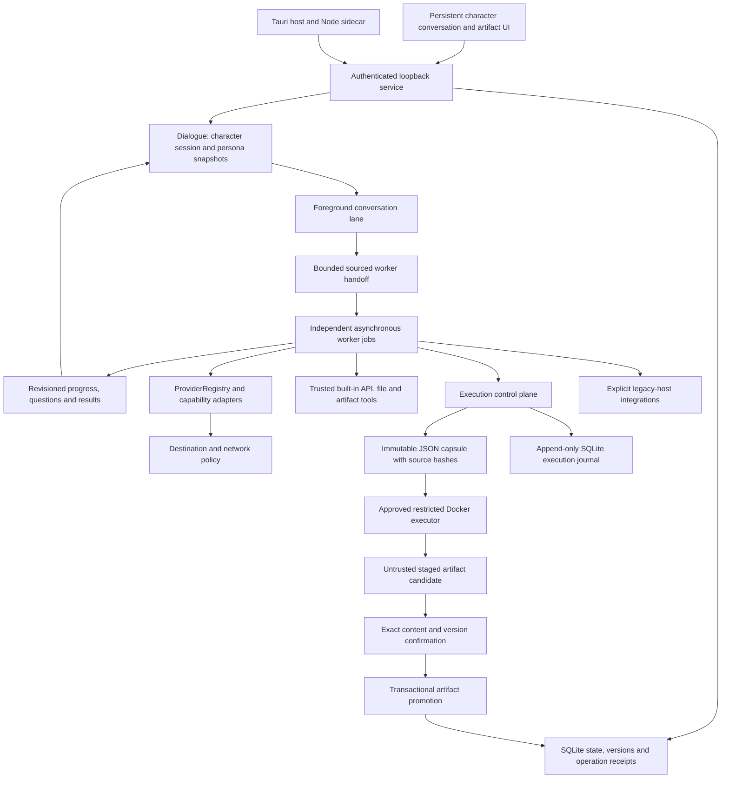

# Tepora V3 — 3.0.0-beta.11 architecture

> **2026-10-07:** The agent parts of this document describe beta.11 (protected execution, Codex, routines, effect receipts). The agent runtime has since been rebuilt; see [AGENT-HARNESS.md](AGENT-HARNESS.md) for the current design.

V3 is the default application on this branch. SQLite persistence is now owned by the Rust `native-core` library, with synchronous N-API domain operations used by the Node ESM loopback service. Canonical context assembly, token accounting and provider request/response state machines also run in Rust. The inner model/tool execution state machine is Rust-owned; a correlated JavaScript effect driver runs network/tool/plugin callbacks. Network admission, HTTP transport and outer session lifecycle still remain in JavaScript. The application retains a JavaScript/CSS web UI, optional Python workers and a thin Tauri host. Earlier application sources and documentation have been removed from this checkout and remain available through Git history.

## Service and persistence

`core/server.mjs` binds to `127.0.0.1`. A one-time launch token establishes an HttpOnly, SameSite cookie. Host/Origin checks, CSRF tokens and CSP control service access. UI and API share one origin. The browser receives no unrestricted native shell/filesystem capability.

`native-core` owns SQLite documents, settings, events, FTS persistence, session transcripts/evidence/inboxes and atomic artifact revisions. `core/store.mjs` and `core/agent/sessions.mjs` are compatibility facades for validation, JavaScript callbacks, search tokenization and import/export normalization. Service-owner PID liveness checking remains in the facade. All operations and compatibility transactions use one Rust-owned connection. See [Rust migration](RUST-MIGRATION.md). Running work becomes interrupted after restart; startup does not automatically dispatch stopped work or replay uncertain effects. V3 data are separate from V2. The source service's data directory and the Tauri host's application directory may differ. SQLite is not encrypted.

Context import assigns fresh IDs, remaps routine last-job references only to jobs in the same import, and clears missing references. Imported routines remain disabled. Explicitly re-enabling a routine clears its link to a resume-blocked imported job and schedules future occurrences; the imported job remains blocked. Routine references are escaped when rendered, including older stored values. Privileged form submissions require the actual live form element registered by the code-owned shell or sheet; a matching HTML ID does not grant access.

## Conversation and handoffs

`Dialogue` owns a durable character session, messages and separate character/worker persona settings. Job navigation in `Companion` is presentation only. Each foreground turn can submit work through `Requests`/`Harness` without waiting for the worker to finish.

A worker has its own job, pinned persona, input grants, provider route and revisions. Current utterance, goal, user decisions and selected prior sources remain distinguishable. Selected history is bounded and limited to the already authorized same recipient. Source IDs, hashes and task revisions are checked before sending and executing. Model plans and worker output never create permissions.

Worker notifications and questions are revisioned and idempotent. Explicit question IDs prevent ordinary conversation from answering unrelated worker questions. Results are retrieved only within their recipient/consent scope; sharing across recipients requires an exact bounded excerpt grant. Cancellation and revised instructions invalidate stale approvals and question targets.

## Providers and capabilities

`ProviderRegistry` pins named endpoint identities and role routes. `native-core/src/protocols.rs` encodes canonical requests and decodes streamed responses; `core/provider-protocols.mjs` retains HTTP transport, cancellation, framing, headers and the public error API. Opaque provider-native replay stays bound to its exact provider identity. `native-core/src/context.rs` and `tokens.rs` render stable model context and estimate its budget. Text protocols include Chat Completions, Responses, Anthropic and Gemini adapters. Typed decisions, embeddings, TTS, image/edit and video generation use separate capability adapters. Protocol support does not certify every provider, account or model.

`NetworkPolicy` gates admission by online / trusted-lan / offline mode and the job's allowed destinations. It is not an OS firewall and does not control an independently forwarding inference server. Modes and route changes do not silently widen a saved task's destinations. Recovery retries only eligible model/provider-blocked work without uncertain effects.

Model-controlled `web_fetch` uses the `public-web` purpose: online mode, internet-tool consent, HTTPS and exclusively public DNS addresses are required. Loopback, LAN and reserved destinations are rejected, checked addresses are pinned and redirects are not followed. Explicit local inference, legacy-host HTTP MCP and configured local RSS retain their separate integration scopes.

`MediaJobs` separates accepted, pending, unknown and ready media states and preserves received bytes with hashes. `SemanticMemory` keeps source scope and consent checks with lexical fallback. `ToolHub` separates importing MCP configuration from starting selected connections; host execution is gated by legacy-host mode.

## beta.11 execution boundary

`Execution` defaults to **protected**. Trusted built-in model/API/file/artifact tools remain usable without Docker. Host CLI, Codex, MCP, Computer Use, browser code execution and runtime launchers are unavailable through the protected execution lane.

`executor_run` serializes a bounded immutable capsule to a preinstalled, explicitly approved digest-pinned Node image. `DockerExecutor` uses no network or host mounts, non-root execution, a read-only root, bounded temporary storage/CPU/memory/processes, dropped capabilities and no-new-privileges. It never pulls an image or falls back to host execution.

Operation starts/results and capsule provenance go into an append-only SQLite journal. Executor output is untrusted and staged. Exact hash, source version, task revision and consent epoch must match before transactional promotion; the original artifact version is retained. Promotion is separate from task acceptance and independent content verification.

Crash, abort, lost response and unconfirmed cleanup are recorded as uncertain. Reconciliation is explicit and does not prove external effects were undone. Switching execution modes requires stopping active jobs/queues and known host workers.

Explicit **legacy-host** enables existing host integrations and interactive HTML artifact previews. It can access core files and backups and is not an OS sandbox. Protected artifact previews escape generated HTML. Standalone exported previews are interactive files, not an isolation boundary.

## Stacked approvals and presence

`Harness` decides inline when someone answers within a presence window (about 90 s while the person is present; no window while away, which `server.mjs` assumes when no page is connected). Otherwise a stackable operation (`run_command`, `mcp_call`, `mcp_tools`, `computer_open`, media generation, capability disclosure) becomes a pending `approval` record bound to the job revision, consent epoch and an argument digest, and the worker receives `{deferred, notExecuted}`. When only dependent work remains the job is parked (`waiting_approval`, `parked: true`) and frees its slot; parked jobs survive restarts. A later decision replays exactly the approved call through the normal dispatch, effect receipt and broker grant, or reports the refusal. Steering, pausing, cancelling or a consent change withdraws or invalidates pending requests. Live screen operations and Codex sessions stay interactive and pause the job when unanswered.

## Companion monitor UI

The page is plain ES modules joined by `core/frontend.mjs` into one classic script; top-level names must be unique across modules and the bundler rejects duplicates. `web/app.mjs` owns state, rendering and actions; `ambient.mjs` (cards, deck, idle watcher), `inbox.mjs` (あなたの番), `markdown.mjs` (escaped Markdown subset, links as text), `status.mjs` (one status vocabulary) and `approval-format.mjs` (plain-language approvals) are pure helpers. The avatar is `web/avatar/`: `pose.mjs` (mood → pose vector), `model.mjs` (the spec, bodies and colours, shared by the service), `kit.mjs`, `geometry.mjs`, `body-*.mjs` and `svg.mjs` (the drawn and picture bodies), `stage.mjs` (`createAvatar`: one handle for every body, with fallback to しろ・改) and `settings.mjs` (the studio); `voice-lines.mjs` holds the persona's tones. `vrm-stage.mjs`, `mesh-avatar.mjs` and `three-body.mjs`, with the pinned three.js, three-vrm and mesh-avatar-studio engine in `web/vendor/`, are loaded by dynamic import only when a VRM, a mesh project or the solid body is chosen, and are served from an explicit allowlist. On the service side `core/avatar.mjs` stores the spec (revision, undo) and the asset library, `core/avatar-inspect.mjs` judges what a person brings by content, and `core/persona.mjs` keeps the persona's voice apart from the avatar. See [AVATAR](AVATAR.md).

The home stage's light and the idle screen are built from small modules that only compute or draw. `seasons.mjs` (七十二候 table) and `daylight.mjs` (hour, weather and sunrise/sunset to CSS custom properties) are pure; `wallpaper.mjs` chooses the backdrop (`body[data-backdrop]`: room, plain, drift, stars, photos) and the dark lamp palette and draws the CSS layers; `lights.mjs` keeps one element per running job around the character and the amber lamp for あなたの番; `seal.mjs` implements the hold, tap and arm-then-confirm seal that fronts the existing `approve` action (seal buttons carry `data-seal` and never `data-action`, so the page's generic click handler cannot approve on a plain click); `frame.mjs` runs the photo slideshow (cross-fade, fit, Ken Burns, decode before show) and `frame-settings.mjs` prepares files in the browser (scaling) and edits the frame's options. `core/photo-frame.mjs` stores the photos under the data directory (signature check, SVG refused, size/count limits, one copy per picture) and serves them only to an authenticated page with a restrictive CSP; the list is part of `/api/bootstrap` and changes arrive as `frame.updated`. The idle screen can start from any quiet view and restores the previous view; photos are never drawn in 共有表示.

On ホーム the conversation column collapses to its message box, placed under the character with CSS grid overlap (a separate row on narrow screens); the column opens on demand elsewhere. The work page updates the job list, bench header and artifact toolbar in place around the artifact iframe, because a detached iframe reloads. Display settings, theme and idle behaviour are display preferences only; they never change permissions or work, and the emergency stop is shown whenever anything runs.

## Desktop, speech and verification

The Tauri host bundles an unmodified Node runtime, the compiled Rust persistence addon and V3 sources. It opens only the sidecar's loopback origin, supports tray show/stop/quit and preserves background work when hiding the window. Optional speech and decision workers remain separate services; real latency and GPU contention need hardware tests.

Root npm/Task commands, CI, native builds and Dependabot now target V3. [QA](QA.md) documents regression gates and [STATUS](STATUS.md) distinguishes verified mechanics from acceptance still required. Full root-capable VM/VPS adapters, automatic provisioning, complete V2 migration and broad automatic effect brokering remain future work. See [BETA11](BETA11.md) for the exact boundary.
