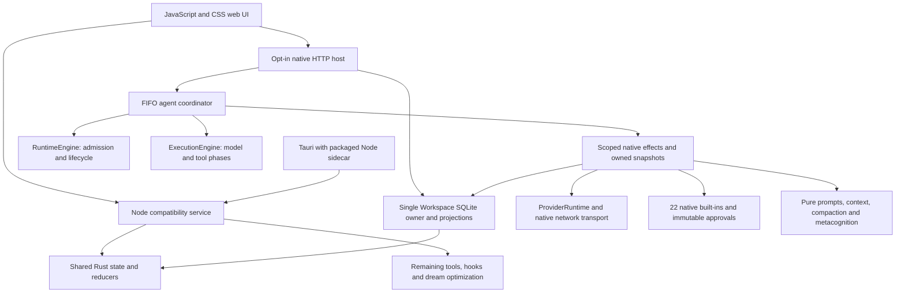

# Tepora V3 — 3.0.0-beta.11 architecture

The current application has a shared Rust core and two service hosts. Normal `npm start` and Tauri use the Node ESM compatibility host with the existing feature set. The opt-in `native-service --dev-native --agent` path runs supported conversation and worker effects in Rust; `--dev-native` alone remains the local-workspace-only mode. This is not a default or desktop cutover, and the web UI remains JavaScript/CSS.

This document describes the rebuilt session harness and incremental native host. [AGENT-HARNESS](AGENT-HARNESS.md) describes the current session model; [Rust migration](RUST-MIGRATION.md) records staged validation. Older protected/legacy-host capsule descriptions in [BETA11](BETA11.md) are historical and do not define the current `sandbox.mode` default or native capabilities.

## HTTP, state and event ownership

`core/server.mjs` is the ordinary loopback service. `native-service/src/http.rs` independently implements the authenticated listener, launch token/cookie flow, CSRF and Host/Origin checks, body bounds, static allowlist/CSP and SSE. It is not a reverse proxy to Node. Both hosts retain the service-owner lease and reject another live owner of the same data directory.

`native-core` owns SQLite documents/settings, FTS persistence, events, session transcripts/evidence/inboxes, and atomic artifact revisions. `store_domain.rs` shares workspace validation, indexing and import/export normalization; `projection.rs` shares UI snapshots and derived events. The Node `Store` and `SessionStore` facades retain their public callback and JavaScript compatibility behavior. The native `WorkspaceAccess` facade exposes narrow state operations and commit batches using the same single connection; provider caches, approvals and tools do not create another database owner.

State batches commit before their events are published. UI-derived projections precede their source event. SSE replay/snapshot choice and live subscription registration share the state lock, with bounded subscriber queues and write deadlines. No SQLite lock is held across provider/file I/O or an approval wait.

Context import assigns fresh IDs, remaps references and cannot restore execution authority: memories are private/unconfirmed, imported skills/routines remain disabled, jobs remain interrupted/resume-blocked and dialogue archives remain read-only. Existing databases and unknown document fields are preserved rather than converted or deleted. SQLite is not encrypted; the source-service and desktop data directories may differ.

`workspace/photo_frame.rs` stores bounded, inert photo bytes for both native development modes. A photo-specific mutex orders imports, reads and deletions while the existing Workspace owner handles metadata and `frame.updated` events. SQLite locks are released during filesystem I/O. Image signatures and inexpensive dimensions are inspected without decoding; authenticated HTTP serves the original bytes with the photo CSP and private caching. The 24 MiB/photo, 300-photo, 2 GiB-total and 120-million-pixel limits match the compatibility host. This does not change the normal launcher. See [photo-frame validation](RUST-PHOTO-FRAME.md).

`workspace/avatar_assets.rs` and its inspection module own the local avatar library in both native development modes. Image, VRM and image-set/mesh pack bytes retain the source format, metadata, quotas and hash checks. An asset-specific mutex serializes file operations outside the SQLite lock and drains before final database close. Deleting a currently worn asset resets its avatar through the same state owner, preserving revision/history and event ordering. See [avatar asset validation](RUST-AVATAR-ASSETS.md).

## Sessions and native coordination

The resident main session and independent worker sessions have append-only logs, ordered inboxes, personas, working folders, toolsets, state and usage. Worker progress is a passive parent notification; a final report is an ordinary follow-up message. Visibility follows the existing main/parent/descendant rules. Input headers identify provenance and use the process-local timezone. Model output, persona text and received reports are data, not new authority.

`native-core/src/runtime.rs` owns admission, capacity, epochs, timers, retries, auxiliary leases, completion checks and stop/resume. `execution.rs` owns prompt/budget/context phases, model failure handling, tool grouping, approvals and ordered receipts. `native-service/src/agent/coordinator.rs` drives both reducers on one FIFO actor. A service ID, session ID, runtime epoch, execution generation and operation ID identify continuations; effect workers return owned values or scoped state requests instead of recursively entering the reducers.

Stop cancels inference and approval waits, rejects work not yet dispatched and drains actual dispatched tool outcomes in model order. Resume waits for the old lease to drain. HTTP Stop All stops active work and rearms the main session; tray/sidecar Stop cancels active workers and native HTTP probes while preserving the resident main inference. Close withdraws approvals, drains commands/receipts and closes network/provider resources before releasing Workspace/SQLite ownership. Restart writes an unknown-outcome receipt for interrupted tool calls rather than replaying their side effects.

The Node host still supplies callbacks, timers and effects through `core/agent/loop.mjs` and `runtime-host.mjs`. It uses the same Rust decision engines; its remaining JavaScript effects have not been removed by adding the native path.

## Providers, network and budgets

`native-core/src/protocols.rs` handles canonical request/response state machines and provider-native replay tied to exact identities. Native `provider.rs` and `network.rs` implement registry profiles/routes, destination admission, DNS/TLS, UTF-8/SSE/NDJSON framing, cancellation, resource/slot leases, limit discovery, retries, compatibility learning and safe errors. Chat Completions, Responses, Anthropic and Gemini are supported, plus discovered native Ollama transport. The Node compatibility path retains its existing provider/network adapters.

The network policy distinguishes online, trusted-LAN and offline destinations. It is not an OS firewall and cannot constrain a separately forwarding inference server. Provider configuration changes invalidate affected active operations. Protocol support and deterministic fixtures do not certify every remote account, model, hardware configuration or real-model quality.

`context.rs` and `tokens.rs` build stable model context, clear/supersede old results, repair call/result sequences and account for tool definitions, images and calibration. Unicode16/17 token estimates are explicit inputs; the native host uses Unicode17 consistently. Role selection, reserve calculation and overflow retries remain compatible with the original harness.

Native dispatch accounting records bounded final receipts for chat, summary and typed decision transport attempts, including retries and unknown usage/cost. Additive all-call aggregates are separate from the existing normal-turn budget counters; modality/Node coverage remains explicitly excluded. See [model-dispatch accounting](RUST-MODEL-USAGE.md) for retention, uncertainty and attribution limits.

Separate capability endpoints handle typed decisions, embeddings, speech and generated media in the compatibility service. Native capability configuration, identity-bound memory-only keys and typed transport components are implemented. Typed decision and scoped semantic consumers are connected to the shared owner; user-requested media jobs also consume those transports. Ordinary streaming speech, dictation proposals and uploaded-audio transcription are also connected. Media agent tools and other speech capability consumers remain unported.

## User-requested media jobs

`workspace/media_jobs.rs` owns the seven media-job/asset routes under `--dev-native --agent`. Its lifecycle lock serializes admissions, two concurrent workers, completion, cancellation and close; all documents/events use the existing Workspace owner. No SQLite guard crosses provider or file I/O. Native capability/network code retains endpoint identity, resource budgets, cancellation and destination policy. Video poll timers are owned tasks, and shutdown cancels and drains them before SQLite closes. Stop All and tray Stop deliberately improve on the source status-only loop by cancelling owned awaiting-download workers while leaving dormant resumable handles unchanged. Cancelled worker tokens cannot publish late ready results. The 16-job create check retains the source status subset and is not a hard cap on all outstanding handles; two-worker execution remains separately bounded.

Persisted submission uncertainty is never replayed as a new paid job. Startup pauses queued/running handles and marks a lost submitting response unknown. Explicit resume polls the same remote ID or retries its download; a provably unsent queued job may be submitted by that explicit action. Local files retain signature/modality checks, hashes, the 32 MiB output limit and 512 MiB library limit. Serialized writes make a separate pending-byte reservation unnecessary. Authenticated GET/HEAD supports source byte ranges and inert download headers. See [media validation](RUST-MEDIA-JOBS.md); agent media tools and live provider acceptance remain separate.

## Local media-view responses

`workspace/media_embed.rs` owns the two ordinary embed/view routes under `--dev-native --agent`. It uses the existing native network policy and stores a 32-entry FIFO of ephemeral handle/video-ID pairs under the sole Workspace State lock. Lookup, admission, close and non-online network-mode invalidation are ordered through that same owner. No handle is persisted; there is no TTL and reading does not refresh insertion order. The HTTP host emits the source HTML/CSP/cache headers without fetching media or opening a browser. Effect-free mode returns 503. [Embed/view validation](RUST-MEDIA-EMBED.md) covers local response bytes only; third-party playback and the external opener are outside this slice.

## Semantic memory

`POST /api/semantic/index` and `POST /api/semantic/search` are connected under `--dev-native --agent`, retaining authentication, CSRF, Host/Origin and network-policy checks. Their asynchronous waits do not occupy the blocking pool; request drop/shutdown cancels the request scope, with 90-second index and 30-second search deadlines. Index batches contain at most 24 documents, each truncated to 12,000 UTF-16 units. Vectors are disposable caches stored through the existing sole Workspace/SQLite owner.

Only confirmed memories are eligible. External indexing requires exact HTTP `consent: true` and only sends shared documents. Current document content/scope/confirmation and capability identity are rechecked before egress and cache publication; mutation revokes affected active work before acknowledgement. Already transmitted bytes cannot be recalled. Search combines lexical and vector ranking, falls back to lexical retrieval when embeddings are unavailable, and rechecks returned documents. Similarity is not truth or automatic learning.

Agent `memory_search` uses the configured semantic space with ordinary tool receipts and lexical fallback. Model arguments cannot grant external embedding consent; agent search and background indexing use non-external defaults. Successful `memory_write` schedules one bounded best-effort coalesced index job without delaying or changing its independent write receipt. Normal run release does not cancel indexing. Session Stop removes only that session's ownership; another session or unscoped owner keeps shared background work alive, and other sessions' foreground searches retain their own cancellation scopes. When the last scoped owner stops, the background job is cancelled. Close cancels and drains all semantic work before SQLite closes.

## Prompts, compaction and self-checks

`native-core/src/harness/` ports result shaping, the actual lightweight schema subset and JSON repair, persona/voice prompts, all harness notices, ledger folding, summary validation, chapters, identifier recovery and metacognition. It has no store, filesystem, network or clock effects. JSON boundaries preserve property ordering, JavaScript number semantics and isolated UTF-16 surrogates. Frozen JavaScript lives only in differential test fixtures.

`agent/context.rs` handles cached prompts, append-only instruction updates, budgets and real asynchronous compaction. It attempts an in-context summary, then rolling compaction-route summaries, then the existing deterministic fallback if model summarization fails. Previous facts, exact ledgers and permanent chapter provenance survive; a cancelled operation cannot return a checkpoint for commit. The actor commits the checkpoint/notice, increments statistics and refreshes the prompt only for the current operation.

`agent/metacognition.rs` applies repetition/error notices and real escalation/deescalation before rereading the session for a measured self-check. Stuck-parent reports use ordinary passive send semantics and per-reason deduplication. `reflect` records model-stated beliefs separately from measured facts. Memory updates are published only after their corresponding effects succeed.

## Native preferences and visual configuration

The explicit native host now implements persona/voice and application preference changes, plus the display/avatar recipe state APIs. `workspace/preferences.rs` validates the existing field subset, serializes persona changes, checks revisions and asks the actor to refresh prompts without replacing a cached prefix. Persona/voice text never grants execution authority. Network-related preference changes retain the existing policy revocation boundary.

`workspace/display_avatar.rs` owns validated recipe changes, revision histories, undo/reset and portable preset import/export under the same Workspace/SQLite owner. The date parser preserves the frozen V8 input behavior and carries its source/license notice into native distributions. These state APIs do not implement custom avatar asset uploads, asset byte serving, audio or media effects. Normal Node/Tauri startup and all JavaScript/CSS remain unchanged.

## Native first-use setup and catalog

In `--dev-native --agent`, `setup/manager.rs`, `runtime_discovery.rs` and `model_catalog.rs` own the setup, discovery and catalog routes. Workspace-only mode remains effect-free. Construction and GET snapshots never start scanning, model calls, downloads or a browser; interrupted persisted transfers are marked interrupted without auto-resume.

- Explicit scan/discovery queries fixed loopback runtimes through `NativeNetwork`, with bounded responses and expiring candidates. Ollama remote/forwarded models are excluded from first-use candidates
- Selection requires exact `consentTest: true`, a fresh candidate, an idle actor and no existing named provider registry. A safe tool-roundtrip probe and Ollama digest recheck precede activation. The actor rechecks cancellation, busy state, settings identity and registry revision; settings, registry, receipt and ordered events commit together through the single SQLite owner, with rollback on failure. The receipt does not certify model quality or vision/decision capabilities
- Install requires online mode before HTTP body parsing and again at admission, exact `consentDownload: true`, a fresh local engine and one of the fixed catalog choices. It requests a bounded, cancellable Ollama pull with progress/idle/total limits. Stop and network restriction cancel the active probe/download; shutdown also cancels scans and drains setup work. Retry can reuse Ollama-managed partial data. It neither installs a runtime package nor automatically activates the downloaded model
- Install-help only opens the fixed official Ollama download page with the platform opener after the explicit authenticated request. It is not arbitrary shell execution or unattended package installation
- Catalog import/search handles bounded unverified metadata with provenance/hash; explicit refresh uses the fixed `https://models.dev/api.json` endpoint through checked web network policy with a 24 MiB limit and cancellation. Catalog entries grant no execution or network authority

The outer cookie/authentication, CSRF, Host/Origin and body-size checks remain in force. Setup does not change the existing sandbox selection or grant tool permissions. Checked application networking is not an OS firewall and cannot constrain a separately forwarding local runtime. Plugin and cached unsupported-tool admission failures remain; saved schedules and heartbeat timers are native actor consumers.

## Tools, approvals and current execution boundary

The native catalog implements `sessions_spawn`, `sessions_send`, `sessions_list`, `sessions_history`, `sessions_stop`, `read`, `write`, `edit`, `todo`, `reflect`, `artifact`, `recall`, `history_search`, `memory_search`, `memory_write`, `tools_search`, `tools_call`, `exec`, `process`, `web_search`, `web_fetch` and `schedule`. Fixed main/worker/lean sets preserve order and include only implemented/enabled definitions. Native memory search uses scoped semantic retrieval with the existing lexical fallback. Image reads/vision bridging and MCP indirection remain unavailable.

Policy matching preserves first-rule ordering, wildcard/prefix/exact names and validated ECMAScript-compatible UTF-16 regex matching. `agent/approvals.rs` persists immutable approved arguments, coordinates actor-owned decisions and withdraws stale requests. Approval wait futures do not write state. Late decisions, altered approval documents and stopped runs cannot authorize dispatch. Actual results and evidence are recorded once, in model order, with truncation/recall references, error/not-executed/interrupted distinctions, read references and usage statistics.

The current `core/sandbox.mjs` default is **`off`**, with optional `workspace`, `readonly` and `container` configurations. This migration preserves those settings and existing file guards; it does not revive the former protected/legacy-host capsule architecture. Native `exec`/`process` uses the same sandbox selection and never silently falls back to an unconfined command. Process ownership, bounded output and cleanup uncertainty are separate from model/tool scheduling. Resume awaits the previous stopped-process barrier before making a new model request.

File tools preserve path resolution, freshness checks and read-before-overwrite behavior. Their serialization key is a lexically resolved path, not inode/canonical identity: symlink/hardlink aliases can race. Configured confinement rejects final symlinks and canonical parents outside writable roots, but does not establish complete safety against concurrent ancestor renames. Neither writable-root checks nor network policy should be described as a complete OS sandbox.

## Native admission and remaining effects

Native mode fails preflight for configured global `.mjs` plugins. Cached unsupported toolsets are diagnosed before model use, including resumed sessions. Absent hooks can use identity behavior; configured hooks cannot silently become no-ops. New native prompts explicitly describe unavailable capabilities, and known unimplemented APIs fail clearly.

Browser rendering, `find`/`grep`, MCP, skills execution, image loading through `read` and unsupported vision bridges, media/speech, Computer Use, dream optimization, JavaScript plugins and remaining avatar/peripheral mutations still use the compatibility service. Their saved data are retained. [Native host setup and limits](../native-service/README.md) lists the supported mode and routes. Neither the default launcher nor Tauri has been switched to the native service.

## Companion monitor UI

The page is plain ES modules joined by `core/frontend.mjs` into one classic script; top-level names must be unique across modules and the bundler rejects duplicates. `web/app.mjs` owns state, rendering and actions; `ambient.mjs` (cards, deck, idle watcher), `inbox.mjs` (あなたの番), `markdown.mjs` (escaped Markdown subset, links as text), `status.mjs` (one status vocabulary) and `approval-format.mjs` (plain-language approvals) are pure helpers. The avatar is `web/avatar/`: `pose.mjs` (mood → pose vector), `model.mjs` (the spec, bodies and colours, shared by the service), `kit.mjs`, `geometry.mjs`, `body-*.mjs` and `svg.mjs` (the drawn and picture bodies), `stage.mjs` (`createAvatar`: one handle for every body, with fallback to しろ・改) and `settings.mjs` (the studio); `voice-lines.mjs` holds the persona's tones. `vrm-stage.mjs`, `mesh-avatar.mjs` and `three-body.mjs`, with the pinned three.js, three-vrm and mesh-avatar-studio engine in `web/vendor/`, are loaded by dynamic import only when a VRM, a mesh project or the solid body is chosen, and are served from an explicit allowlist. On the service side `core/avatar.mjs` stores the spec (revision, undo) and the asset library, `core/avatar-inspect.mjs` judges what a person brings by content, and `core/persona.mjs` keeps the persona's voice apart from the avatar. See [AVATAR](AVATAR.md).

The home stage's light and the idle screen are built from small modules that only compute or draw. `seasons.mjs` (七十二候 table) and `daylight.mjs` (hour, weather and sunrise/sunset to CSS custom properties) are pure; `wallpaper.mjs` chooses the backdrop (`body[data-backdrop]`: room, plain, drift, stars, photos) and the dark lamp palette and draws the CSS layers; `lights.mjs` keeps one element per running job around the character and the amber lamp for あなたの番; `seal.mjs` implements the hold, tap and arm-then-confirm seal that fronts the existing `approve` action (seal buttons carry `data-seal` and never `data-action`, so the page's generic click handler cannot approve on a plain click); `frame.mjs` runs the photo slideshow (cross-fade, fit, Ken Burns, decode before show) and `frame-settings.mjs` prepares files in the browser (scaling) and edits the frame's options. `core/photo-frame.mjs` stores the photos under the data directory (signature check, SVG refused, size/count limits, one copy per picture) and serves them only to an authenticated page with a restrictive CSP; the list is part of `/api/bootstrap` and changes arrive as `frame.updated`. The idle screen can start from any quiet view and restores the previous view; photos are never drawn in 共有表示.

On ホーム the conversation column collapses to its message box, placed under the character with CSS grid overlap (a separate row on narrow screens); the column opens on demand elsewhere. The work page updates the job list, bench header and artifact toolbar in place around the artifact iframe, because a detached iframe reloads. Display settings, theme and idle behaviour are display preferences only; they never change permissions or work, and the emergency stop is shown whenever anything runs.

## Desktop, speech and verification

Tauri still bundles a Node runtime, the compiled Rust core addon and V3 sources. It opens only the sidecar loopback origin and retains tray/background behavior. The standalone native-service binary needs no Node executable after its frontend bundle is built, but it is not the packaged desktop sidecar. Optional Python speech/decision workers remain separate services.

Root npm/Task commands and CI target V3. [QA](QA.md) and [STATUS](STATUS.md) contain historical and current evidence; the dated [migration record](RUST-MIGRATION.md) identifies exactly which native slice was exercised. Local deterministic provider fixtures verify mechanics, not real model quality or a paid account. Windows/macOS packaging, installation, native WebView behavior and real hardware/model acceptance remain separate gates. Complete V2 migration and the remaining native effects are unfinished.

## Process and capability checkpoint

`agent/process_host.rs` adapts real processes to the existing FIFO actor and ordered receipts. `agent/processes.rs` owns the bounded process manager; `sandbox.rs` creates the configured host/workspace/readonly/container invocation. Frozen per-step descriptors preserve dynamic alias receipt keys. Approved arguments are consumed once at dispatch.

`capabilities/` uses the same `WorkspaceAccess` and `NativeNetwork`; registry/event CAS is atomic, and explicit keys are memory-only. Workspace retains the agent host for live process projections. Provider/capability snapshot decorators only read runtime-owned caches, so reconnect sequence capture and subscriber registration remain atomic under the one State lock.

`workspace/input_files.rs` stages inert bounded text/image documents transactionally. `workspace/session_files.rs` provides bounded file listing/download with a resolved-root guard. Agent input now connects bounded attachment preparation and supported image context through correlated admissions. No default application cutover is implied.

See [complete route inventory and release gates](RUST-ROUTE-PARITY.md).

## Native web effects

`agent/web_host.rs` binds existing web tools to the actor with immutable approvals, alias receipts, cancellation and shared cache lifetime. `workspace/web_state.rs` reads selected credentials/configuration atomically without another database owner. `PUT /api/agent/search-key` retains the source credential-storage behavior, emits no secret events and invalidates old bindings before acknowledging the change. NativeNetwork checks trusted binding guards after admission/DNS, and CheckedTransport checks again after TCP/TLS before request dispatch. Revoked/stale responses never repopulate the cache. Browser rendering remains explicitly unavailable; connected decision advice does not expand web authority.

## Typed decision and session lifecycle ownership

Typed decision requests now use `CapabilityDecisionBackend` with the existing shared capability registry, memory-only keys, network owner and resource gate. Actor-owned delegation and completion consume advisory answers only after scope and binding checks. Buffered answers recheck registry revision, endpoint identity, an opaque owner-wide key generation and close state before consumption. Any capability-key set/clear conservatively invalidates buffered advice; original active-transport behavior is preserved. No keys or credential hashes enter advisory bindings or public events. Advice never grants tool authority.

Attachment input resolves up to six staged IDs on the server, verifies hashes and byte limits, then materializes collision-safe files under the configured work root outside the FIFO actor. Pending requests with the same request ID share preparation; only successful actor acceptance caches the receipt. Stop/shutdown cancel admission but still join dispatched filesystem work. A partial write may remain on disk without an accepted-input receipt. Files are saved locally and the input retains their text/path receipts; up to the first four images enter supported vision context. Non-vision chat omits image bytes while retaining the local receipt and never starts a vision bridge. Oversized images use the bounded macOS resize path; if resizing is unavailable or fails, the local file remains but the image is omitted. Image loading through `read` and unsupported vision bridges remain unavailable.

Session deletion rejects the resident main session (403), missing sessions (404), and active or still-draining work (409). For an idle worker, a correlated admission cancels its timer, blocks new send/resume/wake activity and waits for owned process cleanup before the actor rechecks and commits removal. Cancellation or uncertain cleanup cannot become successful deletion; failed deletion retains the session and prior receipts. Successful removal concerns session state and in-memory host caches, not unrelated user files or recursive removal of the working folder.

Native semantic index/search and `memory_search` now share `Capabilities`, `NativeNetwork` and the one SQLite owner. Confirmed-memory consent, scope, content and capability identity are rechecked before egress and cache publication; external embedding requires explicit permission and shared scope. Vectors are disposable caches, and lexical fallback remains available. This does not connect media/speech or other capability consumers.

Current Linux checks: 61 selected ordinary native-service tests, 2 focused SQLite cache tests, 11 real HTTP/socket tests, and the original Node scheduler regression pass. The 11 HTTP tests include a real schedule tool receipt, restart delivery and second-restart deduplication. These are focused gates, not a full Rust/Node/quality pass; approval-policy and broader security suites were not rerun in this slice. Cross-platform CI and packaging for this new source are still pending. Earlier package results at 7743e8d do not certify this candidate. No real model, paid provider or desktop default cutover is claimed.

## Native saved schedules and check-ins

`agent/scheduler.rs` plans ordinary reminders and worker tasks without owning a database or invoking a model. Add/list/cancel retains source metadata, UTF-16 bounds, local-time shorthand, recurrence and missed-tick behavior. Its date grammar is shared with display validation; fixtures cover legacy forms, Date range endpoints, signed-year ordering and DST gaps/repeats. Unix timezone subprocess fixtures cover New York, Lord Howe and Tokyo; Windows uses its OS timezone and does not run the TZ-variable fixture.

`agent/coordinator/scheduling.rs` owns versioned timers. Each interval holds at most one queued callback; stale generations, foreign service IDs and callbacks after close are ignored. Shutdown cancels timers before draining outstanding effects. Heartbeat configuration replaces its timer and cancels any old decision request. Cancellation clears dedup state only for that still-current plan generation, allowing unchanged undelivered work to retry without invalidating a newer settled check-in. Unchanged state, ordinary step-counter progress, a busy main session or pending input does not wake the model. Optional typed decisions remain asynchronous owned admissions, and cancelled results cannot enqueue late input.

Only actor callbacks commit schedule documents and `schedule.updated` events through the existing Workspace. A due one-shot is removed; a missed recurring item fires once and moves to its next future occurrence. As in the source host, delivery and schedule advancement are separate commits: a crash between them can redeliver, so no crash-atomic exactly-once guarantee is claimed. The `schedule` tool follows the existing tool execution/receipt path. Real HTTP fixtures verify saved receipts, startup catch-up and no duplicate reminder on a second restart. This remains the explicit development host; Node/Tauri and GUI files are unchanged.

## Ordinary streaming speech native owner

The explicit native agent host owns streaming speech R074–R077 through an ephemeral lifecycle owner and the existing checked network transport. Stop/close invalidate and drain pending worker operations; no audio/transcript enters durable state. The effect-free native mode and normal Node/Tauri defaults are unchanged. [Streaming contract and verification](RUST-SPEECH-STREAM.md); dictation and uploaded-audio ASR have their own [route contract](RUST-VOICE-ROUTES.md).

## Ordinary voice proposals and uploaded audio

`workspace/voice_operations.rs` owns asynchronous device-only dictation and configured-ASR upload flights. It reuses the provider registry, shared JSON/UTF-16 codec and checked network without saving text, audio or credentials. Counted voice and speech cancellation barriers are both signalled before media drain on Stop All, tray Stop or shutdown. Request drop cancels its scope; late results cannot become successful replies. Native ASR adds explicit response, transcript and concurrent-flight bounds. [Contract and focused validation](RUST-VOICE-ROUTES.md).

## Native ordinary stored skills

`workspace/skills.rs` owns custom-skill create, enabled-flag patch and delete under `--agent`. A skill mutex orders document mutation, durable event publication and existing actor refresh; no SQLite guard crosses the actor wait. Errors during refresh retain the source document/event-before-refresh behavior. Native snapshots reread enabled metadata, while the unavailable `skill` tool/content consumer and shared discovery remain separate gaps. No text is executed and no filesystem discovery is added. [Contract and validation](RUST-CUSTOM-SKILLS.md).

## Native ordinary weather and news

`workspace/feed_connectors.rs` owns the saved-city/feed operations, source-compatible in-memory TTL cache and conservative RSS/Atom projections. The existing checked feed transport and settings remain authoritative. Bounded async flights, request-drop cancellation and counted Stop/tray/close barriers prevent cancelled cache publication and drain before SQLite closes. No connector documents, credentials or events are persisted. [Contract and mock-only validation](RUST-FEED-CONNECTORS.md).
