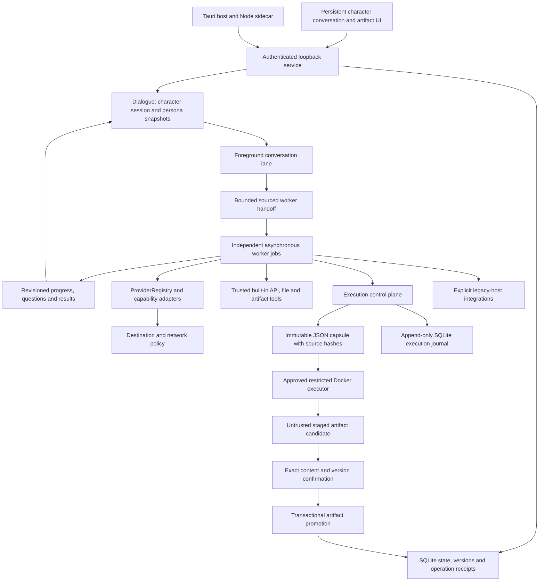

# Tepora V3 — 3.0.0-beta.11 architecture

V3 is the default application on this branch. Its core is a Node ESM loopback service with SQLite persistence, a JavaScript/CSS web UI, optional Python workers and a thin Tauri host. Earlier application sources and documentation have been removed from this checkout and remain available through Git history.

## Service and persistence

`core/server.mjs` binds to `127.0.0.1`. A one-time launch token establishes an HttpOnly, SameSite cookie. Host/Origin checks, CSRF tokens and CSP control service access. UI and API share one origin. The browser receives no unrestricted native shell/filesystem capability.

`core/store.mjs` owns SQLite documents, settings, events, FTS search and service ownership. Running work becomes interrupted after restart; startup does not automatically dispatch stopped work or replay uncertain effects. V3 data are separate from V2. The source service's data directory and the Tauri host's application directory may differ. SQLite is not encrypted.

## Conversation and handoffs

`Dialogue` owns a durable character session, messages and separate character/worker persona settings. Job navigation in `Companion` is presentation only. Each foreground turn can submit work through `Requests`/`Harness` without waiting for the worker to finish.

A worker has its own job, pinned persona, input grants, provider route and revisions. Current utterance, goal, user decisions and selected prior sources remain distinguishable. Selected history is bounded and limited to the already authorized same recipient. Source IDs, hashes and task revisions are checked before sending and executing. Model plans and worker output never create permissions.

Worker notifications and questions are revisioned and idempotent. Explicit question IDs prevent ordinary conversation from answering unrelated worker questions. Results are retrieved only within their recipient/consent scope; sharing across recipients requires an exact bounded excerpt grant. Cancellation and revised instructions invalidate stale approvals and question targets.

## Providers and capabilities

`ProviderRegistry` pins named endpoint identities and role routes. Text protocols include Chat Completions, Responses, Anthropic and Gemini adapters. Typed decisions, embeddings, TTS, image/edit and video generation use separate capability adapters. Protocol support does not certify every provider, account or model.

`NetworkPolicy` gates admission by online / trusted-lan / offline mode and the job's allowed destinations. It is not an OS firewall and does not control an independently forwarding inference server. Modes and route changes do not silently widen a saved task's destinations. Recovery retries only eligible model/provider-blocked work without uncertain effects.

`MediaJobs` separates accepted, pending, unknown and ready media states and preserves received bytes with hashes. `SemanticMemory` keeps source scope and consent checks with lexical fallback. `ToolHub` separates importing MCP configuration from starting selected connections; host execution is gated by legacy-host mode.

## beta.11 execution boundary

`Execution` defaults to **protected**. Trusted built-in model/API/file/artifact tools remain usable without Docker. Host CLI, Codex, MCP, Computer Use, browser code execution and runtime launchers are unavailable through the protected execution lane.

`executor_run` serializes a bounded immutable capsule to a preinstalled, explicitly approved digest-pinned Node image. `DockerExecutor` uses no network or host mounts, non-root execution, a read-only root, bounded temporary storage/CPU/memory/processes, dropped capabilities and no-new-privileges. It never pulls an image or falls back to host execution.

Operation starts/results and capsule provenance go into an append-only SQLite journal. Executor output is untrusted and staged. Exact hash, source version, task revision and consent epoch must match before transactional promotion; the original artifact version is retained. Promotion is separate from task acceptance and independent content verification.

Crash, abort, lost response and unconfirmed cleanup are recorded as uncertain. Reconciliation is explicit and does not prove external effects were undone. Switching execution modes requires stopping active jobs/queues and known host workers.

Explicit **legacy-host** enables existing host integrations and interactive HTML artifact previews. It can access core files and backups and is not an OS sandbox. Protected artifact previews escape generated HTML. Standalone exported previews are interactive files, not an isolation boundary.

## Desktop, speech and verification

The Tauri host bundles an unmodified Node runtime and V3 sources. It opens only the sidecar's loopback origin, supports tray show/stop/quit and preserves background work when hiding the window. Optional speech and decision workers remain separate services; real latency and GPU contention need hardware tests.

Root npm/Task commands, CI, native builds and Dependabot now target V3. [QA](QA.md) documents regression gates and [STATUS](STATUS.md) distinguishes verified mechanics from acceptance still required. Full root-capable VM/VPS adapters, automatic provisioning, complete V2 migration and broad automatic effect brokering remain future work. See [BETA11](BETA11.md) for the exact boundary.
