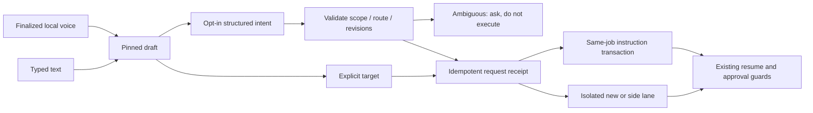
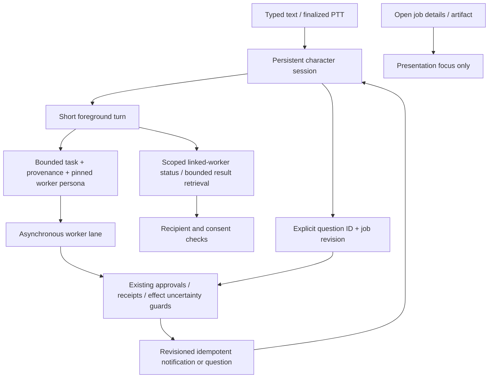

# V3 beta.7 architecture

```
Calm monitor / Tauri host
  -> cookie + CSRF authenticated loopback service
     -> task snapshot: goals, exact allowed recipients, input grants, checks, permissions
     -> independent conversation + work lanes / plans / routines
        -> named ProviderRegistry (roles, capability checks, resources, explicit fallbacks)
           -> Chat Completions / Responses / Anthropic / Gemini adapter
              -> NetworkPolicy -> pinned HTTP/TLS transport
        -> local VLM -> sourced lossy evidence -> main task model
        -> local Laya -> shortlist decision (not authority)
        -> scoped tools -> receipts -> verification/repair -> review/accepted result
           - files / artifacts / memory / shared skills
           - checked public HTTPS fetch
           - owned browser or selected Windows UIA -> observe / act / observe
           - disposable offline browser worker -> JSON calculation
           - explicitly approved host CLI / MCP / Codex (online only)
```

Modes narrow active traffic and future admissions. A job is not silently granted new destinations
when global configuration changes. A stopped job can be rebound through explicit consent and a
revision check, unless effects are uncertain. Host execution remains distinct from browser-worker
isolation; the app does not claim control over unrelated OS processes or upstream server forwarding.

Operation uncertainty, exact-argument approvals, task checkpoints, rolling context and artifact
revisions from prior versions remain. Network/provider errors are not converted into success.
A bounded recovery watcher retries only eligible provider-blocked work with the same permitted
recipients and no uncertain effects. It never retries an external operation merely because the
network recovered.

State classes remain separate: appearance, microphone, privacy presentation, task execution,
provider capabilities and network policy. Source text or displayed controls do not grant authority.
Descriptions derived from private pixels retain their privacy classification.

Resource gates control request admission, not GPU preemption or memory reservations. ASR/Laya have
independent workers; real contention and long-term availability require actual hardware tests.
The documented test matrix is in `BETA7.md`; unfinished scenario conditions remain in the generated
100-scenario answers.


## beta.8 capability layer

`Capabilities` separates typed decisions, embeddings, speech and generation from text-chat protocols.
`MediaJobs` persists accepted/pending/unknown/ready states and exact received bytes independently
from a conversation job. Its output is a media asset, not executable HTML or an instruction.
`SemanticMemory` uses endpoint/content scoped vectors with lexical fallback and live consent checks.
`ToolHub` stages many MCP connections, separately starts selected ones, pages their schemas and
searches a small working set. `ModelCatalog` stores optional provider metadata without executing it.
`CodexLogin` delegates managed browser/device flows to the installed App Server, not token extraction.
`ComputerControllers` routes either explicit LLM tools or typed closed-set next-action decisions
through the same observed-target driver and independent verification contract. It is not a new OS
sandbox. `web/capability-ui.mjs` provides on-demand sheets and nonblocking media without changing
the quiet home; generated responses do not imply automatic speech or autonomous media requests.

## Companion addressing (beta.9)

The composer pins a draft to a **navigation revision** and a **job instruction revision**.
`Companion` persists focus and a bounded return stack in the existing SQLite store. Focus and
return are navigation only: neither resumes, approves, cancels nor duplicates work. New/side
request acceptance saves the receipt and updated focus together; receipt replay never changes focus.
A side task records `sideOfJobId`, not a parent/dependency link. It has a fresh conversation lane
and cannot inherit the origin's files, tool evidence or chat history through that relationship.

Explicit addressing uses `Requests` directly with no extra model inference. Optional natural
addressing calls `IntentProposals` using the focused job's already pinned provider route. Only
bounded purpose, recent user instructions and current utterance are sent; no sibling lane,
artifact/tool content, or private memory is supplied. Consent is bound to the effective route,
consent epoch and context-scope version and may be reused until those change. The only model
output is a strict fixed intent schema. Unknown fields, arbitrary targets and extra calls are
rejected. Ambiguity produces a question and no job. The original utterance is never replaced by
a model-generated command. New/side execution destinations are pinned separately and rechecked.
Proposals expire, and focus/job/attachment revisions are checked again on submission. Stop and
permission changes abort pending model classification. The UI also cancels pre-dispatch continuations.

`Requests.continue` validates focus, job revision, consent epoch and import restrictions. It commits
one steering instruction, visible user turn and accepted request receipt in one SQLite transaction.
Only after commit does `Harness.notifySteer` interrupt stale inference and invalidate old approvals.
Paused/review work uses the ordinary `resume` path, including unknown-effect and external-session
reconciliation guards. A blocked resume retains the saved instruction and returns `resumeRequired`;
it never creates a substitute task. All existing tool-level approvals remain in force.



## Character session and worker message bus (beta.10)

The beta.9 job-focused addressing API remains available for compatibility, but is no longer the
main conversation surface. The new `Dialogue` service owns a stable character session, separate
persona configuration and durable messages. Job navigation is a read-only presentation concern.
Each new character turn runs in the short foreground lane and can dispatch scoped work without
waiting for it. Workers are separate Harness jobs with their own persona/context snapshots.



Worker reports remain untrusted content with explicit source and status. They cannot create
permissions. New character model context is limited to the current session and authorized
recipient; bounded worker result retrieval is scoped separately from raw worker checkpoints.
Cancellation and revised instructions invalidate old question targets. Startup reconciliation
replays durable task state without dispatching stopped work or duplicating delivered messages.
