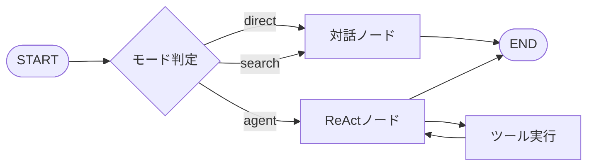
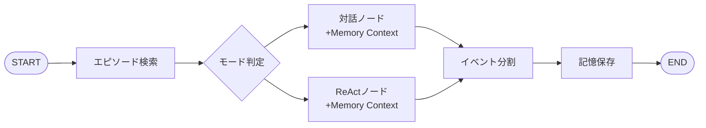
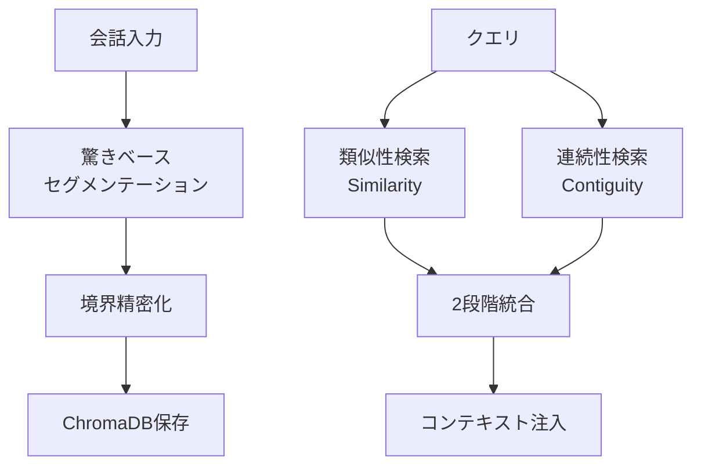
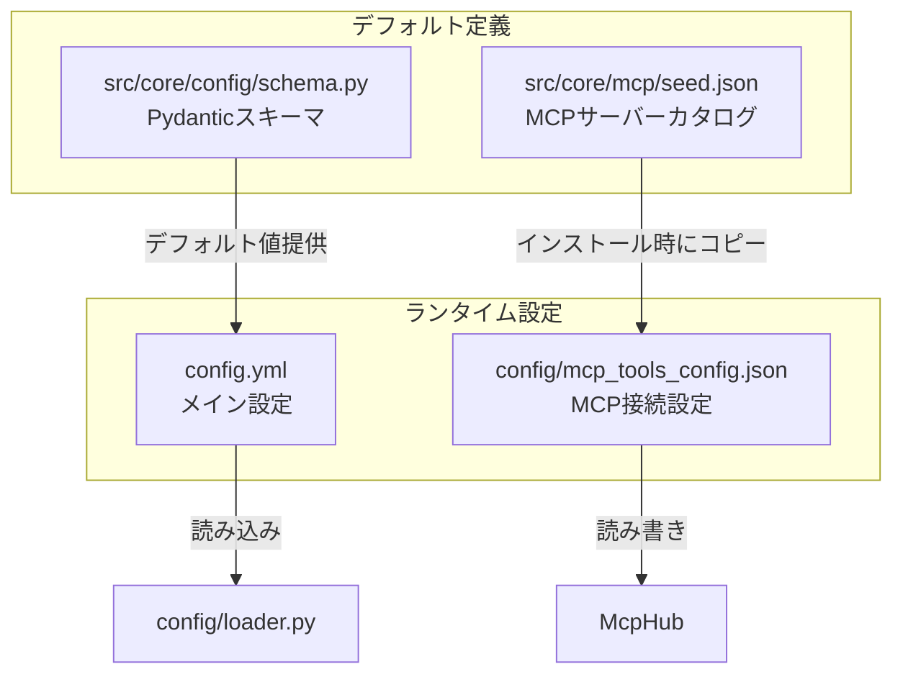
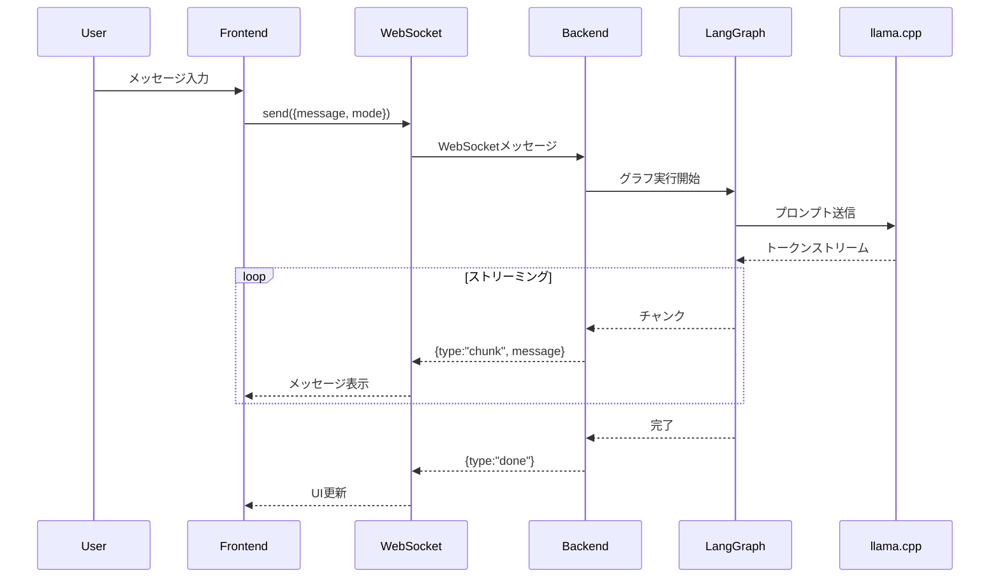
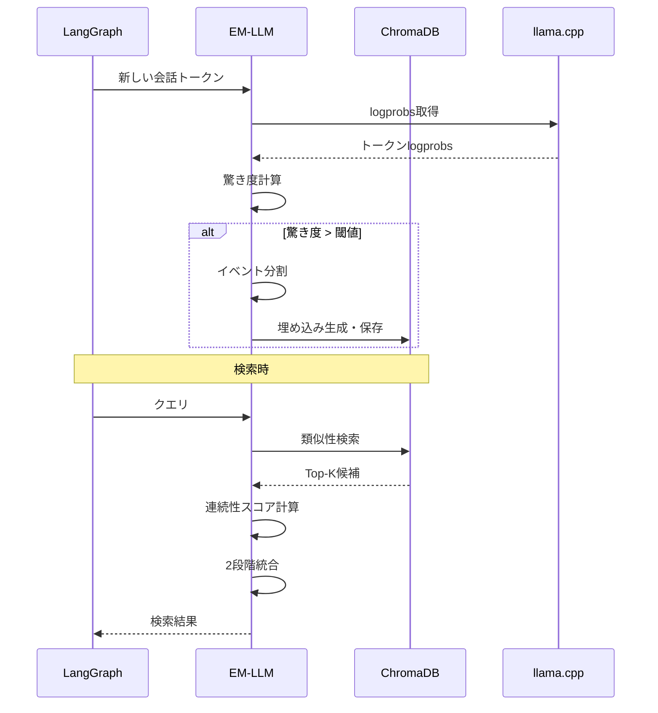
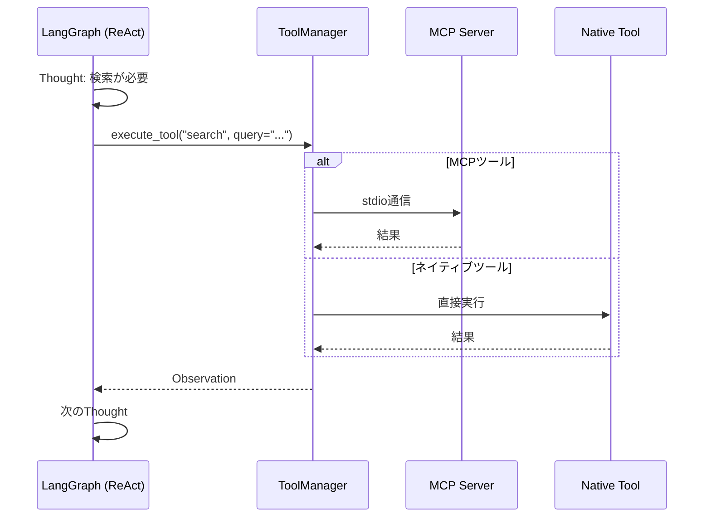

# Tepora Project - 包括的アーキテクチャ仕様書

**バージョン**: 2.6
**最終更新日**: 2026-01-07
**プロジェクト概要**: ローカル環境で動作するパーソナルAIエージェントシステム

---

## 📋 目次

1. [プロジェクト概要](#プロジェクト概要)
2. [システムアーキテクチャ](#システムアーキテクチャ)
3. [技術スタック](#技術スタック)
4. [ディレクトリ構造](#ディレクトリ構造)
5. [バックエンド詳細](#バックエンド詳細)
6. [フロントエンド詳細](#フロントエンド詳細)
7. [主要機能](#主要機能)
8. [データフローとAPI仕様](#データフローとapi仕様)
9. [テスト構造](#テスト構造)
10. [開発経緯](#開発経緯)


---

## プロジェクト概要

### 1.1 プロジェクトのビジョン

Teporaは、**「コンシューマーハードウェアで動作する、真のパーソナルAIエージェントの実用化」**を目指すプロジェクトです。

#### コアコンセプト

- **Local First**: プライバシー最優先。全処理をローカル環境で完結
- **Production Ready**: 実験コードから製品品質への移行
- **Hardware Agnostic**: ハイエンドGPUからCPUまで幅広いハードウェアで動作
- **Modular Design**: 保守性・拡張性・テスト容易性を重視したモジュラー設計

### 1.2 プロジェクトの特徴

Teporaは以下の革新的な特徴を持ちます：

1. **エピソード記憶システム (EM-LLM)**: 人間のような記憶の仕組みを実現
2. **マルチエージェント協調**: 対話型と実行型の2つのエージェントが協調
3. **3つの動作モード**: Chat、Search、Agentの使い分け
4. **MCP対応**: Model Context Protocolによる拡張可能なツールシステム

### 1.3 プロジェクトの名称

**Tepora（テポラ）**

- **語源**: イタリア語の"Tepore"（温かみ）と"ora"（現在）を組み合わせた造語
- **コンセプト**: 紅茶・喫茶店をテーマにした、温かみのあるAIパートナー

---

## システムアーキテクチャ

### 2.1 全体構成図

```mermaid
graph TB
    User[ユーザー] <--> Tauri[Tauri Desktop App (Primary)]
    
    subgraph Frontend[フロントエンド Layer]
        React[React + TypeScript]
        UI[Glassmorphism UI]
        WS[WebSocket Client]
    end
    
    subgraph Backend[バックエンド Layer]
        FastAPI[FastAPI Server]
        Core[AgentCore<br/>LangGraph]
        
        subgraph Managers[マネージャー]
            LLM[LLMManager]
            Tool[ToolManager]
            Mem[MemorySystem]
        end
        
        subgraph AI[AI Engine]
            Llama[llama.cpp Servers]
            Models[GGUF Models]
        end
        
        subgraph Storage[ストレージ]
            Chroma[(ChromaDB<br/>Vector DB)]
            SQLite[(SQLite<br/>Chat History)]
        end
    end
    
    subgraph External[外部連携]
        MCP[MCP Servers]
        Native[Native Tools]
    end
    
    Tauri <--> React
    React <--> WS
    WS <-->|WebSocket| FastAPI
    FastAPI <--> Core
    Core <--> LLM
    Core <--> Tool
    Core <--> Mem
    LLM <--> Llama
    Llama <--> Models
    Mem <--> Chroma
    Mem <--> SQLite
    Tool <--> MCP
    Tool <--> Native
```

### 2.2 アーキテクチャの階層

| 層 | 技術 | 役割 |
|---|---|---|
| **プレゼンテーション層** | Tauri + React | UIレンダリング、ユーザー操作 |
| **通信層** | WebSocket | リアルタイム双方向通信 |
| **アプリケーション層** | FastAPI | HTTPエンドポイント、WebSocketハンドリング |
| **ビジネスロジック層** | LangGraph | ステートマシン、エージェント制御フロー |
| **データアクセス層** | ChromaDB, SQLite | 永続化、ベクトル検索 |
| **推論エンジン層** | llama.cpp | LLM推論処理 |

---

## 技術スタック

### 3.1 フロントエンド

| カテゴリ | 技術 | バージョン | 用途 |
|----------|------|------------|------|
| **フレームワーク** | React | 19.2.1 | UIコンポーネント |
| **言語** | TypeScript | 5.9.3 | 型安全性 |
| **アプリシェル** | Tauri | 2.9.6 | デスクトップアプリ化 |
| **スタイリング** | Tailwind CSS | 4.1.18 | ユーティリティファーストCSS |
| **ルーティング** | React Router | 7.10.1 | SPA routing |
| **ビルドツール** | Vite | 7.3.0 | 高速ビルド |
| **テスト** | Vitest, Testing Library | 4.0.14 | ユニット/コンポーネントテスト |
| **アイコン** | Lucide React | 0.561.0 | アイコンライブラリ |
| **マークダウン** | react-markdown | 10.0.0 | マークダウンレンダリング |
| **データフェッチ** | TanStack Query | 5.90.16 | 非同期状態管理・キャッシュ |

### 3.2 バックエンド

| カテゴリ | 技術 | 用途 |
|----------|------|------|
| **Webフレームワーク** | FastAPI | 0.124.4 | REST API + WebSocket |
| **言語** | Python | 3.10+ |
| **ASGIサーバー** | Uvicorn | 非同期サーバー |
| **ステートマシン** | LangGraph | エージェント制御フロー |
| **LLMフレームワーク** | LangChain | LLM統合 |
| **推論エンジン** | llama.cpp (Python binding) | GGUF推論 |
| **ベクトルDB** | ChromaDB | エピソード記憶、埋め込み |
| **リレーショナルDB** | SQLite | チャット履歴メタデータ |
| **設定管理** | PyYAML | 設定ファイル管理 |

### 3.3 AIモデル

ユーザーはセットアップ時に、以下の推奨モデルリストから用途に合わせて選択可能です。
(デフォルト設定: `src/core/config/schema.py` の `DefaultModelsConfig` 参照)

| カテゴリ | モデル例 | 用途 | 推奨サイズ |
|---|---|---|---|
| **Text Model** | **Gemma 3n E2B/4B**<br>**Ministral 3B**<br>**Phi-4 Mini** | キャラクター/エージェント対話 | 2B - 4B (IQ4_XS) |
| **Embedding** | **EmbeddingGemma** | ベクトル埋め込み (RAG/EM-LLM) | 300M (Q8_0) |

> **Note**: アプリケーションは複数のモデルを同時に管理し、ロール（Character/Executor）に応じて動的に切り替えることが可能です。


---

## ディレクトリ構造

### 4.1 プロジェクトルート

```
Tepora_Project/
├── Tepora-app/                 # アプリケーションルート
│   ├── backend/                # バックエンドアプリケーション
│   └── frontend/               # フロントエンドアプリケーション
├── docs/                       # ドキュメント
│   ├── architecture/           # アーキテクチャ・設計
│   │   ├── ARCHITECTURE.md     # 包括的仕様書（本ドキュメント）
│   │   ├── ROADMAP.md          # 開発ロードマップ
│   │   ├── SYSTEM_PROMPTS_LIST.md  # システムプロンプト一覧
│   │   └── design_document_v2.md   # 設計ドキュメント（レガシー）
│   ├── planning/               # 計画・監査レポート（内容は随時更新）
│   └── guides/                 # 開発ガイド
│       ├── developer_guide.md  # 開発者ガイド
│       ├── development.md      # 開発環境セットアップ
│       └── web_development.md  # Web開発ガイドライン
├── scripts/                    # 開発用スクリプト
│   ├── build_sidecar.py        # PyInstallerビルドスクリプト
│   └── prepare_fallback.py     # フォールバック準備スクリプト
├── Taskfile.yml               # タスクランナー定義
├── README.md                  # プロジェクトREADME
└── LICENSE                    # Apache 2.0 License
```

### 4.2 バックエンド構造

```
backend/
├── server.py                   # FastAPIエントリーポイント
├── config.yml                  # システム設定 (gitignored)
├── config/                     # ランタイム設定
│   └── mcp_tools_config.json   # MCPサーバー設定 (gitignored)
├── pyproject.toml              # プロジェクト設定・依存関係
├── uv.lock                     # 依存関係ロックファイル
├── REFACTORING_SUMMARY.md      # リファクタリング詳細
├── models/                     # GGUFモデル格納
│   ├── gemma-3n-E4B-it-IQ4_XS.gguf
│   ├── jan-nano-128k-iQ4_XS.gguf
│   └── embeddinggemma-300M-Q8_0.gguf
├── bin/                        # llama.cppバイナリ
├── chroma_db_em_llm/           # ChromaDB永続化
├── logs/                       # ログファイル
└── src/
    ├── tepora_server/          # Webサーバー/API層
    │   ├── __init__.py
    │   ├── app_factory.py      # FastAPI App生成
    │   ├── state.py            # アプリケーション状態
    │   └── api/                # ルート定義
    │       ├── __init__.py
    │       ├── dependencies.py # 依存性注入
    │       ├── exception_handlers.py # 例外ハンドラ
    │       ├── security.py     # 認証・セキュリティ
    │       ├── routes.py       # 基本REST API
    │       ├── sessions.py     # セッションAPI
    │       ├── session_handler.py # セッションハンドラ
    │       ├── setup.py        # セットアップAPI
    │       ├── mcp_routes.py   # MCP管理API
    │       └── ws.py           # WebSocketハンドラ
    └── core/                   # コアロジック (Business Logic)
        ├── __init__.py
        ├── state.py            # グラフステート定義
        ├── llm_manager.py      # LLM管理
        ├── tool_manager.py     # ツール管理
        ├── chat_history_manager.py # チャット履歴管理
        ├── embedding_provider.py
        ├── log_maintenance.py  # ログメンテナンス
        ├── app/                # アプリケーション層
        │   ├── __init__.py
        │   ├── core.py         # TeporaCoreAppクラス (Main Hub)
        │   ├── startup_validator.py # 起動時バリデーション
        │   └── utils.py
        ├── graph/              # LangGraphロジック
        │   ├── __init__.py
        │   ├── core.py         # AgentCoreクラス
        │   ├── em_llm_core.py  # EMEnabledAgentCore
        │   ├── constants.py
        │   ├── routing.py
        │   ├── utils.py
        │   └── nodes/          # グラフノード
        │       ├── __init__.py
        │       ├── memory.py
        │       ├── conversation.py
        │       ├── react.py
        │       └── em_llm.py
        ├── em_llm/             # エピソード記憶システム
        │   ├── __init__.py
        │   ├── integrator.py   # EMLLMIntegrator
        │   ├── segmenter.py    # イベントセグメンテーション
        │   ├── boundary.py     # 境界精密化
        │   ├── retrieval.py    # 2段階検索
        │   └── types.py        # データクラス
        ├── llm/                # LLM実行管理
        │   ├── __init__.py
        │   ├── executable.py   # 実行形式管理
        │   ├── health.py       # ヘルスチェック
        │   ├── process.py      # プロセス管理
        │   ├── client_factory.py   # LangChainクライアント生成
        │   ├── model_registry.py   # モデルパス解決
        │   └── process_manager.py  # llama.cppプロセス管理
        ├── tools/              # ツールシステム
        │   ├── __init__.py
        │   ├── base.py         # ツール基底クラス
        │   ├── native.py       # ネイティブツール
        │   └── mcp.py          # MCPツールプロバイダ (McpToolProvider)
        ├── mcp/                # MCP Store・管理システム
        │   ├── __init__.py
        │   ├── hub.py          # McpHubクラス (API/管理用)
        │   ├── installer.py    # MCPインストーラー
        │   ├── registry.py     # MCPレジストリ
        │   ├── models.py       # MCPデータモデル
        │   └── seed.json       # デフォルトMCPサーバー定義
        ├── download/           # モデルダウンロード管理
        │   ├── __init__.py
        │   ├── binary.py       # llama.cppバイナリDL
        │   ├── manager.py      # ダウンロードマネージャー
        │   ├── models.py       # モデルDL処理
        │   ├── progress.py     # 進捗追跡
        │   └── types.py        # 型定義
        ├── common/             # 共通ユーティリティ
        │   ├── __init__.py
        │   └── security.py     # セキュリティユーティリティ
        ├── memory/             # メモリシステム
        │   ├── memory_system.py    # メモリシステム本体
        │   ├── chroma_store.py     # ChromaDBストア
        │   └── vector_store.py     # ベクトルストア抽象化
        ├── a2a/                # Agent-to-Agent Protocol
        │   └── __init__.py
        ├── config/             # 設定モジュール
        │   ├── __init__.py     # 公開API定義
        │   ├── app.py          # アプリケーション設定クラス
        │   ├── loader.py       # 設定ロード・バリデーション・パス解決
        │   ├── schema.py       # Pydanticスキーマ定義
        │   ├── service.py      # 設定サービスクラス
        │   ├── agents.py       # エージェント・ペルソナ設定
        │   ├── prompts.py      # システムプロンプト定義
        │   └── memory.py       # メモリ関連定数

```

### 4.3 フロントエンド構造

```
frontend/
├── package.json                # npm依存関係
├── tsconfig.json               # TypeScript設定
├── vite.config.ts              # Vite設定
├── tailwind.config.cjs         # Tailwind設定
├── index.html
├── src/
│   ├── main.tsx                # Reactエントリーポイント
│   ├── App.tsx                 # ルートコンポーネント
│   ├── index.css               # グローバルスタイル
│   ├── i18n.ts                 # 国際化設定 (i18next)
│   ├── components/             # UIコンポーネント
│   │   ├── Layout.tsx          # メインレイアウト
│   │   ├── ChatInterface.tsx   # チャット画面
│   │   ├── SetupWizard/        # セットアップウィザード
│   │   │   ├── SetupWizard.tsx
│   │   │   └── steps/          # ステップコンポーネント
│   │   ├── Sidebar.tsx         # サイドバー
│   │   ├── StatusBar.tsx       # ステータスバー
│   │   ├── InputArea.tsx       # 入力エリア
│   │   ├── MessageList.tsx     # メッセージリスト
│   │   ├── MessageBubble.tsx   # メッセージバブル
│   │   ├── DialControl.tsx     # モード切替ダイアル
│   │   ├── PersonaSwitcher.tsx # ペルソナ切替
│   │   ├── AgentStatus.tsx     # エージェント状態表示
│   │   ├── SearchResults.tsx   # 検索結果表示
│   │   ├── SystemStatusPanel.tsx # システム詳細パネル
│   │   ├── settings/           # 設定画面
│   │   │   ├── components/     # 設定UIコンポーネント
│   │   │   └── sections/       # 設定セクション
│   │   ├── SessionHistory/     # セッション履歴
│   │   ├── ui/                 # 汎用UIパーツ
│   │   └── chat/               # チャット関連パーツ
│   ├── context/                # React Context
│   │   ├── SettingsContext.tsx # 設定プロバイダー
│   │   └── WebSocketContext.tsx # WS接続プロバイダー
│   ├── hooks/                  # カスタムフック
│   │   ├── useWebSocket.ts     # WebSocket管理
│   │   ├── chat/               # チャット関連フック
│   │   │   ├── useChatState.ts
│   │   │   ├── useMessageBuffer.ts
│   │   │   ├── useSocketConnection.ts
│   │   │   └── useWebSocketMessageHandlers.ts
│   │   ├── useSettings.ts      # 設定管理
│   │   ├── useSessions.ts      # セッション管理
│   │   ├── useMcp.ts           # MCP管理
│   │   ├── useServerConfig.ts  # サーバー設定取得
│   │   └── chat/               # チャット関連フック
│   ├── pages/                  # ページコンポーネント
│   │   ├── Logs.tsx            # ログビューア
│   │   └── Memory.tsx          # 記憶可視化
│   ├── types/                  # TypeScript型定義
│   │   ├── index.ts            # 主要型定義
│   │   └── tauri.d.ts          # Tauri型宣言
│   ├── utils/                  # ユーティリティ
│   │   ├── api.ts              # API呼び出し
│   │   ├── api-client.ts       # HTTPクライアント
│   │   └── sidecar.ts          # Tauriサイドカー管理
│   ├── styles/                 # スタイル定義
│   └── test/                   # テストセットアップ (Vitest)
└── src-tauri/                  # Tauri設定
    ├── Cargo.toml
    ├── tauri.conf.json         # Tauri設定
    ├── build.rs
    ├── src/
    │   ├── main.rs
    │   └── lib.rs
    ├── icons/                  # アプリアイコン
    └── binaries/               # sidecar用バイナリ
        └── tepora-backend.exe  # Pythonバックエンド実行形式
```

---

## バックエンド詳細

### 5.1 Web Server & API (`src/tepora_server`)
(**Old**: `server.py`)

#### 構成
- **`server.py`**: アプリケーションのエントリーポイント。`tepora_server.app_factory` に委譲します。
- **`src.tepora_server.app_factory`**: FastAPI アプリケーションのインスタンス生成、CORS設定、寿命管理 (Lifespan) を行います。
- **`src.tepora_server.api`**: ルート定義 (Router)。REST API と WebSocket エンドポイントを含みます。
- **`src.core.app.core.TeporaCoreApp`**: ビジネスロジックの中枢。LLM、ツール、メモリ、履歴管理を一元管理します。

#### 主要エンドポイント

**WebSocket**
- `WS /ws` - チャット通信とリアルタイムストリーミング (Stream Response)

**REST API**
- `GET /health` - ヘルスチェック
- `POST /api/shutdown` - サーバーシャットダウン
- `GET /api/status` - システムステータス・統計情報取得
- `GET /api/config` - 設定情報取得
- `POST /api/config` - 設定更新 (全体)
- `PATCH /api/config` - 設定更新 (部分)
- `GET /api/logs` - ログファイル一覧
- `GET /api/logs/{filename}` - ログ内容取得

**Session API**
- `GET /api/sessions` - セッション一覧取得
- `POST /api/sessions` - 新規セッション作成
- `GET /api/sessions/{session_id}` - セッション詳細取得
- `PATCH /api/sessions/{session_id}` - セッション名更新
- `DELETE /api/sessions/{session_id}` - セッション削除

**MCP API**
- `GET /api/mcp/status` - MCPサーバー接続ステータス一覧
- `GET /api/mcp/config` - MCP設定情報取得
- `POST /api/mcp/config` - MCP設定更新
- `GET /api/mcp/store` - MCPレジストリ（利用可能なサーバー一覧）取得
- `POST /api/mcp/install` - MCPサーバーインストール
- `POST /api/mcp/servers/{server_name}/enable` - サーバー有効化
- `POST /api/mcp/servers/{server_name}/disable` - サーバー無効化
- `DELETE /api/mcp/servers/{server_name}` - サーバー削除

**Setup API**
- `POST /api/setup/init` - セットアップ初期化（言語設定）
- `GET /api/setup/requirements` - 要件チェック
- `GET /api/setup/default-models` - 推奨モデルリスト取得
- `POST /api/setup/run` - セットアップジョブ開始（バイナリ+選択モデルのダウンロード）
- `GET /api/setup/progress` - 進捗確認
- `POST /api/setup/finish` - セットアップ完了・設定保存
- `POST /api/setup/download/action` - ダウンロード制御（一時停止/再開/キャンセル）
- `GET /api/setup/download/incomplete` - 未完了ダウンロード一覧
- `GET /api/setup/download/progress` - ダウンロード進捗取得
- `GET /api/setup/models` - 利用可能なモデル一覧取得
- `DELETE /api/setup/model/{model_id}` - モデル削除
- `POST /api/setup/model/active` - アクティブモデル設定
- `POST /api/setup/model/check` - モデル存在確認 (HF)
- `POST /api/setup/model/reorder` - モデル順序変更
- `POST /api/setup/model/download` - HuggingFaceからモデルダウンロード
- `POST /api/setup/model/local` - ローカルモデル追加
- `GET /api/setup/model/roles` - モデルロール設定取得
- `POST /api/setup/model/roles/character` - キャラクターモデル設定
- `POST /api/setup/model/roles/executor` - エグゼキューターモデル設定
- `DELETE /api/setup/model/roles/executor/{task_type}` - エグゼキューター設定解除
- `POST /api/setup/binary` - バイナリ直接ダウンロード
- `GET /api/setup/binary/check` - llama.cpp更新チェック
- `POST /api/setup/binary/update` - llama.cpp更新実行
- `POST /api/setup/initial` - 初回セットアップ実行

#### WebSocketメッセージフォーマット

**送信（クライアント→サーバー）**
```json
{
  "message": "ユーザーの入力テキスト",
  "mode": "direct" | "search" | "agent"
}
```

**受信（サーバー→クライアント）**
```json
{
  "type": "chunk" | "status" | "error" | "stats" | "done",
  "message": "AIの応答テキスト",
  "data": {
    // タイプに応じた追加データ
  }
}
```

### 5.2 LangGraphステートマシン

#### 5.2.1 AgentCore (`graph/core.py`)

基本的なエージェントグラフ。以下のノードで構成：



**ノード詳細**:
- **対話ノード** (`nodes/conversation.py`): 通常の会話応答を生成
- **ReActノード** (`nodes/react.py`): 思考→行動→観察のループ
- **メモリノード** (`nodes/memory.py`): チャット履歴管理

#### 5.2.2 EMEnabledAgentCore (`graph/em_llm_core.py`)

EM-LLM機能を統合した拡張グラフ：



### 5.3 LLMManager (`src/core/llm_manager.py`)

LLMManagerは、モデルライフサイクル管理の司令塔として機能し、以下の責務を持ちます：
- **動的リソース割り当て**: 空きポートの検索、プロセス管理
- **モデルキャッシング**: LRUキャッシュによるモデルプロセスの再利用とメモリ効率化
- **ロールベースアクセス**: キャラクター、エグゼキューター、Embeddingの役割に応じたモデル解決

#### 5.3.1 内部コンポーネント構成

`LLMManager`は内部的に責務を分割しています：

- **ModelRegistry** (`src/core/llm/model_registry.py`): 設定ファイルとファイルシステムからモデルパスを解決。
- **ProcessManager** (`src/core/llm/process_manager.py`): llama.cppサーバープロセスの起動・停止・監視（ヘルスチェック）。
- **ClientFactory** (`src/core/llm/client_factory.py`): LangChain互換のチャットクライアント生成。

#### 5.3.2 主要メソッド

```python
class LLMManager:
    async def get_character_model(self) -> BaseChatModel:
        """対話用キャラクターモデルを取得（必要に応じて起動）"""
        
    async def get_executor_model(self, task_type: str = "default") -> BaseChatModel:
        """タスク実行用モデルを取得。タスクタイプに応じて最適なモデルを選択可能。"""
        
    async def get_embedding_model(self) -> Embeddings:
        """ベクトル化用モデルを取得（専用プロセスとして常駐）"""
        
    def cleanup(self):
        """全プロセスの停止とリソース解放"""
```

#### 5.3.3 プロセス管理戦略
- **1モデル1プロセス**: 各モデルは独立した `llama-server` プロセスとして実行され、HTTP経由で通信します。
- **動的ポート**: ポート競合を防ぐため、起動時に空きポートを動的に割り当てます。
- **自動終了**: アプリケーション終了時、管理者プロセスが子プロセスツリーを確実に終了させます。


### 5.4 EM-LLM (Episodic Memory with LLMs)

ICLR 2025採択論文「EM-LLM」の実装。人間のエピソード記憶をLLMで再現。

#### 5.4.1 アーキテクチャ



#### 5.4.2 主要コンポーネント

**EMEventSegmenter** (`em_llm/segmenter.py`)
- **Surprise-based Segmentation**: logprobsの変化を「驚き」として検出（ログ確率が利用できない場合は、文埋め込みによる意味的変化検出へフォールバック）
- **動的イベント分割**: 驚きが閾値を超えた際にイベントを分割
- **設定パラメータ**:
  - `surprise_gamma`: 驚き度の感度 (1.0)
  - `surprise_window`: 驚き計算のウィンドウサイズ (128)
  - `min_event_size`: 最小イベントサイズ (8トークン)
  - `max_event_size`: 最大イベントサイズ (128トークン)

**EMTwoStageRetrieval** (`em_llm/retrieval.py`)
- **Stage 1**: ベクトル類似性による関連エピソード検索
- **Stage 2**: 時間的連続性を考慮した再ランキング
- **Contiguity**: 時系列で近いエピソードを優先的に取得

**EMLLMIntegrator** (`em_llm/integrator.py`)
- すべてのEM-LLMコンポーネントを統合
- LangGraphノードからの利用を簡略化

### 5.5 ToolManager (`tool_manager.py`)

ネイティブツールとMCPツールを統一的に管理。

#### 5.5.1 ツールタイプ

**ネイティブツール** (`tools/native.py`)
- Pythonで直接実装されたツール
- 例: Google検索、Web scraping

**MCPツール** (`tools/mcp.py`)
- Model Context Protocol準拠の外部サーバーと連携
- **McpToolProvider**: エージェント起動時に `mcp_tools_config.json` から設定を読み込み、ツールとして登録
- **McpHub**: API経由での動的設定変更・接続管理を担当（設定ファイルの監視とホットリロード）
- stdio/HTTP経由で通信

#### 5.5.2 主要メソッド

```python
class ToolManager:
    def get_available_tools(self, allowed: List[str], denied: List[str]) -> List[Tool]:
        """利用可能なツールリストを取得"""
        
    def execute_tool(self, tool_name: str, **kwargs) -> Any:
        """ツールを実行"""
```

### 5.6 設定システム (`config/`)

YAMLベースのメイン設定と、JSONベースのMCP設定の2本立て。

#### 5.6.1 設定ファイルの関係



| ファイル | 役割 | 編集方法 |
|----------|------|----------|
| `config.yml` | アプリ全体設定 | 手動編集 / 設定API |
| `mcp_tools_config.json` | MCP接続情報 | 設定画面 / API |
| `schema.py` | デフォルト値定義 | 開発者のみ |
| `seed.json` | MCPサーバーカタログ | 開発者のみ |

#### 5.6.2 config.yml（アプリケーション全体設定）

主要セクション:

```yaml
app:
  max_input_length: 10000
  graph_recursion_limit: 50
  google_search_api_key: "YOUR_KEY"  # Optional
  google_search_engine_id: "YOUR_CX" # Optional
  nsfw_detection: false  # Optional

llm_manager:
  health_check_timeout: 60

models_gguf:
  # 任意の数のモデルを定義可能
  gemma_3n:
    path: "models/gemma-3n-E4B-it-IQ4_XS.gguf"
    port: 8088
    n_ctx: 8192
    n_gpu_layers: -1

em_llm:
  surprise_gamma: 1.0
  total_retrieved_events: 4

agent_profiles:
  default:
    persona:
      key: "default"
    tool_policy:
      allow: ["*"]
```

#### 5.6.3 mcp_tools_config.json（MCPサーバー設定）

MCPサーバーの接続情報（コマンド、引数、環境変数）を管理。`McpHub` によりAPI経由で読み書きされ、ホットリロードに対応。

---

## フロントエンド詳細

### 6.1 コンポーネント構成

#### 6.1.1 ディレクトリ構成
`src/components/` は機能・ドメインごとに整理されています。

```
components/
├── Root Components
│   ├── Layout.tsx              # アプリ全体レイアウト
│   ├── ChatInterface.tsx       # チャット画面コンテナ
│   ├── SetupWizard.tsx         # セットアップウィザード
│   ├── Sidebar.tsx             # ナビゲーションサイドバー
│   ├── StatusBar.tsx           # ステータスバー
│   ├── InputArea.tsx           # メッセージ入力エリア
│   ├── MessageList.tsx         # メッセージ一覧
│   ├── MessageBubble.tsx       # メッセージバブル
│   ├── DialControl.tsx         # モード切替ダイアル
│   ├── PersonaSwitcher.tsx     # ペルソナ切替UI
│   ├── AgentStatus.tsx         # エージェントステータス
│   ├── SearchResults.tsx       # 検索結果パネル
│   └── SystemStatusPanel.tsx   # システム詳細パネル
├── settings/                   # 設定画面
│   ├── SettingsDialog.tsx      # 設定ダイアログ
│   ├── SettingsComponents.tsx  # 共通UI部品
│   ├── SettingsLayout.tsx      # レイアウト
│   ├── SettingsConstants.tsx   # 定数定義
│   ├── settings.css            # スタイル
│   ├── sections/               # タブセクション
│   │   ├── GeneralSettings.tsx     # 一般設定
│   │   ├── ModelSettings.tsx       # モデル設定
│   │   ├── CharacterSettings.tsx   # キャラクター設定
│   │   ├── McpSettings.tsx         # MCP設定
│   │   └── MemorySettings.tsx      # 記憶設定
│   └── subcomponents/          # サブコンポーネント
│       ├── AddModelForm.tsx        # モデル追加フォーム
│       ├── ModelDetailOverlay.tsx  # モデル詳細
│       ├── ModelListOverlay.tsx    # モデル一覧
│       └── ModelSelectionRow.tsx   # モデル選択行
├── SessionHistory/             # セッション履歴
│   ├── SessionHistory.tsx      # メインコンポーネント
│   ├── SessionHistoryPanel.tsx # パネル表示
│   ├── SessionHistoryModal.tsx # モーダル表示
│   └── index.ts                # エクスポート
├── ui/                         # 汎用UIパーツ
│   ├── Modal.tsx               # モーダルダイアログ
│   ├── ConfirmDialog.tsx       # 確認ダイアログ
│   └── DynamicBackground.tsx   # 動的背景
└── chat/                       # チャット拡張
```

#### 6.1.2 主要コンポーネント詳細

**SetupWizard.tsx**
- 初回起動時のセットアップウィザード
- 言語設定、モデルダウンロード、システム要件チェックを行う
- ステップバイステップのUIでユーザーをガイド

**Layout.tsx**
- アプリケーション全体のレイアウトフレーム
- サイドバー、メインエリア、ステータスバーを統合管理
- `SettingsDialog` や `McpStoreModal` のマウントポイント

**Sidebar.tsx**
- ナビゲーションとアクションへのアクセス
- チャットモード切替、セッション履歴、設定、MCPストアへのアクセスランチャー

**StatusBar.tsx**
- アプリケーション下部のステータス表示
- 現在のモデル、システムリソース、バックグラウンド処理の状態を表示

**SystemStatusPanel.tsx**
- システム詳細情報の可視化パネル

**ChatInterface.tsx**
- チャット画面のメインコンテナ
- `MessageList` と `InputArea` を包含
- ストリーミング応答の制御

**MessageList.tsx / MessageBubble.tsx**
- メッセージ履歴の表示
- マークダウンレンダリング (`react-markdown`)、コードハイライト
- ユーザー/AI/システムメッセージのスタイル区分

**SettingsDialog.tsx / SettingsComponents.tsx**
- アプリケーション詳細設定
- タブ切り替え（一般、モデル、キャラクター、MCP、記憶）
- 各種設定項目の即時反映と永続化

**InputArea.tsx**
- メッセージ入力フィールド
- 送信ボタン、キーボードショートカット
- 入力中のタイピング表示

**DialControl.tsx**
- 3モード（Chat/Search/Agent）切替ダイアル
- 視覚的なモード表示とアニメーション

**PersonaSwitcher.tsx**
- キャラクター/ペルソナの切り替えUI
- プロファイル選択とカスタマイズ

**AgentStatus.tsx**
- エージェントモード時の実行状態表示
- 思考プロセス、ツール実行ログの可視化

**SearchResults.tsx**
- 検索モード時の結果表示パネル
- ソースリンク、スニペット表示

**SessionHistory.tsx / SessionHistoryPanel.tsx**
- 過去の対話履歴の参照・切り替え
- セッション検索・フィルタリング

#### 6.1.3 ページ構成 (`src/pages/`)
ルーティング対応のページコンポーネント。

- **Logs.tsx**: システムログビューア
- **Memory.tsx**: EM-LLMの記憶状態の可視化・デバッグ

### 6.2 カスタムフック

ビジネスロジックと状態管理の分離。

#### 6.2.1 コアロジック
- **useWebSocket.ts**: WebSocket通信チャネルの確立・管理
- **useServerConfig.ts**: バックエンド設定の取得・同期
- **useSettings.ts**: アプリケーション設定の管理
- **useSessions.ts**: チャットセッションのCRUD操作
- **useMcp.ts**: MCPサーバーのインストール・状態管理

#### 6.2.2 チャット機能 (`hooks/chat/`)
- **useChatState.ts**: チャット画面のUI状態管理
- **useMessageBuffer.ts**: ストリーミングメッセージのバッファリング制御
- **useSocketConnection.ts**: Socket接続の低レベル制御（再接続、バックオフ）

### 6.3 コンテキスト

- **SettingsContext.tsx**: 全域的な設定プロバイダー（型安全な更新関数を提供）
- **WebSocketContext.tsx**: WebSocket接続の共有プロバイダー

### 6.4 Glassmorphism デザインシステム

#### 6.4.1 カラーパレット

Tailwind設定で定義されたカスタムカラー：

```javascript
colors: {
  coffee: {
    50: '#FAF7F5',
    100: '#F5EDE7',
    // ... 喫茶店テーマのブラウン系
    900: '#3D2817',
  },
  gold: {
    // ... アクセントカラー
  }
}
```

#### 6.4.2 Glassmorphismスタイル

`index.css` で定義されたユーティリティクラス：

```css
.glass {
  background: rgba(255, 255, 255, 0.1);
  backdrop-filter: blur(10px);
  border: 1px solid rgba(255, 255, 255, 0.2);
}

.glass-dark {
  background: rgba(0, 0, 0, 0.3);
  backdrop-filter: blur(15px);
}
```

#### 6.4.3 アニメーション

Spring animationを用いた自然な動き：

- **メッセージ出現**: フェードイン + スライドアップ
- **ダイアル回転**: イージング付き回転アニメーション
- **ホバーエフェクト**: スケール変化 + 影の変化

### 6.5 Tauri統合

#### 6.5.1 設定 (`src-tauri/tauri.conf.json`)

```json
{
  "productName": "tepora",
  "identifier": "com.tauri.dev",
  "app": {
    "windows": [{
      "title": "Tepora AI",
      "width": 800,
      "height": 600
    }]
  },
  "bundle": {
    "externalBin": ["tepora-backend"]
  }
}
```

#### 6.5.2 Sidecar実行形式

バックエンドをPyInstallerで実行形式化し、`tepora-backend`としてバンドル。

**利点**:
- ユーザーはPython環境不要
- シングルインストーラーで配布可能
- プラットフォーム固有の最適化

---

## 主要機能

### 7.1 3つの動作モード

#### 7.1.1 CHAT モード

**目的**: 日常的な会話、相談、ブレインストーミング

**UI**: 没入感のあるシングルカラムのチャットインターフェース

**動作フロー**:
1. ユーザー入力
2. （EM-LLM有効時）過去のエピソード検索
3. Gemma-3Nによる応答生成（ストリーミング）
4. イベントセグメンテーション
5. エピソード記憶保存

**使用エージェント**: キャラクターエージェント（Gemma-3N）

#### 7.1.2 SEARCH モード

**目的**: 情報収集、調査、ファクトチェック

**UI**: 左側にチャット、右側に検索結果を表示するスプリットビュー

**動作フロー**:
1. ユーザー入力
2. クエリ解析
3. Web検索実行（DuckDuckGo）
4. 検索結果のスクレイピング
5. RAG（Retrieval-Augmented Generation）
6. ソースを明示した応答生成

**使用エージェント**: キャラクターエージェント + 検索ツール

#### 7.1.3 AGENT モード

**目的**: 複雑なタスク（コーディング、レポート作成、データ整理）

**UI**: 左側にチャット、右側に思考プロセス・実行ログ・生成物を表示

**動作フロー**:
1. ユーザーがゴール設定
2. エージェントが計画(Plan)立案
3. （オプション）ユーザー承認
4. ReActループ開始
   - **Thought**: 次の行動を推論
   - **Action**: ツールを選択・実行
   - **Observation**: 結果を観察
5. ゴール達成まで繰り返し
6. 最終報告

**使用エージェント**: プロフェッショナルエージェント（Jan-nano）

### 7.2 マルチエージェント協調

#### キャラクターエージェント (Persona)
- **役割**: ユーザーインターフェース、共感的対話
- **性格**: 親しみやすい、温かい
- **モデル**: Gemma-3-4B-Instruct

#### プロフェッショナルエージェント (Professional)
- **役割**: タスク実行、論理推論、コーディング
- **性格**: 論理的、効率的
- **モデル**: Jan-nano-128k

### 7.3 セッション管理

**概要**:
- 複数のチャットセッションを保存・管理する機能。

**機能詳細**:
- **セッション永続化**: SQLiteデータベースへの会話履歴保存
- **履歴閲覧**: サイドバー（または専用パネル）からの過去ログアクセス
- **コンテキスト復帰**: セッション切り替え時のコンテキスト（会話履歴）の再ロード
- **自動タイトル生成**: 会話内容に基づくセッションタイトルの自動生成

---

## データフローとAPI仕様

### 8.1 チャットフロー



### 8.2 エピソード記憶フロー



### 8.3 ツール実行フロー



---

## テスト構造

### 9.1 概要

| レイヤー | テストフレームワーク | カバレッジ対象 |
|----------|---------------------|----------------|
| **バックエンド** | pytest | API、コア機能、WebSocket |
| **フロントエンド** | Vitest + Testing Library | コンポーネント、フック、統合 |

### 9.2 バックエンドテスト (`backend/tests/`)

```
tests/
├── conftest.py              # pytest共通設定・fixture
├── core/                    # コアモジュールテスト
│   └── test_startup_validator.py
├── test_api.py              # REST APIエンドポイント
├── test_api_extensions.py   # 拡張APIテスト
├── test_config_schema.py    # 設定スキーマバリデーション
├── test_llm_manager.py      # LLMManager単体テスト
├── test_tool_manager.py     # ToolManagerテスト
├── test_ws_e2e.py           # WebSocket E2Eテスト
├── test_ws_security.py      # WebSocketセキュリティ
├── test_segmenter.py        # EM-LLMセグメンター
└── test_retrieval.py        # EM-LLM検索
```

**実行方法**:
```bash
cd backend
pytest                      # 全テスト実行
pytest -v tests/test_api.py # 特定ファイル
```

### 9.3 フロントエンドテスト (`frontend/src/test/`)

```
test/
├── setup.ts                 # Vitestセットアップ
├── test-utils.tsx           # テストユーティリティ
├── Integration.test.tsx     # 統合テスト
├── unit/                    # ユニットテスト
│   ├── context/             # Contextテスト (SettingsContext等)
│   ├── hooks/               # Hookテスト (useSettings, useMcp等)
│   └── components/          # コンポーネント単体テスト (CharacterSettings等)
└── example.test.ts          # サンプルテスト
```

コンポーネント個別テストは `components/__tests__/` に配置。

**実行方法**:
```bash
cd frontend
npm run test                # 全テスト実行
npm run test:watch          # ウォッチモード
```

---

## 開発経緯

> [!NOTE]
> **AI-Driven Development**: 本プロジェクトのコードは、設計から実装まで100%コーディングエージェント（AI）によって記述されています。人間の開発者はアーキテクチャの方針決定、レビュー、および指示を担当し、実際のコーディング作業はAIが行いました。

### 10.1 Phase 1: Foundation (〜2025年11月)

#### 主要マイルストーン

1. **初期実装** (2025年初頭)
   - CLIベースのプロトタイプ
   - 基本的な対話機能

2. **EM-LLM統合** (2025年中頃)
   - ICLR 2025論文の実装
   - エピソード記憶システムの構築

3. **大規模リファクタリング** (2025年11月6日)
   - モノリシック構造からモジュラー設計へ
   - コード行数削減: 平均62.5%減
   - モジュール数増加: +209%
   - 設計原則の適用 (SRP, OCP, DIP, SoC, DRY)

#### リファクタリング成果

| 項目 | 変更前 | 変更後 | 改善率 |
|------|--------|--------|--------|
| `main.py` | 362行 | 52行 | -85.6% |
| `graph.py` | 855行 | 68行（レイヤー） | -92.0% |
| `em_llm_core.py` | 875行 | 30行（レイヤー） | -96.6% |
| 平均ファイルサイズ | 〜400行 | 〜150行 | -62.5% |

詳細は `backend/REFACTORING_SUMMARY.md` 参照。

### 10.2 Phase 2: Transition & Refinement (2025年11月〜12月)

#### 完了項目

**コアインフラ**
- ✅ FastAPI + WebSocketサーバー実装
- ✅ Reactフロントエンド基盤
- ✅ Tauri統合とデスクトップアプリ化
- ✅ テストインフラ（Vitest、Testing Library、pytest）

**UI/UX**
- ✅ 3つのモード（CHAT、SEARCH、AGENT）のUI実装
- ✅ Glassmorphismデザインシステム（Teaテーマ）
- ✅ WebSocketリアルタイムストリーミング
- ✅ ダイアルコントロール、ペルソナスイッチャー
- ✅ モード別スプリットビュー（SearchResults、AgentStatus）
- ✅ セッション履歴パネル（SessionHistoryPanel）
- ✅ 設定画面（SettingsContext、各種設定オーバーレイ）
- ✅ セットアップウィザード（SetupWizard）
- ✅ ダイナミック背景（DynamicBackground）
- ✅ ログビューア（Logsページ）

**バックエンド機能**
- ✅ セッション管理API（CRUD操作）
- ✅ MCPストア・管理システム（McpHub、インストーラー、レジストリ）
- ✅ モデルダウンロード機能（HuggingFace Hub統合）
- ✅ ツール確認ダイアログ（危険ツールのハイブリッド承認フロー）

**品質・セキュリティ**
- ✅ 認証ヘッダー実装（将来のリモートアクセス対応）
- ✅ コード監査・レビュー実施

#### 残タスク

- [ ] EM-LLMの長期的評価と長時間テスト
- [ ] インストーラー作成（Tauri Bundle）
- [ ] i18n対応の拡充
- [ ] E2Eテストの整備

### 10.3 Phase 3: Stabilization & Verification (2026年1月)

#### 完了項目

**品質向上**
- ✅ フロントエンドテストカバレッジ拡大 (Vitest/RTL)
  - `useSettings`, `SettingsContext`, `useMcp`, `CharacterSettings` 等の主要モジュールをカバー
- ✅ バックエンドエラーハンドリング統一 (`HTTPException`利用)
- ✅ 型安全性向上 (`SettingsContext`のリファクタリング)
- ✅ 脆弱性監査と修正 (Frontend/Backend)

**バグ修正**
- ✅ UI競合状態の解消 (`setTimeout`の除去)
- ✅ モジュール解決エラーの修正 (`Modal.tsx`)
- ✅ セッション削除ロジックの修正


---


---

## 付録

### A. 起動方法

#### Windows

```bash
# プロジェクトルートで実行
start_app.bat
```

これでバックエンド（`http://localhost:8000`）とフロントエンド（`http://localhost:5173`）が起動します。

#### 手動起動

**バックエンド**:
```bash
cd backend
python server.py
```

**フロントエンド**:
```bash
cd frontend
npm run dev
```

**Tauriアプリ**:
```bash
cd frontend
npm run tauri dev
```

### B. モデルセットアップ

`backend/models/` に以下のGGUFモデルを配置：

1. **Gemma-3N-E4B-it-IQ4_XS.gguf**
   - ソース: [unsloth/gemma-3n-E4B-it-GGUF](https://huggingface.co/unsloth/gemma-3n-E4B-it-GGUF)
   
2. **jan-nano-128k-iQ4_XS.gguf**
   - ソース: [Menlo/Jan-nano-128k-gguf](https://huggingface.co/Menlo/Jan-nano-128k-gguf)
   
3. **embeddinggemma-300M-Q8_0.gguf**
   - ソース: [Google/embeddinggemma-gguf](https://huggingface.co/Google/embeddinggemma-gguf)

### C. 設定カスタマイズ

`backend/config.yml` を編集：

```yaml
# モデルパスの変更
models_gguf:
  gemma_3n:
    path: "models/your-model.gguf"
    n_gpu_layers: 35  # GPU使用レイヤー数

# EM-LLMパラメータ調整
em_llm:
  surprise_gamma: 0.15  # 記憶感度
  total_retrieved_events: 3  # 検索するエピソード数
```

### D. ライセンス

**Tepora**: Apache License 2.0

**使用技術のライセンス**:
- FastAPI: MIT
- React: MIT
- Tauri: MIT/Apache-2.0
- LangChain: MIT
- ChromaDB: Apache-2.0

各機械学習モデルは、それぞれの提供元のライセンスに従います。

---

**作成日**: 2026-01-06  
**バージョン**: 2.6  
**メンテナー**: Tepora Development Team
