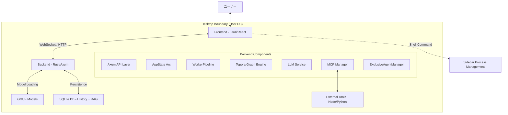
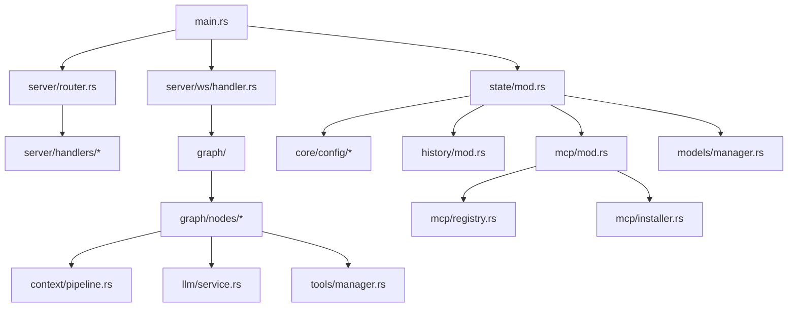
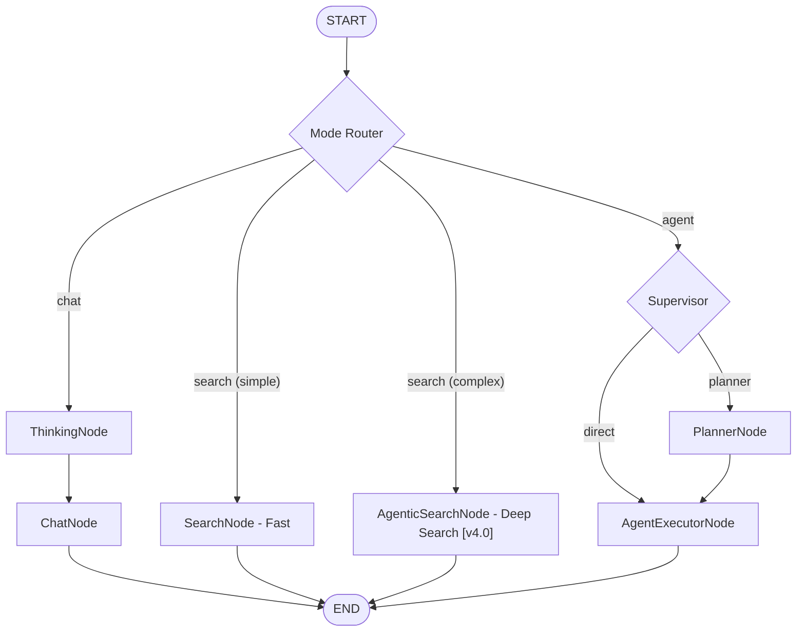
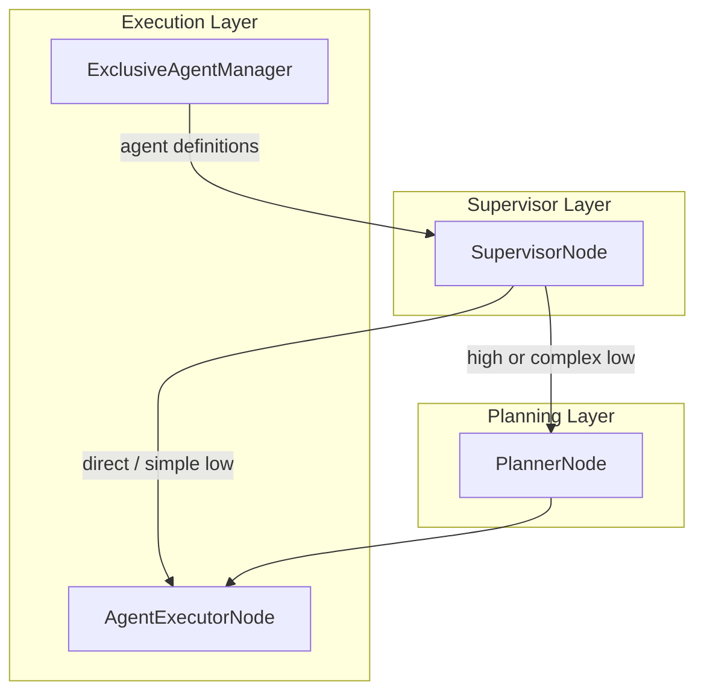
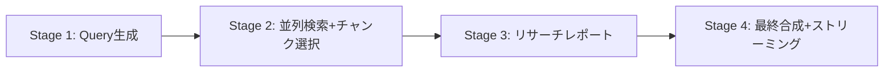
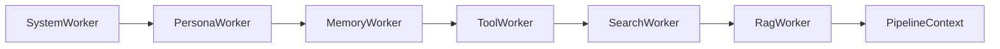
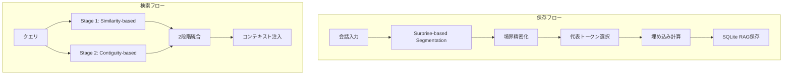
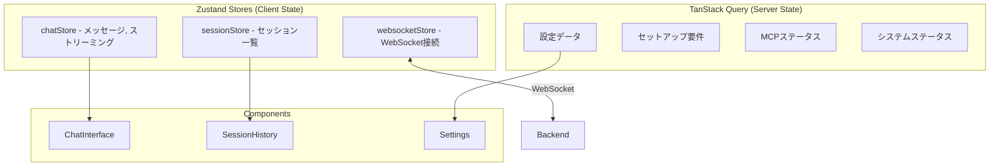
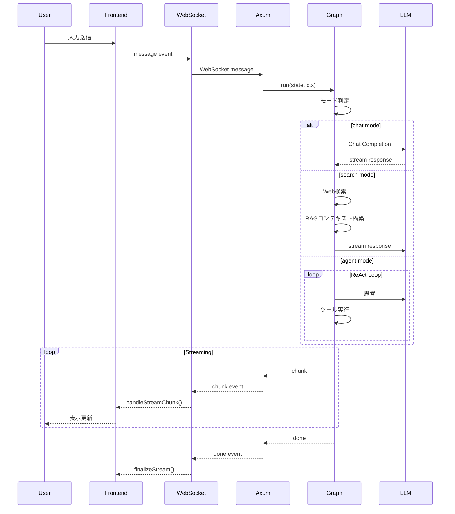
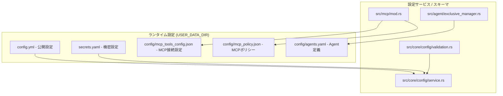

# Tepora Project - アーキテクチャ仕様書

**ドキュメントバージョン**: 5.02
**アプリケーションバージョン**: 4.0 (BETA) (v0.4.0)
**最終更新日**: 2026-02-19
**対象**: Rust Backend + React Frontend

---

## 📋 目次

1. [プロジェクト概要](#1-プロジェクト概要)
2. [システムアーキテクチャ](#2-システムアーキテクチャ)
3. [技術スタック](#3-技術スタック)
4. [ディレクトリ構造](#4-ディレクトリ構造)
5. [バックエンドアーキテクチャ](#5-バックエンドアーキテクチャ-rust)
6. [フロントエンドアーキテクチャ](#6-フロントエンドアーキテクチャ)
7. [データフロー](#7-データフロー)
8. [API仕様](#8-api仕様)
9. [設定システム](#9-設定システム)
10. [セキュリティ](#10-セキュリティ)
11. [品質保証](#11-品質保証)
12. [補足](#12-補足)

---

## 1. プロジェクト概要

### ビジョン

**"Local-First, Privacy-Centric AI Agent"**

Teporaは、ユーザーのローカル環境で完結し、プライバシーを最優先にしたデスクトップAIエージェントです。高度な記憶システム (EM-LLM) と自律的なタスク実行能力を持ちながら、外部クラウドに依存しない安心感を提供します。

### プロジェクト名

**Tepora（テポラ）** - イタリア語の"Tepore"（温かみ）と"ora"（現在）を組み合わせた造語。紅茶・喫茶店をテーマにした、温かみのあるAIパートナーを表現しています。

### コアコンセプト

| コンセプト                   | 説明                                                            |
| ---------------------------- | --------------------------------------------------------------- |
| **Local First**        | プライバシー最優先。データも推論もすべてローカル完結            |
| **Rust Backend**       | Python版から完全移行。安全性、並行性、パフォーマンス最大化      |
| **Graph Architecture** | `petgraph` ベースのステートマシンでエージェント思考をモデル化 |
| **Modern Frontend**    | React 19 + Tauri v2 によるネイティブライクな操作感              |

### 主要機能

| 機能                      | 説明                                                               |
| ------------------------- | ------------------------------------------------------------------ |
| **3つの動作モード** | Chat（AIとの自由対話）/ Search（Fast + Agentic Deep Research）/ Agent（ツール使用） |
| **EM-LLM**          | ICLR 2025採択論文に基づくエピソード記憶システム                    |
| **MCP対応**         | Model Context Protocolによる拡張可能なツールシステム               |
| **RAG**             | Retrieval-Augmented Generationによるコンテキスト拡張               |
| **ペルソナ**        | 複数のキャラクター・ペルソナの切り替え                             |

---

## 2. システムアーキテクチャ

Teporaは **Tauri** を用いたハイブリッドアプリケーションです。UIスレッドとバックエンドロジックは分離されており、ローカルホスト上のHTTP/WebSocketで通信します。

### 全体構成図



### モジュール依存関係



> [!IMPORTANT]
> **依存ルール**: 下位レイヤーは上位レイヤーをインポートしない。`config` と `state` は基盤モジュールとして全てからアクセス可能。

### アーキテクチャ階層

| 層                           | 技術                     | 役割                                       |
| ---------------------------- | ------------------------ | ------------------------------------------ |
| **プレゼンテーション** | Tauri + React            | UIレンダリング、ユーザー操作               |
| **状態管理**           | Zustand + TanStack Query | クライアント状態 + サーバー状態/キャッシュ |
| **通信**               | WebSocket + REST         | リアルタイム双方向通信 + API               |
| **アプリケーション**   | Axum                     | エンドポイント、ルーティング               |
| **ビジネスロジック**   | petgraph + GraphRuntime  | ステートマシン、エージェント制御           |
| **コンテキスト構築**   | WorkerPipeline           | モジュラーなコンテキストエンリッチメント   |
| **データアクセス**     | sqlx + SQLite            | リレーショナル + ベクトル検索 (in-process) |
| **推論エンジン**       | llama.cpp                | LLM推論処理                                |

---

## 3. 技術スタック

### バックエンド

| カテゴリ                    | 技術                | 用途                       |
| --------------------------- | ------------------- | -------------------------- |
| **言語**              | Rust (2021 edition) | コアロジック               |
| **Webフレームワーク** | Axum                | HTTP/WebSocket サーバー    |
| **非同期ランタイム**  | Tokio               | 非同期処理                 |
| **グラフエンジン**    | petgraph            | エージェントステートマシン |
| **データベース**      | sqlx (SQLite)       | リレーショナルデータ永続化 |
| **RAGストア**         | SQLite              | ベクトル検索 (in-process)  |
| **ベクトル演算**      | ndarray             | コサイン類似度計算         |
| **シリアライズ**      | serde / serde_json  | JSON処理                   |
| **HTTP Client**       | reqwest             | 外部API呼び出し            |

### フロントエンド

| カテゴリ                 | 技術           | バージョン | 用途                    |
| ------------------------ | -------------- | ---------- | ----------------------- |
| **フレームワーク** | React          | 19.x       | UIコンポーネント        |
| **言語**           | TypeScript     | 5.x        | 型安全性                |
| **アプリシェル**   | Tauri          | 2.x        | デスクトップアプリ化    |
| **状態管理**       | Zustand        | -          | クライアント状態        |
| **データフェッチ** | TanStack Query | 5.x        | サーバー状態/キャッシュ |
| **スタイリング**   | Tailwind CSS   | 4.x        | ユーティリティCSS       |
| **ルーティング**   | React Router   | 7.x        | SPA routing             |
| **ビルドツール**   | Vite           | 7.x        | 高速ビルド              |

### AIモデル

| カテゴリ             | モデル例                                  | 用途              | 推奨サイズ       |
| -------------------- | ----------------------------------------- | ----------------- | ---------------- |
| **Text Model** | Gemma 3n E2B/4B, Ministral 3B, Phi-4 Mini | 対話/エージェント | 2B - 4B (IQ4_XS) |
| **Embedding**  | EmbeddingGemma                            | ベクトル埋め込み  | 300M (Q8_0)      |

---

## 4. ディレクトリ構造

### プロジェクトルート

```
Tepora_Project/
├── Tepora-app/                 # アプリケーション本体
│   ├── backend-rs/             # Rust バックエンド
│   └── frontend/               # React フロントエンド
├── docs/                       # ドキュメント
│   ├── architecture/           # アーキテクチャ設計（本書）
│   ├── guides/                 # 開発ガイド
│   └── legacy/                 # 旧Python版資料
├── scripts/                    # ビルドスクリプト
├── Taskfile.yml                # タスクランナー
└── README.md
```

### バックエンド構造 (`Tepora-app/backend-rs/`)

```
backend-rs/
├── src/
│   ├── main.rs                 # エントリーポイント
│   │
│   ├── server/                 # ========== サーバー層 ==========
│   │   ├── handlers/           # REST API ハンドラ
│   │   ├── ws/                 # WebSocket ハンドラ
│   │   ├── router.rs           # ルーティング定義
│   │   └── mod.rs
│   │
│   ├── core/                   # ========== コア機能 ==========
│   │   ├── config/             # 設定管理
│   │   ├── security.rs         # 認証・セキュリティ
│   │   ├── errors.rs           # エラー定義
│   │   ├── logging.rs          # ログ設定
│   │   └── mod.rs
│   │
│   ├── state/                  # ========== 状態管理 ==========
│   │   ├── error.rs            # 状態関連エラー
│   │   ├── mod.rs              # AppState (アプリケーション状態)
│   │   └── setup.rs            # セットアップ状態
│   │
│   ├── llm/                    # ========== LLM 統合 ==========
│   │   ├── llama_cpp.rs        # llama.cpp バインディング
│   │   ├── llama_service.rs    # LlamaService (推論サーバー管理)
│   │   ├── service.rs          # LlmService (高レベル抽象化)
│   │   ├── provider.rs         # プロバイダー抽象化
│   │   ├── ollama.rs           # Ollama 統合
│   │   ├── lmstudio.rs         # LM Studio 統合
│   │   └── mod.rs
│   │
│   ├── mcp/                    # ========== MCP ==========
│   │   ├── mod.rs              # McpManager (MCP接続管理)
│   │   ├── registry.rs         # MCPサーバーカタログ
│   │   └── installer.rs        # MCPサーバーインストーラー
│   │
│   ├── graph/                  # ========== グラフエンジン ==========
│   │   ├── mod.rs              # モジュール公開
│   │   ├── runtime.rs          # GraphRuntime (実行エンジン)
│   │   ├── builder.rs          # GraphBuilder (構築ヘルパー)
│   │   ├── state.rs            # AgentState 定義
│   │   ├── node.rs             # Node トレイト定義
│   │   └── nodes/              # ノード実装 (chat, search, agentic, thinking, etc.)
│   │
│   ├── agent/                  # ========== エージェント管理 ==========
│   │   ├── exclusive_manager.rs # ExclusiveAgentManager [v4.0]
│   │   ├── execution.rs        # エージェント実行ランタイム
│   │   ├── planner.rs          # 実行計画生成
│   │   ├── modes.rs            # RequestedAgentMode
│   │   └── ...
│   │
│   ├── context/                # ========== コンテキストパイプライン ==========
│   │   ├── pipeline.rs         # ContextPipeline (レガシー + v4 bridge)
│   │   ├── pipeline_context.rs # PipelineContext (v4.0 構造体) [v4.0]
│   │   ├── worker.rs           # ContextWorker trait + WorkerPipeline [v4.0]
│   │   ├── workers/            # Worker 実装群 [v4.0]
│   │   └── ...
│   │
│   ├── models/                 # ModelManager (モデル管理)
│   ├── history/                # HistoryStore (チャット履歴)
│   ├── tools/                  # Native Tool実行 (web/search/RAG) + MCP委譲
│   │
│   ├── em_llm/                 # EM-LLM (エピソード記憶)
│   ├── memory/                 # メモリシステム
│   ├── rag/                    # RAG エンジン (SqliteRagStore) [v4.0]
│   └── a2a/                    # Agent-to-Agent (将来)
│
└── Cargo.toml
```

### フロントエンド構造 (`Tepora-app/frontend/`)

```
frontend/
├── package.json
├── vite.config.ts
├── tailwind.config.cjs
├── public/
│   └── locales/                # 翻訳 (en, ja, es, zh)
│
├── src/
│   ├── main.tsx                # エントリーポイント
│   ├── App.tsx                 # ルートコンポーネント
│   ├── index.css               # グローバルスタイル
│   ├── i18n.ts                 # 国際化設定
│   │
│   ├── stores/                 # ========== Zustand状態管理 ==========
│   │   ├── chatStore.ts        # チャット状態 (メッセージ、ストリーミング)
│   │   ├── sessionStore.ts     # セッション状態
│   │   └── websocketStore.ts   # WebSocket接続状態
│   │
│   ├── features/               # ========== Feature-Sliced Design ==========
│   │   ├── chat/               # チャット機能
│   │   ├── settings/           # 設定画面
│   │   ├── session/            # セッション管理
│   │   └── navigation/         # ナビゲーション
│   │
│   ├── pages/                  # ルートページ (logs, memory)
│   ├── api/                    # ルーターローダー等
│   ├── components/             # 共有UIコンポーネント
│   ├── hooks/                  # カスタムフック
│   ├── utils/                  # ユーティリティ
│   ├── types/                  # 型定義
│   ├── context/                # React Context
│   ├── styles/                 # スタイル
│   └── test/                   # テスト
│
└── src-tauri/                  # Tauri設定
    ├── tauri.conf.json
    └── capabilities/           # ケーパビリティ定義 (v2)
```

---

## 5. バックエンドアーキテクチャ (Rust)

バックエンドは **Axum** をベースにした非同期Webサーバーとして動作します。

### 5.1 AppState (アプリケーション状態)

`Arc<AppState>` にカプセル化され、全APIハンドラとバックグラウンドタスクで共有されます。

**ファイル**: `src/state/mod.rs`

```rust
pub struct AppState {
    pub paths: Arc<AppPaths>,        // パス設定
    pub config: ConfigService,       // 設定ファイルの読み書き
    pub session_token: SessionToken, // セッショントークン
    pub history: HistoryStore,       // SQLiteへのチャット履歴アクセス
    pub llama: LlamaService,         // 推論サーバー管理 (低レベル)
    pub llm: LlmService,             // LLMサービス (高レベル抽象化)
    pub mcp: McpManager,             // MCPクライアント管理
    pub mcp_registry: McpRegistry,   // MCPサーバーカタログ
    pub models: ModelManager,        // モデル管理
    pub setup: SetupState,           // セットアップ状態
    pub exclusive_agents: ExclusiveAgentManager, // エージェント定義管理
    pub rag_store: Arc<dyn RagStore>,            // RAGストア抽象
    pub graph_runtime: Arc<GraphRuntime>,        // グラフランタイム
    pub em_memory_service: Arc<EmMemoryService>, // エピソード記憶
}
```

### 5.2 グラフエンジン (`src/graph/`)

Python版 LangGraph の概念を Rust ネイティブな `petgraph` で再実装しました。

#### GraphRuntime

任意の `Node` 実装をつなぎ合わせ、状態遷移を管理するエンジンです。

**ファイル**: `src/graph/runtime.rs`

```rust
pub struct GraphRuntime {
    graph: DiGraph<Box<dyn Node>, EdgeCondition>,
    node_indices: HashMap<String, NodeIndex>,
    entry_node_id: String,
    max_steps: usize,
    execution_timeout: Option<Duration>,
}
```

**EdgeCondition (遷移条件)**:

| 条件                                   | 説明                           |
| -------------------------------------- | ------------------------------ |
| `EdgeCondition::Always`              | 無条件遷移（デフォルトエッジ） |
| `EdgeCondition::OnCondition(String)` | ノード出力に基づく条件分岐     |

**主要メソッド**:

| メソッド                                      | 説明                 |
| --------------------------------------------- | -------------------- |
| `add_node(node)`                            | ノードをグラフに追加 |
| `add_edge(from, to)`                        | 無条件エッジを追加   |
| `add_conditional_edge(from, to, condition)` | 条件付きエッジを追加 |
| `run(state, ctx, timeout_override)`         | グラフを実行         |

#### AgentState (グラフ状態)

グラフ実行中に各ノード間で共有されるデータ構造です。

**ファイル**: `src/graph/state.rs`

```rust
pub struct AgentState {
    // Session Identity
    pub session_id: String,
  
    // Core Messaging
    pub input: String,
    pub mode: Mode,                        // Chat | Search | SearchAgentic | Agent
    pub chat_history: Vec<ChatMessage>,
  
    // Hierarchical Agent Routing
    pub agent_id: Option<String>,          // UI選択のエージェント
    pub agent_mode: AgentMode,             // Low | High | Direct  [v4.0: Fast→Low]
    pub selected_agent_id: Option<String>, // Supervisorが選択
    pub supervisor_route: Option<SupervisorRoute>,
  
    // v4.0 Pipeline Context
    pub pipeline_context: Option<PipelineContext>,  // [v4.0] WorkerPipeline出力
  
    // Shared Context for Agents
    pub shared_context: SharedContext,     // Artifacts, Notes, Plans
  
    // Agent ReAct Loop State
    pub agent_scratchpad: Vec<ChatMessage>,
    pub agent_outcome: Option<String>,
  
    // Thinking Mode (CoT)
    pub thinking_enabled: bool,
    pub thought_process: Option<String>,
  
    // Search Mode State
    pub search_queries: Vec<String>,
    pub search_results: Option<Vec<SearchResult>>,
    pub search_attachments: Vec<Value>,
    pub skip_web_search: bool,
  
    // Final Output
    pub output: Option<String>,
    pub error: Option<String>,
}
```

**SharedContext構造**:

```rust
pub struct SharedContext {
    pub current_plan: Option<String>,      // Plannerが生成した計画
    pub artifacts: Vec<Artifact>,          // コードスニペット、検索結果等
    pub notes: Vec<String>,                // エージェント用スクラッチパッド
    pub professional_memory: Option<String>, // プロフェッショナルメモリ
}
```

#### グラフフロー



> [!NOTE]
> `SynthesizerNode` はコード上存在しますが、現行の `build_tepora_graph` デフォルト配線では未接続です。

### 5.3 ノード詳細

| ノード                | ファイル                    | 責務                                            |
| --------------------- | --------------------------- | ----------------------------------------------- |
| `RouterNode`        | `nodes/router.rs`         | 入力モードに基づいてChat/Search/Agentに分岐     |
| `ThinkingNode`      | `nodes/thinking.rs`       | CoT（Chain of Thought）思考プロセス生成         |
| `ChatNode`          | `nodes/chat.rs`           | LLMに対して直接対話応答を生成                   |
| `SearchNode`        | `nodes/search.rs`         | Web検索 + fetch + RAG投入 + RAG検索 + 応答生成 |
| `AgenticSearchNode` | `nodes/search_agentic.rs` | 4段階ディープサーチパイプライン**[v4.0]** |
| `SupervisorNode`    | `nodes/supervisor.rs`     | 階層的ルーティング（Planner or Agent）          |
| `PlannerNode`       | `nodes/planner.rs`        | タスク計画の立案                                |
| `AgentExecutorNode` | `nodes/agent_executor.rs` | ReActループでツールを実行し最終応答を生成       |
| `ToolNode`          | `nodes/tool.rs`           | 補助ノード（現行デフォルトグラフ未接続）        |
| `SynthesizerNode`   | `nodes/synthesizer.rs`    | 補助ノード（現行デフォルトグラフ未接続）        |

### 5.4 階層的マルチエージェントアーキテクチャ

`agent` モードでは、階層的マルチエージェントアーキテクチャを採用しています。



**AgentMode (ルーティングモード)** [v4.0: `Fast` → `Low` にリネーム]:

| モード     | 動作                                                    |
| ---------- | ------------------------------------------------------- |
| `high`   | 必ずPlannerを経由して計画を立ててから AgentExecutor を実行 |
| `low`    | SupervisorがLLMで判断。単純→直接実行、複雑→Plannerへ |
| `direct` | 指定された Custom Agent を選択して直接実行              |

> [!NOTE]
> `"fast"` は serde / parse でレガシーエイリアスとして引き続き受け入れられます。

### 5.4.1 ExclusiveAgentManager [v4.0]

**ファイル**: `src/agent/exclusive_manager.rs`

レガシーの `config.yml` 内 `custom_agents` セクションに替わり、独立した `agents.yaml` ファイルでエージェント定義を管理します。

| 機能                            | 説明                                                          |
| ------------------------------- | ------------------------------------------------------------- |
| **CRUD + ホットリロード** | `agents.yaml` の動的読み込み・書き込み                      |
| **エージェント自動選択**  | タグマッチング + priority ベースのスコアリング                |
| **ツール名解決**          | `web_search` → `native_search`, `mcp:tool` → `tool` |
| **デフォルト設定生成**    | `create_default_config()` で初期 agents.yaml を生成         |

```yaml
# agents.yaml
agents:
  coder:
    name: "Code Assistant"
    description: "コーディングに特化"
    priority: 10
    tags: ["code", "programming"]
    tool_policy:
      allow_all: true
```

### 5.5 Agentic Search [v4.0]

**ファイル**: `src/graph/nodes/search_agentic.rs`

複雑な検索クエリに対して自動的に起動する4段階ディープサーチパイプラインです。



| ステージ                        | 処理内容                                            |
| ------------------------------- | --------------------------------------------------- |
| **Query生成**             | LLMでサブクエリを生成（元クエリ含め最大5件まで）     |
| **並列検索+チャンク選択** | RAG類似検索 + テキスト検索 + 必要時Web検索を統合     |
| **リサーチレポート**      | 検索結果をLLMで構造化レポートに合成                 |
| **最終合成**              | レポート+元コンテキストからストリーミング回答を生成 |

**ルーティング判定** (`RouterNode` 内):

- 200文字以上の入力 → Agentic
- 深掘りキーワード検出 (`比較`, `分析`, `詳細`, `調査`, `深掘り` 等) → Agentic
- `search_attachments` 非空 → Agentic
- それ以外 → Fast (SearchNode)

### 5.6 Thinking Mode (CoT)

複雑な推論を必要とするリクエストに対して **Thinking Mode** をサポートしています。

- **動作**: `ThinkingNode` が最終回答の前に実行され、ステップバイステップの思考プロセスを生成
- **統合**: 生成された思考プロセスは `AgentState.thought_process` に保存
- **制御**: クライアントからのリクエストパラメータ `thinkingMode: true` で有効化

### 5.7 コンテキストパイプライン (WorkerPipeline) [v4.0]

**ファイル**: `src/context/worker.rs`, `src/context/pipeline_context.rs`, `src/context/workers/`

v4.0 では、コンテキスト構築をモジュラーな Worker パイプラインで行います。



| Worker            | 責務                                                         |
| ----------------- | ------------------------------------------------------------ |
| `SystemWorker`  | config からシステムプロンプト構築 + モード別コンテキスト注入 |
| `PersonaWorker` | ペルソナ設定の注入 (モード適格性チェック付き)                |
| `MemoryWorker`  | 会話履歴 + 長期記憶のロード                                  |
| `ToolWorker`    | 利用可能ツール定義の注入 (Native + MCP)                      |
| `SearchWorker`  | Web検索実行 + リランキング                                   |
| `RagWorker`     | RAGストアからのベクトル検索                                  |

**PipelineContext**: 1ターンのエフェメラルコンテキストを保持する構造体。`PipelineMode` (Chat, SearchFast, SearchAgentic, AgentHigh, AgentLow, AgentDirect) に基づいて Worker の有効/無効が決定されます。デフォルトのトークン予算は `max_tokens=12288`, `reserved_output=2048` です。

### 5.8 LlamaService & LlmService

**ファイル**: `src/llm/llama_service.rs`, `src/llm/service.rs`

`LlamaService` は llama.cpp (llama-server) プロセスを管理し、`LlmService` はより高レベルな抽象化を提供します。

```rust
pub struct LlamaService {
    inner: Arc<Mutex<LlamaManager>>,
    client: Client,
}
```

**責務**:

- llama-serverプロセスの起動・停止
- モデル切り替え時の自動再起動
- Chat Completions API の提供
- ヘルスチェック

`LlmService` は `ModelManager` のレジストリを参照して `ModelRuntimeConfig` を組み立て、`chat` / `stream_chat` / `embed` を高レベルAPIとして提供します。`ModelManager` 側では Ollama / LM Studio のモデル一覧同期（`refresh_*_models`）も実装されています。

### 5.9 MCP (Model Context Protocol)

TeporaはMCPクライアントとして動作し、外部のMCPサーバー（`git`, `filesystem` など）と接続します。

**ファイル**: `src/mcp/mod.rs`, `src/mcp/registry.rs`, `src/mcp/installer.rs`

| コンポーネント    | 責務                                       |
| ----------------- | ------------------------------------------ |
| `McpManager`    | MCP接続のライフサイクル管理                |
| `McpRegistry`   | 利用可能なMCPサーバーのカタログ管理        |
| `mcp_installer` | `npm` / `pip` を使った自動インストール |

`McpManager` は `mcp_tools_config.json` と `mcp_policy.json` を管理し、`LOCAL_ONLY` などの接続ポリシー、ブロックコマンド、初回利用承認を適用します。

### 5.10 EM-LLM (エピソード記憶)

ICLR 2025採択論文「EM-LLM」の実装。人間のエピソード記憶をLLMで再現します。

**特徴**:
- **AES-256-GCM 暗号化**: 保存される記憶データは暗号化され、プライバシーが保護されます。

**ファイル**: `src/em_llm/`



### 5.11 RAG ストア (SqliteRagStore) [v4.0]

**ファイル**: `src/rag/store.rs`, `src/rag/sqlite.rs`

v4.0 で Qdrant から in-process SQLite ベースのベクトルストアに移行しました。

| 機能                         | 説明                                                                        |
| ---------------------------- | --------------------------------------------------------------------------- |
| **RagStore trait**     | `insert_batch`, `search`, `text_search`, `get_chunk_window`, `reindex_with_model` 等を抽象化 |
| **SqliteRagStore**     | SQLite +`ndarray` によるコサイン類似度計算                                |
| **セッションフィルタ** | `session_id` で検索・削除を分離し、会話単位でRAGを運用                      |

> [!IMPORTANT]
> `RagStore` trait による抽象化で、将来の LanceDB や Qdrant への移行パスを確保しています。

---

## 6. フロントエンドアーキテクチャ

モダンなReactエコシステムを採用し、**Feature-Sliced Design** の軽量版構成を取っています。

### 6.1 状態管理

フロントエンドは **Zustand** と **TanStack Query** を組み合わせた状態管理を採用しています。



### 6.2 chatStore

**ファイル**: `src/stores/chatStore.ts`

```typescript
interface ChatState {
  // メッセージ
  messages: Message[];
  isProcessing: boolean;
  error: string | null;
  
  // アクティビティログ（エージェント処理表示用）
  activityLog: AgentActivity[];
  
  // 検索結果
  searchResults: SearchResult[];
  
  // メモリ統計
  memoryStats: MemoryStats | null;
  
  // ストリーミングバッファ（内部）
  _streamBuffer: string;
  _streamMetadata: StreamingMetadata | null;
}

interface ChatActions {
  addMessage: (message: Message) => void;
  addUserMessage: (content: string, mode: ChatMode, attachments?: Attachment[]) => void;
  setMessages: (messages: Message[]) => void;
  clearMessages: () => void;
  
  // Streaming
  handleStreamChunk: (content: string, metadata: StreamingMetadata) => void;
  flushStreamBuffer: () => void;
  finalizeStream: () => void;
  
  // Activity
  updateActivity: (activity: AgentActivity) => void;
  clearActivityLog: () => void;
  
  reset: () => void;
}
```

**ストリーミングロジック**:

- 50ms間隔でバッファをフラッシュし、UIの再描画回数を抑制
- `ThinkingNode` から `ChatNode` へのモード切り替え時も、ストリームを途切れさせずに結合

### 6.3 sessionStore

**ファイル**: `src/stores/sessionStore.ts`

```typescript
interface SessionState {
  sessions: Session[];
  currentSessionId: string;      // default: "default"
  isLoadingHistory: boolean;
}

interface SessionActions {
  setSessions: (sessions: Session[]) => void;
  setCurrentSession: (sessionId: string) => void;
  addSession: (session: Session) => void;
  removeSession: (sessionId: string) => void;
  updateSession: (sessionId: string, updates: Partial<Session>) => void;
  setIsLoadingHistory: (isLoading: boolean) => void;
  resetToDefault: () => void;
}
```

### 6.4 websocketStore

**ファイル**: `src/stores/websocketStore.ts`

```typescript
interface WebSocketState {
  isConnected: boolean;
  socket: WebSocket | null;
  reconnectAttempts: number;
  pendingToolConfirmation: ToolConfirmationRequest | null;
  approvedTools: Set<string>;
}

interface WebSocketActions {
  connect: () => Promise<void>;
  disconnect: () => void;
  sendMessage: (
    content: string,
    mode: ChatMode,
    attachments?: Attachment[],
    skipWebSearch?: boolean,
    thinkingMode?: boolean,
    agentId?: string,
    agentMode?: AgentMode,
    timeout?: number
  ) => void;
  sendRaw: (data: object) => void;
  setSession: (sessionId: string) => void;
  stopGeneration: () => void;
  requestStats: () => void;
  handleToolConfirmation: (requestId: string, approved: boolean, remember: boolean) => void;
}
```

### 6.5 機能ディレクトリ (`features/`)

| ディレクトリ             | 責務                                                   |
| ------------------------ | ------------------------------------------------------ |
| `features/chat/`       | メッセージリスト、入力エリア、マークダウンレンダリング |
| `features/settings/`   | 設定パネル、モデル管理、MCP管理UI                      |
| `features/session/`    | セッション履歴管理                                     |
| `features/navigation/` | サイドバー、レイアウト                                 |

### 6.6 主要コンポーネント

| コンポーネント    | 責務                             |
| ----------------- | -------------------------------- |
| `ChatInterface` | チャットビュー全体の制御         |
| `MessageList`   | メッセージリストの表示           |
| `MessageBubble` | 個別メッセージの表示             |
| `InputArea`     | テキスト入力＋添付ファイル       |
| `DialControl`   | Chat / Search / Agent モード切替 |
| `AgentStatus`   | エージェント処理状態の表示       |
| `SetupWizard`   | 初期セットアップフロー           |
| `Logs`          | ログ閲覧ページ (`/logs`)         |
| `Memory`        | メモリ統計ページ (`/memory`)     |

### 6.7 サイドカー連携

Tauriのサイドカー機能により、アプリ起動時にRustバックエンドを自動的に子プロセスとして立ち上げます。

- フロントエンドは `localhost` の動的ポートに対してAPIリクエストを行います
- `src/utils/sidecar.ts` が起動プロセスとポート検知を担当
- アプリ終了時は `POST /api/shutdown`（`x-api-key` 必須）を送信し、必要に応じて強制終了にフォールバックします

---

## 7. データフロー

### メッセージ処理フロー



---

## 8. API仕様

### 8.1 WebSocket

**接続**:

```
ws://127.0.0.1:{port}/ws
```

**認証/プロトコル**:

- `Sec-WebSocket-Protocol` に `tepora.v1` を指定
- 同ヘッダーに `tepora-token.{hex(session_token)}` を追加して認証  
  (クエリパラメータではなくサブプロトコルでトークンを渡す)

**クライアント → サーバー**:

| type                           | 説明           | ペイロード                                                                    |
| ------------------------------ | -------------- | ----------------------------------------------------------------------------- |
| `message` (または `type` 省略) | 通常メッセージ | `{ message, mode, sessionId, attachments?, skipWebSearch?, thinkingMode?, agentId?, agentMode?, timeout? }` |
| `stop`                       | 実行キャンセル | `{}`                                                                        |
| `get_stats`                  | メモリ統計要求 | `{}`                                                                        |
| `set_session`                | セッション切替 | `{ sessionId }`                                                             |
| `tool_confirmation_response` | ツール承認応答 | `{ requestId, approved }`                                                   |

> [!NOTE]
> `mode` は通常 `chat` / `search` / `agent`。内部的に `search_agentic` も受理されます。

**サーバー → クライアント**:

| type                          | 説明               | ペイロード                                      |
| ----------------------------- | ------------------ | ----------------------------------------------- |
| `chunk`                     | ストリーミング応答 | `{ message, mode?, nodeId?, agentName? }`     |
| `status`                    | 処理状態更新       | `{ message }`                                 |
| `activity`                  | ノード進捗         | `{ data: { id, status, message, agentName? } }` |
| `history`                   | チャット履歴       | `{ messages: [...] }`                         |
| `search_results`            | 検索結果           | `{ data: [...] }`                             |
| `tool_confirmation_request` | ツール承認要求     | `{ data: { requestId, toolName, toolArgs } }` |
| `done`                      | 処理完了           | `{}`                                          |
| `error`                     | エラー             | `{ message }`                                 |
| `stats`                     | メモリ統計         | `{ data: {...} }`                             |
| `stopped`                   | 停止完了           | `{}`                                          |
| `session_changed`           | セッション変更通知 | `{ sessionId }`                               |
| `thought`                   | 思考過程通知       | `{ content }`                                 |
| `download_progress`         | ダウンロード進捗   | `{ data: {...} }`                             |

### 8.2 REST API

#### 基本API

| メソッド  | エンドポイント           | 説明                   |
| --------- | ------------------------ | ---------------------- |
| `GET`   | `/health`              | ヘルスチェック         |
| `GET`   | `/api/status`          | システムステータス     |
| `GET`   | `/api/config`          | 設定取得               |
| `POST`  | `/api/config`          | 設定更新（全体）       |
| `PATCH` | `/api/config`          | 設定更新（部分）       |
| `GET`   | `/api/logs`            | ログファイル一覧       |
| `GET`   | `/api/logs/{filename}` | ログ内容取得           |
| `GET`   | `/api/tools`           | 利用可能ツール一覧     |
| `POST`  | `/api/shutdown`        | サーバーシャットダウン |

#### セッションAPI

| メソッド   | エンドポイント                  | 説明               |
| ---------- | ------------------------------- | ------------------ |
| `GET`    | `/api/sessions`               | セッション一覧     |
| `POST`   | `/api/sessions`               | 新規セッション作成 |
| `GET`    | `/api/sessions/{id}`          | セッション詳細     |
| `PATCH`  | `/api/sessions/{id}`          | セッション名更新   |
| `DELETE` | `/api/sessions/{id}`          | セッション削除     |
| `GET`    | `/api/sessions/{id}/messages` | メッセージ履歴取得 |

#### Custom Agent API

| メソッド   | エンドポイント                | 説明                         |
| ---------- | ----------------------------- | ---------------------------- |
| `GET`    | `/api/custom-agents`        | エージェント一覧             |
| `POST`   | `/api/custom-agents`        | エージェント作成             |
| `GET`    | `/api/custom-agents/{id}`   | エージェント詳細             |
| `PUT`    | `/api/custom-agents/{id}`   | エージェント更新             |
| `DELETE` | `/api/custom-agents/{id}`   | エージェント削除             |

#### MCP API

| メソッド   | エンドポイント                      | 説明                               |
| ---------- | ----------------------------------- | ---------------------------------- |
| `GET`    | `/api/mcp/status`                 | 接続ステータス                     |
| `GET`    | `/api/mcp/config`                 | MCP設定取得                        |
| `POST`   | `/api/mcp/config`                 | MCP設定更新                        |
| `GET`    | `/api/mcp/store`                  | レジストリ（利用可能サーバー一覧） |
| `GET`    | `/api/mcp/policy`                 | 接続ポリシー                       |
| `PATCH`  | `/api/mcp/policy`                 | ポリシー更新                       |
| `POST`   | `/api/mcp/install/preview`        | インストールプレビュー             |
| `POST`   | `/api/mcp/install/confirm`        | インストール確認                   |
| `POST`   | `/api/mcp/servers/{name}/approve` | サーバー承認（allowlist更新）      |
| `POST`   | `/api/mcp/servers/{name}/revoke`  | サーバー承認取り消し               |
| `POST`   | `/api/mcp/servers/{name}/enable`  | サーバー有効化                     |
| `POST`   | `/api/mcp/servers/{name}/disable` | サーバー無効化                     |
| `DELETE` | `/api/mcp/servers/{name}`         | サーバー削除                       |

#### セットアップAPI

| メソッド   | エンドポイント                | 説明                       |
| ---------- | ----------------------------- | -------------------------- |
| `POST`   | `/api/setup/init`           | セットアップ初期化         |
| `POST`   | `/api/setup/preflight`      | 事前チェック（容量・権限） |
| `GET`    | `/api/setup/requirements`   | 要件チェック               |
| `GET`    | `/api/setup/default-models` | 推奨モデルリスト           |
| `POST`   | `/api/setup/run`            | セットアップ開始           |
| `GET`    | `/api/setup/progress`       | 進捗確認                   |
| `POST`   | `/api/setup/finish`         | セットアップ完了           |
| `GET`    | `/api/setup/models`         | 利用可能モデル一覧         |
| `GET`    | `/api/setup/model/roles`    | 役割ごとのモデル割当取得   |
| `POST`   | `/api/setup/model/roles/character` | Characterモデル割当設定 |
| `POST`   | `/api/setup/model/roles/professional` | Professionalモデル割当設定 |
| `DELETE` | `/api/setup/model/roles/professional/{task_type}` | Professional割当削除 |
| `POST`   | `/api/setup/model/active`   | アクティブモデル設定       |
| `POST`   | `/api/setup/model/reorder`  | モデル表示順更新           |
| `POST`   | `/api/setup/model/check`    | モデル詳細取得             |
| `POST`   | `/api/setup/model/download` | モデルダウンロード         |
| `POST`   | `/api/setup/model/local`    | ローカルモデル登録         |
| `DELETE` | `/api/setup/model/{id}`     | モデル削除                 |
| `POST`   | `/api/setup/models/ollama/refresh` | Ollamaモデル同期    |
| `POST`   | `/api/setup/models/lmstudio/refresh` | LM Studioモデル同期 |
| `GET`    | `/api/setup/model/update-check` | モデル更新確認          |
| `GET`    | `/api/setup/binary/update-info` | llama.cpp バイナリ更新情報 |
| `POST`   | `/api/setup/binary/update` | llama.cpp バイナリ更新実行  |

---

## 9. 設定システム

### 設定ファイル構成



### config.yml 主要セクション

```yaml
app:
  max_input_length: 10000
  graph_recursion_limit: 50
  graph_execution_timeout: 60000
  tool_execution_timeout: 120
  tool_approval_timeout: 300
  web_fetch_max_chars: 6000
  web_fetch_max_bytes: 1000000
  web_fetch_timeout_secs: 10
  dangerous_patterns: []
  language: "ja"
  setup_completed: true

server:
  host: "127.0.0.1"
  cors_allowed_origins: ["tauri://localhost", "http://127.0.0.1:5173"]

tools:
  search_provider: "google"
  google_search_api_key: "YOUR_KEY"
  google_search_engine_id: "YOUR_CX"
  bing_search_api_key: "YOUR_KEY"
  brave_search_api_key: "YOUR_KEY"

privacy:
  allow_web_search: false
  redact_pii: true
  url_denylist: ["localhost", "*.internal"]

llm_manager:
  loader: "llama_cpp"
  process_terminate_timeout: 5000
  health_check_timeout: 60

models_gguf:
  text_model:
    path: "models/text-model.gguf"
    port: 8088
    n_ctx: 8192
    n_gpu_layers: -1
  embedding_model:
    path: "models/embedding-model.gguf"
    port: 8090
    n_ctx: 4096
    n_gpu_layers: -1

model_download:
  require_allowlist: false
  warn_on_unlisted: true
  require_revision: false
  require_sha256: false
```

> [!NOTE]
> `GET /api/config` は機密値を `****` でマスクして返します。保存時は `config.yml` と `secrets.yaml` に分離されます。

### 実行時データ配置

```
USER_DATA_DIR/
├── config.yml                  # ユーザー設定（公開）
├── secrets.yaml                # APIキー等の機密設定
├── tepora_core.db              # SQLite: チャット履歴 + RAGベクトル
├── models.json                 # モデルレジストリ
├── models/                     # ダウンロード/登録モデル
├── logs/                       # アプリログ
├── bin/llama.cpp/current/      # llama.cppバイナリ
└── config/
    ├── mcp_tools_config.json   # MCP接続設定
    ├── mcp_policy.json         # MCP接続ポリシー
    └── agents.yaml             # エージェント定義 [v4.0]
```

**OS別データディレクトリ**:

- Windows: `%LOCALAPPDATA%\Tepora`
- macOS: `~/Library/Application Support/Tepora`
- Linux: `~/.local/share/tepora`

> [!NOTE]
> デバッグビルドでは `USER_DATA_DIR` は `project_root`（`backend-rs` 配下）になる実装です。

---

## 10. セキュリティ

### 認証

| 対象                 | 方式                       | 説明                    |
| -------------------- | -------------------------- | ----------------------- |
| **REST API**   | `x-api-key` ヘッダー     | `/health` と `/api/status` 以外で必須 |
| **WebSocket**  | `Sec-WebSocket-Protocol` | `tepora-token.{hex(token)}` で認証 |
| **Origin検証** | Allowlist                  | WebSocketのOriginを検証 |

> [!NOTE]
> `TEPORA_ENV!=production` の場合に限り、Origin ヘッダー未設定接続を許可します。トークン検証は常に有効です。

> [!NOTE]
> セッショントークンは `~/.tepora/.session_token` に保存され、REST/WebSocket 共通で使用されます。

### MCPセキュリティ

| 機能                           | 説明                                                      |
| ------------------------------ | --------------------------------------------------------- |
| **2段階インストール**    | preview → confirm の2段階フロー                          |
| **デフォルト無効**       | 新規インストールサーバーはデフォルトで無効状態            |
| **接続ポリシー**         | デフォルトは `LOCAL_ONLY`（ローカルサーバー/stdioのみ） |
| **ツール承認**           | MCPツールはセッション初回使用時にユーザー承認が必要       |
| **危険コマンドブロック** | `sudo` 等の危険コマンドはブロック                       |

### プライバシー保護

| 機能                       | 説明                                   |
| -------------------------- | -------------------------------------- |
| **Web検索許可制御**  | `privacy.allow_web_search` が `false` の場合、外部検索/取得を拒否 |
| **SSRF防御**         | `native_web_fetch` がローカルIP・private network・denylistドメインをブロック |
| **入力ガード**       | `app.dangerous_patterns` による危険入力パターン拒否 |
| **機密設定保護**     | APIキー等は `secrets.yaml` に分離保存 + APIレスポンス時マスク |
| **記憶の暗号化**     | EM-LLM (エピソード記憶) は AES-256-GCM で暗号化して保存 |

### モデルダウンロードセキュリティ

| 機能                     | 説明                                              |
| ------------------------ | ------------------------------------------------- |
| **Allowlist**      | `model_download.allow_repo_owners` による制御     |
| **リビジョン固定** | `require_revision=true` で必須化                  |
| **SHA256検証**     | `require_sha256=true` で必須化                    |
| **未登録警告**     | `warn_on_unlisted=true` で同意フローを要求        |

---

## 11. 品質保証

### 品質ゲート構成

1. **ローカル開発 (Pre-commit)**

   - コミット時にフォーマット、Lint、基本検証を自動実行
2. **検証フェーズ (Task Runner)**

   - `task quality`: 全体の品質チェック
   - `task quality:fix`: 自動修正を含むチェック
3. **CI/CD (GitHub Actions)**

   - プルリクエストおよびプッシュ時に厳格な検証

### 採用ツール

| 領域               | ツール           | 目的                            |
| ------------------ | ---------------- | ------------------------------- |
| **Backend**  | cargo clippy     | Rustコードの静的解析            |
| **Backend**  | cargo fmt        | コードフォーマット              |
| **Backend**  | cargo test       | ユニットテスト                  |
| **Frontend** | ESLint           | TypeScript/React のLint         |
| **Frontend** | Biome            | 追加コードチェック (`quality:frontend`) |
| **Frontend** | TypeScript (tsc) | 型安全性チェック                |
| **Frontend** | Vitest           | ユニット/統合テスト             |
| **Security** | cargo audit      | Rust依存関係の脆弱性スキャン    |
| **Security** | npm audit        | Node.js依存関係の脆弱性スキャン |

### 開発コマンド

```bash
# 開発モード起動 (Frontend + Sidecar)
task dev

# バックエンドのみ開発起動
task dev-backend

# 品質チェック (Format, Lint, Test)
task quality
```

---

## 12. 補足

### Python版からRust版への主な変更点

| 項目                        | Python版     | Rust版 (v4.0)                 |
| --------------------------- | ------------ | ----------------------------- |
| **言語**              | Python 3.10+ | Rust 2021                     |
| **Webフレームワーク** | FastAPI      | Axum                          |
| **グラフエンジン**    | LangGraph    | petgraph (自前実装)           |
| **LLM統合**           | LangChain    | 直接HTTP (llama.cpp API)      |
| **ベクトルDB**        | ChromaDB     | SQLite (in-process)           |
| **コンテキスト構築**  | 手動構築     | WorkerPipeline (v4.0)         |
| **パッケージ管理**    | uv / pip     | Cargo                         |
| **バイナリ配布**      | PyInstaller  | ネイティブバイナリ            |

### 今後の拡張予定

- **A2A Protocol**: Agent-to-Agent通信機能
- **WorkerPipeline 完全統合**: 全ノードで v4.0 パイプラインを使用
- **高機能ベクトルDBへの移行**: RagStore trait 経由で LanceDB や Qdrant への移行を検討

---

*本ドキュメントは Tepora Project の技術仕様を定義しています。*
