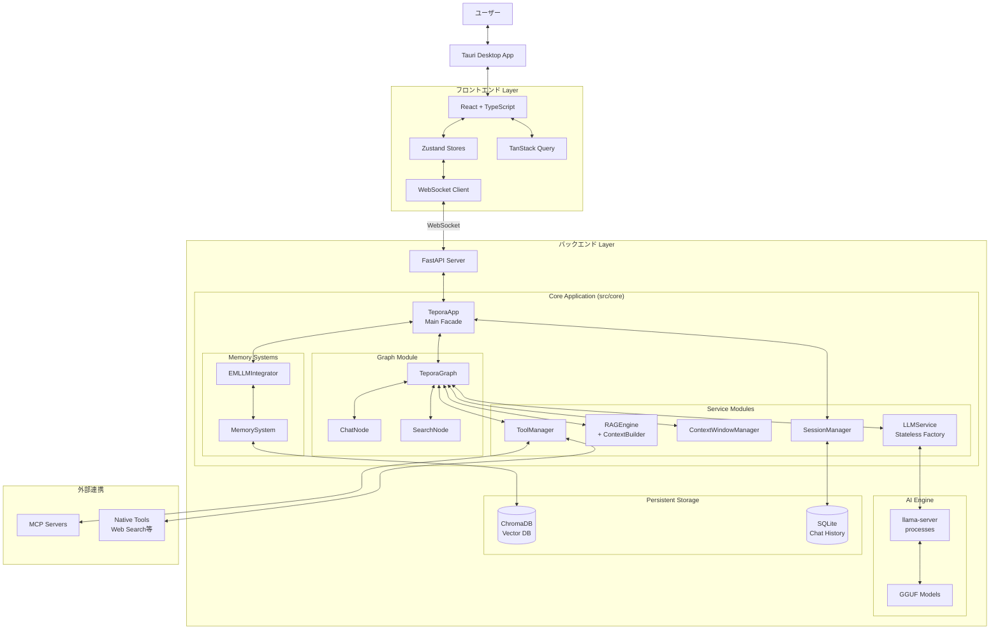
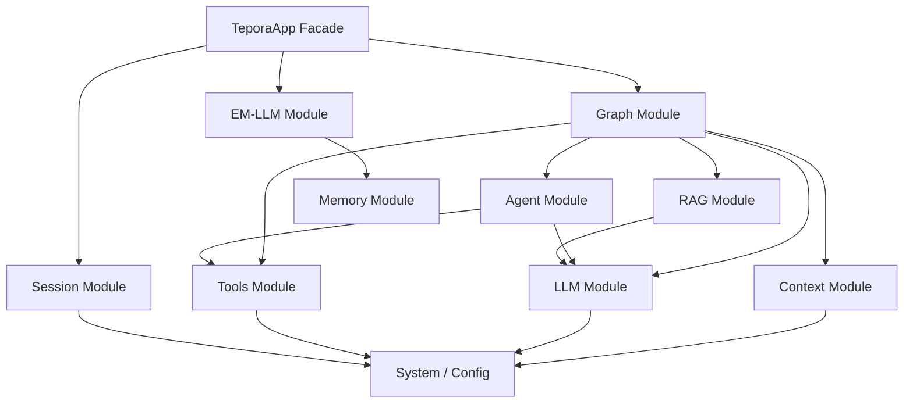
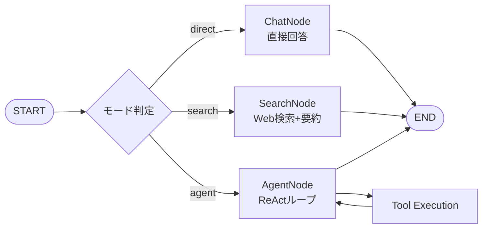
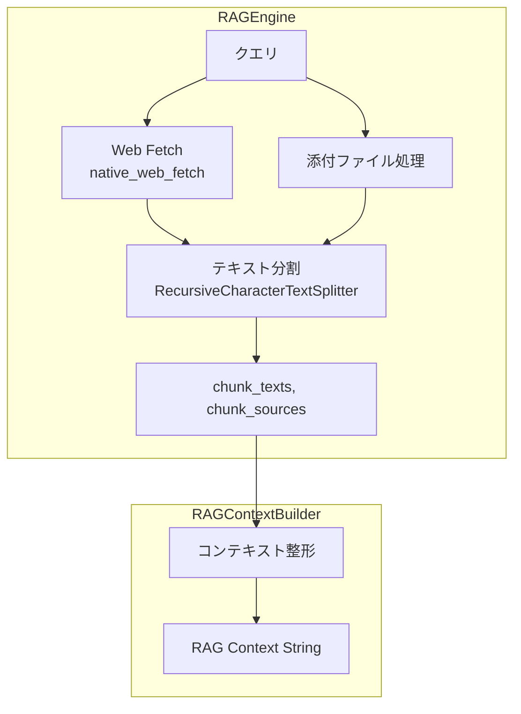
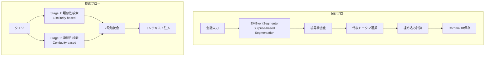
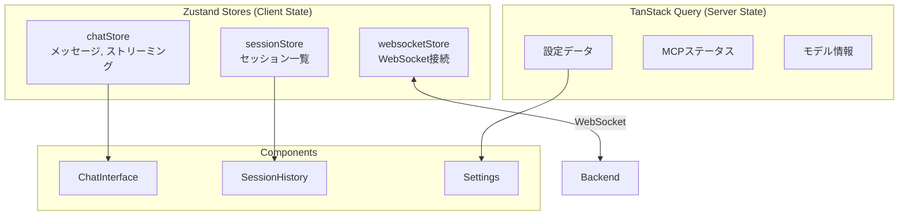
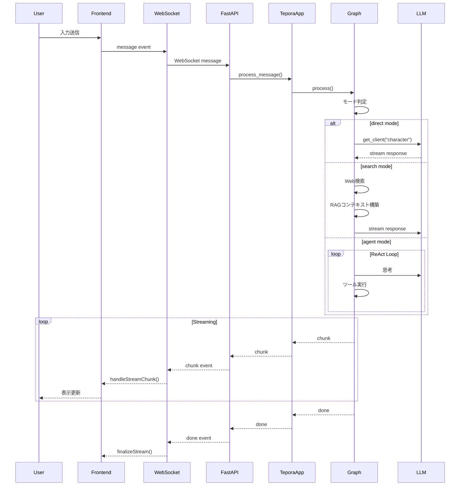
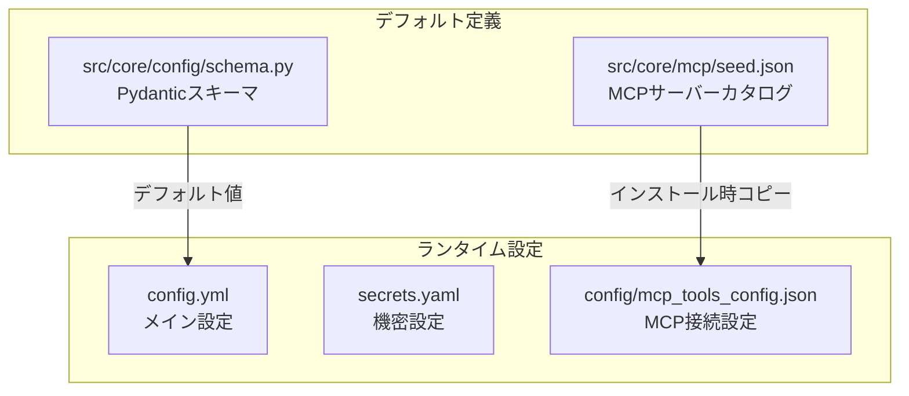

# Tepora Project - 包括的アーキテクチャ仕様書

**バージョン**: 3.0  
**最終更新日**: 2026-01-22  
**プロジェクト概要**: ローカル環境で動作するパーソナルAIエージェントシステム

---

## 📋 目次

1. [プロジェクト概要](#プロジェクト概要)
2. [システムアーキテクチャ](#システムアーキテクチャ)
3. [技術スタック](#技術スタック)
4. [ディレクトリ構造](#ディレクトリ構造)
5. [バックエンドアーキテクチャ](#バックエンドアーキテクチャ)
6. [フロントエンドアーキテクチャ](#フロントエンドアーキテクチャ)
7. [データフロー](#データフロー)
8. [API仕様](#api仕様)
9. [設定システム](#設定システム)
10. [セキュリティ](#セキュリティ)

---

## プロジェクト概要

### ビジョン

Teporaは「**コンシューマーハードウェアで動作する、真のパーソナルAIエージェントの実用化**」を目指すプロジェクトです。

### プロジェクト名

**Tepora（テポラ）** - イタリア語の"Tepore"（温かみ）と"ora"（現在）を組み合わせた造語。紅茶・喫茶店をテーマにした、温かみのあるAIパートナーを表現しています。

### コアコンセプト

| コンセプト | 説明 |
|-----------|------|
| **Local First** | プライバシー最優先。全処理をローカル環境で完結 |
| **Modular Design** | 保守性・拡張性・テスト容易性を重視したモジュラー設計 |
| **Stateless Core** | 並行処理をサポートするステートレスなコア設計 |
| **Hardware Agnostic** | ハイエンドGPUからCPUまで幅広いハードウェアで動作 |

### 主要機能

| 機能 | 説明 |
|------|------|
| **3つの動作モード** | Chat（直接対話）/ Search（Web検索+RAG）/ Agent（ツール使用） |
| **EM-LLM** | ICLR 2025採択論文に基づくエピソード記憶システム |
| **MCP対応** | Model Context Protocolによる拡張可能なツールシステム |
| **RAG** | Retrieval-Augmented Generationによるコンテキスト拡張 |
| **ペルソナ** | 複数のキャラクター・ペルソナの切り替え |

---

## システムアーキテクチャ

### 全体構成図



### モジュール依存関係



> [!IMPORTANT]
> **依存ルール**: 下位レイヤーは上位レイヤーをインポートしない。`system`と`config`は基盤モジュールとして全てからアクセス可能。

### アーキテクチャの階層

| 層 | 技術 | 役割 |
|----|------|------|
| **プレゼンテーション** | Tauri + React | UIレンダリング、ユーザー操作 |
| **状態管理** | Zustand + TanStack Query | クライアント状態 + サーバー状態/キャッシュ |
| **通信** | WebSocket + REST | リアルタイム双方向通信 + API |
| **アプリケーション** | FastAPI | エンドポイント、セッション管理 |
| **ビジネスロジック** | LangGraph + TeporaApp | ステートマシン、エージェント制御 |
| **データアクセス** | ChromaDB + SQLite | ベクトル検索、永続化 |
| **推論エンジン** | llama.cpp | LLM推論処理 |

---

## 技術スタック

### バックエンド

| カテゴリ | 技術 | バージョン | 用途 |
|---------|------|-----------|------|
| **Webフレームワーク** | FastAPI | 0.124+ | REST API / WebSocket |
| **言語** | Python | 3.10+ | ビジネスロジック |
| **ASGIサーバー** | Uvicorn | - | 非同期サーバー |
| **ステートマシン** | LangGraph | - | エージェント制御フロー |
| **LLMフレームワーク** | LangChain | - | LLM統合 |
| **推論エンジン** | llama.cpp | - | GGUF推論 |
| **ベクトルDB** | ChromaDB | - | エピソード記憶 / RAG |
| **リレーショナルDB** | SQLite | - | チャット履歴 / セッション |
| **設定管理** | PyYAML + Pydantic | - | 設定スキーマ / バリデーション |

### フロントエンド

| カテゴリ | 技術 | バージョン | 用途 |
|---------|------|-----------|------|
| **フレームワーク** | React | 19.x | UIコンポーネント |
| **言語** | TypeScript | 5.x | 型安全性 |
| **アプリシェル** | Tauri | 2.x | デスクトップアプリ化 |
| **状態管理** | Zustand | - | クライアント状態 |
| **データフェッチ** | TanStack Query | 5.x | サーバー状態 / キャッシュ |
| **スタイリング** | Tailwind CSS | 4.x | ユーティリティCSS |
| **ルーティング** | React Router | 7.x | SPA routing |
| **ビルドツール** | Vite | 7.x | 高速ビルド |
| **テスト** | Vitest + Testing Library | - | ユニット/コンポーネントテスト |

### AIモデル

| カテゴリ | モデル例 | 用途 | 推奨サイズ |
|---------|---------|------|-----------|
| **Text Model** | Gemma 3n E2B/4B, Ministral 3B, Phi-4 Mini | 対話 / エージェント | 2B - 4B (IQ4_XS) |
| **Embedding** | EmbeddingGemma | ベクトル埋め込み | 300M (Q8_0) |

---

## ディレクトリ構造

### プロジェクトルート

```
Tepora_Project/
├── Tepora-app/                 # アプリケーション本体
│   ├── backend/                # バックエンド
│   └── frontend/               # フロントエンド
├── docs/                       # ドキュメント
│   ├── architecture/           # アーキテクチャ設計
│   │   ├── ARCHITECTURE.md     # 本ドキュメント
│   │   ├── ROADMAP.md          # 開発ロードマップ
│   │   └── refactoring_plan_v2.md  # リファクタリング計画
│   ├── guides/                 # 開発ガイド
│   └── planning/               # 計画・監査レポート
├── scripts/                    # ビルドスクリプト
├── Taskfile.yml               # タスクランナー
└── README.md
```

### バックエンド構造 (`Tepora-app/backend/`)

```
backend/
├── server.py                   # エントリーポイント
├── config.yml                  # アプリケーション設定
├── models/                     # GGUFモデル格納
├── bin/                        # llama.cppバイナリ
├── chroma_db/                  # ChromaDB永続化
├── pyproject.toml              # Python依存関係
└── src/
    ├── tepora_server/          # ========== Web Server Layer ==========
    │   ├── __init__.py
    │   ├── app_factory.py      # FastAPIアプリケーション生成
    │   ├── state.py            # AppState（サーバー状態管理）
    │   │
    │   └── api/                # APIルート
    │       ├── routes.py       # 基本REST API (/api/status, /api/config)
    │       ├── sessions.py     # セッションAPI (/api/sessions)
    │       ├── setup.py        # セットアップAPI (/api/setup)
    │       ├── mcp_routes.py   # MCP管理API (/api/mcp)
    │       ├── ws.py           # WebSocketハンドラ (/ws)
    │       ├── session_handler.py  # WebSocketセッションハンドラ
    │       ├── security.py     # 認証・セキュリティ
    │       ├── dependencies.py # 依存性注入
    │       └── exception_handlers.py
    │
    └── core/                   # ========== Core Business Logic ==========
        ├── __init__.py
        ├── app_v2.py           # TeporaApp（メインファサード）
        │
        ├── graph/              # -------- Graph Module (Orchestrator) --------
        │   ├── __init__.py
        │   ├── runtime.py      # TeporaGraph（メインルーター）
        │   ├── state.py        # AgentState定義
        │   ├── constants.py    # GraphNodes, GraphRoutes, InputMode
        │   ├── routing.py      # ルーティングロジック
        │   ├── utils.py        # ユーティリティ
        │   └── nodes/          # グラフノード
        │       ├── __init__.py
        │       ├── chat.py     # ChatNode（直接対話）
        │       ├── search.py   # SearchNode（検索+要約）
        │       ├── memory.py   # メモリノード
        │       ├── conversation.py  # 会話ノード（V1互換）
        │       ├── react.py    # ReActノード
        │       └── em_llm.py   # EM-LLMノード
        │
        ├── llm/                # -------- LLM Module --------
        │   ├── __init__.py
        │   ├── service.py      # LLMService（ステートレスファクトリ）
        │   ├── runner.py       # LocalModelRunner Protocol
        │   ├── llama_runner.py # LlamaServerRunner（llama.cpp用）
        │   ├── ollama_runner.py # OllamaRunner（将来対応）
        │   ├── process_manager.py  # llama-serverプロセス管理
        │   ├── client_factory.py   # LangChainクライアント生成
        │   ├── model_registry.py   # モデルパス解決
        │   ├── executable.py   # 実行形式管理
        │   ├── health.py       # ヘルスチェック
        │   └── process.py      # プロセス定義
        │
        ├── rag/                # -------- RAG Module --------
        │   ├── __init__.py
        │   ├── engine.py       # RAGEngine（チャンク収集）
        │   ├── context_builder.py  # RAGContextBuilder（コンテキスト整形）
        │   └── manager.py      # SourceManager（ソース管理）
        │
        ├── context/            # -------- Context Module --------
        │   ├── __init__.py
        │   ├── history.py      # SessionHistory（履歴ラッパー）
        │   └── window.py       # ContextWindowManager（トークン管理）
        │
        ├── agent/              # -------- Agent Module --------
        │   ├── __init__.py
        │   ├── base.py         # BaseAgent（エージェント基底）
        │   └── registry.py     # AgentRegistry（エージェント登録）
        │
        ├── tools/              # -------- Tools Module --------
        │   ├── __init__.py
        │   ├── manager.py      # ToolManager（統合管理）
        │   ├── base.py         # ToolProvider基底
        │   ├── native.py       # ネイティブツール（Web検索等）
        │   ├── search/         # -------- Search Tools --------
        │   │   ├── base.py     # SearchEngine基底
        │   │   ├── tool.py     # SearchToolラッパー
        │   │   └── providers/  # 検索エンジン実装
        │   └── mcp.py          # McpToolProvider
        │
        ├── em_llm/             # -------- EM-LLM Module --------
        │   ├── __init__.py
        │   ├── integrator.py   # EMLLMIntegrator（統合クラス）
        │   ├── segmenter.py    # EMEventSegmenter（イベント分割）
        │   ├── boundary.py     # 境界精密化
        │   ├── retrieval.py    # EMTwoStageRetrieval（2段階検索）
        │   └── types.py        # EMConfig, EpisodicEvent
        │
        ├── system/             # -------- System Module --------
        │   ├── __init__.py
        │   ├── logging.py      # ログ設定（PIIリダクション）
        │   └── session.py      # SessionManager（セッション管理）
        │
        ├── memory/             # -------- Memory Module --------
        │   ├── memory_system.py    # MemorySystem（ChromaDB統合）
        │   ├── chroma_store.py     # ChromaDBストア
        │   └── vector_store.py     # ベクトルストア抽象化
        │
        ├── mcp/                # -------- MCP Module --------
        │   ├── __init__.py
        │   ├── hub.py          # McpHub（API/管理用）
        │   ├── installer.py    # MCPインストーラー
        │   ├── registry.py     # MCPレジストリ
        │   ├── models.py       # MCPデータモデル
        │   └── seed.json       # デフォルトMCPサーバー定義
        │
        ├── download/           # -------- Download Module --------
        │   ├── __init__.py
        │   ├── manager.py      # DownloadManager
        │   ├── binary.py       # llama.cppバイナリDL
        │   ├── models.py       # モデルDL処理
        │   ├── progress.py     # 進捗追跡
        │   └── types.py        # 型定義
        │
        ├── models/             # -------- Model Management --------
        │   └── ...             # モデル管理ロジック
        │
        ├── config/             # -------- Config Module --------
        │   ├── __init__.py     # 公開API
        │   ├── schema.py       # Pydanticスキーマ
        │   ├── loader.py       # 設定ロード・バリデーション
        │   ├── app.py          # アプリケーション設定
        │   ├── service.py      # 設定サービス
        │   ├── agents.py       # エージェント・ペルソナ設定
        │   ├── prompts.py      # システムプロンプト
        │   └── memory.py       # メモリ関連定数
        │
        ├── app/                # -------- App Utilities --------
        │   ├── startup_validator.py  # 起動バリデーション
        │   └── utils.py        # sanitize_user_input など
        │
        ├── common/             # -------- Common Utilities --------
        │   └── security.py     # セキュリティユーティリティ
        │
        └── a2a/                # -------- A2A Protocol --------
            └── __init__.py     # Agent-to-Agent機能（将来）
```

### フロントエンド構造 (`Tepora-app/frontend/`)

```
frontend/
├── package.json                # npm依存関係
├── tsconfig.json               # TypeScript設定
├── vite.config.ts              # Vite設定
├── tailwind.config.cjs         # Tailwind設定
├── index.html
│
├── src/
│   ├── main.tsx                # Reactエントリーポイント
│   ├── App.tsx                 # ルートコンポーネント
│   ├── index.css               # グローバルスタイル
│   ├── i18n.ts                 # 国際化設定 (i18next)
│   │
│   ├── stores/                 # ========== Zustand状態管理 ==========
│   │   ├── index.ts            # ストアエクスポート
│   │   ├── chatStore.ts        # チャット状態（メッセージ、ストリーミング）
│   │   ├── sessionStore.ts     # セッション状態（一覧、現在のセッション）
│   │   └── websocketStore.ts   # WebSocket接続状態
│   │
│   ├── components/             # ========== UIコンポーネント ==========
│   │   ├── Layout.tsx          # メインレイアウト
│   │   ├── ChatInterface.tsx   # チャットビュー
│   │   ├── MessageList.tsx     # メッセージリスト
│   │   ├── MessageBubble.tsx   # メッセージバブル
│   │   ├── InputArea.tsx       # 入力エリア
│   │   ├── DialControl.tsx     # モード切替ダイアル
│   │   ├── PersonaSwitcher.tsx # ペルソナ切替
│   │   ├── AgentStatus.tsx     # エージェント状態表示
│   │   ├── StatusBar.tsx       # ステータスバー
│   │   ├── SearchResults.tsx   # 検索結果表示
│   │   ├── SystemStatusPanel.tsx  # システム詳細パネル
│   │   ├── RagContextPanel.tsx    # RAGコンテキストパネル
│   │   │
│   │   ├── SetupWizard/        # セットアップウィザード
│   │   │   ├── SetupWizard.tsx
│   │   │   └── steps/          # ステップコンポーネント
│   │   │
│   │   ├── SessionHistory/     # セッション履歴
│   │   │
│   │   ├── settings/           # 設定画面
│   │   │   ├── components/     # 設定UIコンポーネント
│   │   │   └── sections/       # 設定セクション
│   │   │
│   │   ├── chat/               # チャット関連パーツ
│   │   └── ui/                 # 汎用UIパーツ
│   │
│   ├── hooks/                  # ========== カスタムフック ==========
│   │   ├── useSettings.ts      # 設定管理
│   │   ├── useSessions.ts      # セッション管理
│   │   ├── useMcp.ts           # MCP管理
│   │   ├── useServerConfig.ts  # サーバー設定取得
│   │   └── chat/               # チャット関連フック
│   │
│   ├── context/                # ========== React Context ==========
│   │   └── SettingsContext.tsx # 設定プロバイダー
│   │
│   ├── utils/                  # ========== ユーティリティ ==========
│   │   ├── api.ts              # API呼び出し
│   │   ├── api-client.ts       # HTTPクライアント
│   │   └── sidecar.ts          # Tauriサイドカー管理
│   │
│   ├── types/                  # ========== 型定義 ==========
│   │   ├── index.ts            # 主要型定義
│   │   └── tauri.d.ts          # Tauri型宣言
│   │
│   ├── pages/                  # ========== ページコンポーネント ==========
│   │   ├── Logs.tsx            # ログビューア
│   │   └── Memory.tsx          # 記憶可視化
│   │
│   ├── styles/                 # スタイル定義
│   └── test/                   # テストセットアップ
│
└── src-tauri/                  # ========== Tauri設定 ==========
    ├── tauri.conf.json         # Tauri設定
    ├── Cargo.toml
    ├── build.rs
    ├── src/
    │   ├── main.rs
    │   └── lib.rs
    ├── icons/                  # アプリアイコン
    └── binaries/               # sidecar用バイナリ
        └── tepora-backend.exe  # Pythonバックエンド実行形式
```

---

## バックエンドアーキテクチャ

### TeporaApp（メインファサード）

`TeporaApp` はV2アーキテクチャのメインエントリーポイントです。全コンポーネントを統合し、統一されたAPIを提供します。

**ファイル**: `src/core/app_v2.py`

```python
class TeporaApp:
    """
    V2アプリケーションのメインエントリポイント
    
    責務:
    - 全コンポーネントの初期化と終了処理
    - メッセージ処理のエントリポイント
    - セッション管理
    """
    
    # プロパティ
    @property
    def is_initialized(self) -> bool: ...
    @property
    def session_manager(self) -> SessionManager: ...
    @property
    def tool_manager(self) -> ToolManager: ...
    @property
    def llm_service(self) -> LLMService: ...
    @property
    def graph(self) -> TeporaGraph: ...
    
    # 初期化
    async def initialize(
        self,
        mcp_hub=None,
        download_manager: DownloadManager | None = None,
    ) -> bool:
        """
        全コンポーネントを初期化
        
        初期化順序:
        1. Logging
        2. Tool Manager
        3. Session Manager
        4. LLM Service
        5. Context Manager
        6. RAG Engine & Context Builder
        7. Graph
        """
    
    # メッセージ処理
    async def process_message(
        self,
        session_id: str,
        message: str,
        *,
        mode: str = "direct",
        **kwargs,
    ) -> AsyncIterator[str]:
        """メッセージを処理し、ストリーミング応答を返す"""
    
    # クリーンアップ
    async def shutdown(self) -> None:
        """リソースをクリーンアップ"""
```

### TeporaGraph（オーケストレーター）

`TeporaGraph` はLangGraphベースのメインオーケストレーターです。入力モードに基づいてChat、Search、Agentノードにルーティングします。

**ファイル**: `src/core/graph/runtime.py`



**ノード詳細**:

| ノード | ファイル | 責務 |
|--------|----------|------|
| `ChatNode` | `nodes/chat.py` | 直接対話応答を生成 |
| `SearchNode` | `nodes/search.py` | Web検索実行 → RAGコンテキスト構築 → 要約生成 |
| `AgentNode` | `nodes/react.py` | ReActループ（思考→行動→観察） |
| `ThinkingNode` | `nodes/thinking.py` | CoT（Chain of Thought）思考プロセス生成 |

### Thinking Mode (CoT)

V2では、複雑な推論を必要とするリクエストに対して **Thinking Mode (CoT)** をサポートしています。

- **動作**: `ThinkingNode` が最終回答の前に実行され、ステップバイステップの思考プロセスを生成します。
- **統合**: 生成された思考プロセス（`<thought_process>`）は `AgentState` に保存され、`ChatNode` のシステムプロンプトに注入されます。
- **制御**: クライアントからのリクエストパラメータ `thinking_mode: true` で有効化されます。

### AgentState（グラフ状態）

**ファイル**: `src/core/graph/state.py`

```python
class AgentState(TypedDict):
    """LangGraph state for agent execution"""
    
    # V2: Session identifier
    session_id: str
    
    # Core input and history
    input: str
    mode: str | None  # "direct" | "search" | "agent"
    chat_history: list[HumanMessage | AIMessage]
    
    # Agent ReAct loop state
    agent_scratchpad: list[BaseMessage]
    messages: list[BaseMessage]
    agent_outcome: str | None
    
    # EM-LLM Memory Pipeline
    recalled_episodes: list[dict] | None
    synthesized_memory: str | None
    
    # Search mode state
    search_queries: list[str] | None
    search_results: list[dict] | None
    search_attachments: list[dict] | None
    skip_web_search: bool | None
    
    # Generation metadata
    generation_logprobs: dict | list[dict] | None
```

### LLMService（ステートレスファクトリ）

**ファイル**: `src/core/llm/service.py`

V1の `LLMManager` からの主な変更点:
- `_current_model_key` 状態を排除
- リクエストごとにモデル選択（ステートレス）
- 並行セッションをサポート
- **モデルキー単位の排他制御**（`asyncio.Lock`）でレースコンディション防止
- **キャッシュサイズ3**で複数モデルの同時保持が可能

```python
class LLMService:
    """
    Stateless LLM Service - Factory pattern for model clients
    
    Key differences from V1 LLMManager:
    1. No `_current_model_key` state
    2. Model selection happens per-request
    3. Thread-safe for concurrent sessions
    4. Per-model-key locking prevents race conditions
    """
    
    _CACHE_SIZE = 3  # 複数セッション対応
    
    async def get_client(
        self,
        role: str,  # "character" or "executor"
        *,
        task_type: str = "default",
        model_id: str | None = None,
    ) -> BaseChatModel:
        """指定されたロールのチャットモデルクライアントを取得"""
    
    async def get_embedding_client(self) -> Embeddings:
        """埋め込みモデルクライアントを取得"""
    
    def cleanup(self) -> None:
        """全リソースをクリーンアップ"""
```

**並行性戦略**:

| 機能 | 実装 |
|-----|------|
| モデル起動の排他制御 | モデルキー単位の`asyncio.Lock`で二重起動を防止 |
| キャッシュ管理 | LRU風の追い出し（FIFO）、最大3モデル保持 |
| スレッドセーフ | `_cache_lock`でキャッシュアクセスを保護 |

**内部コンポーネント**:

| コンポーネント | ファイル | 責務 |
|--------------|----------|------|
| `LocalModelRunner` | `runner.py` | ローカルLLM実行の抽象インターフェース（Protocol） |
| `LlamaServerRunner` | `llama_runner.py` | llama.cpp実装（ProcessManagerをラップ） |
| `OllamaRunner` | `ollama_runner.py` | Ollama API接続実装（モデル名ベース管理） |
| `ProcessManager` | `process_manager.py` | llama-serverプロセスの起動・停止・監視 |
| `ClientFactory` | `client_factory.py` | LangChain互換クライアント生成 |
| `ModelRegistry` | `model_registry.py` | 設定からモデルパスを解決 |

### RAGEngine + RAGContextBuilder

**ファイル**: `src/core/rag/engine.py`, `src/core/rag/context_builder.py`



```python
class RAGEngine:
    """
    RAG retrieval engine for collecting chunks from various sources.
    
    Handles:
    - Web content fetching (via injected tool executor)
    - Attachment processing
    - Text chunking
    """
    
    async def collect_chunks(
        self,
        *,
        top_result_url: str | None = None,
        attachments: list[dict] | None = None,
        tool_executor: Callable | None = None,
        skip_web_fetch: bool = False,
    ) -> tuple[list[str], list[str]]:
        """
        Returns:
            Tuple of (chunk_texts, chunk_sources)
        """
```

### ContextWindowManager

**ファイル**: `src/core/context/window.py`

```python
class ContextWindowManager:
    """
    Manages context window for LLM prompts.
    
    Responsible for trimming conversation history to fit within
    token limits while preserving recent context.
    """
    
    async def build_local_context(
        self,
        full_history: list[BaseMessage],
        max_tokens: int | None = None,
        token_counter: Callable | None = None,
    ) -> tuple[list[BaseMessage], int]:
        """
        Build local context from full history within token limits.
        
        Returns:
            Tuple of (trimmed_messages, total_token_count)
        """
```

### ToolManager

**ファイル**: `src/core/tools/manager.py`

```python
class ToolManager:
    """
    MCPツールおよびネイティブツールを統合的に管理
    
    責務:
    - 設定ファイルからMCP接続を構築し、ツールを発見
    - ネイティブツール(Web検索など)の準備
    - ツール実行とタイムアウト制御
    """
    
    async def aexecute_tool(
        self,
        tool_name: str,
        tool_args: dict,
    ) -> str:
        """非同期コンテキストからツールを実行"""
    
    def list_tools(self) -> list[str]:
        """利用可能なツール名のリストを取得"""
    
    def get_tool(self, tool_name: str) -> BaseTool | None:
        """指定された名前のツールを取得"""
```

**ツールプロバイダ**:

| プロバイダ | ファイル | 提供ツール |
|-----------|----------|-----------|
| `NativeToolProvider` | `native.py` | `native_google_search`, `native_duckduckgo`, `native_web_fetch` |
| `McpToolProvider` | `mcp.py` | MCPサーバーから動的に取得 |

### EMLLMIntegrator（エピソード記憶）

**ファイル**: `src/core/em_llm/integrator.py`

ICLR 2025採択論文「EM-LLM」の実装。人間のエピソード記憶をLLMで再現します。



```python
class EMLLMIntegrator:
    """
    Integration class for EM-LLM with existing system.
    
    Orchestrates:
    1. Event segmentation (surprise-based or semantic)
    2. Boundary refinement
    3. Representative token selection
    4. Two-stage retrieval
    """
    
    async def process_logprobs_for_memory(
        self,
        logprobs_content: list[dict],
    ) -> list[EpisodicEvent]:
        """Process LLM logprobs for surprise-based memory formation"""
    
    async def retrieve_relevant_memories_for_query(
        self,
        query: str,
    ) -> list[dict]:
        """Retrieve memories using two-stage retrieval"""
    
    def get_memory_statistics(self) -> dict:
        """Get EM-LLM memory statistics"""
```

### SessionManager

**ファイル**: `src/core/system/session.py`

```python
class SessionManager:
    """
    セッションのビジネスロジックを管理
    
    責務:
    - セッションリソースの集約
    - 履歴・ベクトルストアへの委譲
    """
    
    def get_session_resources(self, session_id: str) -> SessionResources:
        """セッションに関連するリソースを取得"""
    
    def release_session(self, session_id: str) -> bool:
        """セッションリソースを解放"""
    
    @property
    def active_session_count(self) -> int: ...
    def list_active_sessions(self) -> list[str]: ...
```

---

## フロントエンドアーキテクチャ

### 状態管理

フロントエンドは **Zustand** と **TanStack Query** を組み合わせた状態管理を採用しています。



### chatStore

**ファイル**: `src/stores/chatStore.ts`

```typescript
interface ChatState {
  // メッセージ
  messages: Message[];
  isProcessing: boolean;
  error: string | null;
  
  // アクティビティログ（エージェント処理表示用）
  activityLog: AgentActivity[];
  
  // 検索結果
  searchResults: SearchResult[];
  
  // メモリ統計
  memoryStats: MemoryStats | null;
  
  // ストリーミングバッファ（内部）
  _streamBuffer: string;
  _streamMetadata: StreamingMetadata | null;
}

interface ChatActions {
  addMessage: (message: Message) => void;
  addUserMessage: (content: string, mode: ChatMode, attachments?: Attachment[]) => void;
  setMessages: (messages: Message[]) => void;
  clearMessages: () => void;
  
  // Streaming
  handleStreamChunk: (content: string, metadata?: StreamingMetadata) => void;
  flushStreamBuffer: () => void;
  finalizeStream: () => void;
  
  // State
  setIsProcessing: (isProcessing: boolean) => void;
  setError: (error: string) => void;
  clearError: () => void;
  
  // Activity
  updateActivity: (activity: AgentActivity) => void;
  clearActivityLog: () => void;
  
  // Other
  setSearchResults: (results: SearchResult[]) => void;
  setMemoryStats: (stats: MemoryStats | null) => void;
  reset: () => void;
}
```

### sessionStore

**ファイル**: `src/stores/sessionStore.ts`

```typescript
interface SessionState {
  sessions: Session[];
  currentSessionId: string | null;
  isLoading: boolean;
}

interface SessionActions {
  setSessions: (sessions: Session[]) => void;
  setCurrentSessionId: (id: string | null) => void;
  addSession: (session: Session) => void;
  updateSession: (id: string, updates: Partial<Session>) => void;
  removeSession: (id: string) => void;
}
```

### websocketStore

**ファイル**: `src/stores/websocketStore.ts`

```typescript
interface WebSocketState {
  isConnected: boolean;
  isConnecting: boolean;
  error: string | null;
  socket: WebSocket | null;
}

interface WebSocketActions {
  connect: (url: string, token: string) => void;
  disconnect: () => void;
  sendMessage: (message: WebSocketMessage) => void;
  setSession: (sessionId: string) => void;
  stopGeneration: () => void;
}
```

### 主要コンポーネント

| コンポーネント | ファイル | 責務 |
|---------------|----------|------|
| `Layout` | `Layout.tsx` | メインレイアウト（サイドバー＋メインエリア） |
| `ChatInterface` | `ChatInterface.tsx` | チャットビュー全体の制御 |
| `MessageList` | `MessageList.tsx` | メッセージリストの表示 |
| `MessageBubble` | `MessageBubble.tsx` | 個別メッセージの表示 |
| `InputArea` | `InputArea.tsx` | テキスト入力＋添付ファイル |
| `DialControl` | `DialControl.tsx` | Chat / Search / Agent モード切替 |
| `PersonaSwitcher` | `PersonaSwitcher.tsx` | ペルソナ切替UI |
| `AgentStatus` | `AgentStatus.tsx` | エージェント処理状態の表示 |
| `SetupWizard` | `SetupWizard/` | 初期セットアップフロー |
| `SessionHistory` | `SessionHistory/` | セッション履歴管理 |

---

## データフロー

### メッセージ処理フロー



---

## API仕様

### WebSocket

**接続**:
```
ws://127.0.0.1:{port}/ws?token={session_token}
```

**クライアント → サーバー**:

| type | 説明 | ペイロード |
|------|------|-----------|
| `message` | 通常メッセージ | `{ message, mode, sessionId, attachments?, skipWebSearch? }` |
| `stop` | 実行キャンセル | `{}` |
| `get_stats` | メモリ統計要求 | `{}` |
| `set_session` | セッション切替 | `{ sessionId }` |
| `tool_confirmation_response` | ツール承認応答 | `{ requestId, approved }` |

**サーバー → クライアント**:

| type | 説明 | ペイロード |
|------|------|-----------|
| `chunk` | ストリーミング応答 | `{ message, mode?, nodeId?, agentName? }` |
| `status` | 処理状態更新 | `{ status, message }` |
| `activity` | ノード進捗 | `{ data: { id, status, message } }` |
| `history` | チャット履歴 | `{ messages: [...] }` |
| `search_results` | 検索結果 | `{ data: [...] }` |
| `tool_confirmation_request` | ツール承認要求 | `{ data: { requestId, toolName, toolArgs, description } }` |
| `done` | 処理完了 | `{}` |
| `error` | エラー | `{ message }` |
| `stats` | メモリ統計 | `{ data: {...} }` |
| `download_progress` | ダウンロード進捗 | `{ data: { status, progress, ... } }` |

### REST API

#### 基本API

| メソッド | エンドポイント | 説明 |
|---------|---------------|------|
| `GET` | `/health` | ヘルスチェック |
| `GET` | `/api/status` | システムステータス |
| `GET` | `/api/config` | 設定取得 |
| `POST` | `/api/config` | 設定更新（全体） |
| `PATCH` | `/api/config` | 設定更新（部分） |
| `GET` | `/api/logs` | ログファイル一覧 |
| `GET` | `/api/logs/{filename}` | ログ内容取得 |
| `POST` | `/api/shutdown` | サーバーシャットダウン |

#### セッションAPI

| メソッド | エンドポイント | 説明 |
|---------|---------------|------|
| `GET` | `/api/sessions` | セッション一覧 |
| `POST` | `/api/sessions` | 新規セッション作成 |
| `GET` | `/api/sessions/{id}` | セッション詳細 |
| `PATCH` | `/api/sessions/{id}` | セッション名更新 |
| `DELETE` | `/api/sessions/{id}` | セッション削除 |

#### MCP API

| メソッド | エンドポイント | 説明 |
|---------|---------------|------|
| `GET` | `/api/mcp/status` | 接続ステータス |
| `GET` | `/api/mcp/config` | MCP設定取得 |
| `POST` | `/api/mcp/config` | MCP設定更新 |
| `GET` | `/api/mcp/store` | レジストリ（利用可能サーバー一覧） |
| `GET` | `/api/mcp/policy` | 接続ポリシー |
| `PATCH` | `/api/mcp/policy` | ポリシー更新 |
| `POST` | `/api/mcp/install/preview` | インストールプレビュー |
| `POST` | `/api/mcp/install/confirm` | インストール確認 |
| `POST` | `/api/mcp/servers/{name}/enable` | サーバー有効化 |
| `POST` | `/api/mcp/servers/{name}/disable` | サーバー無効化 |
| `DELETE` | `/api/mcp/servers/{name}` | サーバー削除 |

#### セットアップAPI

| メソッド | エンドポイント | 説明 |
|---------|---------------|------|
| `POST` | `/api/setup/init` | セットアップ初期化 |
| `GET` | `/api/setup/requirements` | 要件チェック |
| `GET` | `/api/setup/default-models` | 推奨モデルリスト |
| `POST` | `/api/setup/run` | セットアップ開始 |
| `GET` | `/api/setup/progress` | 進捗確認 |
| `POST` | `/api/setup/finish` | セットアップ完了 |
| `GET` | `/api/setup/models` | 利用可能モデル一覧 |
| `POST` | `/api/setup/model/download` | モデルダウンロード |
| `DELETE` | `/api/setup/model/{id}` | モデル削除 |

---

## 設定システム

### 設定ファイル構成



### config.yml 主要セクション

```yaml
app:
  max_input_length: 10000
  graph_recursion_limit: 50
  tool_execution_timeout: 120
  tool_approval_timeout: 300
  web_fetch_max_chars: 6000
  language: "ja"
  nsfw_enabled: false

server:
  host: "127.0.0.1"

tools:
  google_search_api_key: "YOUR_KEY"  # Optional
  google_search_engine_id: "YOUR_CX"

privacy:
  allow_web_search: false
  redact_pii: true  # 外部送信テキストからPII自動削除

model_download:
  require_allowlist: false
  warn_on_unlisted: true
  require_revision: true

llm_manager:
  health_check_timeout: 60

models_gguf:
  gemma_3n:
    path: "models/gemma-3n-E4B-it-IQ4_XS.gguf"
    port: 8088
    n_ctx: 8192
    n_gpu_layers: -1

em_llm:
  surprise_gamma: 1.0
  total_retrieved_events: 4

characters:
  bunny_girl:
    name: "Bunny Girl"
    description: "..."
    system_prompt: "..."

professionals:
  professional:
    name: "Professional"
    description: "..."
    system_prompt: "..."
```

### 実行時データ配置

```
USER_DATA_DIR/
├── config.yml              # ユーザー設定
├── secrets.yaml            # 機密設定（APIキー等）
├── tepora_chat.db          # SQLite: チャット履歴
├── chroma_db/              # ChromaDB: EM-LLM / RAG
├── logs/                   # アプリログ
└── config/
    ├── mcp_tools_config.json   # MCP接続設定
    └── .mcp_trusted_hashes     # MCP信頼ハッシュ
```

**配布版データ配置**:
- Windows: `%LOCALAPPDATA%\Tepora`
- macOS: `~/Library/Application Support/Tepora`
- Linux: `~/.local/share/tepora`

---

## セキュリティ

### 認証

| 対象 | 方式 | 説明 |
|------|------|------|
| **REST API** | `x-api-key` ヘッダー | 機密操作に必須 |
| **WebSocket** | クエリパラメータ `token` | 接続時に認証 |
| **Origin検証** | Allowlist | WebSocketのOriginを検証 |

> [!NOTE]
> `TEPORA_ENV=development` の場合、トークン検証はスキップされます。

### MCPセキュリティ

| 機能 | 説明 |
|------|------|
| **2段階インストール** | preview（プレビュー）→ confirm（確認）の2段階フロー |
| **デフォルト無効** | 新規インストールサーバーはデフォルトで無効状態 |
| **接続ポリシー** | デフォルトは `LOCAL_ONLY`（ローカルサーバー/stdioのみ） |
| **ツール承認** | MCPツールはセッション初回使用時にユーザー承認が必要 |
| **危険コマンドブロック** | `sudo` 等の危険コマンドはブロック |

### プライバシー保護

| 機能 | 説明 |
|------|------|
| **PII保護** | 外部通信前に個人情報（メール、電話番号等）を自動リダクション |
| **ローカル処理** | 全LLM処理はローカルで完結 |
| **ログリダクション** | ログファイルからもPIIを削除 |

### モデルダウンロードセキュリティ

| 機能 | 説明 |
|------|------|
| **Allowlist** | 許可されたリポジトリ/オーナーからのみダウンロード |
| **リビジョン固定** | 特定リビジョンを指定（タンパリング防止） |
| **SHA256検証** | 提供時はハッシュ検証を実行 |
| **未登録警告** | Allowlist外は警告 + 同意を必須化 |
| **バイナリ検証** | llama.cppバイナリはSHA256ダイジェストで完全性検証 |

---

## 補足

### V1からV2への主な変更点

| 項目 | V1 | V2 |
|------|----|----|
| **メインファサード** | `TeporaCoreApp` | `TeporaApp` (`app_v2.py`) |
| **LLM管理** | `LLMManager` (stateful) | `LLMService` (stateless) |
| **グラフ** | `AgentCore` | `TeporaGraph` |
| **RAG** | ConversationNodes内に混在 | `RAGEngine` + `RAGContextBuilder` に分離 |
| **コンテキスト** | ConversationNodes内に混在 | `ContextWindowManager` に分離 |
| **状態管理(FE)** | React Context + hooks | Zustand stores |
| **V1コード** | `格納/core_v1_archive/` | 実行経路から除外（V2のみ） |

> [!TIP]
> V1互換のため、`TeporaApp` には `process_user_request()` や `cleanup()` などのV1互換メソッドが用意されています。

### 今後の拡張予定

- **Agent Module**: 専門エージェント（Coding, Research）のSubGraph実装
- **A2A Protocol**: Agent-to-Agent通信機能
- **Session-Scoped RAG**: メタデータフィルタリングによるセッション分離
