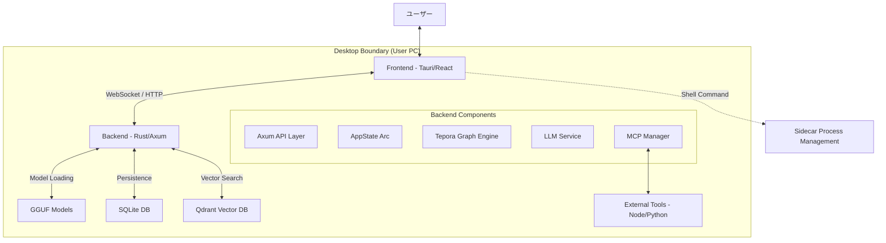
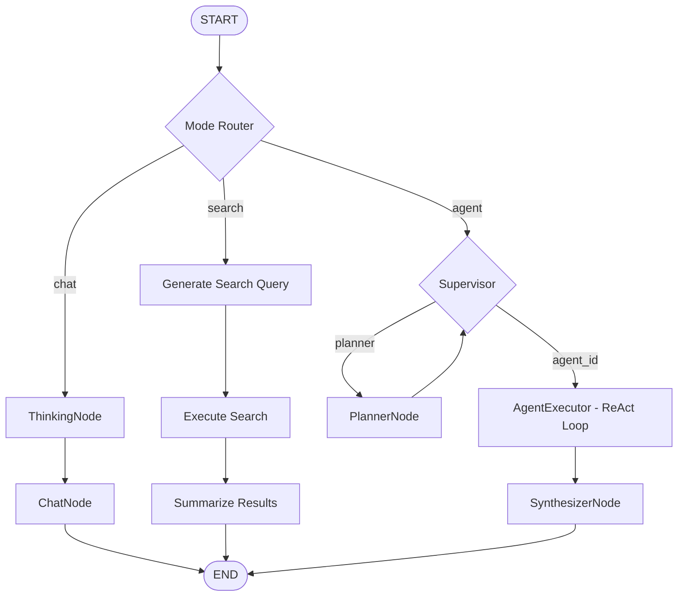
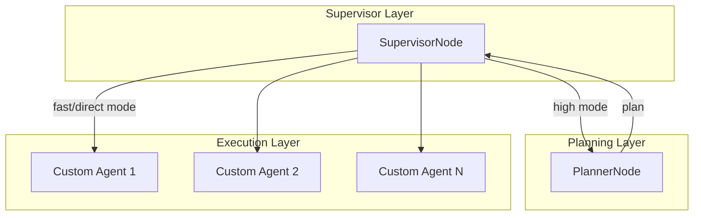
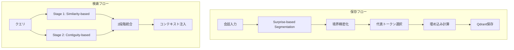

# Tepora Project - アーキテクチャ仕様書

**ドキュメントバージョン**: 4.1
**アプリケーションバージョン**: 3.0 (Beta) (v0.3.0)
**最終更新日**: 2026-02-13
**対象**: Rust Backend + React Frontend

---

## 📋 目次

1. [プロジェクト概要](#1-プロジェクト概要)
2. [システムアーキテクチャ](#2-システムアーキテクチャ)
3. [技術スタック](#3-技術スタック)
4. [ディレクトリ構造](#4-ディレクトリ構造)
5. [バックエンドアーキテクチャ](#5-バックエンドアーキテクチャ-rust)
6. [フロントエンドアーキテクチャ](#6-フロントエンドアーキテクチャ)
7. [データフロー](#7-データフロー)
8. [API仕様](#8-api仕様)
9. [設定システム](#9-設定システム)
10. [セキュリティ](#10-セキュリティ)
11. [品質保証](#11-品質保証)
12. [補足](#12-補足)

---

## 1. プロジェクト概要

### ビジョン

**"Local-First, Privacy-Centric AI Agent"**

Teporaは、ユーザーのローカル環境で完結し、プライバシーを最優先にしたデスクトップAIエージェントです。高度な記憶システム (EM-LLM) と自律的なタスク実行能力を持ちながら、外部クラウドに依存しない安心感を提供します。

### プロジェクト名

**Tepora（テポラ）** - イタリア語の"Tepore"（温かみ）と"ora"（現在）を組み合わせた造語。紅茶・喫茶店をテーマにした、温かみのあるAIパートナーを表現しています。

### コアコンセプト

| コンセプト                   | 説明                                                            |
| ---------------------------- | --------------------------------------------------------------- |
| **Local First**        | プライバシー最優先。データも推論もすべてローカル完結            |
| **Rust Backend**       | Python版から完全移行。安全性、並行性、パフォーマンス最大化      |
| **Graph Architecture** | `petgraph` ベースのステートマシンでエージェント思考をモデル化 |
| **Modern Frontend**    | React 19 + Tauri v2 によるネイティブライクな操作感              |

### 主要機能

| 機能                      | 説明                                                               |
| ------------------------- | ------------------------------------------------------------------ |
| **3つの動作モード** | Chat（AIとの自由対話）/ Search（Web検索+RAG）/ Agent（ツール使用） |
| **EM-LLM**          | ICLR 2025採択論文に基づくエピソード記憶システム                    |
| **MCP対応**         | Model Context Protocolによる拡張可能なツールシステム               |
| **RAG**             | Retrieval-Augmented Generationによるコンテキスト拡張               |
| **ペルソナ**        | 複数のキャラクター・ペルソナの切り替え                             |

---

## 2. システムアーキテクチャ

Teporaは **Tauri** を用いたハイブリッドアプリケーションです。UIスレッドとバックエンドロジックは分離されており、ローカルホスト上のHTTP/WebSocketで通信します。

### 全体構成図



### モジュール依存関係


> [!IMPORTANT]
> **依存ルール**: 下位レイヤーは上位レイヤーをインポートしない。`config` と `state` は基盤モジュールとして全てからアクセス可能。

### アーキテクチャ階層

| 層                           | 技術                     | 役割                                       |
| ---------------------------- | ------------------------ | ------------------------------------------ |
| **プレゼンテーション** | Tauri + React            | UIレンダリング、ユーザー操作               |
| **状態管理**           | Zustand + TanStack Query | クライアント状態 + サーバー状態/キャッシュ |
| **通信**               | WebSocket + REST         | リアルタイム双方向通信 + API               |
| **アプリケーション**   | Axum                     | エンドポイント、ルーティング               |
| **ビジネスロジック**   | petgraph + GraphRuntime  | ステートマシン、エージェント制御           |
| **データアクセス**     | sqlx + Qdrant            | リレーショナル + ベクトル検索              |
| **推論エンジン**       | llama.cpp                | LLM推論処理                                |

---

## 3. 技術スタック

### バックエンド

| カテゴリ                    | 技術                | 用途                       |
| --------------------------- | ------------------- | -------------------------- |
| **言語**              | Rust (2021 edition) | コアロジック               |
| **Webフレームワーク** | Axum                | HTTP/WebSocket サーバー    |
| **非同期ランタイム**  | Tokio               | 非同期処理                 |
| **グラフエンジン**    | petgraph            | エージェントステートマシン |
| **データベース**      | sqlx (SQLite)       | リレーショナルデータ永続化 |
| **ベクトルDB**        | Qdrant              | ベクトル検索 (Memory/RAG)  |
| **シリアライズ**      | serde / serde_json  | JSON処理                   |
| **HTTP Client**       | reqwest             | 外部API呼び出し            |

### フロントエンド

| カテゴリ                 | 技術           | バージョン | 用途                    |
| ------------------------ | -------------- | ---------- | ----------------------- |
| **フレームワーク** | React          | 19.x       | UIコンポーネント        |
| **言語**           | TypeScript     | 5.x        | 型安全性                |
| **アプリシェル**   | Tauri          | 2.x        | デスクトップアプリ化    |
| **状態管理**       | Zustand        | 5.x        | クライアント状態        |
| **データフェッチ** | TanStack Query | 5.x        | サーバー状態/キャッシュ |
| **スタイリング**   | Tailwind CSS   | 4.x        | ユーティリティCSS       |
| **ルーティング**   | React Router   | 7.x        | SPA routing             |
| **ビルドツール**   | Vite           | 7.x        | 高速ビルド              |

### AIモデル

| カテゴリ             | モデル例                                  | 用途              | 推奨サイズ       |
| -------------------- | ----------------------------------------- | ----------------- | ---------------- |
| **Text Model** | Gemma 3n E2B/4B, Ministral 3B, Phi-4 Mini | 対話/エージェント | 2B - 4B (IQ4_XS) |
| **Embedding**  | EmbeddingGemma                            | ベクトル埋め込み  | 300M (Q8_0)      |

---

## 4. ディレクトリ構造

### プロジェクトルート

```
Tepora_Project/
├── Tepora-app/                 # アプリケーション本体
│   ├── backend-rs/             # Rust バックエンド
│   └── frontend/               # React フロントエンド
├── docs/                       # ドキュメント
│   ├── architecture/           # アーキテクチャ設計（本書）
│   ├── guides/                 # 開発ガイド
│   └── legacy/                 # 旧Python版資料
├── scripts/                    # ビルドスクリプト
├── Taskfile.yml                # タスクランナー
└── README.md
```

### バックエンド構造 (`Tepora-app/backend-rs/`)

```
backend-rs/
├── src/
│   ├── main.rs                 # エントリーポイント
│   ├── api.rs                  # REST API ルート定義
│   ├── ws.rs                   # WebSocket ハンドラ
│   ├── state.rs                # AppState (アプリケーション状態)
│   ├── config.rs               # 設定管理 (ConfigService, AppPaths)
│   │
│   ├── graph/                  # ========== グラフエンジン ==========
│   │   ├── mod.rs              # モジュール公開
│   │   ├── runtime.rs          # GraphRuntime (実行エンジン)
│   │   ├── builder.rs          # GraphBuilder (構築ヘルパー)
│   │   ├── state.rs            # AgentState 定義
│   │   ├── node.rs             # Node トレイト定義
│   │   └── nodes/              # ノード実装
│   │       ├── chat.rs         # ChatNode (直接対話)
│   │       ├── search.rs       # SearchNode (検索+要約)
│   │       ├── thinking.rs     # ThinkingNode (CoT)
│   │       ├── supervisor.rs   # SupervisorNode (ルーティング)
│   │       ├── planner.rs      # PlannerNode (計画立案)
│   │       ├── agent_executor.rs # AgentExecutor (ReActループ)
│   │       ├── synthesizer.rs  # SynthesizerNode (最終応答生成)
│   │       ├── router.rs       # RouterNode (モード分岐)
│   │       └── tool.rs         # ToolNode (ツール実行)
│   │
│   ├── llama.rs                # LlamaService (推論サーバー管理)
│   ├── mcp.rs                  # McpManager (MCP接続管理)
│   ├── mcp_registry.rs         # MCPサーバーカタログ
│   ├── mcp_installer.rs        # MCPサーバーインストーラー
│   ├── models.rs               # ModelManager (モデル管理)
│   ├── history.rs              # HistoryStore (チャット履歴)
│   ├── search.rs               # 検索エンジン統合
│   ├── tooling.rs              # ToolManager (ツール管理)
│   ├── security.rs             # 認証・セキュリティ
│   ├── setup_state.rs          # セットアップ状態管理
│   │
│   ├── context/                # コンテキスト管理
│   ├── em_llm/                 # EM-LLM (エピソード記憶)
│   ├── memory/                 # メモリシステム
│   ├── rag/                    # RAG エンジン
│   └── a2a/                    # Agent-to-Agent (将来)
│
└── Cargo.toml
```

### フロントエンド構造 (`Tepora-app/frontend/`)

```
frontend/
├── package.json
├── vite.config.ts
├── tailwind.config.cjs
├── public/
│   └── locales/                # 翻訳 (en, ja, es, zh)
│
├── src/
│   ├── main.tsx                # エントリーポイント
│   ├── App.tsx                 # ルートコンポーネント
│   ├── index.css               # グローバルスタイル
│   ├── i18n.ts                 # 国際化設定
│   │
│   ├── stores/                 # ========== Zustand状態管理 ==========
│   │   ├── chatStore.ts        # チャット状態 (メッセージ、ストリーミング)
│   │   ├── sessionStore.ts     # セッション状態
│   │   └── websocketStore.ts   # WebSocket接続状態
│   │
│   ├── features/               # ========== Feature-Sliced Design ==========
│   │   ├── chat/               # チャット機能
│   │   ├── settings/           # 設定画面
│   │   ├── session/            # セッション管理
│   │   └── navigation/         # ナビゲーション
│   │
│   ├── components/             # 共有UIコンポーネント
│   ├── hooks/                  # カスタムフック
│   ├── utils/                  # ユーティリティ
│   ├── types/                  # 型定義
│   ├── context/                # React Context
│   └── pages/                  # ページコンポーネント
│
└── src-tauri/                  # Tauri設定
    ├── tauri.conf.json
    ├── capabilities/           # 権限設定
    ├── icons/                  # アプリアイコン
    └── src/                    # Tauri Rust エントリポイント
```

---

## 5. バックエンドアーキテクチャ (Rust)

バックエンドは **Axum** をベースにした非同期Webサーバーとして動作します。

### 5.1 AppState (アプリケーション状態)

`Arc<AppState>` にカプセル化され、全APIハンドラとバックグラウンドタスクで共有されます。

**ファイル**: `src/state.rs`

```rust
pub struct AppState {
    pub paths: Arc<AppPaths>,        // パス設定
    pub config: ConfigService,       // 設定ファイルの読み書き
    pub session_token: SessionToken, // セッショントークン
    pub history: HistoryStore,       // SQLiteへのチャット履歴アクセス
    pub llama: LlamaService,         // 推論サーバー管理
    pub mcp: McpManager,             // MCPクライアント管理
    pub mcp_registry: McpRegistry,   // MCPサーバーカタログ
    pub models: ModelManager,        // モデル管理
    pub setup: SetupState,           // セットアップ状態
    pub started_at: DateTime<Utc>,   // 起動時刻
}
```

### 5.2 グラフエンジン (`src/graph/`)

Python版 LangGraph の概念を Rust ネイティブな `petgraph` で再実装しました。

#### GraphRuntime

任意の `Node` 実装をつなぎ合わせ、状態遷移を管理するエンジンです。

**ファイル**: `src/graph/runtime.rs`

```rust
pub struct GraphRuntime {
    graph: DiGraph<Box<dyn Node>, EdgeCondition>,
    name_to_index: HashMap<String, NodeIndex>,
    entry_node: Option<String>,
    max_steps: usize,
}
```

**EdgeCondition (遷移条件)**:

| 条件                                   | 説明                           |
| -------------------------------------- | ------------------------------ |
| `EdgeCondition::Always`              | 無条件遷移（デフォルトエッジ） |
| `EdgeCondition::OnCondition(String)` | ノード出力に基づく条件分岐     |

**主要メソッド**:

| メソッド                                      | 説明                 |
| --------------------------------------------- | -------------------- |
| `add_node(node)`                            | ノードをグラフに追加 |
| `add_edge(from, to)`                        | 無条件エッジを追加   |
| `add_conditional_edge(from, to, condition)` | 条件付きエッジを追加 |
| `run(state, ctx)`                           | グラフを実行         |

#### AgentState (グラフ状態)

グラフ実行中に各ノード間で共有されるデータ構造です。

**ファイル**: `src/graph/state.rs`

```rust
pub struct AgentState {
    // Session Identity
    pub session_id: String,
  
    // Core Messaging
    pub input: String,
    pub mode: Mode,                        // Chat | Search | Agent
    pub chat_history: Vec<ChatMessage>,
  
    // Hierarchical Agent Routing
    pub agent_id: Option<String>,          // UI選択のエージェント
    pub agent_mode: AgentMode,             // Fast | High | Direct
    pub selected_agent_id: Option<String>, // Supervisorが選択
    pub supervisor_route: Option<SupervisorRoute>,
  
    // Shared Context for Agents
    pub shared_context: SharedContext,     // Artifacts, Notes, Plans
  
    // Agent ReAct Loop State
    pub agent_scratchpad: Vec<ChatMessage>,
    pub agent_outcome: Option<String>,
  
    // Thinking Mode (CoT)
    pub thinking_enabled: bool,
    pub thought_process: Option<String>,
  
    // Search Mode State
    pub search_queries: Vec<String>,
    pub search_results: Option<Vec<SearchResult>>,
    pub search_attachments: Vec<Value>,
    pub skip_web_search: bool,
  
    // Generation Metadata
    pub generation_logprobs: Option<Value>,
  
    // Final Output
    pub output: Option<String>,
    pub error: Option<String>,
}
```

**SharedContext構造**:

```rust
pub struct SharedContext {
    pub current_plan: Option<String>,      // Plannerが生成した計画
    pub artifacts: Vec<Artifact>,          // コードスニペット、検索結果等
    pub notes: Vec<String>,                // エージェント用スクラッチパッド
    pub professional_memory: Option<String>, // プロフェッショナルメモリ
}
```

#### グラフフロー



### 5.3 ノード詳細

| ノード              | ファイル                    | 責務                                        |
| ------------------- | --------------------------- | ------------------------------------------- |
| `RouterNode`      | `nodes/router.rs`         | 入力モードに基づいてChat/Search/Agentに分岐 |
| `ThinkingNode`    | `nodes/thinking.rs`       | CoT（Chain of Thought）思考プロセス生成     |
| `ChatNode`        | `nodes/chat.rs`           | LLMに対して直接対話応答を生成               |
| `SearchNode`      | `nodes/search.rs`         | Web検索実行 → 再ランク → LLM要約          |
| `SupervisorNode`  | `nodes/supervisor.rs`     | 階層的ルーティング（Planner or Agent）      |
| `PlannerNode`     | `nodes/planner.rs`        | タスク計画の立案                            |
| `AgentExecutor`   | `nodes/agent_executor.rs` | ReActループでツールを実行                   |
| `ToolNode`        | `nodes/tool.rs`           | 個別ツールの実行                            |
| `SynthesizerNode` | `nodes/synthesizer.rs`    | エージェント結果から最終応答を生成          |

### 5.4 階層的マルチエージェントアーキテクチャ

`agent` モードでは、階層的マルチエージェントアーキテクチャを採用しています。



**AgentMode (ルーティングモード)**:

| モード     | 動作                                                    |
| ---------- | ------------------------------------------------------- |
| `high`   | 必ずPlannerを経由して計画を立ててからCustom Agentを実行 |
| `fast`   | SupervisorがLLMで判断。単純→直接Agent、複雑→Plannerへ |
| `direct` | 指定されたCustom Agentに直接ルーティング                |

### 5.5 Thinking Mode (CoT)

複雑な推論を必要とするリクエストに対して **Thinking Mode** をサポートしています。

- **動作**: `ThinkingNode` が最終回答の前に実行され、ステップバイステップの思考プロセスを生成
- **統合**: 生成された思考プロセスは `AgentState.thought_process` に保存
- **制御**: クライアントからのリクエストパラメータ `thinking_mode: true` で有効化

### 5.6 LlamaService

**ファイル**: `src/llama.rs`

llama.cpp (llama-server) プロセスを管理するサービスです。

```rust
pub struct LlamaService {
    paths: Arc<AppPaths>,
    process: Arc<Mutex<Option<Child>>>,
    port: AtomicU16,
}
```

**責務**:

- llama-serverプロセスの起動・停止
- GGUFモデルのロード
- Chat Completions API の提供
- ヘルスチェック

### 5.7 MCP (Model Context Protocol)

TeporaはMCPクライアントとして動作し、外部のMCPサーバー（`git`, `filesystem` など）と接続します。

**ファイル**: `src/mcp.rs`, `src/mcp_registry.rs`, `src/mcp_installer.rs`

| コンポーネント    | 責務                                       |
| ----------------- | ------------------------------------------ |
| `McpManager`    | MCP接続のライフサイクル管理                |
| `McpRegistry`   | 利用可能なMCPサーバーのカタログ管理        |
| `mcp_installer` | `npm` / `pip` を使った自動インストール |

### 5.8 EM-LLM (エピソード記憶)

ICLR 2025採択論文「EM-LLM」の実装。人間のエピソード記憶をLLMで再現します。

**ファイル**: `src/em_llm/`



---

## 6. フロントエンドアーキテクチャ

モダンなReactエコシステムを採用し、**Feature-Sliced Design** の軽量版構成を取っています。

### 6.1 状態管理

フロントエンドは **Zustand** と **TanStack Query** を組み合わせた状態管理を採用しています。


### 6.2 chatStore

**ファイル**: `src/stores/chatStore.ts`

```typescript
interface ChatState {
  // メッセージ
  messages: Message[];
  isProcessing: boolean;
  error: string | null;
  
  // アクティビティログ（エージェント処理表示用）
  activityLog: AgentActivity[];
  
  // 検索結果
  searchResults: SearchResult[];
  
  // メモリ統計
  memoryStats: MemoryStats | null;
  
  // ストリーミングバッファ（内部）
  _streamBuffer: string;
  _streamMetadata: StreamingMetadata | null;
}

interface ChatActions {
  addMessage: (message: Message) => void;
  addUserMessage: (content: string, mode: ChatMode, attachments?: Attachment[]) => void;
  
  // Streaming
  handleStreamChunk: (content: string, metadata?: StreamingMetadata) => void;
  flushStreamBuffer: () => void;
  finalizeStream: () => void;
  
  // Activity
  updateActivity: (activity: AgentActivity) => void;
  clearActivityLog: () => void;
  
  reset: () => void;
}
```

**ストリーミングロジック**:

- 50ms間隔でバッファをフラッシュし、UIの再描画回数を抑制
- `ThinkingNode` から `ChatNode` へのモード切り替え時も、ストリームを途切れさせずに結合

### 6.3 sessionStore

**ファイル**: `src/stores/sessionStore.ts`

```typescript
interface SessionState {
  sessions: Session[];
  currentSessionId: string | null;
  isLoading: boolean;
}

interface SessionActions {
  setSessions: (sessions: Session[]) => void;
  setCurrentSessionId: (id: string | null) => void;
  addSession: (session: Session) => void;
  updateSession: (id: string, updates: Partial<Session>) => void;
  removeSession: (id: string) => void;
}
```

### 6.4 websocketStore

**ファイル**: `src/stores/websocketStore.ts`

```typescript
interface WebSocketState {
  isConnected: boolean;
  isConnecting: boolean;
  error: string | null;
  socket: WebSocket | null;
  pendingToolConfirmation: ToolConfirmation | null;
}

interface WebSocketActions {
  connect: (url: string, token: string) => void;
  disconnect: () => void;
  sendMessage: (message: WebSocketMessage) => void;
  setSession: (sessionId: string) => void;
  stopGeneration: () => void;
  confirmTool: (requestId: string, approved: boolean) => void;
}
```

### 6.5 機能ディレクトリ (`features/`)

| ディレクトリ             | 責務                                                   |
| ------------------------ | ------------------------------------------------------ |
| `features/chat/`       | メッセージリスト、入力エリア、マークダウンレンダリング |
| `features/settings/`   | 設定パネル、モデル管理、MCP管理UI                      |
| `features/session/`    | セッション履歴管理                                     |
| `features/navigation/` | サイドバー、レイアウト                                 |

### 6.6 主要コンポーネント

| コンポーネント    | 責務                             |
| ----------------- | -------------------------------- |
| `ChatInterface` | チャットビュー全体の制御         |
| `MessageList`   | メッセージリストの表示           |
| `MessageBubble` | 個別メッセージの表示             |
| `InputArea`     | テキスト入力＋添付ファイル       |
| `DialControl`   | Chat / Search / Agent モード切替 |
| `AgentStatus`   | エージェント処理状態の表示       |
| `SetupWizard`   | 初期セットアップフロー           |

### 6.7 サイドカー連携

Tauriのサイドカー機能により、アプリ起動時にRustバックエンドを自動的に子プロセスとして立ち上げます。

- フロントエンドは `localhost` の動的ポートに対してAPIリクエストを行います
- `src/utils/sidecar.ts` が起動プロセスとポート検知を担当

---

## 7. データフロー

### メッセージ処理フロー


---

## 8. API仕様

### 8.1 WebSocket

**接続**:

```
ws://127.0.0.1:{port}/ws?token={session_token}
```

**クライアント → サーバー**:

| type                           | 説明           | ペイロード                                                                    |
| ------------------------------ | -------------- | ----------------------------------------------------------------------------- |
| `message`                    | 通常メッセージ | `{ message, mode, sessionId, attachments?, skipWebSearch?, thinkingMode? }` |
| `stop`                       | 実行キャンセル | `{}`                                                                        |
| `get_stats`                  | メモリ統計要求 | `{}`                                                                        |
| `set_session`                | セッション切替 | `{ sessionId }`                                                             |
| `tool_confirmation_response` | ツール承認応答 | `{ requestId, approved }`                                                   |

**サーバー → クライアント**:

| type                          | 説明               | ペイロード                                      |
| ----------------------------- | ------------------ | ----------------------------------------------- |
| `chunk`                     | ストリーミング応答 | `{ message, mode?, nodeId?, agentName? }`     |
| `status`                    | 処理状態更新       | `{ status, message }`                         |
| `activity`                  | ノード進捗         | `{ data: { id, status, message } }`           |
| `history`                   | チャット履歴       | `{ messages: [...] }`                         |
| `search_results`            | 検索結果           | `{ data: [...] }`                             |
| `tool_confirmation_request` | ツール承認要求     | `{ data: { requestId, toolName, toolArgs } }` |
| `done`                      | 処理完了           | `{}`                                          |
| `error`                     | エラー             | `{ message }`                                 |
| `stats`                     | メモリ統計         | `{ data: {...} }`                             |

### 8.2 REST API

#### 基本API

| メソッド  | エンドポイント           | 説明                   |
| --------- | ------------------------ | ---------------------- |
| `GET`   | `/health`              | ヘルスチェック         |
| `GET`   | `/api/status`          | システムステータス     |
| `GET`   | `/api/config`          | 設定取得               |
| `POST`  | `/api/config`          | 設定更新（全体）       |
| `PATCH` | `/api/config`          | 設定更新（部分）       |
| `GET`   | `/api/logs`            | ログファイル一覧       |
| `GET`   | `/api/logs/{filename}` | ログ内容取得           |
| `POST`  | `/api/shutdown`        | サーバーシャットダウン |

#### セッションAPI

| メソッド   | エンドポイント                  | 説明               |
| ---------- | ------------------------------- | ------------------ |
| `GET`    | `/api/sessions`               | セッション一覧     |
| `POST`   | `/api/sessions`               | 新規セッション作成 |
| `GET`    | `/api/sessions/{id}`          | セッション詳細     |
| `PATCH`  | `/api/sessions/{id}`          | セッション名更新   |
| `DELETE` | `/api/sessions/{id}`          | セッション削除     |
| `GET`    | `/api/sessions/{id}/messages` | メッセージ履歴取得 |

#### MCP API

| メソッド   | エンドポイント                      | 説明                               |
| ---------- | ----------------------------------- | ---------------------------------- |
| `GET`    | `/api/mcp/status`                 | 接続ステータス                     |
| `GET`    | `/api/mcp/config`                 | MCP設定取得                        |
| `POST`   | `/api/mcp/config`                 | MCP設定更新                        |
| `GET`    | `/api/mcp/store`                  | レジストリ（利用可能サーバー一覧） |
| `GET`    | `/api/mcp/policy`                 | 接続ポリシー                       |
| `PATCH`  | `/api/mcp/policy`                 | ポリシー更新                       |
| `POST`   | `/api/mcp/install/preview`        | インストールプレビュー             |
| `POST`   | `/api/mcp/install/confirm`        | インストール確認                   |
| `POST`   | `/api/mcp/servers/{name}/enable`  | サーバー有効化                     |
| `POST`   | `/api/mcp/servers/{name}/disable` | サーバー無効化                     |
| `DELETE` | `/api/mcp/servers/{name}`         | サーバー削除                       |

#### セットアップAPI

| メソッド   | エンドポイント                | 説明                       |
| ---------- | ----------------------------- | -------------------------- |
| `POST`   | `/api/setup/init`           | セットアップ初期化         |
| `POST`   | `/api/setup/preflight`      | 事前チェック（容量・権限） |
| `GET`    | `/api/setup/requirements`   | 要件チェック               |
| `GET`    | `/api/setup/default-models` | 推奨モデルリスト           |
| `POST`   | `/api/setup/run`            | セットアップ開始           |
| `GET`    | `/api/setup/progress`       | 進捗確認                   |
| `POST`   | `/api/setup/finish`         | セットアップ完了           |
| `GET`    | `/api/setup/models`         | 利用可能モデル一覧         |
| `POST`   | `/api/setup/model/download` | モデルダウンロード         |
| `DELETE` | `/api/setup/model/{id}`     | モデル削除                 |

---

## 9. 設定システム

### 設定ファイル構成


### config.yml 主要セクション

```yaml
app:
  max_input_length: 10000
  graph_recursion_limit: 50
  tool_execution_timeout: 120
  tool_approval_timeout: 300
  web_fetch_max_chars: 6000
  language: "ja"

server:
  host: "127.0.0.1"

tools:
  google_search_api_key: "YOUR_KEY"
  google_search_engine_id: "YOUR_CX"
  bing_api_key: "YOUR_KEY"
  brave_api_key: "YOUR_KEY"

privacy:
  allow_web_search: false
  redact_pii: true

llm:
  loader: "llama_cpp"
  health_check_timeout: 60

models_gguf:
  gemma_3n:
    path: "models/gemma-3n-E4B-it-IQ4_XS.gguf"
    port: 8088
    n_ctx: 8192
    n_gpu_layers: -1

em_llm:
  surprise_gamma: 1.0
  total_retrieved_events: 4

characters:
  bunny_girl:
    name: "Bunny Girl"
    system_prompt: "..."

custom_agents:
  my_agent:
    id: "agent-001"
    name: "My Custom Agent"
    system_prompt: "..."
    enabled: true
```

### 実行時データ配置

```
USER_DATA_DIR/
├── config.yml              # ユーザー設定
├── tepora_core.db          # SQLite: チャット履歴
├── logs/                   # アプリログ
└── config/
    └── mcp_tools_config.json   # MCP接続設定
```

**OS別データディレクトリ**:

- Windows: `%LOCALAPPDATA%\Tepora`
- macOS: `~/Library/Application Support/Tepora`
- Linux: `~/.local/share/tepora`

---

## 10. セキュリティ

### 認証

| 対象                 | 方式                       | 説明                    |
| -------------------- | -------------------------- | ----------------------- |
| **REST API**   | `x-api-key` ヘッダー     | 機密操作に必須          |
| **WebSocket**  | クエリパラメータ `token` | 接続時に認証            |
| **Origin検証** | Allowlist                  | WebSocketのOriginを検証 |

> [!NOTE]
> `TEPORA_ENV=development` の場合、トークン検証はスキップされます。

### MCPセキュリティ

| 機能                           | 説明                                                      |
| ------------------------------ | --------------------------------------------------------- |
| **2段階インストール**    | preview → confirm の2段階フロー                          |
| **デフォルト無効**       | 新規インストールサーバーはデフォルトで無効状態            |
| **接続ポリシー**         | デフォルトは `LOCAL_ONLY`（ローカルサーバー/stdioのみ） |
| **ツール承認**           | MCPツールはセッション初回使用時にユーザー承認が必要       |
| **危険コマンドブロック** | `sudo` 等の危険コマンドはブロック                       |

### プライバシー保護

| 機能                       | 説明                                   |
| -------------------------- | -------------------------------------- |
| **PII保護**          | 外部通信前に個人情報を自動リダクション |
| **ローカル処理**     | 全LLM処理はローカルで完結              |
| **ログリダクション** | ログファイルからもPIIを削除            |

### モデルダウンロードセキュリティ

| 機能                     | 説明                                              |
| ------------------------ | ------------------------------------------------- |
| **Allowlist**      | 許可されたリポジトリ/オーナーからのみダウンロード |
| **リビジョン固定** | 特定リビジョンを指定（タンパリング防止）          |
| **SHA256検証**     | 提供時はハッシュ検証を実行                        |
| **未登録警告**     | Allowlist外は警告 + 同意を必須化                  |

---

## 11. 品質保証

### 品質ゲート構成

1. **ローカル開発 (Pre-commit)**

   - コミット時にフォーマット、Lint、基本検証を自動実行
2. **検証フェーズ (Task Runner)**

   - `task quality`: 全体の品質チェック
   - `task quality:fix`: 自動修正を含むチェック
3. **CI/CD (GitHub Actions)**

   - プルリクエストおよびプッシュ時に厳格な検証

### 採用ツール

| 領域               | ツール           | 目的                            |
| ------------------ | ---------------- | ------------------------------- |
| **Backend**  | cargo clippy     | Rustコードの静的解析            |
| **Backend**  | cargo fmt        | コードフォーマット              |
| **Backend**  | cargo test       | ユニットテスト                  |
| **Frontend** | Biome            | 高速Lint/フォーマット           |
| **Frontend** | TypeScript (tsc) | 型安全性チェック                |
| **Security** | cargo audit      | Rust依存関係の脆弱性スキャン    |
| **Security** | npm audit        | Node.js依存関係の脆弱性スキャン |

### 開発コマンド

```bash
# 開発モード起動 (Frontend + Sidecar)
task dev

# バックエンドのみ開発起動 (Watch mode)
task dev:backend

# 品質チェック (Format, Lint, Test)
task quality
```

---

## 12. 補足

### Python版からRust版への主な変更点

| 項目                        | Python版     | Rust版                   |
| --------------------------- | ------------ | ------------------------ |
| **言語**              | Python 3.10+ | Rust 2021                |
| **Webフレームワーク** | FastAPI      | Axum                     |
| **グラフエンジン**    | LangGraph    | petgraph (自前実装)      |
| **LLM統合**           | LangChain    | 直接HTTP (llama.cpp API) |
| **ベクトルDB**        | ChromaDB     | Qdrant                   |
| **パッケージ管理**    | uv / pip     | Cargo                    |
| **バイナリ配布**      | PyInstaller  | ネイティブバイナリ       |

### 今後の拡張予定

- **A2A Protocol**: Agent-to-Agent通信機能
- **Session-Scoped RAG**: メタデータフィルタリングによるセッション分離
- **Ollama対応**: Ollamaバックエンドのサポート

---

*本ドキュメントは Tepora Project の技術仕様を定義しています。*
