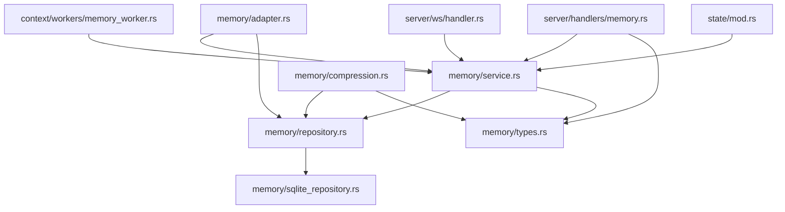

# メモリシステム アーキテクチャ

**最終更新**: 2026-03-18
**バージョン**: v0.4.5

---

## 1. 概要

Tepora のエピソード記憶は、`src/infrastructure/episodic_store/memory/` に統合された単一モジュールとして実装されている。
このモジュールは EM-LLM の形成・検索アルゴリズムと FadeMem の減衰・層管理をまとめて提供し、永続化には SQLite ベースの `MemoryRepository` を使用する。

外部互換は維持しており、REST `/api/memory/*`、WebSocket payload、フロントエンド契約、設定キー `em_llm.*`、DB テーブル `memory_events` / `memory_edges` / `memory_compaction_*` は継続利用する。

---

## 2. モジュール一覧と責務

| モジュール | パス | ステータス | 責務 |
|-----------|------|-----------|------|
| `memory` | `src/infrastructure/episodic_store/memory/` | **現行（Active）** | EM-LLM × FadeMem の統合実装。取り込み・検索・減衰・圧縮・永続化・v1テーブル退役を提供 |

### 2.1 `memory/`（現行）

| サブモジュール | 責務 |
|---------------|------|
| `service.rs` | `MemoryService`。メモリ保存・検索・減衰・統計・バックグラウンド処理の主ファサード |
| `repository.rs` | `MemoryRepository` trait と検索用スコア型 |
| `sqlite_repository.rs` | SQLite 実装。`memory_*` テーブル管理と旧 `episodic_events` 退役処理を担当 |
| `adapter.rs` | `MemoryAdapter` / `UnifiedMemoryAdapter`。ドメインポートとの橋渡し |
| `types.rs` | `MemoryEvent`, `MemoryScope`, `MemoryLayer`, `EMConfig`, `DecayConfig` など共有型の正本 |
| `boundary.rs` | イベント境界の精緻化 |
| `segmenter.rs` | イベントセグメンテーション |
| `retrieval.rs` | 二段階検索（意味的 + 連続性） |
| `ranking.rs` | 検索再スコアリング |
| `decay.rs` | FadeMem 減衰エンジン |
| `compression.rs` | 手動圧縮・コンパクション |
| `integrator.rs` | EM-LLM 統合ロジック |
| `sentence.rs` | 文分割ユーティリティ |
| `tests.rs` | リポジトリ・アルゴリズム統合テスト入口 |

---

## 3. 依存関係

**主要な依存フロー:**

1. **リクエスト受信** → `server/handlers/memory.rs` または `server/ws/handler.rs`
2. **コンテキスト構築** → `context/workers/memory_worker.rs`
3. **メモリサービス呼び出し** → `memory/service.rs`（`MemoryService`）
4. **永続化** → `memory/sqlite_repository.rs`（`SqliteMemoryRepository`）

---

## 4. 統合完了状態

2026-03-18 時点で、メモリ再設計の実装統合は完了している。

| 項目 | 内容 | ステータス |
|------|------|-----------|
| 形成パイプライン | EM-LLM の segmentation / refinement / retrieval / integration を本番経路で利用 | ✅ 完了 |
| 永続化 | SQLite ベースの `MemoryRepository` / `SqliteMemoryRepository` に統一 | ✅ 完了 |
| FadeMem | `MemoryLayer`、減衰、強化、手動圧縮を単一モジュールに集約 | ✅ 完了 |
| v1 退役 | 旧 `episodic_events` の退役と退役テーブル自動クリーンアップを実装 | ✅ 完了 |
| モジュール統合 | 旧 `em_llm` / `memory_v2` を廃止し、`memory` を唯一の実装入口に整理 | ✅ 完了 |

---

## 5. 関連ファイル

- `src/infrastructure/episodic_store/memory/mod.rs` — メモリ実装の公開入口
- `src/state/mod.rs` — `MemoryService` を `AppState` に保持
- `src/server/handlers/memory.rs` — メモリ関連 API ハンドラー
- `src/server/ws/handler.rs` — WebSocket 経由のメモリ操作
- `src/context/workers/memory_worker.rs` — コンテキストパイプラインのメモリ取得

---

*本ドキュメントは、統合後の単一メモリ実装の責務と依存関係を記録する。*
