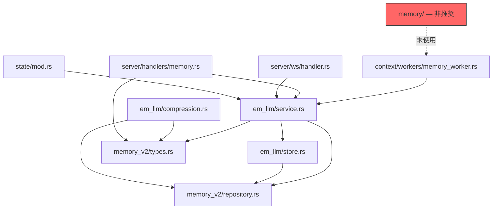

# メモリシステム アーキテクチャ

**最終更新**: 2026-02-26  
**バージョン**: v0.4.0

---

## 1. 概要

Tepora のバックエンドには、メモリ関連の処理を担う3つのモジュールが存在する。
本ドキュメントは、各モジュールの責務・依存関係・運用ステータスを明確にし、
段階的な統合計画を記録するものである。

---

## 2. モジュール一覧と責務

| モジュール | パス | ステータス | 責務 |
|-----------|------|-----------|------|
| `memory` | `src/memory/` | **非推奨（Deprecated）** | ベクトルストア抽象層（VectorStore trait）+ LanceDB実装 |
| `em_llm` | `src/em_llm/` | **現行（Active）** | EM-LLM エピソード記憶サービス本体。イベント分割・圧縮・減衰・検索・統合を実装 |
| `memory_v2` | `src/memory_v2/` | **現行（Active）** | 再設計された永続化層。SQLite ベースのリポジトリ + 型定義 |

### 2.1 `memory/`（非推奨）

- `VectorStore` trait による抽象化と `LanceDbVectorStore` (旧Qdrant) 実装
- `MemorySystem<V>` によるエピソード記憶の CRUD
- **現在どのモジュールからも使用されていない**
- v0.5.0 で削除予定

### 2.2 `em_llm/`（現行）

ICLR 2025 論文 "Human-inspired Episodic Memory for Infinite Context LLMs" に基づく実装。

| サブモジュール | 責務 |
|---------------|------|
| `service.rs` | メモリサービスの主ファサード。イベント保存・検索・バックグラウンド処理 |
| `store.rs` | イベントストア（内部で `memory_v2::SqliteMemoryRepository` を利用） |
| `boundary.rs` | イベント境界の精緻化 |
| `compression.rs` | メモリ圧縮・コンパクション |
| `decay.rs` | 時間減衰エンジン |
| `retrieval.rs` | 二段階検索（意味的 + 時間的） |
| `segmenter.rs` | イベントセグメンテーション |
| `integrator.rs` | EM-LLM 統合ロジック |
| `sentence.rs` | 文レベル処理ユーティリティ |
| `types.rs` | EM設定・エピソードイベント型 |

### 2.3 `memory_v2/`（現行）

EM-LLM × FadeMem の再設計に基づくデータ永続化層。

| サブモジュール | 責務 |
|---------------|------|
| `repository.rs` | `MemoryRepository` trait 定義 |
| `sqlite_repository.rs` | SQLite 実装（主ストレージ） |
| `types.rs` | `MemoryEvent`, `MemoryLayer`, `CompactionJob` 等の型 |
| `tests.rs` | リポジトリのユニットテスト |

---

## 3. 依存関係

**主要な依存フロー:**

1. **リクエスト受信** → `server/handlers/memory.rs` or `server/ws/handler.rs`
2. **コンテキスト構築** → `context/workers/memory_worker.rs`
3. **メモリサービス呼び出し** → `em_llm/service.rs`（`EmMemoryService`）
4. **永続化** → `memory_v2/sqlite_repository.rs`（`SqliteMemoryRepository`）

---

## 4. 移行ロードマップ

`memory_v2/mod.rs` に記載されている phases 1-6 に基づく計画：

| フェーズ | 内容 | ステータス |
|---------|------|-----------|
| Phase 1 | `memory_v2` の型定義とリポジトリ trait を導入 | ✅ 完了 |
| Phase 2 | `em_llm` が `memory_v2` のリポジトリを使用するよう切替 | ✅ 完了 |
| Phase 3 | `memory/`（旧VectorStore）を非推奨化 | ✅ 完了（本改善にて実施） |
| Phase 4 | `em_llm` の上位ロジックを `memory_v2` 配下に段階移動 | 🔲 未着手 |
| Phase 5 | `em_llm/` を `memory_v2/` に完全統合 | 🔲 未着手 |
| Phase 6 | `memory_v2` を `memory` にリネーム（最終整理） | 🔲 未着手 |

> **注意**: Phase 4〜6 は重大なリファクタリングを伴うため、
> 機能追加が一段落するタイミングで段階的に実施する。

---

## 5. 関連ファイル

- `src/state/mod.rs` — `EmMemoryService` を `AppState` に保持
- `src/server/handlers/memory.rs` — メモリ関連 API ハンドラー
- `src/server/ws/handler.rs` — WebSocket 経由のメモリ操作
- `src/context/workers/memory_worker.rs` — コンテキストパイプラインのメモリ取得

---

*本ドキュメントは中期的改善項目 #7（メモリ実装の統合整理）として作成された。*
