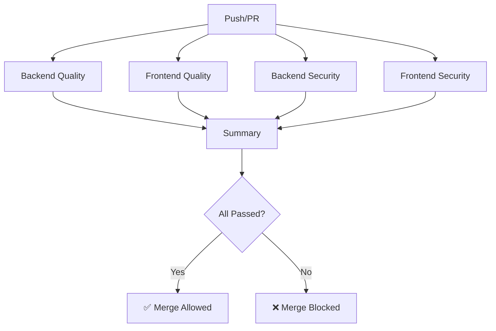

# Tepora Quality Gates

このドキュメントでは、Tepora プロジェクトの品質ゲートシステムについて説明します。

## 概要

品質ゲートは、コードの品質と信頼性を保証するための自動チェックシステムです。

```
┌─────────────────┐    ┌─────────────────┐    ┌─────────────────┐
│  Gate 1         │    │  Gate 2         │    │  Gate 3         │
│  Pre-commit     │ -> │  CI Pipeline    │ -> │  Release        │
│  (ローカル)      │    │  (PR)           │    │  (リリース前)    │
└─────────────────┘    └─────────────────┘    └─────────────────┘
```

## 品質チェック項目

### Backend (Rust)

| チェック | ツール | コマンド |
|----------|--------|----------|
| Lint | Clippy | `cargo clippy -- -D warnings` |
| Format | rustfmt | `cargo fmt -- --check` |
| Type Check | Rust compiler | `cargo check` |
| Tests | cargo test | `cargo test` |
| Security | cargo-audit | `cargo audit` |

### Frontend (TypeScript/React)

| チェック | ツール | コマンド |
|----------|--------|----------|
| Type Check | TypeScript | `npm run typecheck` |
| Lint | Biome/ESLint | `npx biome check src/` |
| Tests | Vitest | `npm test` |
| Security | npm audit | `npm audit` |

## 使用方法

### 統合品質ゲート実行

```bash
# 全チェック実行
task quality

# 厳格モード（警告も失敗扱い）
task quality:strict

# 自動修正モード
task quality:fix

# バックエンドのみ
task quality:backend

# フロントエンドのみ
task quality:frontend
```

### セキュリティスキャン

```bash
# 全セキュリティスキャン
task security

# 個別実行
task security-backend
task security-frontend
```

### カバレッジレポート

```bash
# 全カバレッジ
task coverage
```

## Pre-commit フック

### インストール

```bash
task pre-commit:install
```

### 手動実行

```bash
task pre-commit
# または
pre-commit run --all-files
```

### 設定ファイル

Pre-commit の設定は `.pre-commit-config.yaml` にあります。

## CI/CD パイプライン

GitHub Actions で自動実行されます。

### トリガー

- `main` / `develop` ブランチへのプッシュ
- これらのブランチへのプルリクエスト

### ジョブ構成



## トラブルシューティング

### よくあるエラー

#### rustfmt エラー

```bash
# rustfmtでフォーマット
cargo fmt
```

#### Clippy エラー

該当箇所の警告を修正し、`cargo clippy -- -D warnings` で再確認します。

#### Biome エラー

```bash
# 自動修正
npx biome check --write src/
```

### チェックのスキップ

緊急時のみ、以下のように特定チェックをスキップできます：

```rust
#[allow(clippy::needless_return)] // Clippy: 特定の警告を無視
```

```ts
// biome-ignore lint/suspicious/noExplicitAny: 理由を記載
```

> [!CAUTION]
> チェックのスキップは最小限に抑え、必ずコメントで理由を記載してください。

## 設定ファイル一覧

| ファイル | 用途 |
|----------|------|
| `Cargo.toml` | Rust依存関係 |
| `biome.json` | Biome lint/format 設定 |
| `.pre-commit-config.yaml` | Pre-commit フック設定 |
| `.github/workflows/ci.yml` | CI パイプライン設定 |
| `Taskfile.yml` | タスクランナー設定 |
