# Tepora v4.0 アップグレード提案書

**ドキュメントバージョン**: 0.4 (Finalized)
**作成日**: 2026-02-13
**最終更新**: 2026-02-14
**ステータス**: 🟢 提案確定（実装準備可）
**前提**: 現行 v3.0 (Rust Backend + React Frontend) からの進化

---

## 📋 目次

1. [提案概要](#1-提案概要)
2. [バックエンドアーキテクチャ拡張](#2-バックエンドアーキテクチャ拡張)
3. [モード別コンテキストパイプライン](#3-モード別コンテキストパイプライン)
4. [フロントエンド拡張](#4-フロントエンド拡張)
5. [段階的移行ロードマップ](#5-段階的移行ロードマップ)
6. [詳細仕様案](#6-詳細仕様案)
7. [設計原則との整合性](#7-設計原則との整合性)
8. [エラーハンドリング方針](#8-エラーハンドリング方針)
9. [決定済み事項一覧](#9-決定済み事項一覧)

---

## 1. 提案概要

### ビジョン

v3.0 で確立した Rust + petgraph ベースのグラフエンジンを基盤に、以下の3つの軸で拡張する：

| 軸 | 概要 |
|:---|:---|
| **LLMバックエンド多様化** | llama.cpp 直接管理に加え、Ollama / LMStudio を統合 (**完了**) |
| **コンテキストパイプラインのモジュラー化** | 固定パイプラインから ConfigurableWorker ベースの柔軟な構成へ (**コンテキストファースト**) |
| **UI/UX 拡張** | RAG / Search / Agent の各モードに応じたリッチな UI |

### 現行 → 提案の差分サマリ

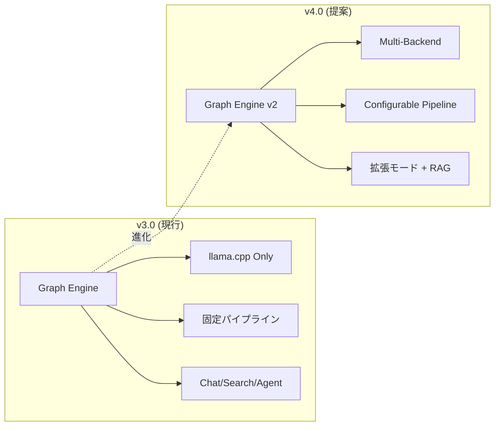

---

## 2. バックエンドアーキテクチャ拡張

### 2.1 全体構成図

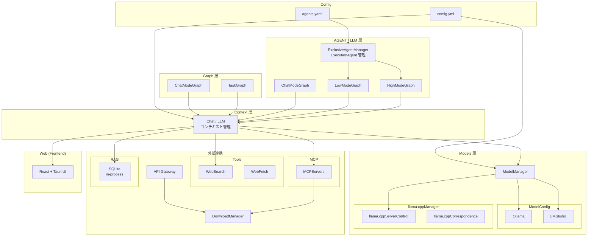

### 2.2 新規コンポーネント

#### ModelConfig 層（LLMバックエンド抽象化）

**(実装・テスト済み)** 現行の `LlamaService` を抽象化し、Ollama / LMStudio を統合管理する。

#### ExclusiveAgentManager（ExecutionAgent 管理）

ユーザー定義エージェント（**ExecutionAgent** と呼称統一）を管理するコンポーネント。
`custom_agents`（config.yml）の **完全置換**。

**特徴**:
- **agents.yaml**: エージェントの振る舞い（プロンプト、ツール）と使用するモデルIDを定義
- **モデル管理との分離**: モデル接続詳細は ModelManager が管理。`agents.yaml` は論理モデルIDのみ指定

#### Graph 構造の全体像

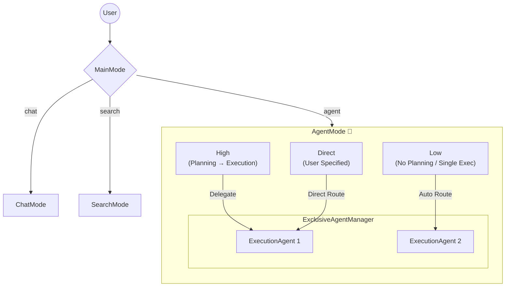

**AgentMode サブモード定義**:

| モード | 特徴 |
|:---|:---|
| **High** | Planning フェーズあり。SynthesisAgent がユーザー対面・Execution呼出、PlanningAgent が計画提案、ExecutionAgent が実行 |
| **Low** | Planning なし。SynthesisAgent（速度重視）が ExecutionAgent を自動選択・実行。SubAgent 呼び出し可能 |
| **Direct** | ユーザーが明示指定。Synthesis なし。ExecutionAgent と直接会話。軽量・低レイテンシ |

---

## 3. モード別コンテキストパイプライン

### コンテキストファースト設計

V4 では **コンテキスト構築こそがアプリケーションの核** であると位置づける。

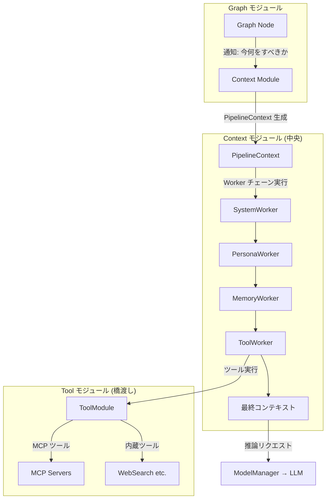

**PipelineContext**: 1ターンごとに生成・破棄される Ephemeral コンテキスト。(Option B 採用)

### Persona 配置ルール

> **原則**: ユーザーと直接会話する Agent のみがペルソナを持つ。内部 Agent には Persona は余計なコンテキストとなる。

| Agent / Mode | ユーザー対面 | Persona |
|:---|:---:|:---:|
| ChatMode | ✅ | ✅ |
| SearchMode (Fast/④Reporting) | ✅ | ✅ |
| **SynthesisAgent** (High/Low) | ✅ | ✅ |
| **PlanningAgent** (High) | ❌ | ❌ |
| **ExecutionAgent** (High/Low) | ❌ | ❌ |
| **ExecutionAgent** (Direct) | ✅ 直接会話 | ❌※ |

※ Direct 利用時は `system_prompt` でキャラクター性定義可能（モデル性能次第）

### WebSearch 共通設定

**WebSearch の有効/無効は SearchMode と AgentMode で共通設定。**

### ConfigurableWorker 共通要素

| 要素 | 説明 |
|:---|:---|
| **System** | システムプロンプト（静的 + 動的部分） |
| **Persona** | キャラクター/ペルソナ設定 |
| **Memory** | EM-LLM による記憶コンテキスト |
| **LocalContext** | セッション固有のローカルコンテキスト |
| **Artifact** | 生成物・参照資料のチャンク管理 |
| **UserIn** | ユーザー入力（処理済み） |

---

### 3.1 ChatMode パイプライン 🟣

ペルソナ/キャラクターとの対話に特化。シンプルで軽量。

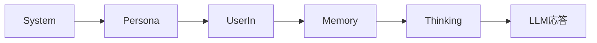

- キャラクター/ペルソナが中心
- Search / RAG は含まない

---

### 3.2 SearchMode (Fast) パイプライン 🔵

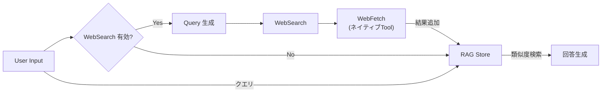

- **WebSearch 有効時**: Query 生成 → 検索 → fetch（ネイティブ Tool パイプライン） → RAG 追加 → 類似度検索 → 回答
- **WebSearch 無効時**: 既存 RAG データのみで回答

---

### 3.3 SearchMode (Agentic) パイプライン 🔴

多段階 Context Window + Artifact 蓄積型の高度な情報検索。

**RAG 操作セット**:
- チャンクID指定 → 詳細取得
- 文字数指定 → 前後ウィンドウ取得
- 文字検索 → テキストマッチ
- 類似度検索 → ランク付き結果
- **WebSearch 有効時**: WebSearch → fetch → RAG 追加も可能

取得した情報は **Artifact へ記述・蓄積** し、繰り返し検索を行うことで濃密な情報検索を実現する。

#### 4段階 Context Window

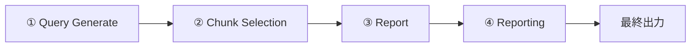

| 段階 | Persona | 主な役割 |
|:---|:---:|:---|
| ① Query Generate | ❌ | 検索クエリ生成 |
| ② Chunk Selection | ❌ | チャンク選別 |
| ③ Report | ❌ | レポート作成 |
| ④ Reporting | ✅ | キャラクターとして最終報告 |

---

### 3.4 AgentMode パイプライン

#### High Mode ⬛

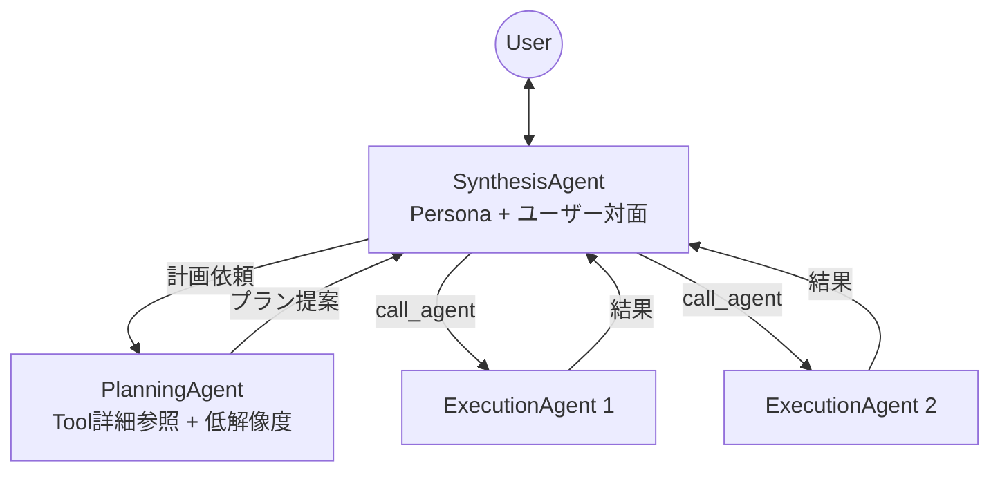

| Agent | 責務 | 解像度 | Context Window |
|:---|:---|:---:|:---|
| **Synthesis** | ユーザー対話、Exec呼出、最終応答 | 高 | System, **Persona**, Memory, Artifact, UserIn, SubAgentResults |
| **Planning** | Tool詳細参照、計画提示 | 低 | System, Memory, Artifact, **Tool詳細** |
| **Execution** | 個別タスク (ReAct) | — | System(agent定義), Scratchpad, Tools |

> **Planning の設計意図**: ユーザーへの解像度を低く抑え、その分 Tool の詳細情報（パラメータ、制約等）を入力するコンテキストエリアを確保する。

#### Low Mode ⬜

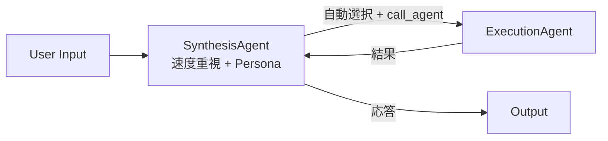

- **Synthesis あり**（速度重視設計）
- Planning なし
- SubAgent 呼び出し可能

#### Direct Mode ◽

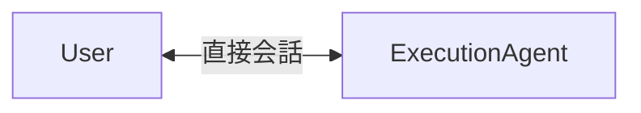

- **Synthesis なし** → 計算量削減・低レイテンシ
- 軽量操作・レスポンス速度重視

---

### 3.5 パイプライン比較表

| 要素 | Chat 🟣 | Search Fast 🔵 | Search Agentic 🔴 | Agent High ⬛ | Agent Low ⬜ | Agent Direct ◽ |
|:---|:---:|:---:|:---:|:---:|:---:|:---:|
| **Synthesis** | — | — | — | ✅ | ✅ 速度重視 | ❌ |
| **Planning** | — | — | — | ✅ | ❌ | ❌ |
| **Persona** | ✅ | ✅ | ④のみ | Synth のみ | Synth のみ | ❌ |
| **Memory** | ✅ | ✅ | ✅ | Synth/Plan | ✅ | ✅ |
| **Artifact** | ❌ | ❌ | ✅ 蓄積 | ✅ 共有 | ✅ 任意 | ✅ 任意 |
| **Scratchpad** | ❌ | ❌ | ❌ | Exec のみ | ✅ | ✅ |
| **RAG** | ❌ | ✅ | ✅ 高機能 | Tool次第 | Tool次第 | Tool次第 |
| **WebSearch** | ❌ | 共通設定 | 共通設定 | 共通設定 | 共通設定 | 共通設定 |
| **Tools** | ❌ | ✅ fetch | ✅ | ✅ | ✅ | ✅ |
| **SubAgent** | ❌ | ❌ | ❌ | ✅ | ✅ | ❌ |

---

## 4. フロントエンド拡張

**UIコンセプト**:
> **現状維持** — 近未来的な喫茶店と紅茶、あたたかみをベースとした既存のデザインフィロソフィーを踏襲する。

| 要素 | 説明 |
|:---|:---|
| **RAG タブ** | RAG 専用モードの追加 |
| **Agent 設定** | `agents.yaml` はファイル編集を基本。読み込み状況確認画面等はあっても良い |

---

## 5. 段階的移行ロードマップ

Phase A の「LLMバックエンド多様化」は完了済み。

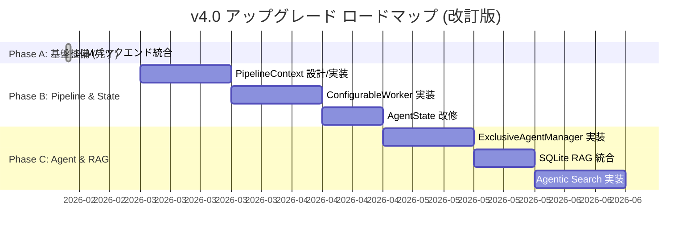

---

## 6. 詳細仕様案

### 6.1 PipelineContext（Option B: Ephemeral Context）

```rust
pub struct PipelineContext {
    // 識別
    pub session_id: String,
    pub turn_id: String,
    pub mode: PipelineMode,

    // コンテキスト構築
    pub system_parts: Vec<SystemPart>,
    pub persona: Option<PersonaConfig>,  // ユーザー対面 Agent のみ有効
    pub messages: Vec<Message>,
    pub user_input: String,

    // メモリ
    pub working_memory: HashMap<String, Value>,  // ephemeral (Worker 間共有)
    pub memory_chunks: Vec<MemoryChunk>,          // EM-LLM 長期記憶

    // 検索・RAG
    pub search_results: Vec<SearchResult>,
    pub rag_chunks: Vec<RagChunk>,

    // 共通
    pub artifacts: Vec<Artifact>,
    pub scratchpad: Vec<ScratchpadEntry>,  // ReAct 記録
    pub tool_results: Vec<ToolResult>,
    pub sub_agent_results: Vec<SubAgentResult>,
    pub token_budget: TokenBudget,
}
```

### 6.2 ConfigurableWorker Trait

```rust
#[async_trait]
pub trait ContextWorker: Send + Sync {
    fn name(&self) -> &str;
    async fn execute(
        &self,
        ctx: &mut PipelineContext,
        state: &Arc<AppState>
    ) -> Result<(), WorkerError>;
}
```

### 6.3 agents.yaml スキーマ

```yaml
version: "1.0"
defaults:
  model_id: "default-model"        # models 管理の論理ID
  max_iterations: 10
  temperature: 0.7
  max_tokens: 4096

agents:
  - slug: "web-researcher"
    name: "Web Researcher"
    description: "Web検索のエキスパート"
    model_id: "fast-reasoner"       # 省略時は defaults
    system_prompt: "..."
    tools:
      - "web_search"                # ネイティブ Tool
      - "fetch_url"
    parameters:                     # defaults を上書き
      max_iterations: 5
      temperature: 0.3

  - slug: "rag-specialist"
    name: "RAG Specialist"
    tools:
      - "rag_search"                # RAG をカスタム有効化
      - "rag_ingest"
      - "mcp:filesystem"            # MCP は mcp: プレフィックス
```

**Tool 名前解決**:

| プレフィックス | 解決先 | 例 |
|:---|:---|:---|
| (なし) | ToolModule 内蔵ツール | `web_search`, `fetch_url` |
| `mcp:` | MCP サーバー経由 | `mcp:filesystem`, `mcp:github` |

**役割分離**:

| 定義 | 責務 | 管理する情報 |
|:---|:---|:---|
| **agents.yaml** | エージェントの振る舞い | プロンプト、ツール、論理モデルID |
| **models 管理** (既存) | モデルのインフラ | バックエンド種別、接続先、パラメータ |

### 6.4 RAG 抽象レイヤー

RAG はネイティブ Tool として提供。ExecutionAgent にはデフォルト組み込みせず、カスタムで有効化。

```rust
#[async_trait]
pub trait RagStore: Send + Sync {
    // 取り込み
    async fn ingest(&self, doc: Document, opts: IngestOptions) -> Result<Vec<ChunkId>>;

    // 検索操作
    async fn similarity_search(&self, query: &str, limit: usize) -> Result<Vec<RagChunk>>;
    async fn text_search(&self, pattern: &str) -> Result<Vec<RagChunk>>;
    async fn get_chunk(&self, chunk_id: &ChunkId) -> Result<Option<RagChunk>>;
    async fn get_chunk_window(&self, chunk_id: &ChunkId, chars: usize) -> Result<Vec<RagChunk>>;

    // ドキュメント単位
    async fn get_document(&self, doc_id: &DocumentId) -> Result<Option<Document>>;

    // ライフサイクル
    async fn clear_session(&self, session_id: &str) -> Result<()>;
    async fn reindex(&self, new_embedding_model: &str) -> Result<ReindexProgress>;
}
```

- **チャンク戦略**: 意味分割。ドキュメント単位でも保持
- **スコープ**: セッション切替でリセット
- **ストレージ**: **SQLite + ndarray** (in-process、サーバー不要、ベクトル検索)

> [!IMPORTANT]
> **実装変更 (2026-02-15)**: 
> 最終的な実装では、**SQLite + ndarray** (in-process) を採用しました。理由は以下の通りです:
> 1. **ビルド依存性**: LanceDB は `protoc` (Protocol Buffers コンパイラ) のインストールを要求し、ユーザー環境のセットアップ難易度が上がるため。
> 2. **依存パッケージ数**: LanceDB の採用により 250 以上の追加クレートが必要となり、バイナリサイズとコンパイル時間が増大するため。
> 3. **依存競合**: `candle-core` と `lancedb` 間で `half` クレートのバージョン競合が発生したため。
> 4. **十分な性能**: ローカル単一ユーザーの規模では、最適化された `ndarray` によるコサイン類似度計算で十分な検索速度が得られるため。
>
> 将来的なスケーラビリティが必要になった場合は、`RagStore` trait 経由で LanceDB/Qdrant へ移行可能です。
- **再計算**: 埋め込みモデル変更時に `reindex()` で既存記録を再計算可能

---

## 7. 設計原則との整合性

[Tepora_Design_Philosophy.md](./Tepora_Design_Philosophy.md) との整合確認。

| 原則 | 整合性 | 備考 |
|:---|:---:|:---|
| **P1. Local First** | ✅ | Ollama/LMStudio もローカル実行 |
| **P2. Production Ready** | ✅ | trait による型安全な抽象化 |
| **P3. Hardware Agnostic** | ✅ | 多様な LLM バックエンドで柔軟性向上 |
| **P4. Modular & Hierarchical** | ✅ | ConfigurableWorker がモジュラー設計 |
| **P5. Warm & Calm UX** | ✅ | 既存デザインフィロソフィー維持 |

---

## 8. エラーハンドリング方針

### Agent 実行時

| 場面 | 方針 |
|:---|:---|
| **ExecutionAgent 失敗** | Synthesis に通知。Synthesis が判断（断念 / 別 Agent / リトライ） |
| **Tool 構文エラー** | 自動修正を試行 → 失敗なら Execution に通知し ReAct リトライ |
| **Tool そのものがエラー** | Execution + ユーザーに通知。ReAct 脱出→Synthesis に失敗報告 |
| **LLM 推論エラー (Chat/Search)** | ユーザーに通知し失敗 |
| **LLM 推論エラー (Agent)** | ユーザーに通知 + Persona/Synthesis モデルへフォールバック（設定で切替可） |
| **max_iterations (Execution)** | Synthesis に途中経過を返し、Synthesis が追加を判断 |
| **max_iterations (Synthesis)** | 到達前に最終結果を出すよう求め、到達時は超過エラー→ユーザーに Continue 確認 |

### RAG / 検索

| 場面 | 方針 |
|:---|:---|
| **埋め込み生成失敗** | リトライ可能ならリトライ → 不可ならユーザー通知しスキップ続行 |
| **SQLite アクセスエラー** | セッション再作成を試行 |
| **WebSearch/fetch 失敗** | RAG のみで回答。RAG が空なら Agent に通知 |

### パイプライン

| 場面 | 方針 |
|:---|:---|
| **Worker 途中失敗** | リトライ可能ならリトライ → 不可ならパイプライン中断 |
| **トークン予算超過** | コンテキスト圧縮を試行（優先順位による切捨て / LLM 圧縮） |

---

## 9. 決定済み事項一覧

| # | 事項 | 決定 |
|:---|:---|:---|
| 1 | グラフ基盤 | Rust + petgraph 維持 |
| 2 | 移行方式 | 段階的（Phase A → B → C） |
| 3 | 設計原則 | Design Philosophy 準拠維持 |
| 4 | LLM バックエンド | Ollama / LMStudio 統合完了 |
| 5 | Agent 用語 | ExecutionAgent に統一 |
| 6 | モデル指定 | 固定（ローカルモデルに動的判断を委ねない） |
| 7 | 後方互換性 | 不要（custom_agents 完全置換） |
| 8 | State 設計 | Option B: PipelineContext (Ephemeral) |
| 9 | SearchMode | RAG 中心、NotebookLM 的 UX |
| 10 | WebSearch | SearchMode / AgentMode 共通設定 |
| 11 | RAG ストレージ | **SQLite + ndarray** (in-process, Rust native) |
| 12 | UI コンセプト | 現状維持（近未来的喫茶店 + 紅茶 + あたたかみ） |
| 13 | エラーハンドリング | Section 8 に記載 |

---

> [!TIP]
> 全ての主要設計事項が確定しました。各 Phase の開始前に、対応する詳細設計書（Implementation Plan）を別途作成し、レビューを行います。

*Tepora Project - アップグレード提案書 v4.0*
