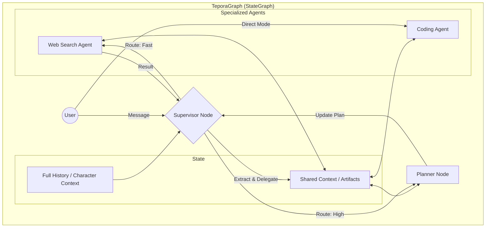

# Multi-Agent Architecture Implementation Plan

This plan details the transition to a hierarchical multi-agent system where a Supervisor Agent manages the workflow, delegating to a Planner (High Mode) or directly to Specialized Agents (Fast Mode). Specialized Agents are dynamically sourced from user-defined Custom Agents.

## User Review Required

> [!IMPORTANT]
> **Architecture Change**: This is a fundamental change to the `TeporaGraph`. The linear chain will be replaced by a conditional `StateGraph`. `CustomAgentConfig` will be used to generate graph nodes dynamically.

> [!NOTE]
> **Memory Isolation**: Critical requirement. Character Memory (history/persona) must be separated from Agent Working Memory (task execution).
> **Shared Workspace**: A dedicated, task-specific storage area for agents to share artifacts/data, distinct from global RAG.

## Retained Architectural Strengths

We will actively preserve and leverage these high-quality components from the current system:

1.  **WebSocket Event Streaming**:
    - *Current*: Streams intermediate steps (`on_chain_start`) to `AgentStatus` UI.
    - *New Design*: Will be enhanced to support **Hierarchical Events** (e.g., `Supervisor -> Delegating to Agent X`).

2.  **Human-in-the-loop (Tool Approval)**:
    - *Current*: `SessionHandler` intercepts dangerous tools for user confirmation.
    - *New Design*: Maintains global safety.

## Proposed Changes

### Backend (`src/core/`)

#### 1. Graph-Native Architecture (Revised)
Instead of building external "Workspace" systems, we will leverage **LangGraph's State Schema** to naturally handle isolation and data sharing.

- **State Schema (`src/core/graph/state.py`)**:
    - Extend `AgentState` to include a `shared_context` field. This *is* the Shared Workspace.
    - `shared_context`: A dictionary/object within the graph state holding:
        - `current_plan`: The plan from the Planner.
        - `artifacts`: Code snippets, search results, valid for the current task only.
        - `notes`: Scratchpad for agents.

- **Memory Isolation via State Slicing**:
    - **Global State**: Holds full `chat_history` (Character Context).
    - **Agent Node Execution**: When the Supervisor invokes a Specialized Agent, the node logic will:
        1. **Select** only the relevant data: `task_instruction` + `shared_context`.
        2. **Exclude** the raw `chat_history`.
        3. **Invoke** the Custom Agent's model.
        4. **Merge** the result back into `shared_context` or return a summary to Supervisor.
    - This achieves strict isolation **functionally** without enabling complex separate storage backends.

#### 2. Supervisor as a Router Node
- **`Supervisor` Node**:
    - Inputs: Full `AgentState` (Character Memory + User Input).
    - **Memory Architecture ("Growing AI")**:
        1.  **Character Memory (`char_em_llm`)**:
            - *Purpose*: User preference, personality, emotional context.
            - *Access*: **Supervisor Only** (Read-Only). Custom Agents never see this.
        2.  **Professional Memory (`prof_em_llm`)**:
            - *Purpose*: **Shared Task Learning**. Stores past successful plans, tool usage patterns, and "How-To" knowledge.
            - *Access*: **Shared**. Supervisor uses it for routing/planning. Specialized Agents use it to retrieve "How-to" guidance for their specific tools.
    - Logic:
        - Route to Planner/Specialized Agent based on memory + input.
        - *Isolation*: Crucially, **neither** of these full memories is passed to Specialized Agents. They receive only the distilled `task_instruction` and `shared_context`.

#### 3. Dynamic Node injection (`src/core/graph/builder.py`)
- We will iterate over enabled agents via `CustomAgentRegistry`.
- **Memory Access**:
    - Specialized Agents will be injected with read access to `prof_em_llm` (Professional Memory) to query for similar past tasks.
- **Model Management**:
    - Each node will instantiate an LLM client based on `agent.model_config_name`. (e.g., using `DeepSeek-R1` for coding, `Gemma` for chat).
- **Tool & MCP Integration**:
    - Tools are retrieved from `ToolManager`.
    - **Filtering**: We apply `CustomAgentRegistry.get_tool_filter(agent.id)` to strictly limit which tools (Native or MCP) the agent can access.
    - *Example*: An "Automator" agent might only have access to `browser_click` and `mcp_filesystem_read`.
- **System Prompt**:
    - Constructed from `agent.system_prompt` + `registry.get_skills_as_prompt(agent.id)`.

#### 2. Dynamic Graph Construction (`src/core/graph/builder.py`)
- Modify `TeporaGraph` construction to:
    1. Load all enabled `CustomAgentConfig`s.
    2. Add a node for each Custom Agent.
    3. Connect Supervisor to all Custom Agents.
    4. Connect Planner to Supervisor.

### Frontend (`frontend/src/`)

#### 1. Visualization (`AgentStatus.tsx`)
- Update to support hierarchical display.
- Differentiate between "Supervisor" (Orchestrator), "Planner", and "Worker" (Specialized Agent) activities.

#### 2. Direct Interaction (`ChatInterface`)
- Allow selecting a specific agent from the UI (e.g., dropdown or command).
- If a specific agent is selected, the message is sent with `mode="direct_agent"` and `agent_id="..."`.

## Architecture Diagram (Mermaid)

## Verification Plan

### Automated Tests
- **Unit Tests**: Test `Supervisor` routing logic (mocking LLM).
- **Integration Tests**: Verify end-to-end flow for High Mode (`Supervisor` -> `Planner` -> `Agent`) and Fast Mode (`Supervisor` -> `Agent`).

### Manual Verification
1. **High Mode**: Ask a complex question (e.g., "Research X and then write a summary"). Verify Planner is invoked.
2. **Fast Mode**: Ask a specific simple question (e.g., "Search for X"). Verify it goes directly to the Search Agent (if configured).
3. **Direct Interaction**: Select a specific agent (e.g., "Pirate Bot") and chat. Verify only that agent responds.
