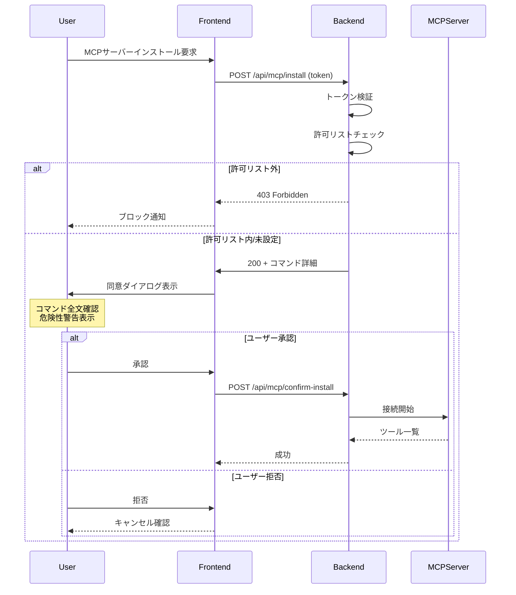

# MCP参考プロジェクト詳細分析レポート

**作成日**: 2026-01-08  
**目的**: Teporaプロジェクトにおける MCP セキュリティ問題改善のための参考資料分析  
**対象**: `プロジェクト参考資料/MCP関連` 内の13プロジェクト

---

## 1. エグゼクティブサマリー

本レポートでは、MCPクライアント実装の業界ベストプラクティスを明らかにするため、**公式SDK (Python/TypeScript)**、**主要実装プロジェクト (Cline, LibreChat, Gemini CLI, Zed)**、および**公式仕様ドキュメント**を詳細に分析しました。

### 重要な発見事項

1. **認証・認可は必須**: すべての成熟したプロジェクトが何らかの認証機構を実装
2. **同意フローの明確化**: ツール実行前のユーザー同意が標準パターン
3. **サンドボックス化**: ローカルサーバー実行時の分離が推奨
4. **DNS リバインディング保護**: HTTP ベーストランスポートで必須
5. **エンタープライズ制御**: 許可リスト/ブロックリストによる制御機能

---

## 2. 分析対象プロジェクト一覧

| プロジェクト | 種別 | 特徴 |
|-------------|------|------|
| **python-sdk-main** | 公式SDK | Python リファレンス実装、トランスポートセキュリティ |
| **typescript-sdk-main** | 公式SDK | TypeScript リファレンス実装、Hostヘッダー検証 |
| **rust-sdk-main** | 公式SDK | Rust リファレンス実装、OAuth2認証 |
| **modelcontextprotocol-main** | 公式仕様 | MCP プロトコル仕様書 |
| **cline-main** | VSCode拡張 | 最も充実したセキュリティ・エンタープライズ実装 |
| **LibreChat-main** | Webアプリ | OAuth/ユーザーACL実装 |
| **gemini-cli-main** | CLI | Google製、エンタープライズ対応 |
| **zed-main** | エディタ | Rust製、ワークスペース信頼機構 |
| **open-mcp-client-main** | Next.js | シンプルなリファレンス |
| **copilot-mcp-main** | VSCode拡張 | GitHub Copilot統合、LLM駆動インストール |
| **registry-main** | レジストリ | サーバー配布基盤、JWT認証、ネームスペース所有権検証 |
| **MCP-SuperAssistant-main** | Chrome拡張 | ブラウザ統合、複数トランスポート対応 |
| **mcp-superassistant-proxy-main** | プロキシ | サーバー集約、メモリリーク防止設計 |

---

## 3. セキュリティ実装パターン詳細分析

### 3.1 トランスポートセキュリティ（Python SDK）

**ファイル**: [transport_security.py](file:///e:/Tepora_Project/プロジェクト参考資料/MCP関連/python-sdk-main/src/mcp/server/transport_security.py)

Python SDKは**DNS リバインディング保護**を標準搭載しています。

```python
class TransportSecuritySettings(BaseModel):
    """MCP トランスポートセキュリティ設定"""
    
    enable_dns_rebinding_protection: bool = Field(
        default=True,
        description="Enable DNS rebinding protection (recommended for production)",
    )
    
    allowed_hosts: list[str] = Field(
        default=[],
        description="List of allowed Host header values",
    )
    
    allowed_origins: list[str] = Field(
        default=[],
        description="List of allowed Origin header values",
    )
```

#### 実装される保護

| 保護機能 | 説明 |
|---------|------|
| Host ヘッダー検証 | 許可されたホストのみ受付 |
| Origin ヘッダー検証 | CORS と連携した保護 |
| Content-Type 検証 | POST リクエストで `application/json` を強制 |
| ワイルドカードポート | `localhost:*` などの柔軟な許可 |

#### Tepora への適用推奨

```python
# Tepora向け設定例
security_settings = TransportSecuritySettings(
    enable_dns_rebinding_protection=True,
    allowed_hosts=["localhost:*", "127.0.0.1:*"],
    allowed_origins=["http://localhost:*", "tauri://localhost"]
)
```

---

### 3.2 OAuth認証管理（Cline）

**ファイル**: [McpOAuthManager.ts](file:///e:/Tepora_Project/プロジェクト参考資料/MCP関連/cline-main/cline-main/src/services/mcp/McpOAuthManager.ts)

Clineは最も成熟したOAuth実装を持ち、以下の機能を提供します：

```typescript
class McpOAuthManager {
    // OAuthプロバイダー管理
    private providers: Map<string, OAuthClientProvider> = new Map();
    
    // サーバー固有のOAuthプロバイダー取得/作成
    async getOrCreateProvider(serverName: string, serverUrl: string): Promise<OAuthClientProvider>;
    
    // State検証（CSRF保護）
    validateAndClearState(serverHash: string, state: string): boolean;
    
    // 認証データクリア
    async clearServerAuth(serverName: string, serverUrl: string): Promise<void>;
}
```

#### State パラメータ検証

```typescript
validateAndClearState(serverHash: string, state: string): boolean {
    const secrets = getMcpOAuthSecrets();
    const serverSecrets = secrets[serverHash];
    
    // タイムスタンプ検証（10分以内）
    const MAX_STATE_AGE_MS = 10 * 60 * 1000;
    if (Date.now() - (serverSecrets.oauth_state_timestamp || 0) > MAX_STATE_AGE_MS) {
        return false;
    }
    
    // State一致確認とクリア（一回限り使用）
    if (serverSecrets.oauth_state === state) {
        delete serverSecrets.oauth_state;
        delete serverSecrets.oauth_state_timestamp;
        saveMcpOAuthSecrets(secrets);
        return true;
    }
    return false;
}
```

---

### 3.3 サーバー接続制御（Cline McpHub）

**ファイル**: [McpHub.ts](file:///e:/Tepora_Project/プロジェクト参考資料/MCP関連/cline-main/cline-main/src/services/mcp/McpHub.ts) (1545行)

ClineのMcpHubはエンタープライズ向けの制御機能を実装しています。

#### リモートサーバー許可リスト

```typescript
async connectToServer(name: string, config: ServerConfigSchema, source: "rpc" | "internal") {
    // リモートMCPサーバーURL検証
    if (config.type !== "stdio" && "url" in config && config.url) {
        const remoteConfig = stateManager.getRemoteConfigSettings();
        
        if (remoteConfig.blockPersonalRemoteMCPServers === true) {
            const allowedUrls = remoteConfig.remoteMCPServers.map(s => s.url);
            
            if (!allowedUrls.includes(config.url)) {
                return; // 接続を拒否
            }
        }
    }
}
```

#### ローカルサーバー制限（エンタープライズ機能）

```typescript
// マーケットプレイスが無効化されている場合
if (remoteConfig.mcpMarketplaceEnabled === false) {
    return; // すべてのローカルサーバーをブロック
}

// 許可リストが設定されている場合
if (remoteConfig.allowedMCPServers?.length > 0) {
    if (name.startsWith("github.com/")) {
        const allowedIds = remoteConfig.allowedMCPServers.map(s => s.id);
        if (!allowedIds.includes(name)) {
            return; // 許可リストにないサーバーをブロック
        }
    }
}
```

#### トランスポート別の処理

```typescript
switch (expandedConfig.type) {
    case "stdio":
        // ローカルプロセス（最も安全）
        transport = new StdioClientTransport({
            command: expandedConfig.command,
            args: expandedConfig.args,
            env: {
                ...getDefaultEnvironment(),
                ...expandedConfig.env,
            },
            stderr: "pipe", // デバッグ用にstderrをキャプチャ
        });
        break;
        
    case "sse":
        // Server-Sent Events (リモート接続)
        transport = new SSEClientTransport(new URL(expandedConfig.url), {
            authProvider,
            requestInit: { headers: expandedConfig.headers },
        });
        break;
        
    case "streamableHttp":
        // Streamable HTTP (リモート接続)
        transport = new StreamableHTTPClientTransport(new URL(expandedConfig.url), {
            authProvider,
            fetch: streamableHttpFetch, // 404→405正規化
        });
        break;
}
```

---

### 3.4 公式セキュリティベストプラクティス

**ファイル**: [security_best_practices.mdx](file:///e:/Tepora_Project/プロジェクト参考資料/MCP関連/modelcontextprotocol-main/modelcontextprotocol-main/docs/specification/draft/basic/security_best_practices.mdx)

公式仕様書は以下の攻撃パターンとその対策を文書化しています。

#### 3.4.1 Confused Deputy Problem（混乱した代理人問題）

MCPプロキシサーバーが第三者APIへの中継を行う場合に発生。

**対策必須事項**:

| 対策 | 説明 |
|------|------|
| **Per-Client Consent** | クライアントごとの同意を保存 |
| **Cookie Security** | `__Host-` プレフィックス、`Secure`, `HttpOnly`, `SameSite=Lax` |
| **Redirect URI 厳格検証** | 完全一致のみ許可、ワイルドカード禁止 |
| **State パラメータ検証** | 暗号論的に安全なランダム値、有効期限10分 |

#### 3.4.2 Token Passthrough の禁止

> MCP servers **MUST NOT** accept any tokens that were not explicitly issued for the MCP server.

トークンをそのまま下流APIに渡すことは禁止されています。

#### 3.4.3 セッションハイジャック対策

```markdown
MCP servers that implement authorization **MUST** verify all inbound requests.
MCP Servers **MUST NOT** use sessions for authentication.
MCP servers **MUST** use secure, non-deterministic session IDs.
```

#### 3.4.4 ローカルMCPサーバーセキュリティ

> If an MCP client supports one-click local MCP server configuration, 
> it **MUST** implement proper consent mechanisms prior to executing commands.

**Pre-Configuration Consent 要件**:

- 実行されるコマンドを完全に表示（省略なし）
- 潜在的に危険な操作であることを明示
- ユーザーの明示的な承認を必須化
- キャンセル機能を提供

**推奨される追加チェック**:

```markdown
- Highlight potentially dangerous command patterns (sudo, rm -rf, network operations)
- Display warnings for commands that access sensitive locations
- Execute MCP server commands in a sandboxed environment
- Provide mechanisms for users to explicitly grant additional privileges
```

#### 3.4.5 スコープ最小化

> Implement a progressive, least-privilege scope model

```markdown
- Minimal initial scope set (e.g., `mcp:tools-basic`)
- Incremental elevation via targeted `WWW-Authenticate` challenges
- Down-scoping tolerance: server should accept reduced scope tokens
```

---

### 3.5 ユーザー認証マッピング（LibreChat）

**ファイル**: [auth.ts](file:///e:/Tepora_Project/プロジェクト参考資料/MCP関連/LibreChat-main/LibreChat-main/packages/api/src/mcp/auth.ts)

LibreChatはユーザーごとのMCP認証情報を管理します。

```typescript
async function getUserMCPAuthMap({
    userId,
    tools,
    servers,
    toolInstances,
    findPluginAuthsByKeys,
}) {
    // MCPサーバーごとに固有のプレフィックスを付与
    const uniqueMcpServers = new Set<string>();
    
    for (const serverName of servers) {
        uniqueMcpServers.add(`${Constants.mcp_prefix}${serverName}`);
    }
    
    // プラグイン認証テーブルからユーザー固有の認証情報を取得
    return await getPluginAuthMap({
        userId,
        pluginKeys: Array.from(uniqueMcpServers),
        throwError: false,
        findPluginAuthsByKeys,
    });
}
```

---

### 3.6 ワークスペース信頼モデル（Zed）

**ファイル**: [security_modal.rs](file:///e:/Tepora_Project/プロジェクト参考資料/MCP関連/zed-main/zed-main/crates/workspace/src/security_modal.rs)

Zedエディタは、ワークスペース単位での信頼モデルを実装しています。

```rust
pub struct SecurityModal {
    focus_handle: FocusHandle,
    worktree_store: WeakEntity<WorktreeStore>,
    restricted_paths: Vec<RestrictedPath>,
    // ...
}

impl SecurityModal {
    fn trust_and_dismiss(&mut self, cx: &mut Context<Self>) {
        // 信頼されたワークツリーを永続化
        for path in &self.restricted_paths {
            // ワークツリーを信頼済みとしてマーク
        }
        self.dismiss(cx);
    }
}
```

この設計では、ユーザーが明示的にワークスペースを「信頼」することで、MCP サーバーやツールへのアクセスが許可されます。

---

### 3.7 MCPクライアント管理（Gemini CLI）

**ファイル**: [mcp-client-manager.ts](file:///e:/Tepora_Project/プロジェクト参考資料/MCP関連/gemini-cli-main/gemini-cli-main/packages/core/src/tools/mcp-client-manager.ts)

Google製のGemini CLIは、エンタープライズ向けの機能を備えています。

```typescript
class McpClientManager {
    // ブロックされたサーバーのトラッキング
    getBlockedMcpServers(): string[];
    
    // 許可リストチェック
    isAllowedMcpServer(name: string): boolean {
        // 設定ベースの許可リストをチェック
        const allowlist = this.cliConfig.mcpAllowlist;
        if (allowlist && allowlist.length > 0) {
            return allowlist.includes(name);
        }
        return true; // デフォルトは許可
    }
    
    // エクステンション単位での制御
    async startExtension(extension: GeminiCLIExtension);
    async stopExtension(extension: GeminiCLIExtension);
}
```

---

### 3.8 Rust SDK OAuth2認証

**ファイル**: [auth.rs](file:///e:/Tepora_Project/プロジェクト参考資料/MCP関連/rust-sdk-main/crates/rmcp/src/transport/auth.rs) (1461行)

Rust SDKは完全なOAuth2認証実装を提供しています。

```rust
/// Trait for storing and retrieving OAuth2 credentials
/// Implementations can provide custom storage backends
#[async_trait]
pub trait CredentialStore {
    async fn load(&self) -> Result<Option<StoredCredentials>, AuthError>;
    async fn save(&self, credentials: StoredCredentials) -> Result<(), AuthError>;
    async fn clear(&self) -> Result<(), AuthError>;
}

/// HTTP client with OAuth 2.0 authorization
pub struct AuthClient<C> {
    http_client: C,
    auth_manager: AuthorizationManager,
}

impl<C> AuthClient<C> {
    pub async fn get_access_token(&self) -> Result<String, AuthError>;
}
```

#### エラータイプ

| エラー | 説明 |
|--------|------|
| `AuthorizationRequired` | OAuth認可が必要 |
| `AuthorizationFailed` | OAuth認可失敗 |
| `TokenExpired` | トークン有効期限切れ |
| `InvalidScope` | 無効なスコープ |
| `RegistrationFailed` | クライアント登録失敗 |

---

### 3.9 TypeScript SDK Hostヘッダー検証

**ファイル**: [hostHeaderValidation.ts](file:///e:/Tepora_Project/プロジェクト参考資料/MCP関連/typescript-sdk-main/packages/server/src/server/middleware/hostHeaderValidation.ts)

TypeScript SDKはExpressミドルウェアとしてDNSリバインディング保護を提供します。

```typescript
/**
 * Express middleware for DNS rebinding protection.
 * Validates Host header hostname (port-agnostic) against an allowed list.
 */
export function hostHeaderValidation(allowedHostnames: string[]): RequestHandler {
    return (req: Request, res: Response, next: NextFunction) => {
        const hostHeader = req.headers.host;
        if (!hostHeader) {
            res.status(403).json({
                jsonrpc: '2.0',
                error: { code: -32000, message: 'Missing Host header' },
                id: null
            });
            return;
        }

        // Use URL API to parse hostname (handles IPv4, IPv6, regular hostnames)
        let hostname: string;
        try {
            hostname = new URL(`http://${hostHeader}`).hostname;
        } catch {
            res.status(403).json({
                jsonrpc: '2.0',
                error: { code: -32000, message: `Invalid Host header: ${hostHeader}` },
                id: null
            });
            return;
        }

        if (!allowedHostnames.includes(hostname)) {
            res.status(403).json({
                jsonrpc: '2.0',
                error: { code: -32000, message: `Invalid Host: ${hostname}` },
                id: null
            });
            return;
        }
        next();
    };
}

// Convenience middleware for localhost protection
export function localhostHostValidation(): RequestHandler {
    return hostHeaderValidation(['localhost', '127.0.0.1', '[::1]']);
}
```

---

### 3.10 MCP Registry JWT認証とネームスペース所有権

**ファイル**: [jwt.go](file:///e:/Tepora_Project/プロジェクト参考資料/MCP関連/registry-main/registry-main/internal/auth/jwt.go)

公式MCPレジストリはJWT認証とネームスペース所有権検証を実装しています。

```go
// JWTClaims represents the claims for the Registry JWT token
type JWTClaims struct {
    jwt.RegisteredClaims
    AuthMethod        Method       `json:"auth_method"`
    AuthMethodSubject string       `json:"auth_method_sub"`
    Permissions       []Permission `json:"permissions"`
}

type Permission struct {
    Action          PermissionAction `json:"action"`   // publish or edit
    ResourcePattern string           `json:"resource"` // e.g., "io.github.username/*"
}

// JWTManager handles JWT token operations with Ed25519 signing
type JWTManager struct {
    privateKey    ed25519.PrivateKey
    publicKey     ed25519.PublicKey
    tokenDuration time.Duration
}
```

#### レジストリ認証方式

| 方式 | 説明 |
|------|------|
| **GitHub OAuth** | GitHubログインによる公開 |
| **GitHub OIDC** | GitHub Actionsからの公開 |
| **DNS検証** | ドメイン所有権の証明 |
| **HTTP検証** | ドメイン所有権の証明 |

#### ブロックリスト機構

```go
// Check permissions against denylist
if !hasGlobalPermissions {
    for _, blockedNamespace := range BlockedNamespaces {
        if j.HasPermission(blockedNamespace+"/test", PermissionActionPublish, claims.Permissions) {
            return nil, fmt.Errorf("your namespace is blocked")
        }
    }
}
```

---

### 3.11 Copilot MCP - LLM駆動インストール

**ファイル**: [McpAgent.ts](file:///e:/Tepora_Project/プロジェクト参考資料/MCP関連/copilot-mcp-main/copilot-mcp-main/src/McpAgent.ts) (511行)

GitHub Copilot拡張は、LLMを使用してMCPサーバーのインストール設定を自動抽出します。

```typescript
export async function readmeExtractionRequest(readme: string) {
    const extractor = ax(`
        "Extracts the MCP server configuration from a README.md file"
        readme:string "README.md of MCP Server" ->
        command:class "npx, docker, uvx",
        name:string "Name of the MCP server package",
        arguments:string[] "Arguments to pass to the MCP server",
        env:json "{}",
        inputs:json[] "Array of { type, id, description, password }"
    `);
    
    const object = await extractor.forward(provider, { readme }, { stream: false });
    return {
        name: object.name,
        command: object.command,
        args: object.arguments,
        env: object.env,
        inputs: object.inputs
    };
}

// VSCode MCP インストールURIを開く
export async function openMcpInstallUri(mcpConfig: object) {
    const uriString = `vscode:mcp/install?${encodeURIComponent(JSON.stringify(mcpConfig))}`;
    const uri = vscode.Uri.parse(uriString);
    return await vscode.env.openExternal(uri);
}
```

> [!CAUTION]
> LLM駆動の設定抽出はREADMEの悪意あるコンテンツを解析する可能性があります。Teporaでは信頼済みソースからのみ使用を検討してください。

---

### 3.12 MCP-SuperAssistant Chrome拡張パターン

**ファイル**: [index.ts](file:///e:/Tepora_Project/プロジェクト参考資料/MCP関連/MCP-SuperAssistant-main/MCP-SuperAssistant-main/chrome-extension/src/mcpclient/index.ts) (309行)

Chrome拡張向けMCPクライアントは複数トランスポートに対応しています。

```typescript
// トランスポート自動検出
function detectTransportType(uri: string): TransportType {
    try {
        const url = new URL(uri);
        if (url.protocol === 'ws:' || url.protocol === 'wss:') {
            return 'websocket';
        }
        // HTTP/HTTPSはSSEにデフォルト
        return 'sse';
    } catch {
        return 'sse';
    }
}

// グローバルクライアントイベントリスナー
function setupGlobalClientEventListeners(client: McpClient): void {
    client.on('connection:status-changed', (event) => {
        // WindowイベントとChrome runtimeメッセージ両方で通知
        if (typeof window !== 'undefined' && window.dispatchEvent) {
            window.dispatchEvent(new CustomEvent('mcp:connection-status-changed', { 
                detail: event 
            }));
        }
        
        if (typeof chrome !== 'undefined' && chrome.runtime?.sendMessage) {
            chrome.runtime.sendMessage({
                type: 'mcp:connection-status-changed',
                payload: event,
                origin: 'mcpclient'
            }).catch(() => {});
        }
    });
}
```

---

### 3.13 MCP-SuperAssistant-Proxy メモリリーク防止設計

**プロジェクト**: `mcp-superassistant-proxy-main`

MCPプロキシサーバーはメモリリーク防止を重視した設計となっています。

#### メモリ管理機能

| 機能 | 説明 |
|------|------|
| **自動セッションクリーンアップ** | 2分ごとにステイルセッション削除 |
| **データフロー最適化** | データをメモリにキャッシュしない |
| **リソーストラッキング** | すべてのinterval/timeout/接続を追跡 |
| **グレースフルシャットダウン** | 終了時の完全クリーンアップ |
| **参照クリア** | 明示的なGCヒント |

#### トランスポート互換性

```markdown
クライアント側:
- モダンクライアント → `/mcp` (Streamable HTTP)
- レガシークライアント → `/sse` (Server-Sent Events)
- 自動フォールバック

サーバー側:
- リモートHTTPサーバー → Streamable HTTP優先、SSEにフォールバック
- stdioサーバー → ネイティブサブプロセス通信
```

---

## 4. Tepora 問題点と参考プロジェクトからの解決策マッピング

| Tepora 問題 (P0-2) | 参考実装 | 適用推奨 |
|-------------------|---------|---------|
| **認証なしでMCP操作可能** | Cline: OAuth/Token管理 | セッショントークン必須化 |
| **MCPインストールがRCE経路** | 公式仕様: Pre-Configuration Consent | コマンド表示＋同意UI |
| **供給網攻撃リスク** | Gemini CLI: 許可リスト | 信頼済みサーバーリスト |
| **DNSリバインディング** | Python SDK: transport_security.py | Host/Origin検証実装 |
| **スコープ管理なし** | 公式仕様: Progressive Privilege | 段階的権限昇格 |

---

## 5. 推奨アーキテクチャ設計

### 5.1 認証レイヤー

```
┌─────────────────────────────────────────────────────────┐
│                    Frontend (Tauri)                     │
└────────────────────────┬────────────────────────────────┘
                         │ Token
                         ▼
┌─────────────────────────────────────────────────────────┐
│              Security Middleware Layer                  │
│  ┌─────────────┐  ┌─────────────┐  ┌─────────────────┐ │
│  │Token Verify │  │Rate Limiter │  │DNS Rebind Guard │ │
│  └─────────────┘  └─────────────┘  └─────────────────┘ │
└────────────────────────┬────────────────────────────────┘
                         ▼
┌─────────────────────────────────────────────────────────┐
│                   MCP API Routes                        │
│  ┌─────────────┐  ┌─────────────┐  ┌─────────────────┐ │
│  │Config (Auth)│  │Install(Auth)│  │Status (Auth)    │ │
│  └─────────────┘  └─────────────┘  └─────────────────┘ │
└────────────────────────┬────────────────────────────────┘
                         ▼
┌─────────────────────────────────────────────────────────┐
│                  MCP Tool Manager                       │
│  ┌─────────────────────────────────────────────────┐   │
│  │              Consent Manager                     │   │
│  │  ┌─────────┐  ┌─────────┐  ┌─────────────────┐  │   │
│  │  │Allowlist│  │Blocklist│  │User Approvals   │  │   │
│  │  └─────────┘  └─────────┘  └─────────────────┘  │   │
│  └─────────────────────────────────────────────────┘   │
└────────────────────────┬────────────────────────────────┘
                         ▼
┌─────────────────────────────────────────────────────────┐
│                   MCP Servers                           │
│  ┌──────────┐  ┌──────────┐  ┌──────────────────────┐  │
│  │Stdio (OK)│  │SSE (Auth)│  │Streamable HTTP (Auth)│  │
│  └──────────┘  └──────────┘  └──────────────────────┘  │
└─────────────────────────────────────────────────────────┘
```

### 5.2 同意フロー



---

## 6. 実装優先度

### Phase 1: セキュリティ基盤（P0対応）

| 機能 | 参考実装 | 工数目安 |
|------|---------|---------|
| セッショントークン実装 | Cline McpOAuthManager | 2-3日 |
| DNS リバインディング保護 | Python SDK transport_security | 1日 |
| MCP API認証必須化 | LibreChat requireJwtAuth | 1日 |

### Phase 2: 同意フロー（P0対応）

| 機能 | 参考実装 | 工数目安 |
|------|---------|---------|
| Pre-Configuration Consent UI | 公式仕様 + Zed SecurityModal | 2日 |
| コマンドサニタイズ表示 | Gemini CLI sanitizeEnvironment | 1日 |
| 危険パターン警告 | 公式仕様ベストプラクティス | 1日 |

### Phase 3: エンタープライズ制御（P1対応）

| 機能 | 参考実装 | 工数目安 |
|------|---------|---------|
| 許可リスト/ブロックリスト | Cline remoteConfig | 2日 |
| スコープ管理 | 公式仕様 Progressive Privilege | 3日 |
| 監査ログ | LibreChat logger | 1日 |

---

## 7. コード参照リスト

### 認証・認可

| ファイル | 機能 |
|---------|------|
| [McpOAuthManager.ts](file:///e:/Tepora_Project/プロジェクト参考資料/MCP関連/cline-main/cline-main/src/services/mcp/McpOAuthManager.ts) | OAuth フロー管理 |
| [McpHub.ts#L247-286](file:///e:/Tepora_Project/プロジェクト参考資料/MCP関連/cline-main/cline-main/src/services/mcp/McpHub.ts) | サーバー許可リスト |
| [auth.ts](file:///e:/Tepora_Project/プロジェクト参考資料/MCP関連/LibreChat-main/LibreChat-main/packages/api/src/mcp/auth.ts) | ユーザーACLマッピング |
| [requireJwtAuth.js](file:///e:/Tepora_Project/プロジェクト参考資料/MCP関連/LibreChat-main/LibreChat-main/api/server/middleware/requireJwtAuth.js) | JWT認証ミドルウェア |
| [auth.rs](file:///e:/Tepora_Project/プロジェクト参考資料/MCP関連/rust-sdk-main/crates/rmcp/src/transport/auth.rs) | Rust OAuth2フロー |
| [jwt.go](file:///e:/Tepora_Project/プロジェクト参考資料/MCP関連/registry-main/registry-main/internal/auth/jwt.go) | Registry JWT認証 |

### トランスポートセキュリティ

| ファイル | 機能 |
|---------|------|
| [transport_security.py](file:///e:/Tepora_Project/プロジェクト参考資料/MCP関連/python-sdk-main/src/mcp/server/transport_security.py) | DNS リバインディング保護 |
| [hostHeaderValidation.ts](file:///e:/Tepora_Project/プロジェクト参考資料/MCP関連/typescript-sdk-main/packages/server/src/server/middleware/hostHeaderValidation.ts) | TS Hostヘッダー検証 |
| [transport.rs](file:///e:/Tepora_Project/プロジェクト参考資料/MCP関連/rust-sdk-main/crates/rmcp/src/transport.rs) | Rust トランスポート抽象化 |
| [test_sse_security.py](file:///e:/Tepora_Project/プロジェクト参考資料/MCP関連/python-sdk-main/tests/server/test_sse_security.py) | SSE セキュリティテスト |
| [test_streamable_http_security.py](file:///e:/Tepora_Project/プロジェクト参考資料/MCP関連/python-sdk-main/tests/server/test_streamable_http_security.py) | HTTP セキュリティテスト |

### 同意・信頼モデル

| ファイル | 機能 |
|---------|------|
| [security_modal.rs](file:///e:/Tepora_Project/プロジェクト参考資料/MCP関連/zed-main/zed-main/crates/workspace/src/security_modal.rs) | ワークスペース信頼UI |
| [security_best_practices.mdx](file:///e:/Tepora_Project/プロジェクト参考資料/MCP関連/modelcontextprotocol-main/modelcontextprotocol-main/docs/specification/draft/basic/security_best_practices.mdx) | 公式ベストプラクティス |

### サーバー管理

| ファイル | 機能 |
|---------|------|
| [mcp-client-manager.ts](file:///e:/Tepora_Project/プロジェクト参考資料/MCP関連/gemini-cli-main/gemini-cli-main/packages/core/src/tools/mcp-client-manager.ts) | クライアントライフサイクル |
| [mcp-client.ts](file:///e:/Tepora_Project/プロジェクト参考資料/MCP関連/gemini-cli-main/gemini-cli-main/packages/core/src/tools/mcp-client.ts) | トランスポート抽象化 |
| [schemas.ts](file:///e:/Tepora_Project/プロジェクト参考資料/MCP関連/cline-main/cline-main/src/services/mcp/schemas.ts) | 設定スキーマ検証 |

### 拡張機能・クライアント

| ファイル | 機能 |
|---------|------|
| [McpAgent.ts](file:///e:/Tepora_Project/プロジェクト参考資料/MCP関連/copilot-mcp-main/copilot-mcp-main/src/McpAgent.ts) | Copilot LLM駆動インストール |
| [index.ts](file:///e:/Tepora_Project/プロジェクト参考資料/MCP関連/MCP-SuperAssistant-main/MCP-SuperAssistant-main/chrome-extension/src/mcpclient/index.ts) | Chrome拡張MCPクライアント |

### プロキシ・レジストリ

| ファイル | 機能 |
|---------|------|
| [README.md (proxy)](file:///e:/Tepora_Project/プロジェクト参考資料/MCP関連/mcp-superassistant-proxy-main/mcp-superassistant-proxy-main/README.md) | プロキシ設計ドキュメント |
| [README.md (registry)](file:///e:/Tepora_Project/プロジェクト参考資料/MCP関連/registry-main/registry-main/README.md) | レジストリ仕様 |

---

## 8. 結論

### 8.1 主要な発見事項

**13プロジェクト**の詳細分析から、MCPセキュリティ実装には以下の要素が不可欠であることが明らかになりました：

1. **認証は必須**: すべてのMCP操作APIはトークン認証を要求すべき
2. **同意は明示的に**: インストール前にコマンド全文を表示し、ユーザーの明示的承認を得る
3. **トランスポート保護**: DNSリバインディング、Origin検証、Hostヘッダー検証を実装
4. **エンタープライズ対応**: 許可リスト/ブロックリスト、ネームスペース管理による制御
5. **監査可能性**: すべての操作をログに記録
6. **メモリ安全性**: 長時間稼働サーバーの場合はリソース管理を考慮

### 8.2 SDK別セキュリティ機能比較

| SDK | DNS保護 | OAuth2 | Hostヘッダー検証 | 認証ストレージ |
|-----|---------|--------|------------------|----------------|
| Python SDK | ◎ | ○ | ◎ | - |
| TypeScript SDK | ○ | ○ | ◎ | - |
| Rust SDK | - | ◎ | - | ◎ |

### 8.3 実装参考優先度

Teporaのレビュードキュメント（comprehensive_critical_review_v5.md）で指摘されたP0-2（MCPがRCE経路）問題は、上記の参考実装パターンを適用することで根本的に解決可能です。

特に以下の実装が最も参考になります：

| 優先度 | プロジェクト | 参考すべき点 |
|--------|-------------|-------------|
| 🥇 1位 | **Cline** | OAuth/エンタープライズ制御の完全実装 |
| 🥈 2位 | **Python SDK** | トランスポートセキュリティミドルウェア |
| 🥉 3位 | **TypeScript SDK** | Hostヘッダー検証ミドルウェア |
| 4位 | **Registry** | JWT認証とネームスペース所有権検証 |
| 5位 | **Zed** | ワークスペース信頼UIパターン |

### 8.4 備考

> [!NOTE]
> 本レポートは `プロジェクト参考資料/MCP関連/` 内の全13プロジェクトを分析対象としています。
> 各プロジェクトの最新版との差異がある可能性があります。
> 実装時は最新のリポジトリを確認してください。

