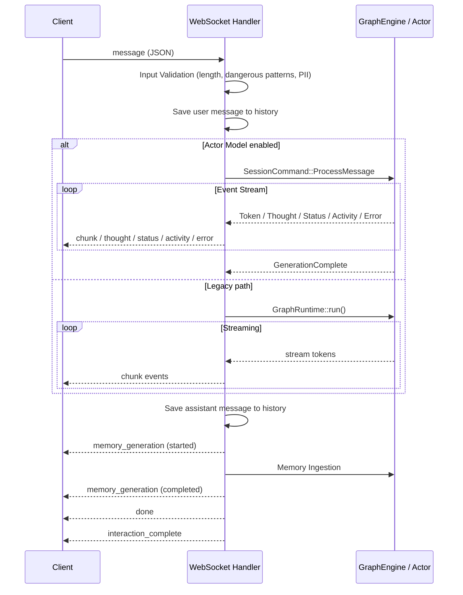

# Tepora フロントエンド技術要求仕様書 (大規模改修向け)

## 1. 目的と背景
本ドキュメントは、Teporaのフロントエンド（Web/Tauri）の大規模改修に向けた「技術的・アーキテクチャ的」な要求仕様を定義するものです。
バックエンド（Rust）との境界（契約）、状態管理の責務、パフォーマンス、テスト戦略、および技術的負債の解消に焦点を当てており、視覚的なデザインやレイアウトに関する言及はスコープ外とします。

---

## 2. バックエンド・フロントエンド間のインターフェース要求

### 2.1 WebSocket (tepora.v1 プロトコル) 通信の安定化と制御
- **コネクション管理の堅牢化**: 再接続ロジック（Exponential Backoff）の実装。接続断や認証エラー時（VITE_SESSION_TOKEN等の無効化）の適切なフォールバック処理。
- **メッセージの順序保証と重複排除**: バックエンドから送信されるイベントストリーム（Token, Activity, State, Metrics）を正確に処理し、UIへの反映順序を保証すること。
- **ペイロード型の厳格化**: TypeScriptの型定義（`types/`）とバックエンドのRust構造体（`WsIncomingMessage`, `WsOutgoingMessage`等）を厳密に同期させる仕組み（または運用ルール）の徹底。
- **タイムアウトとキャンセル**: バックエンドへの長時間の推論リクエスト（`timeout` パラメータ等）に対するクライアント側でのタイムアウト制御と、中途キャンセル（Abort）の安全な処理。
- **順序保証の実装条件**: ストリーミング系イベントには共通メタデータ `eventId`, `streamId`, `seq`, `emittedAt` を必須とする。クライアントは `streamId + seq` で順序制御し、`eventId` で重複排除を行う。`seq` は同一 `streamId` 内で単調増加、欠番時はバッファまたは再同期扱いとする。
- **再接続時の整合性ルール**: 接続再確立後に既存ストリームを暗黙に継続しない。再接続後は旧ストリームを失効とみなし、必要な場合のみサーバーから `history` / `session_changed` / 明示的な再実行で状態を再構築する。

### 2.2 REST API インターフェース
- **データフェッチ戦略**: 設定（`/api/config`）、カスタムエージェント（`/api/custom-agents`）、メモリ操作（`/api/memory/*`）、モデル情報などの同期的なデータ取得において、エラーハンドリングとリトライ機構を統一すること。
- **認証情報（トークン）のインジェクション**: 全てのアウトバウンドリクエスト（REST/WebSocket）に対して、セッショントークンを確実に付与するインターセプタ機構の整備。
- **Query既定値の明文化**: `QueryClient` のデフォルト設定を明示的に上書きする。`config` / `sessions` / `agent-skills` / `models` のような準静的データは `staleTime` を 30秒以上、`retry` は 1回以下、`refetchOnWindowFocus` は `false` を原則とする。`runtime metrics` / `setup progress` / `compaction_jobs` のような動的データはポーリングまたは手動再読込を明示的に設計し、Mutation の `retry` は原則 `0` とする。
- **HTTPキャンセルとWS停止の分離**: `fetch` / Query のキャンセルは `AbortSignal` ベースで扱い、生成停止は WebSocket の `stop` メッセージで扱う。両者を同一の抽象で隠蔽せず、責務を分離する。

### 2.3 実行時型バリデーション (Runtime Type Validation)
- **境界におけるスキーマ検証の必須化**: コンパイル時のTypeScript定義（`unknown` からのキャストなど）に依存せず、Zod や Valibot 等のバリデーションライブラリを用いて、APIレスポンスおよびWebSocketメッセージ（`WsOutgoingMessage` 相当）の実行時型チェックを行う。不正なペイロードは境界で弾き、フロントエンド内部のデータ不整合を防ぐ。
- **採用ライブラリ**: 実行時型バリデーションは `Zod` を正式採用する。クライアントbundle sizeよりも開発効率・表現力・周辺エコシステムを優先し、メモリフットプリント上の明確な不利が確認されない限り、Valibot への置換は行わない。

### 2.4 契約同期戦略 (Rust <-> TypeScript)
- **単一の真実源 (Single Source of Truth)**: Rust側のAPI/WS契約を単一の真実源とし、フロントエンド型はそこから生成または検証可能な形式で同期する。手書きの二重管理を原則禁止する。
- **推奨実装**: Rust構造体から JSON Schema / OpenAPI / それに準ずる機械可読な契約を生成し、TypeScript型と実行時バリデーションスキーマを同一契約から導出する。
- **変更管理**: 契約変更は破壊的変更の有無をレビューで明示し、フロントエンド型・バリデータ・モックテストを同一PR内で更新する。

---

## 3. WebSocket プロトコル仕様 (tepora.v1)

### 3.1 接続

```
ws://127.0.0.1:{port}/ws
```

#### 認証
- `Sec-WebSocket-Protocol` ヘッダーに以下の2つのサブプロトコルを指定:
  1. `tepora.v1` — アプリケーションプロトコル識別子
  2. `tepora-token.{hex(session_token)}` — 認証トークン（HEXエンコード）
- Origin ヘッダーの検証: `config.yml` の `server.cors_allowed_origins` / `server.ws_allowed_origins` に基づくAllowlist。`TEPORA_ENV != production` の場合に限り、Origin未設定を許可。

#### ハートビート
- サーバーは **10秒間隔** で WebSocket Ping フレームを送信。
- Ping 送信失敗時、サーバー側でコネクションをクローズ。

### 3.2 クライアント → サーバー メッセージ (WsIncomingMessage)

全メッセージは JSON オブジェクトとして送信。`type` フィールドでメッセージ種別を判別。

#### `message` (通常メッセージ送信)

`type` フィールド省略可。省略時は `message` として処理。

```typescript
interface WsMessagePayload {
  type?: undefined;       // 省略可
  clientMessageId: string; // クライアント生成の一意ID (UUID推奨)
  message: string;        // ユーザー入力テキスト (必須, max: app.max_input_length)
  mode: ChatMode;         // "chat" | "search" | "agent"
  sessionId?: string;     // 対象セッションID (デフォルト: 現在のセッション)
  attachments?: Attachment[]; // 添付ファイル（オプション）
  skipWebSearch?: boolean; // Web検索スキップフラグ
  thinkingBudget?: number; // Thinking Mode 予算 (0-3, サーバー側で min(val, 3) にクランプ)
  agentId?: string;       // Agent Skills ID
  agentMode?: AgentMode;  // "high" | "fast" | "low" | "direct"
  timeout?: number;       // タイムアウト (ミリ秒)
}
```

> **バリデーション**: `message` が `app.max_input_length` 超過時は `error` イベントを返却。`app.dangerous_patterns` にマッチ時も拒否。PII検出（添付ファイル）時は `error` イベント（Conflictステータス）を返却。

#### `stop` (生成停止)

```typescript
{ type: "stop" }
```

レスポンス: `{ "type": "stopped" }` を即時返却。Actor Model 有効時は該当セッションの `StopGeneration` コマンドもディスパッチ。

#### `get_stats` (メモリ統計取得)

```typescript
{ type: "get_stats" }
```

レスポンス: `stats` イベント (§3.3参照)

#### `set_session` (セッション切替)

```typescript
{ type: "set_session", sessionId: string }
```

レスポンス:
1. `{ "type": "session_changed", "sessionId": "<new_id>" }`
2. `{ "type": "history", "messages": [...] }` — 切替先セッションの直近100件の履歴

#### `regenerate` (応答再生成)

```typescript
{ type: "regenerate" }
```

動作:
1. `regenerate_started` イベントを返却
2. 直前のユーザーメッセージを取得し、末尾のアシスタント/システムメッセージを削除
3. 保存済みの `additional_kwargs` (mode, agentId, agentMode, attachments, thinkingBudget, skipWebSearch) を復元して再実行
4. 通常の生成フロー (chunk → done) と同じイベントを返却

#### `tool_confirmation_response` (ツール承認応答)

```typescript
{
  type: "tool_confirmation_response";
  requestId: string;
  decision: ApprovalDecision;  // "deny" | "once" | "always_until_expiry"
  ttlSeconds?: number;         // "always_until_expiry" 時の有効期限 (秒)
  approved?: boolean;          // レガシー互換 (true → once, false → deny)
}
```

> **注意**: `decision` + `ttlSeconds` が優先。`decision` 未指定時のみ `approved` フィールドにフォールバック。

#### `perf_probe` (パフォーマンスプローブ)

```typescript
{ type: "perf_probe" }
```

環境変数 `TEPORA_PERF_PROBE_ENABLED=1` 設定時のみ有効。デバッグ/テスト用。

### 3.3 サーバー → クライアント メッセージ (WsOutgoingMessage)

全メッセージは `type` フィールドで識別。フロントエンドの `WebSocketMessage` 型で定義。

#### 共通メタデータ

ストリーミングまたは状態同期に関与する全メッセージは、以下の共通フィールドを含む。

```typescript
interface WsEnvelopeBase {
  eventId: string;        // サーバー生成の一意ID
  streamId: string;       // 同一生成フロー / 同一同期フローを識別
  seq: number;            // 同一 streamId 内で単調増加
  emittedAt: string;      // ISO 8601
  requestId?: string;     // 対応する clientMessageId または要求ID
  replay?: boolean;       // 再送/再同期イベント時のみ true
}
```

クライアントは `eventId` の既読集合を保持して重複排除を行い、`streamId + seq` で順序を確定する。`done`, `error`, `stopped`, `interaction_complete` は同一 `streamId` を共有する終端イベントとして扱う。

| type | 説明 | ペイロード |
|------|------|-----------|
| `chunk` | ストリーミング応答トークン | `{ message: string, mode?: string, nodeId?: string, agentName?: string }` |
| `thought` | 思考過程 (CoT) | `{ content: string }` |
| `done` | 生成完了 | `{}` |
| `status` | 処理状態更新 | `{ message: string }` |
| `activity` | ノード進捗/アクティビティ | `{ data: { id: string, status: string, message: string, agentName?: string } }` |
| `error` | エラー | `{ message: string }` |
| `history` | チャット履歴 (set_session時) | `{ messages: HistoryMessage[] }` |
| `stats` | メモリ統計 | `{ data: MemoryStatsData }` |
| `search_results` | 検索結果 | `{ data: SearchResult[] }` |
| `tool_confirmation_request` | ツール承認要求 | `{ data: ToolConfirmationRequest }` |
| `session_changed` | セッション変更通知 | `{ sessionId: string }` |
| `stopped` | 停止完了 | `{}` |
| `regenerate_started` | 再生成開始通知 | `{}` |
| `memory_generation` | メモリ保存進捗 | `{ status: "started" \| "completed" \| "error", sessionId?: string }` |
| `download_progress` | モデルDL進捗 | `{ data: DownloadProgressData }` |
| `interaction_complete` | DB書き込み完了通知 | `{ sessionId: string }` |
| `node_completed` | グラフノード完了通知 (Actor Model時) | `{ nodeId: string, output: string }` |

#### 主要データ型定義

```typescript
// --- stats イベント data ---
interface MemoryStatsData {
  total_events: number;
  em_llm_enabled: boolean;
  memory_events: number;
  retrieval: { limit: number; min_score: number };
  char_memory: {
    total_events: number;
    layer_counts: { lml: number; sml: number };
    mean_strength: number;
  };
  prof_memory: {
    total_events: number;
    layer_counts: { lml: number; sml: number };
    mean_strength: number;
  };
}

// --- history イベント messages の要素 ---
interface HistoryMessage {
  id: string;
  role: "user" | "assistant" | "system";
  content: string;
  timestamp: string;    // ISO 8601
  mode: string;         // "chat" | "search" | "agent"
  isComplete: boolean;  // 常に true
}

// --- tool_confirmation_request イベント data ---
interface ToolConfirmationRequest {
  requestId: string;
  toolName: string;
  toolArgs: Record<string, unknown>;
  description?: string;
  scope: PermissionScopeKind;   // "native_tool" | "mcp_server"
  scopeName: string;
  riskLevel: PermissionRiskLevel; // "low" | "medium" | "high" | "critical"
  expiryOptions: number[];      // TTL選択肢 (秒)
}

// --- search_results イベント data ---
interface SearchResult {
  title: string;
  url: string;
  snippet: string;
}
```

### 3.4 メッセージ処理フロー



---

## 4. REST API 仕様

### 4.0 共通仕様

#### 認証
- 全APIエンドポイント（`/health` と `/api/status` を除く）は `x-api-key` ヘッダーによる認証が必須。
- トークンはバックエンド起動時に生成され、`~/.tepora/.session_token` に保存。
- フロントエンドは `VITE_SESSION_TOKEN` 環境変数または Tauri のトークン読み込みロジックで取得。

#### レート制限
- 全APIルートに `rate_limit_middleware` が適用。

#### CORS
- `config.yml` の `server.cors_allowed_origins` に基づく Allowlist。
- 許可メソッド: `GET`, `POST`, `PUT`, `PATCH`, `DELETE`, `OPTIONS`
- 許可ヘッダー: `Accept`, `Content-Type`, `x-api-key`

#### エラーレスポンス形式
```typescript
interface ApiErrorResponse {
  error: string;     // エラーメッセージ
  status?: number;   // HTTPステータスコード
}
```

主要エラーコード:
| ステータス | 意味 |
|-----------|------|
| `400` | BadRequest — バリデーションエラー |
| `401` | Unauthorized — 認証失敗 |
| `403` | Forbidden — 権限不足 |
| `404` | NotFound — リソースが存在しない |
| `409` | Conflict — ロックダウン有効時の操作など |
| `429` | TooManyRequests — レート制限超過 |
| `500` | Internal Server Error |

### 4.1 ヘルスチェック・システム

| メソッド | エンドポイント | 認証 | 説明 |
|---------|--------------|------|------|
| `GET` | `/health` | 不要 | ヘルスチェック。`"OK"` を返却 |
| `GET` | `/api/status` | 不要 | システムステータス（初期化状態、メモリ、メッセージ数等） |
| `POST` | `/api/shutdown` | 必要 | サーバーのグレースフルシャットダウン |

#### GET /api/status レスポンス
```typescript
interface StatusResponse {
  initialized: boolean;
  em_llm_enabled: boolean;
  total_messages: number;
  memory_events: number;
}
```

### 4.2 認証

| メソッド | エンドポイント | 説明 |
|---------|--------------|------|
| `POST` | `/api/auth/refresh` | セッショントークンの更新 |

> **注**: `features.redesign.session_expiration` フラグが有効時のみ動作。無効時は `400 BadRequest` を返却。

#### POST /api/auth/refresh レスポンス
```typescript
{ token: string; expires_at: string } // ISO 8601
```

#### トークン更新時のフロントエンド動作
- トークン更新成功後、フロントエンドは以後のRESTリクエストに新トークンを使用し、既存WebSocket接続を明示的に閉じて新トークンで再接続する。
- 旧接続上の進行中ストリームは接続切断時点で失効とみなし、自動で新接続へ移送しない。必要に応じて `regenerate` または再送信で復旧する。

### 4.3 設定管理

| メソッド | エンドポイント | 説明 |
|---------|--------------|------|
| `GET` | `/api/config` | 現在の設定取得（機密値はマスク） |
| `POST` | `/api/config` | 設定の全体更新 |
| `PATCH` | `/api/config` | 設定の部分更新 |
| `POST` | `/api/config/secrets/rotate` | シークレットのローテーション |

#### GET /api/config レスポンス
`config.yml` の内容を JSON として返却。APIキー等の機密値は `"****"` でマスク。

#### POST /api/config リクエスト
```typescript
// config.yml 全体を置換する JSON オブジェクト
Record<string, unknown>
```

#### PATCH /api/config リクエスト
```typescript
// 部分更新する JSON オブジェクト。指定キーのみ更新。
Record<string, unknown>
```

### 4.4 セッション管理

| メソッド | エンドポイント | 説明 |
|---------|--------------|------|
| `GET` | `/api/sessions` | セッション一覧 |
| `POST` | `/api/sessions` | 新規セッション作成 |
| `GET` | `/api/sessions/:session_id` | セッション詳細 + 直近メッセージ |
| `PATCH` | `/api/sessions/:session_id` | セッションタイトル更新 |
| `DELETE` | `/api/sessions/:session_id` | セッション削除 |
| `GET` | `/api/sessions/:session_id/messages` | メッセージ履歴取得 |

#### GET /api/sessions レスポンス
```typescript
{ sessions: Session[] }

interface Session {
  id: string;              // UUID
  title: string | null;
  created_at: string;      // ISO 8601
  updated_at: string;      // ISO 8601
  message_count: number;
  preview: string | null;  // 直近メッセージのプレビュー
}
```

#### POST /api/sessions リクエスト / レスポンス
```typescript
// Request
{ title?: string | null }

// Response
{ session: Session }
```

#### PATCH /api/sessions/:session_id リクエスト
```typescript
{ title: string }
```

#### GET /api/sessions/:session_id/messages
```typescript
// Query params: ?limit=100 (デフォルト: 100)

// Response
{
  messages: {
    id: string;
    role: "user" | "assistant" | "system";
    content: string;
    timestamp: string;
    mode?: string;
  }[]
}
```

### 4.5 メトリクス

| メソッド | エンドポイント | 説明 |
|---------|--------------|------|
| `GET` | `/api/sessions/:session_id/metrics` | セッション別AgentEventログ |
| `GET` | `/api/metrics/runtime` | ランタイムメトリクススナップショット |

#### GET /api/sessions/:session_id/metrics レスポンス
```typescript
{ events: AgentEvent[] }
```

#### GET /api/metrics/runtime レスポンス
```typescript
// RuntimeMetricsSnapshot — Actor Model のランタイム統計
interface RuntimeMetricsSnapshot {
  active_sessions: number;
  total_dispatched: number;
  // ... (infrastructure/observability で定義)
}
```

### 4.6 ログ管理

| メソッド | エンドポイント | 説明 |
|---------|--------------|------|
| `GET` | `/api/logs` | ログファイル一覧 |
| `GET` | `/api/logs/:filename` | 特定ログファイルの内容取得 |
| `POST` | `/api/logs/frontend` | フロントエンドログの送信 |

#### GET /api/logs レスポンス
```typescript
{ logs: string[] }  // ファイル名の配列
```

#### GET /api/logs/:filename レスポンス
```typescript
{ content: string }
```

### 4.7 Agent Skills

| メソッド | エンドポイント | 説明 |
|---------|--------------|------|
| `GET` | `/api/agent-skills` | Skill一覧 + ルート情報 |
| `GET` | `/api/agent-skills/:skill_id` | Skill package 詳細取得 |
| `POST` | `/api/agent-skills` | Skill package 保存/更新 |
| `DELETE` | `/api/agent-skills/:skill_id` | Skill package 削除 |

#### GET /api/agent-skills レスポンス
```typescript
interface AgentSkillsResponse {
  roots: SkillRootInfo[];
  skills: AgentSkillSummary[];
}

interface SkillRootInfo {
  path: string;
  enabled: boolean;
  label?: string;
  writable: boolean;
}

interface AgentSkillSummary {
  id: string;
  name: string;
  description: string;
  package_dir: string;
  root_path: string;
  root_label?: string;
  metadata: Record<string, unknown>;
  display_name?: string;
  short_description?: string;
  valid: boolean;
  writable: boolean;
  warnings: string[];
}
```

#### GET /api/agent-skills/:skill_id レスポンス
```typescript
interface AgentSkillPackage extends AgentSkillSummary {
  skill_markdown: string;
  skill_body: string;
  openai_yaml?: string | null;
  references: SkillFileEntry[];
  scripts: SkillFileEntry[];
  assets: SkillFileEntry[];
  other_files: SkillFileEntry[];
}

interface SkillFileEntry {
  path: string;
  kind: string;          // "reference" | "script" | "asset" | "other"
  content: string;
  encoding: "utf8" | "hex" | string;
}
```

#### POST /api/agent-skills リクエスト
```typescript
interface AgentSkillSaveRequest {
  id: string;
  root_path?: string;
  skill_markdown: string;
  openai_yaml?: string | null;
  references: SkillFileEntry[];
  scripts: SkillFileEntry[];
  assets: SkillFileEntry[];
  other_files: SkillFileEntry[];
}
```

### 4.8 ツール

| メソッド | エンドポイント | 説明 |
|---------|--------------|------|
| `GET` | `/api/tools` | 利用可能なネイティブ/MCPツール一覧 |

#### GET /api/tools レスポンス
```typescript
interface ToolInfo {
  name: string;
  description: string;
}
// Response: ToolInfo[]
```

### 4.9 メモリ管理

| メソッド | エンドポイント | 説明 |
|---------|--------------|------|
| `POST` | `/api/memory/compress` | 記憶イベントの圧縮/コンパクション (非同期ジョブ) |
| `GET` | `/api/memory/compaction_jobs` | コンパクションジョブ一覧 |
| `POST` | `/api/memory/decay` | 記憶の減衰サイクル実行 |

#### POST /api/memory/compress リクエスト / レスポンス
```typescript
// Request
interface CompressMemoriesRequest {
  session_id?: string;   // デフォルト: "default"
  model_id?: string;     // 使用するLLMモデルID
  scope?: "Char" | "Prof"; // メモリスコープ
}

// Response (202 Accepted)
{ status: "queued"; job_id: string; session_id: string }
```

> **非同期処理**: ジョブはバックグラウンドで実行。進捗は `GET /api/memory/compaction_jobs` で確認。

#### GET /api/memory/compaction_jobs
```typescript
// Query params: ?session_id=xxx&scope=Char&status=running

// Response
{
  session_id: string;
  jobs: CompactionJob[];
}

interface CompactionJob {
  id: string;
  session_id: string;
  scope: "Char" | "Prof";
  status: "queued" | "running" | "done" | "failed";
  scanned_events: number;
  merged_groups: number;
  replaced_events: number;
  created_events: number;
  created_at: string;     // ISO 8601
  finished_at?: string;   // ISO 8601
}
```

#### POST /api/memory/decay リクエスト / レスポンス
```typescript
// Request
{ session_id?: string }

// Response
{ status: "success"; result: DecayResult }
```

### 4.10 セキュリティ

| メソッド | エンドポイント | 説明 |
|---------|--------------|------|
| `POST` | `/api/security/lockdown` | ロックダウンモードの有効化/無効化 |
| `GET` | `/api/security/permissions` | 付与済みパーミッション一覧 |
| `DELETE` | `/api/security/permissions/:kind/:name` | パーミッションの取り消し |
| `GET` | `/api/security/audit/verify` | 監査ログのチェイン検証 |
| `GET` | `/api/credentials/status` | クレデンシャルのステータス一覧 |
| `POST` | `/api/credentials/rotate` | クレデンシャルのローテーション |
| `POST` | `/api/backup/export` | 暗号化バックアップのエクスポート |
| `POST` | `/api/backup/import` | バックアップのインポート |

#### POST /api/security/lockdown リクエスト
```typescript
{ enabled: boolean; reason?: string }
```

#### GET /api/security/permissions レスポンス
```typescript
{
  permissions: PermissionEntry[];
}

interface PermissionEntry {
  scope_kind: "native_tool" | "mcp_server";
  scope_name: string;
  decision: "deny" | "once" | "always_until_expiry";
  expires_at?: string | null;
  created_at?: string | null;
  updated_at?: string | null;
}
```

#### DELETE /api/security/permissions/:kind/:name
- `:kind` — `native_tool` / `native_tools` / `mcp_server` / `mcp_servers`
- `:name` — ツール名またはMCPサーバー名

#### GET /api/security/audit/verify レスポンス
```typescript
interface AuditVerifyResult {
  valid: boolean;
  entries: number;
  failure_at?: number | null;
  message?: string | null;
}
```

#### GET /api/credentials/status レスポンス
```typescript
{
  credentials: CredentialStatus[];
}

interface CredentialStatus {
  provider: string;
  status: string;
  present: boolean;
  expires_at?: string | null;
  last_rotated_at?: string | null;
}
```

#### POST /api/credentials/rotate リクエスト
```typescript
{ provider: string; secret: string; expires_at?: string }
```

#### POST /api/backup/export リクエスト / レスポンス
```typescript
// Request
interface BackupExportRequest {
  passphrase: string;
  include_chat_history?: boolean;
  include_settings?: boolean;
  include_characters?: boolean;
  include_executors?: boolean;
}

// Response
{
  success: boolean;
  archive: {
    filename: string;
    archive: BackupEnvelope;
    manifest: BackupManifest;
  };
}

interface BackupEnvelope {
  version: number;
  algorithm: string;     // "AES-256-GCM"
  nonce_hex: string;
  ciphertext_hex: string;
}

interface BackupManifest {
  schema_version: number;
  exported_at: string;
  include_chat_history: boolean;
  include_settings: boolean;
  include_characters: boolean;
  include_executors: boolean;
}
```

#### POST /api/backup/import リクエスト
```typescript
interface BackupImportRequest {
  stage: "preview" | "apply";  // preview: 検証のみ, apply: 実際に適用
  passphrase: string;
  archive: BackupEnvelope;
}
```

### 4.11 MCP (Model Context Protocol) 管理

| メソッド | エンドポイント | 説明 |
|---------|--------------|------|
| `GET` | `/api/mcp/status` | MCPサーバー接続ステータス |
| `GET` | `/api/mcp/config` | MCP設定取得 |
| `POST` | `/api/mcp/config` | MCP設定更新 |
| `GET` | `/api/mcp/store` | MCPサーバーレジストリ（利用可能サーバー一覧） |
| `GET` | `/api/mcp/policy` | 接続ポリシー取得 |
| `PATCH` | `/api/mcp/policy` | 接続ポリシー更新 |
| `POST` | `/api/mcp/install/preview` | インストールプレビュー（検証のみ） |
| `POST` | `/api/mcp/install/confirm` | インストール確認（実行） |
| `POST` | `/api/mcp/servers/:name/approve` | サーバーの接続承認 |
| `POST` | `/api/mcp/servers/:name/revoke` | サーバーの承認取り消し |
| `POST` | `/api/mcp/servers/:name/enable` | サーバーの有効化 |
| `POST` | `/api/mcp/servers/:name/disable` | サーバーの無効化 |
| `DELETE` | `/api/mcp/servers/:name` | サーバーの削除 |

### 4.12 セットアップ・モデル管理

| メソッド | エンドポイント | 説明 |
|---------|--------------|------|
| `POST` | `/api/setup/init` | セットアップ初期化 |
| `POST` | `/api/setup/preflight` | 事前チェック（容量/権限） |
| `GET` | `/api/setup/requirements` | セットアップ要件チェック |
| `GET` | `/api/setup/default-models` | 推奨モデルリスト |
| `POST` | `/api/setup/run` | セットアップ開始 |
| `GET` | `/api/setup/progress` | セットアップ進捗 |
| `POST` | `/api/setup/finish` | セットアップ完了 |
| `GET` | `/api/setup/models` | 登録済みモデル一覧 |
| `GET` | `/api/setup/model/roles` | 役割ごとのモデル割当取得 |
| `POST` | `/api/setup/model/roles/character` | デフォルトキャラクターモデル割当 |
| `POST` | `/api/setup/model/roles/character/:character_id` | キャラクター別モデル割当 |
| `DELETE` | `/api/setup/model/roles/character/:character_id` | キャラクター別モデル割当削除 |
| `POST` | `/api/setup/model/roles/agent/:agent_id` | Agent別モデル割当 |
| `DELETE` | `/api/setup/model/roles/agent/:agent_id` | Agent別モデル割当削除 |
| `POST` | `/api/setup/model/roles/professional` | プロフェッショナルモデル割当 |
| `DELETE` | `/api/setup/model/roles/professional/:task_type` | プロフェッショナル割当削除 |
| `POST` | `/api/setup/model/active` | アクティブモデル設定 |
| `POST` | `/api/setup/model/reorder` | モデル表示順更新 |
| `POST` | `/api/setup/model/check` | モデル詳細情報取得 |
| `POST` | `/api/setup/model/download` | モデルダウンロード |
| `POST` | `/api/setup/model/local` | ローカルモデル登録 |
| `DELETE` | `/api/setup/model/:model_id` | モデル削除 |
| `POST` | `/api/setup/models/ollama/refresh` | Ollamaモデル同期 |
| `POST` | `/api/setup/models/lmstudio/refresh` | LM Studioモデル同期 |
| `GET` | `/api/setup/model/update-check` | モデル更新確認 |
| `GET` | `/api/setup/binary/update-info` | llama.cppバイナリ更新情報 |
| `POST` | `/api/setup/binary/update` | llama.cppバイナリ更新実行 |

#### GET /api/setup/models レスポンス (参考)
```typescript
interface ModelInfo {
  id: string;
  display_name: string;
  role: string;
  file_size: number;
  filename?: string;
  file_path?: string;
  source: string;         // "local" | "downloaded" | "ollama" | "lmstudio"
  loader?: string;        // "llama_cpp" | "ollama" | "lmstudio" | "openai_compatible"
  is_active?: boolean;
  tokenizer_path?: string;
  tokenizer_format?: string;
}
```

---

## 5. アーキテクチャとディレクトリ構成の再構築 (DDD / Feature-Sliced Design)

### 5.1 モジュール境界の厳格化
- 現在の `Tepora-app/frontend/src/features/` 配下（`chat`, `navigation`, `session`, `settings`）の独立性を高め、Feature 間の直接参照（循環参照）をLintツール等で静的に禁止する。
- 共通ロジック（`utils`, `types`, `hooks`）と機能特化ロジックの依存方向を単方向に保つ（Shared -> Feature）。

### 5.2 状態管理 (State Management) の責務分離
- **サーバー状態 (Server State)**: バックエンドから取得する非同期データ（APIレスポンス、エージェントリスト、設定値など）は、`@tanstack/react-query` に完全に移譲し、キャッシュ・リトライ・無効化のライフサイクルを管理する。
- **クライアント状態 (Client State)**: UIの開閉状態、入力中のテキスト（ドラフト）、ローカルのフィルタリング状態などは、`useState` または `useReducer` を用いてコンポーネントツリーに局所化する。
- **グローバル状態 (Global State)**: `zustand` (`stores/`) は、複数のFeatureを跨ぐ真のグローバル状態（例：現在選択されているエージェントID、グローバルなエラー通知状態、WebSocketのコネクションオブジェクト等）の管理に限定し、肥大化を防ぐ。
- **複雑なステートマシン (XState)**: バックエンドのActor Modelに呼応するような複雑な状態遷移（チャット生成フローの制御やツール呼び出しのシーケンス等）は `@xstate/react` を用いて宣言的に管理する。Zustand (単純なデータストア) と XState (ロジック・遷移フロー管理) の役割を明確に切り分ける。
- **Queryエラー回復**: Query由来の失敗は route/page 単位の Error Boundary と `QueryErrorResetBoundary` を連携させ、再試行UIから Query cache を安全にリセットできる構成にする。
- **メモリフットプリント優先の保持戦略**: ローカルLLMの実行メモリを優先するため、フロントエンドの常駐メモリ使用量を抑制する。`React Query` の `gcTime` は短めに設定し、inactive query の長時間保持を避ける。永続キャッシュは原則無効とし、大きなレスポンスを複数層で重複保持しない。
- **XState context の制約**: State machine の context には状態遷移に必要な最小限のID・フラグ・要求メタデータのみを保持し、メッセージ本文・履歴配列・重い派生データは保持しない。

### 5.3 国際化 (i18n) アーキテクチャ
- **多言語基盤の整備**: `react-i18next` を使用し、翻訳キーと値をコンポーネントから分離して厳密に管理する。
- **リソース分割**: 巨大な単一翻訳ファイルを避け、Feature（機能）やPage単位でのNameSpace分割と遅延ロードを検討する。
- **静的解析と自動化**: 存在しないキーの呼び出しや翻訳漏れを防ぐため、TypeScriptによる型付け、Lint連携、および既存の `i18n-auto-key` スキル等を活用した自動検証・CIパイプラインの構築を行う。

### 5.4 ルーティングと例外処理 (Error Boundary)
- **ルーティング戦略**: `React Router v7` は **Data Mode** を正式採用する。Vite + SPA/Tauri 構成では `createBrowserRouter` / `RouterProvider` を基準とし、Loader / Action / route-level Error Boundary を使用する。Framework Mode への移行は別途要件が生じた場合のみ検討する。
- **Tauri と Web のルーター統一**: 原則は Browser Router を用いるが、Tauri 配布形態や deep-link 要件により履歴APIの制約が生じる場合のみ Hash Router を選択する。選択は実装前に一度だけ決定し、環境ごとの分岐を常態化させない。
- **フォールバックと Error Boundary**: アプリケーション全体、ルート単位、機能コンポーネント単位の３層で境界を分ける。Route loader/action の失敗は route-level Error Boundary、React Query 失敗は `QueryErrorResetBoundary` 連携、局所Widgetのクラッシュは feature boundary で吸収する。

---

## 6. パフォーマンスとリソース最適化

### 6.1 レンダリング最適化 (React 19+)
- **無駄な再レンダリングの抑止**: 頻繁に更新される WebSocket からのストリーミングデータ（特に `MessageBubble` 内のトークン追加）が、親コンポーネント（`MessageList` や `ChatInterface`）全体を再レンダリングさせないアーキテクチャ設計。
- **React Compiler (段階導入)**: React Compiler は必須前提ではなく段階導入とする。採用時は Vite/Babel パイプラインへ明示的に組み込み、ベンチマークで効果が確認できた領域から適用する。Compiler 前提の最適化を仕様の必須条件にしない。
- **履歴データの常駐抑制**: 長いチャット履歴は全件を常時メモリ保持しない。表示は windowing / virtualization を前提とし、直近表示に必要な範囲のみを常駐させ、古い履歴はページングまたはオンデマンド再取得する。
- **重い派生データの再利用制御**: Markdown変換結果、Syntax Highlight結果、添付ファイルの展開結果などの重い派生データは全件キャッシュしない。必要な範囲でのみ計算・保持し、画面外データについては破棄可能な設計にする。

### 6.2 バンドルサイズと読み込み速度
- **コードスプリッティング**: `React.lazy` / `Suspense` を用いたルートレベル（`Pages/`）や大型コンポーネントの動的インポート。
- **依存関係の精査**: `package.json` の依存パッケージを見直し、不要なライブラリの削除や軽量な代替ライブラリへの移行（例：巨大なアイコンライブラリのTree-shaking対応の確認）。

---

## 7. テスト・品質保証とCI/CD連携

### 7.1 テスト戦略 (Vitest / React Testing Library / Playwright)
- **ビジネスロジックのカバレッジ**: `hooks/` や `utils/`、状態管理（`stores/`）のユニットテスト（Vitest）を拡充し、エッジケース（例：バックエンドからの不正なJSON、タイムアウト）を網羅する。
- **コンポーネントテスト**: ロジックとビュー（DOM）を分離し、複雑な状態を持つコンポーネント（例：`InputArea` における `thinkingBudget` の制御や添付ファイル処理）の振る舞いをテストする。
- **Web E2E/結合テスト**: Playwright を用い、フロントエンドとバックエンド（またはモック）を結合したクリティカルパス（チャット送信〜応答ストリーミング完了まで）の自動テストを継続的に実行する。
- **Desktop E2E/スモークテスト**: Tauri デスクトップ固有機能は Web E2E と分離して扱う。Tauri 公式の WebDriver 互換テスト手法または統合ハーネスを使用し、少なくとも sidecar 起動、トークン取得、更新確認、ローカルファイル連携を検証対象に含める。macOS では公式制約により desktop WebDriver client がないことを前提に、必要な検証手段を別途設計する。

### 7.2 静的解析と品質ゲート (QA Checks)
- **TypeScript 厳格化**: `tsconfig.json` の `strict` モードを維持し、`any` 型の使用を禁止する（プロジェクトルール準拠）。
- **Lint ルール**: `npm run lint` (`eslint . --max-warnings 0`) を CI パイプラインで確実にパスさせる。未使用変数や未処理のPromise等の潜在的バグを早期検知するルールの追加。

---

## 8. 特殊環境 (Browser / Web) への対応

### 8.1 ブラウザ環境との差分吸収
- **基準環境の定義**: Tepora は Tauri デスクトップアプリを基準環境とする。Webブラウザ版は特殊環境として扱い、デスクトップ前提の機能との差分を明示的に吸収する。
- **実行環境の抽象化**: Webブラウザ版と Tauri デスクトップアプリ版（`task dev-tauri`）の差異を吸収する抽象化レイヤーを維持する。ローカルファイルパスの変換 `convertFileSrc`、sidecar 利用可否、ネイティブ権限依存機能の分岐をここに集約する。
- **Sidecar 状態連携**: バックエンド（Sidecar）プロセスの起動・停止状態とフロントエンドのUI状態（起動中、エラー、準備完了）のシームレスな連携は、デスクトップ基準機能として扱う。
- **Tauri 2 Capability 管理**: `shell`, `process`, `dialog`, `updater` などのプラグイン利用は capability ベースで権限を宣言し、window / webview 単位で最小権限を付与する。開発用 capability と本番 capability を分離し、不要な権限の常時有効化を禁止する。
- **Web フォールバック方針**: ブラウザでは利用できないネイティブ機能について、無効化・代替UI・サーバー経由処理のいずれを採るかを feature ごとに定義し、単純な実行時エラーに依存しない。
