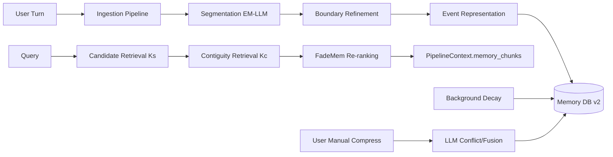

# Tepora メモリ機能 全体再設計書（EM-LLM × FadeMem）

- 作成日: 2026-02-23
- ステータス: Draft v1（実装着手用）
- 対象: `Tepora-app/backend-rs`, `Tepora-app/frontend`
- 参照論文:
  - EM-LLM: arXiv 2407.09450
  - FadeMem: arXiv 2601.18642

---

## 1. 背景と再設計目的

現行実装は、EM-LLM/FadeMemの要素を部分導入しているが、実運用経路は「会話ターン単位保存 + 埋め込み検索」に寄っている。  
この状態では、論文ベースの設計意図（イベント境界、2段階検索、重要度主導忘却）との乖離が継続的に発生する。

本再設計の目的は以下。

1. メモリ最小単位を「会話ターン」から「イベント原子」に再定義する。
1. EM-LLMの形成パイプライン（Segmentation/Refinement/Retrieval）を実行経路に戻す。
1. FadeMemの忘却・強度・レイヤー遷移を運用可能な形で常時適用する。
1. LLM高負荷処理（矛盾解決・融合）はユーザー明示トリガーのみに限定する。
1. 既存データを壊さずに段階移行できる設計にする。

---

## 2. 設計原則

1. `Local-first` と `Privacy-first` を維持する（保存データ暗号化・ローカル処理）。
1. 高頻度経路は軽量計算のみ（検索・減衰は数式とSQL中心）。
1. 高コストLLM処理は手動実行のみ（自動圧縮禁止）。
1. 既存API/UIとの互換を段階維持し、破壊的変更はバージョン境界で行う。
1. 論文整合性と実運用妥当性を両立する（チャットアプリ向け時間単位最適化）。

---

## 3. スコープ

### 3.1 In Scope

1. メモリ形成・保存・検索・減衰・圧縮の全面再設計
1. DB v2スキーマ新設と移行パス
1. バックエンドAPI再設計
1. フロントエンド設定/可視化/手動圧縮UI再設計
1. 検証戦略（ユニット・統合・E2E）定義

### 3.2 Out of Scope（本書v1では扱わない）

1. クラウド同期
1. 外部ベクトルDB移行
1. 学習済み埋め込みモデルの刷新

---

## 4. 現状課題（要点）

1. 実行経路が `ingest_interaction` 中心で、会話ターン単位保存が主体。
1. `segmenter/retrieval/integrator` は存在するが、本番経路との結線が弱い。
1. FadeMem重要度計算の `semantic_relevance` が固定値に近く、動的性が不足。
1. 圧縮は類似度クラスタ + 要約中心で、関係分類（矛盾/包含）の式対応が薄い。
1. `char_memory/prof_memory` 二系統の責務分離が未完成。

---

## 5. ターゲットアーキテクチャ（v2）



### 5.1 メモリ最小単位

- `MemoryEvent`（イベント原子）
- 1イベントは「意味的一貫性のある最小記憶断片」
- 1ターンが複数イベントに分割されることを前提化

### 5.2 時間単位（FadeMem運用）

- デフォルト時間単位を `hours` とする（チャット利用実態に適合）
- 式中の `elapsed` は `時間単位正規化値` に変換して扱う
- 設定で `hours | sessions` を切替可能にする（v2.1で `sessions` 本実装）

---

## 6. データモデル（DB v2）

方針: 既存 `episodic_events` は互換維持。新規 `memory_*` テーブル群を追加し、段階移行する。

### 6.1 テーブル定義（案）

```sql
CREATE TABLE IF NOT EXISTS memory_events (
  id TEXT PRIMARY KEY,
  session_id TEXT NOT NULL,
  scope TEXT NOT NULL,                         -- CHAR | PROF
  episode_id TEXT NOT NULL,
  event_seq INTEGER NOT NULL,                  -- episode内の順序
  source_turn_id TEXT,
  source_role TEXT,                            -- user | assistant | tool | system
  content TEXT NOT NULL,                       -- 暗号化対象
  summary TEXT,
  embedding BLOB NOT NULL,
  surprise_mean REAL,
  surprise_max REAL,
  importance REAL NOT NULL DEFAULT 0.5,
  strength REAL NOT NULL DEFAULT 1.0,
  memory_layer TEXT NOT NULL DEFAULT 'SML',    -- SML | LML
  access_count INTEGER NOT NULL DEFAULT 0,
  last_accessed_at TEXT,
  decay_anchor_at TEXT NOT NULL DEFAULT (STRFTIME('%Y-%m-%dT%H:%M:%fZ', 'now')),
  created_at TEXT NOT NULL DEFAULT (STRFTIME('%Y-%m-%dT%H:%M:%fZ', 'now')),
  updated_at TEXT NOT NULL DEFAULT (STRFTIME('%Y-%m-%dT%H:%M:%fZ', 'now')),
  is_deleted INTEGER NOT NULL DEFAULT 0
);

CREATE TABLE IF NOT EXISTS memory_edges (
  id TEXT PRIMARY KEY,
  session_id TEXT NOT NULL,
  from_event_id TEXT NOT NULL,
  to_event_id TEXT NOT NULL,
  edge_type TEXT NOT NULL,                     -- temporal_next | semantic_neighbor | compressed_from
  weight REAL NOT NULL DEFAULT 1.0,
  created_at TEXT NOT NULL DEFAULT (STRFTIME('%Y-%m-%dT%H:%M:%fZ', 'now'))
);

CREATE TABLE IF NOT EXISTS memory_compaction_jobs (
  id TEXT PRIMARY KEY,
  session_id TEXT NOT NULL,
  scope TEXT NOT NULL,
  status TEXT NOT NULL,                        -- queued | running | done | failed
  scanned_events INTEGER NOT NULL DEFAULT 0,
  merged_groups INTEGER NOT NULL DEFAULT 0,
  replaced_events INTEGER NOT NULL DEFAULT 0,
  created_events INTEGER NOT NULL DEFAULT 0,
  created_at TEXT NOT NULL DEFAULT (STRFTIME('%Y-%m-%dT%H:%M:%fZ', 'now')),
  finished_at TEXT
);

CREATE TABLE IF NOT EXISTS memory_compaction_members (
  id TEXT PRIMARY KEY,
  job_id TEXT NOT NULL,
  original_event_id TEXT NOT NULL,
  new_event_id TEXT NOT NULL
);
```

### 6.2 インデックス

1. `memory_events(session_id, scope, created_at DESC)`
1. `memory_events(session_id, scope, strength DESC)`
1. `memory_events(session_id, scope, memory_layer, strength DESC)`
1. `memory_edges(session_id, from_event_id)`
1. `memory_edges(session_id, to_event_id)`

---

## 7. 主要ドメインモデル（Rust）

```rust
enum MemoryScope { Char, Prof }
enum MemoryLayer { SML, LML }

struct MemoryEvent {
  id: String,
  session_id: String,
  scope: MemoryScope,
  episode_id: String,
  event_seq: u32,
  content: String,
  embedding: Vec<f32>,
  importance: f64,
  strength: f64,
  layer: MemoryLayer,
  access_count: u32,
  created_at: DateTime<Utc>,
  last_accessed_at: Option<DateTime<Utc>>,
}
```

---

## 8. パイプライン設計

## 8.1 取り込み（Ingestion）

1. ターンを正規化（user/assistant/tool/system をソース化）
1. セグメンテーション
   - 優先: `logprobs` による surprise segmentation（EM-LLM準拠）
   - 代替: sentence embedding の semantic change segmentation
1. boundary refinement（modularity / conductance）
1. representative selection + embedding生成
1. 初期 importance 計算
1. `SML, strength=1.0` で `memory_events` 保存
1. episode内順序と `memory_edges(temporal_next)` を保存

補足: 1ターン=1イベントの保存は禁止（フォールバック時でも最小2候補分割を試行）。

## 8.2 検索（Retrieval）

1. Query embedding 生成
1. Stage1: 類似検索で `Ks` 件候補取得
1. Stage2: `memory_edges` を使って連続イベント `Kc` 件拡張
1. Stage3: FadeMem再ランキング
   - `score = cosine_sim * strength * recency_factor(layer, elapsed)`
1. Stage4: diversity + token budget で context packing
1. 採用イベントにアクセス強化（`access_count` 更新 + `reinforce`）

## 8.3 減衰（Background）

1. `run_decay_cycle(session_id?, scope?)` を軽量定期実行
1. 各イベントで `importance -> λ_i -> strength` を再計算
1. 閾値に応じて `SML/LML` 遷移
1. `prune_threshold` 以下を論理削除（即物理削除はしない）

## 8.4 圧縮（User-triggered LLM）

1. UIの「メモリ圧縮」ボタンで明示起動
1. 候補群抽出（高類似 + 近接時間）
1. LLMで関係分類（compatible / contradictory / subsumes / subsumed）
1. LLM融合（事実保持・矛盾解決・冗長排除）
1. 新イベント作成 + provenance保存（`memory_compaction_members`）
1. 旧イベントは `is_deleted=1`（追跡可能性を維持）

---

## 9. 数式実装方針（FadeMem準拠）

1. 重要度:
   - `I_i = w_sem * rel_i + w_freq * freq_i + w_rec * rec_i`
1. 層判定:
   - `I_i >= θ_promote -> LML`
   - `I_i <= θ_demote -> SML`
1. 減衰率:
   - `λ_i = λ_base * exp(-μ * I_i)`
1. 強度:
   - `v_i(t) = v_i(t0) * exp(-λ_i * Δt^β_layer)`
1. 強化:
   - `v_i <- clamp(v_i + Δv * ln(1 + n_access), 0, 1)`

運用補正:
- `rel_i` は固定値禁止。直近検索ヒット率と局所類似度から更新する。
- `freq_i` は指数移動平均でスパイク耐性を持たせる。

---

## 10. API契約（v2）

### 10.1 REST

1. `GET /api/memory/stats`
1. `GET /api/memory/events?session_id=&scope=&layer=&cursor=&limit=`
1. `POST /api/memory/compress`（手動のみ）
1. `POST /api/memory/decay`
1. `POST /api/memory/reindex`（管理用）

### 10.2 WebSocket stats payload

```json
{
  "type": "stats",
  "data": {
    "char_memory": {
      "total_events": 120,
      "layer_counts": {"lml": 35, "sml": 85},
      "mean_strength": 0.62
    },
    "prof_memory": {
      "total_events": 48,
      "layer_counts": {"lml": 18, "sml": 30},
      "mean_strength": 0.71
    },
    "retrieval": {"limit": 8, "min_score": 0.15}
  }
}
```

---

## 11. 設定スキーマ（新設案）

```yaml
memory:
  enabled: true
  time_unit: hours                  # hours | sessions
  scope_defaults:
    chat: CHAR
    agent: PROF
  ingest:
    segmentation_mode: auto         # auto | logprob | semantic
    min_event_size: 8
    max_event_size: 128
    surprise_gamma: 1.0
    use_boundary_refinement: true
  retrieval:
    total_k: 8
    similarity_ratio: 0.7
    contiguity_ratio: 0.3
    min_score: 0.15
  decay:
    lambda_base: 0.1
    importance_modulation: 2.0
    beta_lml: 0.8
    beta_sml: 1.2
    promote_threshold: 0.7
    demote_threshold: 0.3
    prune_threshold: 0.05
    reinforcement_delta: 0.05
    alpha: 0.5
    beta: 0.3
    gamma: 0.2
  compression:
    enabled: true
    auto_run: false
    similarity_threshold: 0.9
```

互換方針:
1. 既存 `em_llm.*` は v2で読み取り互換（deprecation warning）
1. v3で `memory.*` に完全移行

---

## 12. 実装計画（段階移行）

## Phase 0: ベースライン固定

1. 現行挙動のスナップショットテスト追加
1. 既存 `episodic_events` への新規仕様追加を停止

## Phase 1: DB v2 + Store抽象

1. `memory_events` / `memory_edges` / compactionテーブル追加
1. `MemoryRepository` trait導入
1. `SqliteMemoryRepository` 実装

## Phase 2: Ingestion再配線

1. `EmMemoryService::ingest_interaction` を `ingest_turn -> segment -> persist` へ置換
1. `segmenter/integrator` を本番経路へ接続
1. source_turn_id と episode_id 管理を追加

## Phase 3: Retrieval再配線

1. `MemoryWorker` が v2 retrieval pipeline を利用
1. 2段階検索 + FadeMemランキング + reinforcement 適用
1. `PipelineContext.memory_chunks` へ拡張メタ情報を保持

## Phase 4: Decay運用

1. 起動時軽量decay
1. 定期decay（間隔設定）
1. pruneを論理削除化

## Phase 5: Compression/UI

1. 関係分類 + 融合プロンプトを導入
1. `/api/memory/compress` をジョブ化
1. `Memory.tsx` にジョブ結果/履歴表示追加

## Phase 6: Cutover

1. dual-read比較（v1 vs v2の検索品質監視）
1. v2を既定化
1. v1テーブル退役計画を別紙化

---

## 13. テスト戦略

### 13.1 Unit

1. segmentation（surprise/semantic）
1. boundary refinement
1. decay formulas
1. ranking consistency
1. layer transition hysteresis

### 13.2 Integration

1. ingest -> retrieve のE2E（イベント分割確認）
1. session隔離
1. char/prof scope隔離
1. compression後のprovenance整合

### 13.3 Regression

1. 既存WebSocket stats互換
1. メモリ無効時の既存挙動維持

---

## 14. リスクと対策

1. 分割過多でイベント断片化
   - 対策: `min_event_size` + boundary refinement + packing時マージ
1. decay過剰で有用記憶消失
   - 対策: pruneは論理削除 + 復元ツール
1. 圧縮LLMの誤融合
   - 対策: 手動実行限定 + provenance + ロールバック
1. 移行中の検索品質低下
   - 対策: dual-read評価期間を設ける

---

## 15. 受け入れ基準（DoD）

1. 本番経路で「1ターン1レコード保存」が排除されている。
1. 検索が `Ks + Kc + FadeMem再ランキング` で動作する。
1. `char/prof` の両系統で独立集計・検索ができる。
1. LLM圧縮が手動トリガーのみである。
1. 既存データを破壊せずにv2へ段階移行できる。

---

## 16. 着手タスク（直近）

1. `backend-rs/src/memory_v2/` モジュール骨格作成（trait + models + repo）
1. `store.rs` から v2 repository への移行アダプタ作成
1. `MemoryWorker` を v2 retrieval API に向けたI/Fへ差し替え
1. `docs/architecture/ARCHITECTURE.md` の 5.10 節を本書参照へ更新

