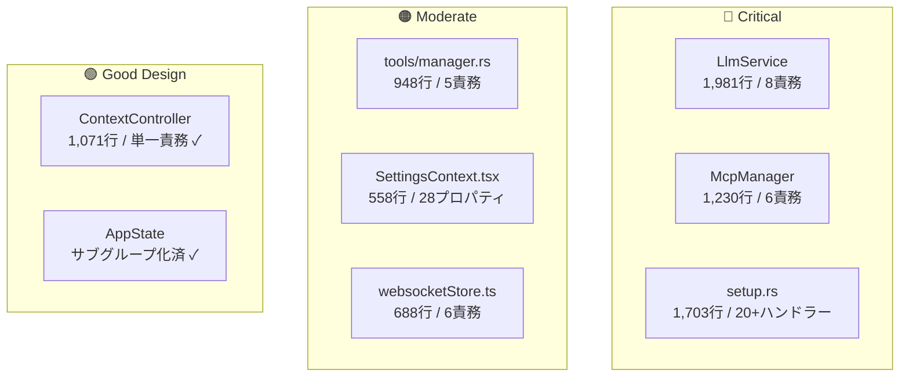

# God Object / 責務過多分析レポート

Tepora-alpha コードベースを全面的に走査し、**God Object（責務過多なオブジェクト・モジュール）** を特定しました。以下、深刻度順にまとめます。

---

## 🔴 深刻度：高（Critical）

### 1. [LlmService](file:///Users/nekon/dev/Tepora-alpha/Tepora-app/backend-rs/src/llm/service.rs#33-39) — [service.rs](file:///Users/nekon/dev/Tepora-alpha/Tepora-app/backend-rs/src/llm/service.rs) (1,981行)

> [!SUCCESS]
> 2026-03-15 更新: この項目は着手済みです。`service.rs` は orchestrator へ縮小され、責務は `model_resolution.rs`, `external_loader_common.rs`, `openai_compatible_client.rs`, `ollama_native_client.rs`, `lmstudio_native_client.rs` に分割されました。以下は分割前の分析メモとして保持しています。

**混在している責務:**
| # | 責務 | 行範囲（概算） |
|---|------|---------------|
| 1 | モデル解決・ルーティング | [resolve_model_target](file:///Users/nekon/dev/Tepora-alpha/Tepora-app/backend-rs/src/llm/service.rs#312-367), [resolve_llama_model_config](file:///Users/nekon/dev/Tepora-alpha/Tepora-app/backend-rs/src/llm/service.rs#368-444) |
| 2 | OpenAI Compatible API (chat/stream) | [chat_openai_compatible](file:///Users/nekon/dev/Tepora-alpha/Tepora-app/backend-rs/src/llm/service.rs#445-532), [stream_chat_openai_compatible](file:///Users/nekon/dev/Tepora-alpha/Tepora-app/backend-rs/src/llm/service.rs#533-749) |
| 3 | Ollama Native API (chat/stream) | [chat_ollama_native](file:///Users/nekon/dev/Tepora-alpha/Tepora-app/backend-rs/src/llm/service.rs#750-858), [stream_chat_ollama_native](file:///Users/nekon/dev/Tepora-alpha/Tepora-app/backend-rs/src/llm/service.rs#859-1078) |
| 4 | LM Studio Native API (chat/stream) | [chat_lmstudio_native](file:///Users/nekon/dev/Tepora-alpha/Tepora-app/backend-rs/src/llm/service.rs#1079-1176), [stream_chat_lmstudio_native](file:///Users/nekon/dev/Tepora-alpha/Tepora-app/backend-rs/src/llm/service.rs#1177-1396) |
| 5 | Embedding API | [embed_openai_compatible](file:///Users/nekon/dev/Tepora-alpha/Tepora-app/backend-rs/src/llm/service.rs#1397-1443) |
| 6 | Logprobs API | [get_logprobs_openai_compatible](file:///Users/nekon/dev/Tepora-alpha/Tepora-app/backend-rs/src/llm/service.rs#1444-1506) |
| 7 | タイムアウト・設定読み取り | 3つの `get_*_timeout` メソッド |
| 8 | SSEストリーム解析 | [stream_chat_openai_compatible](file:///Users/nekon/dev/Tepora-alpha/Tepora-app/backend-rs/src/llm/service.rs#533-749) 内のバッファパース |

> [!CAUTION]
> 特に [chat_openai_compatible](file:///Users/nekon/dev/Tepora-alpha/Tepora-app/backend-rs/src/llm/service.rs#445-532) と [stream_chat_openai_compatible](file:///Users/nekon/dev/Tepora-alpha/Tepora-app/backend-rs/src/llm/service.rs#533-749) で**リクエストパラメータ組み立ての同一コード**が重複しています（lines 458-492 / 546-574）。さらに Ollama / LM Studio のネイティブAPI実装も同様のパターンが繰り返されています。

**推奨リファクタリング:**
- `LlmProvider` trait を導入し、`OllamaProvider`, `LmStudioProvider`, `OpenAiCompatProvider`, `LlamaCppProvider` に分離
- リクエストパラメータ組み立てを共通ヘルパーに抽出
- SSEストリーム解析を独立ユーティリティに

---

### 2. [McpManager](file:///Users/nekon/dev/Tepora-alpha/Tepora-app/backend-rs/src/mcp/mod.rs#1) — [mod.rs](file:///Users/nekon/dev/Tepora-alpha/Tepora-app/backend-rs/src/mcp/mod.rs) (1,230行)

> [!SUCCESS]
> 2026-03-15 更新: この項目は着手済みです。`mod.rs` は薄い再エクスポート層へ縮小され、責務は `manager.rs`, `config_store.rs`, `policy_manager.rs`, `connection_manager.rs`, `tool_executor.rs`, `state.rs`, `types.rs` に分割されました。以下は分割前の分析メモとして保持しています。

**混在している責務:**
| # | 責務 |
|---|------|
| 1 | サーバー設定の読み込み・保存（JSON I/O）|
| 2 | ポリシー管理（ロード・保存・承認・取消）|
| 3 | サーバー接続管理（stdio / HTTP / Wasm）|
| 4 | ツール発見・実行 |
| 5 | セキュリティ制御（quarantine / audit）|
| 6 | 設定パス解決 |

> [!WARNING]
> [McpManager](file:///Users/nekon/dev/Tepora-alpha/Tepora-app/backend-rs/src/mcp/mod.rs#161-172) は 8 つの `Arc<RwLock<...>>` フィールドを持ち、設定、ステータス、クライアント接続、初期化状態、エラー状態をすべて一つの struct で管理しています。

**推奨リファクタリング:**
- `McpConfigStore` (設定 I/O)
- `McpPolicyManager` (ポリシー CRUD)
- `McpConnectionManager` (接続ライフサイクル)
- `McpToolExecutor` (ツール実行)
に4分割

---

### 3. [server/handlers/setup.rs](file:///Users/nekon/dev/Tepora-alpha/Tepora-app/backend-rs/src/server/handlers/setup.rs) — [setup.rs](file:///Users/nekon/dev/Tepora-alpha/Tepora-app/backend-rs/src/server/handlers/setup.rs) (1,703行)

**混在している責務:**
| # | 責務 |
|---|------|
| 1 | セットアップウィザード (init/preflight/run/finish) |
| 2 | モデル管理 CRUD (list/roles/active/reorder/delete) |
| 3 | モデルダウンロード（HuggingFace/ローカル登録）|
| 4 | バイナリアップデート（tar/zip/gz展開、SHA256検証）|
| 5 | モデル更新チェック |
| 6 | ファイル展開ユーティリティ |

> [!IMPORTANT]
> 1ファイルに **20以上の pub async fn ハンドラー** が定義されています。本来は Route ごとにハンドラーモジュールを分割すべきです。

**推奨リファクタリング:**
- `handlers/setup_wizard.rs` — init, preflight, run, finish, progress
- `handlers/model_management.rs` — list, roles, active, reorder, delete, register
- `handlers/model_download.rs` — download, check, update check
- `handlers/binary_update.rs` — バイナリ更新・展開

---

## 🟠 深刻度：中（Moderate）

### 4. [tools/manager.rs](file:///Users/nekon/dev/Tepora-alpha/Tepora-app/backend-rs/src/tools/manager.rs) — [manager.rs](file:///Users/nekon/dev/Tepora-alpha/Tepora-app/backend-rs/src/tools/manager.rs) (948行)

> [!SUCCESS]
> 2026-03-15 更新: この項目は着手済みです。`tools` は `dispatcher.rs`, `rag.rs`, `web.rs`, `web_security.rs` に分割され、`mod.rs` は `execute_tool` / `ToolExecution` の薄い公開面だけを維持する構成になりました。以下は分割前の分析メモとして保持しています。

**混在している責務:**
- ツールディスパッチ ([execute_tool](file:///Users/nekon/dev/Tepora-alpha/Tepora-app/backend-rs/src/mcp/mod.rs#305-359) の巨大な match 文)
- RAG操作 7種 (search, ingest, text_search, get_chunk, get_chunk_window, clear_session, reindex)
- Web Fetch（SSRF防御付き）
- IP アドレス検証ユーティリティ（IPv4/IPv6 のブロックリスト）
- URL デニリスト管理

> [!NOTE]
> IP検証ロジック（[is_blocked_ipv4](file:///Users/nekon/dev/Tepora-alpha/Tepora-app/backend-rs/src/tools/manager.rs#608-622), [is_blocked_ipv6](file:///Users/nekon/dev/Tepora-alpha/Tepora-app/backend-rs/src/tools/manager.rs#623-635) 等）だけで約100行あり、ネットワークセキュリティの関心事が tool dispatch と混在しています。

---

### 5. [SettingsContext.tsx](file:///Users/nekon/dev/Tepora-alpha/Tepora-app/frontend/src/context/SettingsContext.tsx) — [SettingsContext.tsx](file:///Users/nekon/dev/Tepora-alpha/Tepora-app/frontend/src/context/SettingsContext.tsx) (558行)

> [!SUCCESS]
> 2026-03-15 更新: この項目は着手済みです。`SettingsProvider` は維持しつつ、消費側APIは `useSettingsState`, `useSettingsConfigActions`, `useAgentSkills`, `useAgentProfiles` に分割されました。`Config` / `ModelConfig` 型は `src/types/settings.ts` に移され、アプリ本体から巨大な `SettingsContextValue` 依存は除去されました。以下は分割前の分析メモとして保持しています。

**混在している責務:**
- **全カテゴリの設定状態管理**（app, llm_manager, chat_history, em_llm, models_gguf, tools, privacy, search, model_download, server, loaders, thinking）
- Agent Skills CRUD（fetch, get, save, delete）
- キャラクター管理（add, update, delete, setActive）
- 設定の正規化・マイグレーション（[normalizeConfig](file:///Users/nekon/dev/Tepora-alpha/Tepora-app/frontend/src/context/SettingsContext.tsx#196-218)）

> [!WARNING]
> [SettingsContextValue](file:///Users/nekon/dev/Tepora-alpha/Tepora-app/frontend/src/context/SettingsContext.tsx#126-160) interface には **28個のプロパティ** が定義されており、すべてのコンシューマーがこの巨大なインターフェースに依存しています。

---

### 6. [websocketStore.ts](file:///Users/nekon/dev/Tepora-alpha/Tepora-app/frontend/src/stores/websocketStore.ts) — [websocketStore.ts](file:///Users/nekon/dev/Tepora-alpha/Tepora-app/frontend/src/stores/websocketStore.ts) (688行)

> [!SUCCESS]
> 2026-03-15 更新: この項目は着手済みです。接続状態は `socketConnectionStore.ts`、承認状態は `toolConfirmationStore.ts`、受信ルーティングは `messageRouter.ts`、命令的APIは `socketCommands.ts` へ分割されました。以下は分割前の分析メモとして保持しています。

**混在している責務:**
- WebSocket接続管理（connect/disconnect/reconnect）
- IPC トランスポート管理
- メッセージルーティング（12種類の [case](file:///Users/nekon/dev/Tepora-alpha/Tepora-app/backend-rs/src/tools/manager.rs#880-885) 分岐を持つ [handleMessage](file:///Users/nekon/dev/Tepora-alpha/Tepora-app/frontend/src/stores/websocketStore.ts#150-294)）
- ツール承認管理
- セッション管理
- メッセージ送信

---

## 🟡 深刻度：低（Minor）

### 7. [AppState](file:///Users/nekon/dev/Tepora-alpha/Tepora-app/backend-rs/src/state/mod.rs#212-220) / [AppStateCompat](file:///Users/nekon/dev/Tepora-alpha/Tepora-app/backend-rs/src/state/mod.rs#185-208) — [mod.rs](file:///Users/nekon/dev/Tepora-alpha/Tepora-app/backend-rs/src/state/mod.rs) (636行)

[AppState](file:///Users/nekon/dev/Tepora-alpha/Tepora-app/backend-rs/src/state/mod.rs#212-220) は [core](file:///Users/nekon/dev/Tepora-alpha/Tepora-app/backend-rs/src/context/controller.rs#829-857), [ai](file:///Users/nekon/dev/Tepora-alpha/Tepora-app/backend-rs/src/llm/service.rs#1673-1683), `integration`, `runtime`, [memory](file:///Users/nekon/dev/Tepora-alpha/Tepora-app/backend-rs/src/context/controller.rs#865-878) にサブグループ化されており、設計意図は良好です。ただし:

- [AppStateCompat](file:///Users/nekon/dev/Tepora-alpha/Tepora-app/backend-rs/src/state/mod.rs#185-208) が **全フィールドをフラットに複製** しており、サブグループ化の恩恵を打ち消している
- [initialize()](file:///Users/nekon/dev/Tepora-alpha/Tepora-app/backend-rs/src/mcp/mod.rs#232-255) メソッド（約160行）がすべてのサブシステムの初期化を一手に担っている

### 8. `core/security_controls.rs` (1,147行)

行数は多いが、セキュリティ制御という1つのドメインに集中しており、God Object とは言い切れない。ただし、audit / lockdown / rate limiting が混在している可能性あり。

### 9. [context/controller.rs](file:///Users/nekon/dev/Tepora-alpha/Tepora-app/backend-rs/src/context/controller.rs) (1,071行)

**良い例**: コンテキストウィンドウ組み立てという単一責務に集中しており、行数は多いが**責務分離は適切**。

---

## 📊 サマリー

## 🎯 優先リファクタリング順位

| 優先度 | 対象 | 影響範囲 | 難易度 |
|--------|------|----------|--------|
| 1 | [LlmService](file:///Users/nekon/dev/Tepora-alpha/Tepora-app/backend-rs/src/llm/service.rs#33-39) → Provider trait分割 | 高（全LLM呼び出しに影響） | 中 |
| 2 | [setup.rs](file:///Users/nekon/dev/Tepora-alpha/Tepora-app/backend-rs/src/server/handlers/setup.rs) → ハンドラーモジュール分割 | 低（API互換性維持可能） | 低 |
| 3 | [McpManager](file:///Users/nekon/dev/Tepora-alpha/Tepora-app/backend-rs/src/mcp/mod.rs#161-172) → 4分割 | 中 | 中 |
| 4 | [tools/manager.rs](file:///Users/nekon/dev/Tepora-alpha/Tepora-app/backend-rs/src/tools/manager.rs) → IP/URLユーティリティ分離 | 低 | 低 |
| 5 | [SettingsContext](file:///Users/nekon/dev/Tepora-alpha/Tepora-app/frontend/src/context/SettingsContext.tsx#126-160) → カテゴリ別Context分割 | 中（多数のコンシューマー） | 中 |
| 6 | `websocketStore` → Transport / MessageRouter分離 | 中 | 中 |
