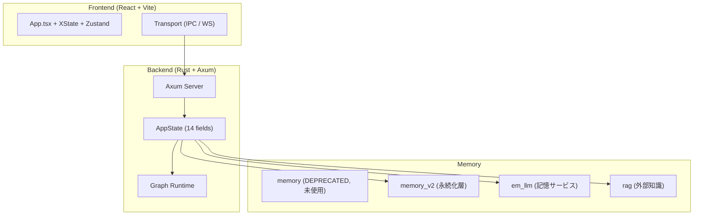
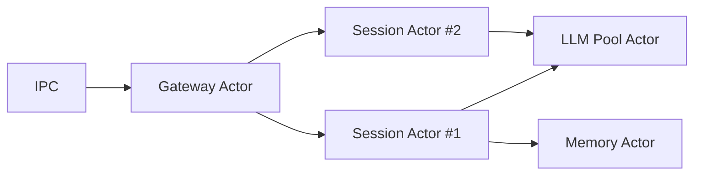

# Tepora ゼロベース再設計 — 正式提案書（レビュー修正版）

**作成日**: 2026-03-01  
**更新日**: 2026-03-02（Phase 1-6 完了検証の追補を反映）  
**対象**: Tepora (Local-First AI Agent App)

---

## User Review Required

> [!IMPORTANT]
> 7件のレビュー指摘（Critical 1、Major 4、Minor 2）を全件反映しました。変更箇所には `[R#n]` タグを付記しています。

---

## 1. 現状分析

### 1.1 構成



### 1.2 問題点

| # | 領域 | 問題 | 影響度 |
|---|------|------|--------|
| 1 | 通信 | Axum HTTP/WS + Tauri IPC の二重経路 | 🔴 |
| 2 | 状態管理 | [AppState](Tepora-app/backend-rs/src/state/mod.rs#143-165) に14フィールド集約（God Object） | 🔴 |
| 3 | メモリ層 | [memory](Tepora-app/backend-rs/src/memory/mod.rs#350-371) (未使用) + `memory_v2` + `em_llm` 並存 | 🟡 |
| 4 | 境界 | ドメインとインフラが同一レイヤー | 🟡 |
| 5 | ワークフロー | ノード接続がハードコード（宣言的定義は feature flag で部分導入済み） | 🟢 |
| 6 | FE | Zustand + XState + WS Store の責務境界が曖昧 | 🟡 |

---

## 2. 設計原則

既存の [Tepora_Design_Philosophy.md](./docs/architecture/Tepora_Design_Philosophy.md) の P1-P5 を継承し、以下を追加：

| 原則 | 内容 |
|------|------|
| Hard Boundaries | コンポーネント境界を型レベルで強制 |
| Message-Passing | `Arc<Mutex>` ではなくチャネルベースの隔離 |
| Single Source of Truth | 各ドメインのデータ真実は1箇所 |
| Infrastructure Agnostic Domain | ドメイン層は外部クレート非依存 |

---

## 3. 提案アーキテクチャ

### 3.1 Hexagonal Architecture

```
backend-rs/src/
├── domain/               # 純粋ドメイン（外部クレート非依存）
│   ├── agent.rs
│   ├── episodic_memory.rs#   trait EpisodicMemoryPort
│   ├── knowledge.rs      #   trait KnowledgePort
│   ├── workflow.rs
│   ├── events.rs
│   └── errors.rs         #   DomainError enum
│
├── application/          # ユースケース（domain のみ参照）
│   ├── chat.rs
│   ├── planning.rs
│   ├── search.rs
│   └── workflow_loader.rs
│
├── infrastructure/       # 外部接合
│   ├── actors/
│   ├── llm/
│   ├── episodic_store/   #   memory_v2 + em_llm 統合
│   ├── knowledge_store/  #   RAG（独立維持）
│   ├── mcp/
│   └── transport/
│
├── workflows/            # JSON ワークフロー定義
└── main.rs               # DI + 起動
```

---

### 3.2 メモリ: 2系統分離設計

#### 本質的な違い

| 観点 | EpisodicMemory（対話記憶） | Knowledge（外部知識/RAG） |
|------|---------------------------|--------------------------|
| データ源 | ユーザーとの対話 | URL、ファイル、テキスト |
| ライフサイクル | 長期（減衰・圧縮） | セッション/タスク単位 |
| 時間軸 | あり（境界検出、減衰曲線） | なし（静的チャンク） |
| 統合元 | [memory](Tepora-app/backend-rs/src/memory/mod.rs#350-371) + `memory_v2` + `em_llm` | [rag](Tepora-app/backend-rs/src/em_llm/store.rs#594-603)（独立維持） |

#### `[R#2]` Port 設計方針

> [!IMPORTANT]
> **方針決定**: Port trait は **`async_trait` + `dyn` dispatch** で統一する。
>
> **根拠**:
> - 現行コードベースで [MemoryAdapter](Tepora-app/backend-rs/src/memory_v2/adapter.rs#13-36), [RagStore](Tepora-app/backend-rs/src/rag/store.rs#26-70), [VectorStore](Tepora-app/backend-rs/src/memory/mod.rs#60-96) が既にこのパターンを使用
> - Rust の native async trait は object-safe ではないため、`async_trait` クレートが必要
> - パフォーマンス影響は vtable + Box allocation のみで、I/O bound な処理では無視可能

```rust
// domain/episodic_memory.rs
use async_trait::async_trait;
use super::errors::DomainError;

/// Object-safety 規約:
/// - &self のみ（&mut self 不可 → 内部で Arc<RwLock> を使用）
/// - ジェネリクス不可（具体型のみ）
/// - 戻り値に impl Trait 不可
#[async_trait]
pub trait EpisodicMemoryPort: Send + Sync {
    async fn ingest_interaction(
        &self, session_id: &str, user: &str, assistant: &str, embedding: &[f32],
    ) -> Result<Vec<String>, DomainError>;

    async fn recall(
        &self, session_id: &str, query_embedding: &[f32], limit: usize,
    ) -> Result<Vec<EpisodicHit>, DomainError>;

    async fn run_decay(
        &self, session_id: Option<&str>,
    ) -> Result<DecayResult, DomainError>;

    async fn compress(
        &self, session_id: &str,
    ) -> Result<CompressionResult, DomainError>;
}

// domain/knowledge.rs
#[async_trait]
pub trait KnowledgePort: Send + Sync {
    async fn ingest(
        &self, source: KnowledgeSource, session_id: &str,
    ) -> Result<Vec<String>, DomainError>;

    async fn search(
        &self, query_embedding: &[f32], limit: usize, session_id: Option<&str>,
    ) -> Result<Vec<KnowledgeHit>, DomainError>;

    async fn build_context(
        &self, query: &str, query_embedding: &[f32], config: &ContextConfig,
    ) -> Result<String, DomainError>;

    async fn clear_session(
        &self, session_id: &str,
    ) -> Result<usize, DomainError>;
}
```

---

### 3.3 `[R#1]` 宣言的ワークフロー DSL — 現行 JSON 準拠

> [!IMPORTANT]
> **方針決定**: 現行の **JSON 形式を維持**する。YAML への移行は行わない。
>
> **根拠**:
> - [WorkflowDef](Tepora-app/backend-rs/src/graph/schema.rs#32-46) + JSON Schema + [load_workflow_from_json](Tepora-app/backend-rs/src/graph/loader.rs#45-74) が既に動作
> - YAML → JSON 変換層は不要な複雑性
> - JSON は GUI エディタとの親和性が高い（将来のドラッグ&ドロップ対応）

#### 現行スキーマとの対応表

| 提案 v1（YAML） | 現行実装（JSON） | 備考 |
|------------------|-----------------|------|
| `entry` | `entry_node` | ✅ 現行に合わせる |
| `nodes[].routes` | `edges[].condition` | ✅ ルーティングは edges で表現 |
| `nodes[].next` | `edges[]` (condition なし) | ✅ 無条件遷移は edge で表現 |
| `version` (新規) | なし | ⚠️ 後方互換のため optional で追加 |

#### 正規スキーマ（現行準拠 + 拡張）

```json
{
  "name": "tepora_default",
  "entry_node": "router",
  "max_steps": 50,
  "nodes": [
    { "id": "router",          "type": "RouterNode" },
    { "id": "chat",            "type": "ChatNode" },
    { "id": "planner",         "type": "PlannerNode" },
    { "id": "supervisor",      "type": "SupervisorNode" },
    { "id": "agent_executor",  "type": "AgentExecutorNode" },
    { "id": "search_agentic",  "type": "AgenticSearchNode" },
    { "id": "synthesizer",     "type": "SynthesizerNode" }
  ],
  "edges": [
    { "from": "router",         "to": "chat",            "condition": "chat" },
    { "from": "router",         "to": "planner",         "condition": "plan" },
    { "from": "router",         "to": "agent_executor",  "condition": "agent" },
    { "from": "router",         "to": "search_agentic",  "condition": "search" },
    { "from": "planner",        "to": "supervisor",      "condition": "supervisor" },
    { "from": "supervisor",     "to": "search_agentic",  "condition": "search" },
    { "from": "supervisor",     "to": "agent_executor",  "condition": "agent" },
    { "from": "supervisor",     "to": "synthesizer",     "condition": "synthesize" },
    { "from": "search_agentic", "to": "supervisor" },
    { "from": "agent_executor", "to": "supervisor" }
  ]
}
```

---

### 3.4 `[R#5]` Actor Model — 運用仕様



#### 運用パラメータ

| パラメータ | 値 | 根拠 |
|-----------|------|------|
| `mpsc` バッファ上限 | **64 messages** | 通常チャットの最大並行メッセージ数を十分カバー |
| Session Actor TTL | **30分（非アクティブ）** | メモリリーク防止。最終メッセージからの経過時間 |
| GC 間隔 | **5分** | TTL 切れ Actor の回収チェック |
| バックプレッシャ | **`try_send` → fail-fast** | バッファ満杯時はエラー返却（UI に「混雑中」表示） |
| 最大同時 Session Actor 数 | **32** | 単一ユーザーアプリのため十分 |

#### 障害時挙動

| 障害 | 挙動 |
|------|------|
| Session Actor パニック | `tokio::spawn` で隔離。Gateway が検知し、UI にエラー通知。自動再起動なし |
| LLM Pool Actor 停止 | 全 Session に `LlmUnavailable` イベント送信。手動回復が必要 |
| Memory Actor 停止 | メモリ書き込みのみ失敗。チャット自体は継続可能（degraded mode） |
| `mpsc` バッファ飽和 | `try_send` が `Err(Full)` → クライアントに 503 返却 |

---

### 3.5 通信: IPC-First

| モード | 経路 | 用途 |
|--------|------|------|
| Desktop (Primary) | Tauri IPC | 本番 |
| Dev Mode | Axum HTTP + SSE | ホットリロード開発 |
| Web (将来) | Axum HTTP + SSE | ブラウザ版 |

---

### 3.6 `[R#6]` セキュリティ & 可観測性

#### フロントエンドログ転送 — プライバシー保護方針

> [!CAUTION]
> Privacy-First 原則（P1）を厳守するため、以下の規約を適用する。

| 項目 | 規約 |
|------|------|
| **転送対象** | **allowlist 方式**: [error](Tepora-app/backend-rs/src/em_llm/store.rs#605-610), `warn` レベルのみ。`debug`/[info](Tepora-app/backend-rs/src/em_llm/store.rs#349-396) は転送不可 |
| **PII マスキング** | メッセージ本文中のユーザープロンプト → `[REDACTED_PROMPT]` に置換 |
| **API キー** | 正規表現 `sk-[a-zA-Z0-9]{20,}` → `[REDACTED_KEY]` |
| **ファイルパス** | ユーザーディレクトリ部分 → `[USER_DIR]/...` に正規化 |
| **保持期間** | ログファイルは最大 7 日で自動ローテーション |
| **実装先** | `infrastructure/transport/log_forwarder.rs` |

---

### 3.7 フロントエンド再設計

| 責務 | ツール | 変更方針 |
|------|--------|----------|
| UI状態遷移 | XState | 全チャットフローをカバー |
| データキャッシュ | Zustand | データ保持のみに限定 |
| 通信 | Transport | XState `services` 経由のみ |

---

## 4. 段階的移行ロードマップ

### `[R#3]` Phase 1: EpisodicMemory 統合

| 項目 | 内容 |
|------|------|
| **目標** | [memory](Tepora-app/backend-rs/src/memory/mod.rs#350-371)(未使用) 削除 + `memory_v2`/`em_llm` を `infrastructure/episodic_store/` に統合 |
| **前提** | [MEMORY_ARCHITECTURE.md](docs/architecture/MEMORY_ARCHITECTURE.md) の Phase 1-3 完了済み。[memory/](Tepora-app/backend-rs/src/memory/mod.rs#350-371) は現在どこからも参照されていない |

#### データ移行計画

| ステップ | 内容 |
|----------|------|
| 1. バックアップ | 起動時に `tepora_core.db` / `em_memory.db` / `rag.db` の `.bak.{timestamp}` を自動作成 |
| 2. スキーマ変更 | `em_llm` の `episodic_events` テーブルと `memory_v2` の テーブルは既に同一DBに共存。スキーマ変更なし |
| 3. モジュール移動 | ファイル構造の再配置のみ。データ変換は発生しない |
| 4. ロールバック条件 | 統合後に `cargo test` の既存テスト全件パスすること。失敗時は git revert |

#### Phase 1 Definition of Done

- [x] [memory/](Tepora-app/backend-rs/src/memory/mod.rs#350-371) ディレクトリ削除 + [lib.rs](Tepora-app/backend-rs/src/lib.rs)/[main.rs](Tepora-app/backend-rs/src/main.rs) から除去
- [x] `em_llm/` + `memory_v2/` → `infrastructure/episodic_store/` に再配置
- [x] `EpisodicMemoryPort` trait 定義 + 既存 [UnifiedMemoryAdapter](Tepora-app/backend-rs/src/infrastructure/episodic_store/memory_v2/adapter.rs#44-77) をこの trait に適合
- [x] 既存テスト全件パス: `cargo test --lib em_llm` および `cargo test --lib memory_v2`（2026-03-02 実行で両方 pass）
- [x] アプリ起動確認: `task dev`（`scripts/dev_sync.mjs`）で backend/frontend 起動を確認。backend は `cargo run --bin tepora-backend` + `TEPORA_PORT=0`、frontend は空きポートを予約して起動（2026-03-02）

---

### Phase 2: RAG 独立化 + Knowledge Port

| 項目 | 内容 |
|------|------|
| **目標** | [rag/](Tepora-app/backend-rs/src/em_llm/store.rs#594-603) → `infrastructure/knowledge_store/` + `domain/knowledge.rs` 新設 |
| **DoD** | `KnowledgePort` trait 定義、`cargo test --lib rag`全件パス |
| **進捗** | ✅ 完了（2026-03-02: `cargo test --lib rag` pass） |

---

### Phase 3: Hexagonal 層分離

| 項目 | 内容 |
|------|------|
| **目標** | `domain/` / `application/` / `infrastructure/` ディレクトリ構造の確立 |
| **DoD** | `domain/` に [use](Tepora-app/backend-rs/src/main.rs#201-206) される外部クレートがゼロ |
| **進捗** | ✅ 完了（2026-03-02: `rg -n "use anyhow\|use sqlx\|use axum\|use reqwest" src/domain` が 0 件、`cargo test` 全件 pass） |

---

### Phase 4: Actor Model 全面展開

| 項目 | 内容 |
|------|------|
| **目標** | [AppState](Tepora-app/backend-rs/src/state/mod.rs#207-214) 分解 + Session Actor 本格導入 |
| **DoD** | [AppState](Tepora-app/backend-rs/src/state/mod.rs#207-214) のフィールド数が 7 以下 |
| **進捗** | ✅ 完了（2026-03-02: `AppState` を責務別グループへ分解し直下 6 フィールド化、Actor に TTL/GC/try_send バックプレッシャ/同時セッション上限を実装） |

---

### Phase 5: Transport 統一 (IPC-First)

| 項目 | 内容 |
|------|------|
| **目標** | IPC をプライマリ、Axum をオプショナルに |
| **DoD** | Tauri IPC でチャット全機能動作 |
| **進捗** | ✅ 完了（2026-03-02: Desktop 既定 transport を IPC 化、`features.redesign.transport_mode` 設定値を検証許可、Tauri `chat_command` の Actor エラーハンドリングを強化、WSL `src-tauri` の `cargo check` と FE lint/typecheck/test を通過） |

---

### Phase 6: Wasm Sandbox + Observability

| 項目 | 内容 |
|------|------|
| **目標** | `redesign_sandbox` feature 正式化 + 構造化トレーシング全面適用 |
| **DoD** | MCP ツールが Wasm 内で実行可能 |
| **進捗** | ✅ 完了（2026-03-02: Wasm MCP stdio 起動パス + `wasm_runtime_shim`/`wasm-mcp-echo` フィクスチャを追加し、`wasm_mcp_e2e` で `list_tools`→`execute_tool` 成功を確認。HTTP/MCP 構造化トレース、Frontend ログ allowlist+PII マスキング + 7日ローテーション（`infrastructure/transport/log_forwarder.rs`）を適用。さらに CI を Windows 必須ゲート化（`.github/workflows/ci.yml` の `backend-wasm-e2e-windows`）し、macOS 監視（`.github/workflows/backend-macos-smoke.yml`）を週次+手動で追加） |

---

## `[R#4]` 5. 検証計画（Phase 別）

### Phase 共通

```bash
# Backend
cd Tepora-app/backend-rs && cargo build 2>&1 && cargo test 2>&1

# Frontend
cd Tepora-app/frontend && npx tsc --noEmit && npx eslint src/
```

### Phase 1 (EpisodicMemory 統合)

| 種別 | 内容 |
|------|------|
| Unit | `cargo test --lib` — `em_llm::tests` (29KB), `memory_v2::tests` (18KB), `adapter::test_adapter_routing` |
| Integration | `task dev` → チャット送受信 → メモリページでの検索結果確認 |
| Regression | [memory/](Tepora-app/backend-rs/src/memory/mod.rs#350-371) 削除後ビルドエラーなし |

### Phase 2 (RAG 独立化)

| 種別 | 内容 |
|------|------|
| Unit | `cargo test --lib rag` — `engine::tests`, `context_builder::tests` |
| Integration | URL 添付 → チャンク分割 → コンテキスト構築の動作確認 |

### Phase 3 (Hexagonal 層分離)

| 種別 | 内容 |
|------|------|
| Architectural | `grep -r "use anyhow\|use sqlx\|use axum\|use reqwest" src/domain/` → 0件 |
| Full | `cargo test` 全件パス |

### Phase 4 (Actor Model)

| 種別 | 内容 |
|------|------|
| Concurrency | `actor::manager::tests::test_dispatch_multiple_sessions`（3セッション並行） |
| Stress | `actor::manager::tests::test_dispatch_returns_busy_when_queue_is_full`（64連続 + fail-fast） |
| Lifecycle | `actor::manager::tests::test_gc_loop_evicts_expired_sessions` / `test_reap_expired_sessions`（TTL + GC 回収） |

### Phase 5 (Transport 統一)

| 種別 | 内容 |
|------|------|
| E2E | Tauri IPC 経由: メッセージ送信 → ストリーミング受信 → ツール承認フロー（手順を下記に固定化） |
| FE | `npx tsc --noEmit`、`npx eslint src/`、`npm test -- --run` pass（25 files / 208 tests） |
| Regression | WebSocket 経由（Dev Mode）の動作維持（`src/test/unit/stores/websocketStore.test.ts` pass） |

#### Phase 5 手動 E2E 手順（IPC）

1. `task dev` で Desktop アプリを起動する（または `npm run tauri dev`）。
2. チャット画面で通常メッセージを送信し、応答がストリーミング表示されることを確認する。
3. 応答完了時に会話が履歴へ反映されることを確認する。
4. ツール確認が必要な入力を送信し、承認ダイアログで `Approve` / `Deny` の双方を確認する。
5. `features.redesign.transport_mode` を `websocket` に変更して再起動し、Dev Mode 回帰がないことを確認する。

#### Phase 5 検証結果（2026-03-02）

- Backend: `cd Tepora-app/backend-rs && cargo check` pass（incremental finalize warning のみ）
- Frontend Type: `cd Tepora-app/frontend && npx tsc --noEmit` pass
- Frontend Lint: `cd Tepora-app/frontend && npx eslint src/` pass
- Frontend Test: `cd Tepora-app/frontend && npm test -- --run` pass（25 files / 208 tests）
- Tauri (WSL): `cd /mnt/e/Tepora_Project/Tepora-app/frontend/src-tauri && cargo check` pass（incremental finalize warning のみ）

### Phase 6 (Wasm Sandbox + Observability)

| 種別 | 内容 |
|------|------|
| Build | `cargo check --features redesign_sandbox` pass |
| Observability | `server::middleware::tracing` に `request_id/session_id/method/path/status/latency_ms` を構造化出力し、`x-request-id` を付与 |
| Security | `receive_frontend_logs` を `warn/error` allowlist 化し、`[REDACTED_KEY]` / `[REDACTED_PROMPT]` / `[USER_DIR]` マスキング + `infrastructure/transport/log_forwarder.rs` による 7 日ローテーションを適用 |
| E2E (WSL) | `cargo test --features redesign_sandbox --test wasm_mcp_e2e -- --nocapture --test-threads=1` pass（Wasm MCPサーバーで `list_tools` + `execute_tool` 成功） |
| CI Gate (Windows, Push/PR 必須) | `.github/workflows/ci.yml` に `backend-wasm-e2e-windows` を追加し、`quality-gate-summary` 失敗条件へ組み込み |
| Monitoring (macOS, 非必須) | `.github/workflows/backend-macos-smoke.yml` を追加し、`schedule`（毎週月曜 00:00 UTC）+ `workflow_dispatch` で監視実行 |

---

## `[R#7]` 6. リンク方針

本ドキュメント内のファイル参照はすべてプロジェクトルートからの**相対パス**を使用する。

---

## 7. 前回提案からの変更履歴

| 観点 | v1 (2026-02-26) | 本提案 |
|------|-----------------|--------|
| メモリ | 4モジュール → 1 Engine | **2系統分離**: Episodic + Knowledge |
| RAG | Memory と統合 | **独立維持** |
| DSL | YAML + `entry` + `routes` | **現行JSON準拠** (`entry_node` + `edges`) `[R#1]` |
| Port | 未定義 | **`async_trait` + `dyn`** に確定 `[R#2]` |
| 移行 | 計画なし | Phase 1 に移行/ロールバック DoD 追加 `[R#3]` |
| 検証 | BE テストのみ | Phase 別 FE/BE/E2E 検証計画 `[R#4]` |
| Actor | 仕様未定義 | バッファ/TTL/GC/バックプレッシャ明文化 `[R#5]` |
| ログ | 無制限転送 | allowlist + PII マスキング規約 `[R#6]` |
| リンク | 絶対パス | 相対パス統一 `[R#7]` |

